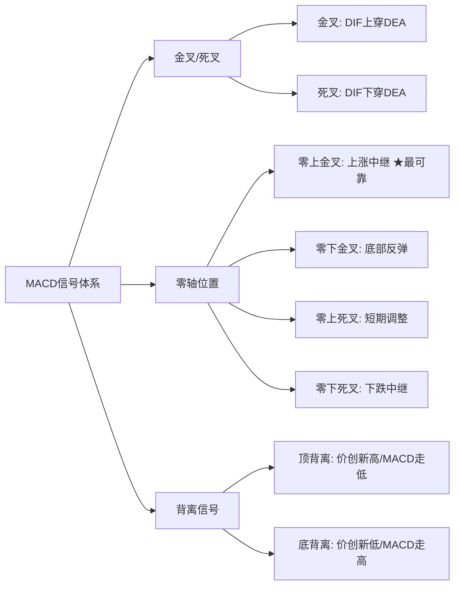

# 趋势类指标（MA、EMA、MACD）

> [!note] 💡 概念解析
> 趋势类指标通过平滑价格波动来识别市场方向，是技术分析的基石。MA/EMA定义趋势方向，MACD结合趋势与动能判断买卖时机。

## 一、移动平均线（MA）

### 定义与计算

移动平均线是过去N天收盘价的平均值，用于**平滑价格波动、识别趋势方向**。

$$MA_N = \frac{P_1 + P_2 + ... + P_N}{N}$$

其中 $P_i$ 为第 $i$ 天收盘价，$N$ 为周期（常用5、10、20、60、120日）。

> [!example] 计算示例
> 某股近5日收盘价：10、11、12、13、14
> $$MA_5 = (10+11+12+13+14)/5 = 12$$
> 第6日收盘16，新MA5：$(11+12+13+14+16)/5 = 13.2$

### 核心用法

| 信号类型 | 判断标准 | 含义 |
|---------|---------|------|
| 多头排列 | 短期均线 > 中期 > 长期 | 健康上涨趋势，回调到均线附近是加仓机会 |
| 空头排列 | 短期均线 < 中期 < 长期 | 典型熊市，反弹到均线附近是减仓信号 |
| 金叉 | 短期均线上穿长期均线 | 买入信号 |
| 死叉 | 短期均线下穿长期均线 | 卖出信号 |

> [!warning] 均线的滞后性
> MA的最大缺点是滞后——震荡市中频繁产生假信号。需结合MACD、成交量等指标过滤。

## 二、指数移动平均线（EMA）

### 与MA的区别

EMA给**近期价格更高权重**，响应速度更快：

$$EMA_t = \alpha \cdot P_t + (1-\alpha) \cdot EMA_{t-1}$$

其中 $\alpha = \frac{2}{N+1}$ 为平滑因子。$N=12$ 时 $\alpha = 0.154$，近期价格权重约15%。

> [!tip] EMA vs MA 选择
> - **EMA**：适合短线，对价格变化敏感，但信号噪音大
> - **MA**：适合中长线，趋势判断更稳定，但滞后明显
> - MACD指标中的DIF线使用EMA而非MA，正是因为需要更快响应

## 三、MACD（指数平滑异同移动平均线）

### 指标构成

MACD由三部分组成：

1. **DIF线（快线）**：EMA12 - EMA26，反映短期趋势
2. **DEA线（慢线）**：DIF的9日EMA，更稳定
3. **MACD柱状图**：DIF - DEA的差值，表示动能强弱

$$DIF = EMA_{12} - EMA_{26}$$
$$DEA = EMA_9(DIF)$$
$$柱状图 = DIF - DEA$$

### 四大买卖信号



| 信号 | 位置 | 含义 | 可靠性 |
|------|------|------|--------|
| 零上金叉 | MACD > 0 | 上涨中继，加仓信号 | ⭐⭐⭐⭐⭐ |
| 零下金叉 | MACD < 0 | 底部反弹，试探买入 | ⭐⭐⭐ |
| 零上死叉 | MACD > 0 | 短期调整，可部分减仓 | ⭐⭐⭐ |
| 零下死叉 | MACD < 0 | 下跌中继，果断空仓 | ⭐⭐⭐⭐⭐ |

### 背离——MACD的终极奥义

> [!important] 背离是MACD最强大的信号
> - **顶背离**：股价创新高，MACD高点却走低 → 上涨动能衰竭，强烈见顶警告
> - **底背离**：股价创新低，MACD低点却走高 → 下跌动能衰竭，强烈见底信号
>
> 背离的可靠性远高于普通金叉死叉。

### 量化策略伪代码

```python
# 趋势跟踪策略
if DIF > DEA and MACD > 0:
    buy()      # 零上金叉，加仓
elif DIF < DEA and MACD < 0:
    sell()     # 零下死叉，清仓

# 背离检测
if price.higher_high() and not macd.higher_high():
    alert("顶背离，减仓！")
if price.lower_low() and not macd.lower_low():
    alert("底背离，关注买入！")
```

## 三指标对比总结

| 特性 | MA | EMA | MACD |
|------|-----|-----|------|
| 响应速度 | 慢 | 快 | 中 |
| 信号数量 | 少 | 中 | 多 |
| 假信号 | 少 | 中 | 需要过滤 |
| 最佳场景 | 中长线趋势 | 短线跟踪 | 趋势+动能综合判断 |
| 核心价值 | 方向识别 | 灵敏跟踪 | 背离预警 |

## 📚 相关概念

[[震荡类指标（KDJ、RSI、CCI）]] [[趋势强度指标（DMI、布林带）]] [[道氏理论]] [[指标组合使用方法论]] [[量价关系与成交量指标]]

## 实战掌握清单

> [!tip] 交易者视角
> 趋势类指标（MA、EMA、MACD） 的学习重点不是记住术语，而是把它放进研究、组合、执行和复盘的闭环。技术指标是价格、成交量和波动率的二次加工，核心价值在于把主观观察变成稳定规则。

### 关键判断

- 先确认指标属于趋势、震荡、量能、波动率还是资金流。
- 判断当前市场是否适合该指标：趋势指标怕横盘，震荡指标怕单边。
- 把参数选择、信号延迟和交易频率写清楚。

### 落地动作

1. 用样本外数据检验信号，而不是只看历史图形好不好看。
2. 同时记录胜率、盈亏比、换手、滑点和回撤。
3. 把指标作为过滤器、触发器或退出规则，避免多个同源指标重复投票。

### 失效边界

- 参数过拟合。
- 忽略手续费和滑点。
- 在市场结构变化后继续迷信旧阈值。

### 复盘问题

- 这项知识改变了哪一个具体决策：标的、方向、仓位、退出、对冲还是不交易？
- 如果判断相反，最大亏损、最长恢复期和退出触发条件是什么？
- 有没有一个更简单的基准方法可以取得相近结果？
