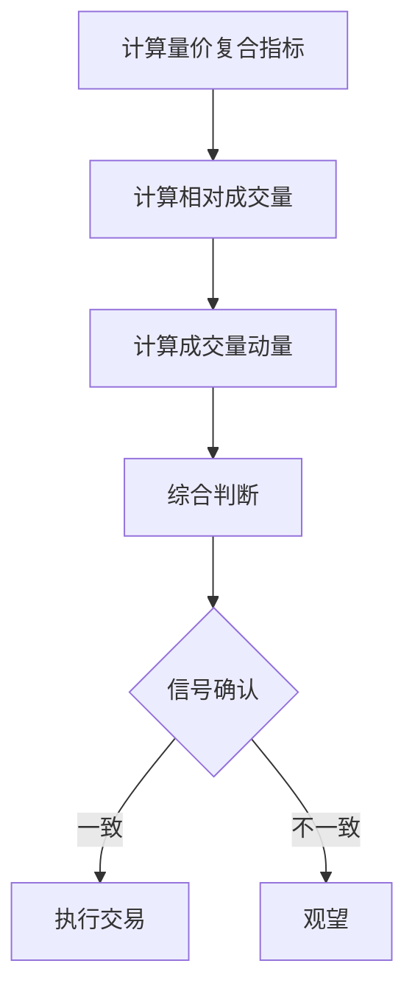

# 增强型成交量指标

> [!note] 💡 概念解析
> 增强型成交量指标是在传统成交量分析基础上，结合价格、时间等因素构建的复合指标，能够更准确地反映市场的真实动能。

## 一、传统成交量指标的局限

| 局限性 | 说明 |
|-------|------|
| 绝对值问题 | 不同股票成交量无法直接比较 |
| 时间因素 | 不同时期的成交量标准不同 |
| 价格因素 | 未考虑价格变动对成交量的影响 |
| 市场环境 | 未考虑整体市场的影响 |

## 二、增强型成交量指标

### 2.1 量价复合指标

将成交量与价格变动结合：

$$\text{量价复合} = \text{成交量} \times |\text{价格变动率}|$$

- 数值大 → 市场活跃，趋势可能延续
- 数值小 → 市场低迷，可能变盘

### 2.2 相对成交量指标

将成交量与历史平均水平比较：

$$\text{相对成交量} = \frac{\text{当日成交量}}{\text{N日平均成交量}}$$

- 相对成交量 > 2 → 明显放量
- 相对成交量 < 0.5 → 明显缩量

### 2.3 成交量动量指标

衡量成交量的变化速度：

$$\text{成交量动量} = \frac{\text{今日成交量} - \text{昨日成交量}}{\text{昨日成交量}} \times 100\%$$

## 三、增强型指标的实战应用

### 3.1 量价复合指标应用

> [!tip] 使用方法
> 1. 计算量价复合指标
> 2. 与历史水平比较
> 3. 结合价格走势判断趋势

### 3.2 相对成交量指标应用

| 相对成交量 | 市场状态 | 操作建议 |
|-----------|---------|---------|
| > 3 | 极端放量 | 警惕异常 |
| 2-3 | 明显放量 | 关注 |
| 1-2 | 温和放量 | 正常 |
| 0.5-1 | 温和缩量 | 正常 |
| < 0.5 | 明显缩量 | 关注变盘 |

### 3.3 成交量动量指标应用

- 动量持续为正 → 成交量在放大，趋势可能延续
- 动量持续为负 → 成交量在缩小，趋势可能减弱
- 动量由负转正 → 成交量触底反弹，可能变盘

## 四、增强型指标的组合使用

## 五、增强型指标的注意事项

> [!warning] 使用注意
> 1. 增强型指标需要**足够的历史数据**
> 2. 不同指标可能给出**矛盾信号**
> 3. 需要结合**价格走势**和**K线形态**综合判断
> 4. 指标参数需要根据**具体股票**调整

## 📚 相关概念

[[量价关系与成交量指标]] [[OBV能量潮指标详解]] [[量比分析详解]] [[成交量五大形态]] [[指标组合使用方法论]]

## 实战掌握清单

> [!tip] 交易者视角
> 增强型成交量指标 的学习重点不是记住术语，而是把它放进研究、组合、执行和复盘的闭环。技术指标是价格、成交量和波动率的二次加工，核心价值在于把主观观察变成稳定规则。

### 关键判断

- 先确认指标属于趋势、震荡、量能、波动率还是资金流。
- 判断当前市场是否适合该指标：趋势指标怕横盘，震荡指标怕单边。
- 把参数选择、信号延迟和交易频率写清楚。

### 落地动作

1. 用样本外数据检验信号，而不是只看历史图形好不好看。
2. 同时记录胜率、盈亏比、换手、滑点和回撤。
3. 把指标作为过滤器、触发器或退出规则，避免多个同源指标重复投票。

### 失效边界

- 参数过拟合。
- 忽略手续费和滑点。
- 在市场结构变化后继续迷信旧阈值。

### 复盘问题

- 这项知识改变了哪一个具体决策：标的、方向、仓位、退出、对冲还是不交易？
- 如果判断相反，最大亏损、最长恢复期和退出触发条件是什么？
- 有没有一个更简单的基准方法可以取得相近结果？

## 深度案例与训练

### 指标实验

围绕 增强型成交量指标 设计三组实验：趋势行情、震荡行情和急跌反弹。分别测试参数、信号延迟、胜率、盈亏比、换手率和最大回撤。

### 组合使用

- 不要堆叠多个同源指标，例如多个均线指标重复投票。
- 指标最好分工：趋势判断、入场触发、风险退出、仓位过滤。
- 对指标做样本外验证，避免只适合历史图形。

### 实盘要求

指标信号必须配合交易成本、流动性和止损纪律。

## 最小可执行项目

### 指标参数实验

围绕 增强型成交量指标 做一个参数实验：默认参数、短周期参数和长周期参数分别在趋势、震荡和极端波动中表现如何。

| 输出 | 用途 |
|---|---|
| 胜率 | 判断信号命中 |
| 盈亏比 | 判断是否值得交易 |
| 换手 | 判断成本压力 |
| 回撤 | 设计仓位 |
| 参数稳定性 | 识别过拟合 |

### 验收标准

指标必须服务于明确分工：判断趋势、触发入场、过滤风险或辅助退出。
