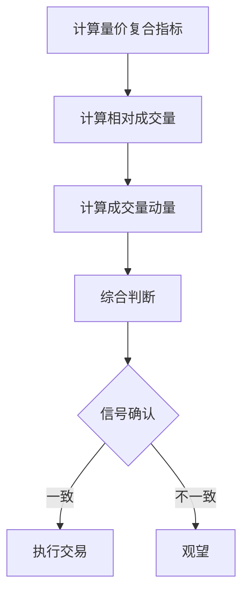

# 增强型成交量指标

> [!note] 💡 概念解析
> 增强型成交量指标是在传统成交量分析基础上，结合价格、时间等因素构建的复合指标，能够更准确地反映市场的真实动能。

## 一、传统成交量指标的局限

| 局限性 | 说明 |
|-------|------|
| 绝对值问题 | 不同股票成交量无法直接比较 |
| 时间因素 | 不同时期的成交量标准不同 |
| 价格因素 | 未考虑价格变动对成交量的影响 |
| 市场环境 | 未考虑整体市场的影响 |

## 二、增强型成交量指标

### 2.1 量价复合指标

将成交量与价格变动结合：

$$\text{量价复合} = \text{成交量} \times |\text{价格变动率}|$$

- 数值大 → 市场活跃，趋势可能延续
- 数值小 → 市场低迷，可能变盘

### 2.2 相对成交量指标

将成交量与历史平均水平比较：

$$\text{相对成交量} = \frac{\text{当日成交量}}{\text{N日平均成交量}}$$

- 相对成交量 > 2 → 明显放量
- 相对成交量 < 0.5 → 明显缩量

### 2.3 成交量动量指标

衡量成交量的变化速度：

$$\text{成交量动量} = \frac{\text{今日成交量} - \text{昨日成交量}}{\text{昨日成交量}} \times 100\%$$

## 三、增强型指标的实战应用

### 3.1 量价复合指标应用

> [!tip] 使用方法
> 1. 计算量价复合指标
> 2. 与历史水平比较
> 3. 结合价格走势判断趋势

### 3.2 相对成交量指标应用

| 相对成交量 | 市场状态 | 操作建议 |
|-----------|---------|---------|
| > 3 | 极端放量 | 警惕异常 |
| 2-3 | 明显放量 | 关注 |
| 1-2 | 温和放量 | 正常 |
| 0.5-1 | 温和缩量 | 正常 |
| < 0.5 | 明显缩量 | 关注变盘 |

### 3.3 成交量动量指标应用

- 动量持续为正 → 成交量在放大，趋势可能延续
- 动量持续为负 → 成交量在缩小，趋势可能减弱
- 动量由负转正 → 成交量触底反弹，可能变盘

## 四、增强型指标的组合使用

## 五、增强型指标的注意事项

> [!warning] 使用注意
> 1. 增强型指标需要**足够的历史数据**
> 2. 不同指标可能给出**矛盾信号**
> 3. 需要结合**价格走势**和**K线形态**综合判断
> 4. 指标参数需要根据**具体股票**调整

## 📚 相关概念

[[量价关系与成交量指标]] [[OBV能量潮指标详解]] [[量比分析详解]] [[成交量五大形态]] [[指标组合使用方法论]]

## 课程化学习补充

> [!important] 学习定位
> 技术指标是价格与成交量的压缩表达，适合做信号过滤、风险控制和交易纪律，不适合孤立预测未来。本文仅用于学习、研究与复盘，不构成任何投资建议。

### 必须掌握的问题

- 指标参数是否符合交易周期
- 信号是否经过样本外验证
- 是否与趋势/量能/波动率共振
- 是否明确无效条件

### 实战应用流程

1. 先写清楚你的投资假设：为什么这个信号、资产或方法应该产生收益。
2. 明确数据口径：样本范围、更新时间、复权/分红/停牌处理和交易日历。
3. 做最小可行验证：先用简单规则验证方向，再逐步加入复杂模型。
4. 把成本和约束前置：手续费、滑点、冲击成本、保证金、流动性和容量都要进入测算。
5. 上线后持续复盘：记录信号、下单、成交、持仓、回撤和失效原因。

### 风险与失效条件

- 指标共线导致虚假确认
- 震荡市和趋势市参数错配
- 过度优化
- 忽略滑点和交易成本

### 复盘问题

- 这笔交易或这套模型赚的是什么钱：风险补偿、行为偏差、流动性溢价，还是偶然噪音？
- 如果市场环境反过来，最大亏损和最长恢复期会是多少？
- 当前结论是否依赖某个不可持续假设，例如低利率、低波动、充裕流动性或监管套利？
- 有没有一个更简单的基准策略能取得接近效果？

### 延伸学习

- [[技术分析完整指南]]
- [[量价关系与成交量指标]]
- [[假形态识别与应对]]
- [[风险度量指标]]
