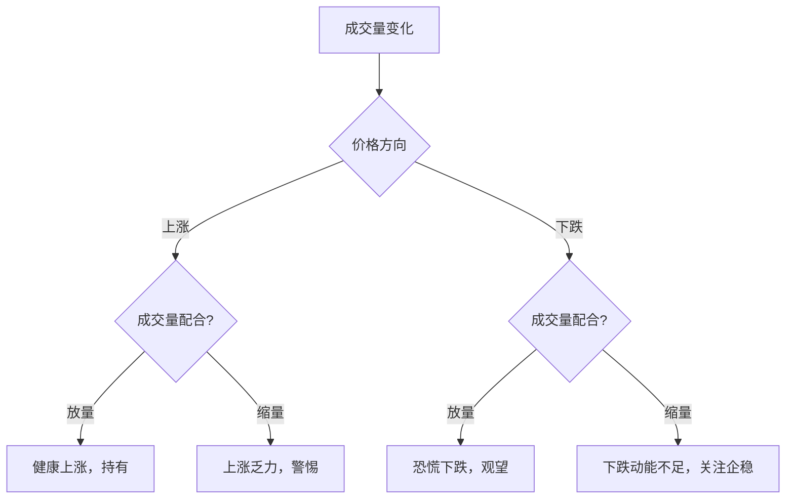

# 成交量五大形态

> [!note] 💡 概念解析
> 成交量的五种基本形态——放量、缩量、天量、地量、堆量，是判断市场情绪和趋势强弱的重要依据。

## 一、成交量的五种基本形态

### 1.1 放量

**定义**：成交量明显大于近期平均水平。

| 放量类型 | 特征 | 含义 |
|---------|------|------|
| 放量上涨 | 价格上涨，成交量放大 | 上涨动能充足，看涨 |
| 放量下跌 | 价格下跌，成交量放大 | 恐慌性抛售，看跌 |

### 1.2 缩量

**定义**：成交量明显小于近期平均水平。

| 缩量类型 | 特征 | 含义 |
|---------|------|------|
| 缩量上涨 | 价格上涨，成交量缩小 | 上涨动能不足，警惕回调 |
| 缩量下跌 | 价格下跌，成交量缩小 | 下跌动能不足，可能企稳 |

### 1.3 天量

**定义**：成交量达到近期最高水平，通常伴随着重大消息或极端行情。

> [!warning] 天量见天价
> 天量往往出现在阶段性顶部，是主力资金出货的信号。出现天量后，股价可能见顶回落。

### 1.4 地量

**定义**：成交量达到近期最低水平，市场极度低迷。

> [!tip] 地量见地价
> 地量往往出现在阶段性底部，是市场恐慌情绪充分释放的信号。出现地量后，股价可能见底反弹。

### 1.5 堆量

**定义**：成交量逐渐放大，形成类似"土堆"的形态。

- **上涨堆量**：成交量逐步放大，价格稳步上涨 → 健康上涨
- **下跌堆量**：成交量逐步放大，价格持续下跌 → 加速下跌

## 二、成交量形态的实战应用

### 2.1 量价配合原则

### 2.2 形态识别要点

| 形态 | 入场信号 | 出场信号 |
|------|---------|---------|
| 放量突破 | 突破阻力位时放量 | 突破后缩量回落 |
| 缩量回调 | 回调至支撑位缩量 | 放量跌破支撑 |
| 天量见顶 | - | 天量后价格滞涨 |
| 地量见底 | 地量后价格企稳 | - |
| 温和堆量 | 逐步放量上涨 | 放量加速后见顶 |

## 三、成交量形态的注意事项

> [!warning] 避免误判
> 1. 成交量需要**结合价格走势**分析，单独看成交量没有意义
> 2. 不同股票的成交量标准不同，需要**相对比较**
> 3. 重大消息可能导致成交量**异常放大**，需要过滤
> 4. 周末和节假日前后的成交量**不具可比性**

## 📚 相关概念

[[量价关系与成交量指标]] [[OBV能量潮指标详解]] [[量比分析详解]] [[成交量八大公式]] [[量价分析实战（雪球）]]

## 实战掌握清单

> [!tip] 交易者视角
> 成交量五大形态 的学习重点不是记住术语，而是把它放进研究、组合、执行和复盘的闭环。技术指标是价格、成交量和波动率的二次加工，核心价值在于把主观观察变成稳定规则。

### 关键判断

- 先确认指标属于趋势、震荡、量能、波动率还是资金流。
- 判断当前市场是否适合该指标：趋势指标怕横盘，震荡指标怕单边。
- 把参数选择、信号延迟和交易频率写清楚。

### 落地动作

1. 用样本外数据检验信号，而不是只看历史图形好不好看。
2. 同时记录胜率、盈亏比、换手、滑点和回撤。
3. 把指标作为过滤器、触发器或退出规则，避免多个同源指标重复投票。

### 失效边界

- 参数过拟合。
- 忽略手续费和滑点。
- 在市场结构变化后继续迷信旧阈值。

### 复盘问题

- 这项知识改变了哪一个具体决策：标的、方向、仓位、退出、对冲还是不交易？
- 如果判断相反，最大亏损、最长恢复期和退出触发条件是什么？
- 有没有一个更简单的基准方法可以取得相近结果？

## 深度案例与训练

### 指标实验

围绕 成交量五大形态 设计三组实验：趋势行情、震荡行情和急跌反弹。分别测试参数、信号延迟、胜率、盈亏比、换手率和最大回撤。

### 组合使用

- 不要堆叠多个同源指标，例如多个均线指标重复投票。
- 指标最好分工：趋势判断、入场触发、风险退出、仓位过滤。
- 对指标做样本外验证，避免只适合历史图形。

### 实盘要求

指标信号必须配合交易成本、流动性和止损纪律。
