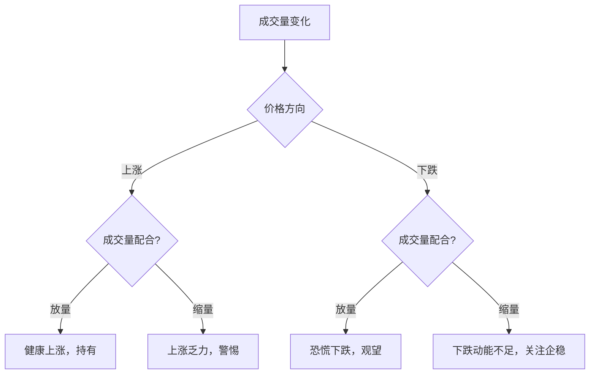

# 成交量五大形态

> [!note] 💡 概念解析
> 成交量的五种基本形态——放量、缩量、天量、地量、堆量，是判断市场情绪和趋势强弱的重要依据。

## 一、成交量的五种基本形态

### 1.1 放量

**定义**：成交量明显大于近期平均水平。

| 放量类型 | 特征 | 含义 |
|---------|------|------|
| 放量上涨 | 价格上涨，成交量放大 | 上涨动能充足，看涨 |
| 放量下跌 | 价格下跌，成交量放大 | 恐慌性抛售，看跌 |

### 1.2 缩量

**定义**：成交量明显小于近期平均水平。

| 缩量类型 | 特征 | 含义 |
|---------|------|------|
| 缩量上涨 | 价格上涨，成交量缩小 | 上涨动能不足，警惕回调 |
| 缩量下跌 | 价格下跌，成交量缩小 | 下跌动能不足，可能企稳 |

### 1.3 天量

**定义**：成交量达到近期最高水平，通常伴随着重大消息或极端行情。

> [!warning] 天量见天价
> 天量往往出现在阶段性顶部，是主力资金出货的信号。出现天量后，股价可能见顶回落。

### 1.4 地量

**定义**：成交量达到近期最低水平，市场极度低迷。

> [!tip] 地量见地价
> 地量往往出现在阶段性底部，是市场恐慌情绪充分释放的信号。出现地量后，股价可能见底反弹。

### 1.5 堆量

**定义**：成交量逐渐放大，形成类似"土堆"的形态。

- **上涨堆量**：成交量逐步放大，价格稳步上涨 → 健康上涨
- **下跌堆量**：成交量逐步放大，价格持续下跌 → 加速下跌

## 二、成交量形态的实战应用

### 2.1 量价配合原则

### 2.2 形态识别要点

| 形态 | 入场信号 | 出场信号 |
|------|---------|---------|
| 放量突破 | 突破阻力位时放量 | 突破后缩量回落 |
| 缩量回调 | 回调至支撑位缩量 | 放量跌破支撑 |
| 天量见顶 | - | 天量后价格滞涨 |
| 地量见底 | 地量后价格企稳 | - |
| 温和堆量 | 逐步放量上涨 | 放量加速后见顶 |

## 三、成交量形态的注意事项

> [!warning] 避免误判
> 1. 成交量需要**结合价格走势**分析，单独看成交量没有意义
> 2. 不同股票的成交量标准不同，需要**相对比较**
> 3. 重大消息可能导致成交量**异常放大**，需要过滤
> 4. 周末和节假日前后的成交量**不具可比性**

## 📚 相关概念

[[量价关系与成交量指标]] [[OBV能量潮指标详解]] [[量比分析详解]] [[成交量八大公式]] [[量价分析实战（雪球）]]

## 课程化学习补充

> [!important] 学习定位
> 技术指标是价格与成交量的压缩表达，适合做信号过滤、风险控制和交易纪律，不适合孤立预测未来。本文仅用于学习、研究与复盘，不构成任何投资建议。

### 必须掌握的问题

- 指标参数是否符合交易周期
- 信号是否经过样本外验证
- 是否与趋势/量能/波动率共振
- 是否明确无效条件

### 实战应用流程

1. 先写清楚你的投资假设：为什么这个信号、资产或方法应该产生收益。
2. 明确数据口径：样本范围、更新时间、复权/分红/停牌处理和交易日历。
3. 做最小可行验证：先用简单规则验证方向，再逐步加入复杂模型。
4. 把成本和约束前置：手续费、滑点、冲击成本、保证金、流动性和容量都要进入测算。
5. 上线后持续复盘：记录信号、下单、成交、持仓、回撤和失效原因。

### 风险与失效条件

- 指标共线导致虚假确认
- 震荡市和趋势市参数错配
- 过度优化
- 忽略滑点和交易成本

### 复盘问题

- 这笔交易或这套模型赚的是什么钱：风险补偿、行为偏差、流动性溢价，还是偶然噪音？
- 如果市场环境反过来，最大亏损和最长恢复期会是多少？
- 当前结论是否依赖某个不可持续假设，例如低利率、低波动、充裕流动性或监管套利？
- 有没有一个更简单的基准策略能取得接近效果？

### 延伸学习

- [[技术分析完整指南]]
- [[量价关系与成交量指标]]
- [[假形态识别与应对]]
- [[风险度量指标]]
