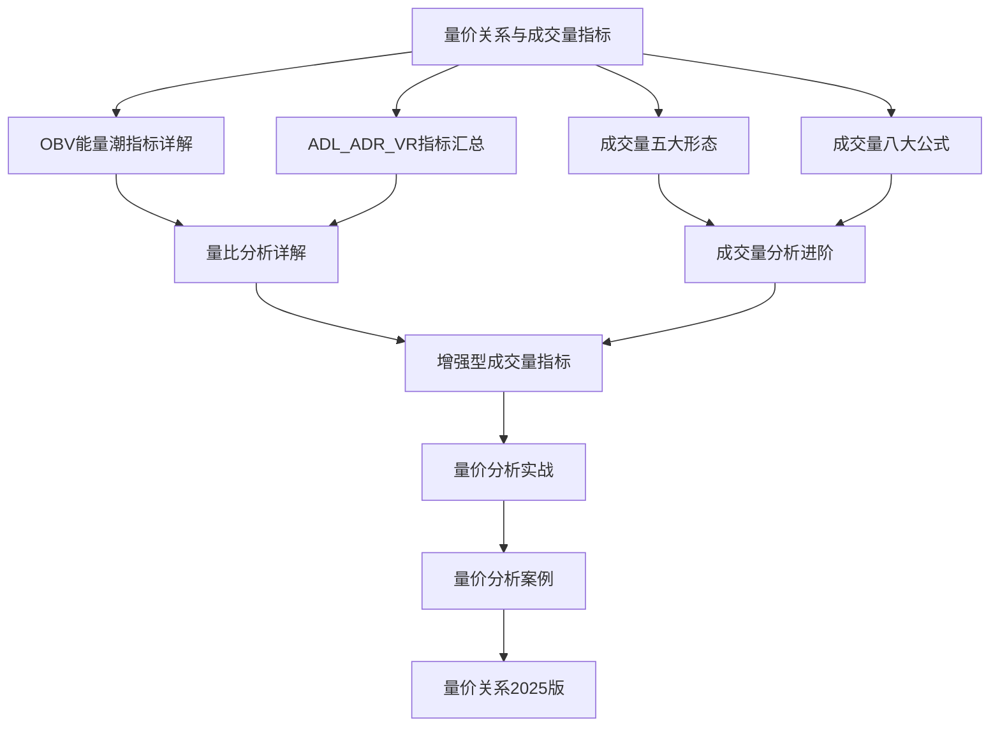

# 三、成交量体系

本章节系统介绍成交量分析的理论与实践，从基础概念到高级应用。

## 笔记列表

### 基础理论
1. [[量价关系与成交量指标]] - 量价关系的基本理论和核心指标（已有）
2. [[OBV能量潮指标详解]] - OBV指标的计算方法、应用法则和实战案例
3. [[ADL_ADR_VR指标汇总]] - ADL、ADR、OBV、VR四大指标的综合对比

### 形态与公式
4. [[成交量五大形态]] - 放量、缩量、天量、地量、堆量的识别与应用
5. [[成交量八大公式]] - 量价关系的八大口诀与实战速查

### 进阶分析
6. [[量比分析详解]] - 量比的计算、市场意义和选股应用
7. [[成交量分析进阶]] - 成交量的结构分析和主力行为识别
8. [[增强型成交量指标]] - 量价复合指标和相对成交量指标

### 实战应用
9. [[量价分析实战（雪球）]] - 量价分析的实际交易应用
10. [[量价分析案例：贵州茅台]] - 以贵州茅台为案例的量价分析
11. [[量价关系2025版]] - 量价关系的最新研究与发展

## 学习路径

## 核心要点

- 量价关系是技术分析的核心
- "先见量，后见价"是市场规律
- OBV、ADL、ADR、VR是常用的成交量指标
- 放量、缩量、天量、地量、堆量是五种基本形态
- 量价分析需要结合价格走势和K线形态
