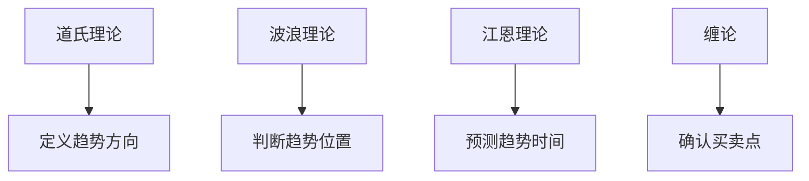

# 四大理论对比总结

> [!note] 💡 概念解析
> 世界四大顶级交易理论——道氏理论、波浪理论、江恩理论、缠论，各有特色和适用场景，对比分析有助于理解各自的优缺点和互补关系。

## 一、四大理论概述

| 理论 | 创始人 | 时间 | 核心思想 |
|------|--------|------|---------|
| 道氏理论 | 查尔斯·道 | 1896年 | 趋势定义与市场周期 |
| 波浪理论 | 拉尔夫·艾略特 | 1938年 | 八浪循环与自然法则 |
| 江恩理论 | 威廉·江恩 | 1900年代 | 时间、价格、几何关系 |
| 缠论 | 缠中说禅 | 2006年 | 走势结构与买卖点 |

## 二、四大理论核心对比

### 2.1 分析维度

| 维度 | 道氏理论 | 波浪理论 | 江恩理论 | 缠论 |
|------|---------|---------|---------|------|
| 趋势 | ✓ | ✓ | ✓ | ✓ |
| 周期 | ✓ | ✓ | ✓ | - |
| 形态 | - | ✓ | - | ✓ |
| 时间 | - | - | ✓ | - |
| 买卖点 | - | - | ✓ | ✓ |

### 2.2 理论基础

> [!tip] 理论来源
> - **道氏理论**：基于市场行为观察
> - **波浪理论**：基于自然法则和斐波那契数列
> - **江恩理论**：基于几何学和天文学
> - **缠论**：融合道氏理论、波浪理论和形态学

## 三、四大理论优缺点

### 3.1 道氏理论

| 优点 | 缺点 |
|------|------|
| 定义了趋势的基本概念 | 信号滞后 |
| 奠定了技术分析基础 | 不能预测具体点位 |
| 适用于所有市场 | 对短期交易帮助有限 |

### 3.2 波浪理论

| 优点 | 缺点 |
|------|------|
| 提供了完整的市场结构 | 波浪计数主观性强 |
| 可以预测价格目标 | 不同人可能得出不同结论 |
| 适用于所有时间框架 | 学习难度大 |

### 3.3 江恩理论

| 优点 | 缺点 |
|------|------|
| 结合时间、价格、几何 | 学习门槛极高 |
| 可以预测具体点位和时间 | 计算复杂 |
| 适用于期货和外汇 | 需要大量经验 |

### 3.4 缠论

| 优点 | 缺点 |
|------|------|
| 系统性强，逻辑严密 | 学习难度大 |
| 提供明确的买卖点 | 实战应用复杂 |
| 融合多种理论 | 容易陷入条条框框 |

## 四、四大理论的互补关系

### 4.1 趋势判断

### 4.2 综合应用

> [!example] 综合应用方法
> 1. 用**道氏理论**判断大趋势方向
> 2. 用**波浪理论**判断当前所处浪型
> 3. 用**江恩理论**预测转折时间
> 4. 用**缠论**寻找精确买卖点

## 五、四大理论的学习建议

### 5.1 学习顺序

| 顺序 | 理论 | 原因 |
|------|------|------|
| 1 | 道氏理论 | 基础概念，必学 |
| 2 | 波浪理论 | 结构分析，进阶 |
| 3 | 缠论 | 买卖点，实战 |
| 4 | 江恩理论 | 时间分析，高级 |

### 5.2 学习建议

> [!tip] 学习建议
> 1. 先学**道氏理论**，建立趋势概念
> 2. 再学**波浪理论**，理解市场结构
> 3. 然后学**缠论**，掌握买卖点
> 4. 最后学**江恩理论**，提升时间分析能力

## 六、四大理论的现代应用

### 6.1 量化交易中的应用

| 理论 | 量化应用 |
|------|---------|
| 道氏理论 | 趋势跟踪策略 |
| 波浪理论 | 形态识别算法 |
| 江恩理论 | 时间周期分析 |
| 缠论 | 走势结构识别 |

### 6.2 人工智能的应用

> [!tip] AI应用
> 1. **机器学习**识别波浪形态
> 2. **深度学习**分析走势结构
> 3. **自然语言处理**分析缠论文章
> 4. **强化学习**优化交易策略

## 📚 相关概念

[[道氏理论]] [[艾略特波浪理论]] [[江恩理论]] [[缠论]] [[四大理论综合比较]]

## 实战掌握清单

> [!tip] 交易者视角
> 四大理论对比总结 的学习重点不是记住术语，而是把它放进研究、组合、执行和复盘的闭环。技术指标是价格、成交量和波动率的二次加工，核心价值在于把主观观察变成稳定规则。

### 关键判断

- 先确认指标属于趋势、震荡、量能、波动率还是资金流。
- 判断当前市场是否适合该指标：趋势指标怕横盘，震荡指标怕单边。
- 把参数选择、信号延迟和交易频率写清楚。

### 落地动作

1. 用样本外数据检验信号，而不是只看历史图形好不好看。
2. 同时记录胜率、盈亏比、换手、滑点和回撤。
3. 把指标作为过滤器、触发器或退出规则，避免多个同源指标重复投票。

### 失效边界

- 参数过拟合。
- 忽略手续费和滑点。
- 在市场结构变化后继续迷信旧阈值。

### 复盘问题

- 这项知识改变了哪一个具体决策：标的、方向、仓位、退出、对冲还是不交易？
- 如果判断相反，最大亏损、最长恢复期和退出触发条件是什么？
- 有没有一个更简单的基准方法可以取得相近结果？
