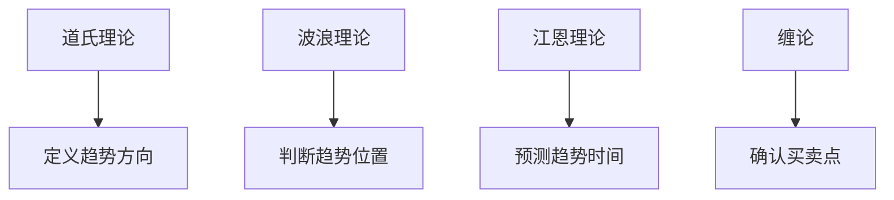

# 四大理论对比总结

> [!note] 💡 概念解析
> 世界四大顶级交易理论——道氏理论、波浪理论、江恩理论、缠论，各有特色和适用场景，对比分析有助于理解各自的优缺点和互补关系。

## 一、四大理论概述

| 理论 | 创始人 | 时间 | 核心思想 |
|------|--------|------|---------|
| 道氏理论 | 查尔斯·道 | 1896年 | 趋势定义与市场周期 |
| 波浪理论 | 拉尔夫·艾略特 | 1938年 | 八浪循环与自然法则 |
| 江恩理论 | 威廉·江恩 | 1900年代 | 时间、价格、几何关系 |
| 缠论 | 缠中说禅 | 2006年 | 走势结构与买卖点 |

## 二、四大理论核心对比

### 2.1 分析维度

| 维度 | 道氏理论 | 波浪理论 | 江恩理论 | 缠论 |
|------|---------|---------|---------|------|
| 趋势 | ✓ | ✓ | ✓ | ✓ |
| 周期 | ✓ | ✓ | ✓ | - |
| 形态 | - | ✓ | - | ✓ |
| 时间 | - | - | ✓ | - |
| 买卖点 | - | - | ✓ | ✓ |

### 2.2 理论基础

> [!tip] 理论来源
> - **道氏理论**：基于市场行为观察
> - **波浪理论**：基于自然法则和斐波那契数列
> - **江恩理论**：基于几何学和天文学
> - **缠论**：融合道氏理论、波浪理论和形态学

## 三、四大理论优缺点

### 3.1 道氏理论

| 优点 | 缺点 |
|------|------|
| 定义了趋势的基本概念 | 信号滞后 |
| 奠定了技术分析基础 | 不能预测具体点位 |
| 适用于所有市场 | 对短期交易帮助有限 |

### 3.2 波浪理论

| 优点 | 缺点 |
|------|------|
| 提供了完整的市场结构 | 波浪计数主观性强 |
| 可以预测价格目标 | 不同人可能得出不同结论 |
| 适用于所有时间框架 | 学习难度大 |

### 3.3 江恩理论

| 优点 | 缺点 |
|------|------|
| 结合时间、价格、几何 | 学习门槛极高 |
| 可以预测具体点位和时间 | 计算复杂 |
| 适用于期货和外汇 | 需要大量经验 |

### 3.4 缠论

| 优点 | 缺点 |
|------|------|
| 系统性强，逻辑严密 | 学习难度大 |
| 提供明确的买卖点 | 实战应用复杂 |
| 融合多种理论 | 容易陷入条条框框 |

## 四、四大理论的互补关系

### 4.1 趋势判断

### 4.2 综合应用

> [!example] 综合应用方法
> 1. 用**道氏理论**判断大趋势方向
> 2. 用**波浪理论**判断当前所处浪型
> 3. 用**江恩理论**预测转折时间
> 4. 用**缠论**寻找精确买卖点

## 五、四大理论的学习建议

### 5.1 学习顺序

| 顺序 | 理论 | 原因 |
|------|------|------|
| 1 | 道氏理论 | 基础概念，必学 |
| 2 | 波浪理论 | 结构分析，进阶 |
| 3 | 缠论 | 买卖点，实战 |
| 4 | 江恩理论 | 时间分析，高级 |

### 5.2 学习建议

> [!tip] 学习建议
> 1. 先学**道氏理论**，建立趋势概念
> 2. 再学**波浪理论**，理解市场结构
> 3. 然后学**缠论**，掌握买卖点
> 4. 最后学**江恩理论**，提升时间分析能力

## 六、四大理论的现代应用

### 6.1 量化交易中的应用

| 理论 | 量化应用 |
|------|---------|
| 道氏理论 | 趋势跟踪策略 |
| 波浪理论 | 形态识别算法 |
| 江恩理论 | 时间周期分析 |
| 缠论 | 走势结构识别 |

### 6.2 人工智能的应用

> [!tip] AI应用
> 1. **机器学习**识别波浪形态
> 2. **深度学习**分析走势结构
> 3. **自然语言处理**分析缠论文章
> 4. **强化学习**优化交易策略

## 📚 相关概念

[[道氏理论]] [[艾略特波浪理论]] [[江恩理论]] [[缠论]] [[四大理论综合比较]]

## 课程化学习补充

> [!important] 学习定位
> 技术指标是价格与成交量的压缩表达，适合做信号过滤、风险控制和交易纪律，不适合孤立预测未来。本文仅用于学习、研究与复盘，不构成任何投资建议。

### 必须掌握的问题

- 指标参数是否符合交易周期
- 信号是否经过样本外验证
- 是否与趋势/量能/波动率共振
- 是否明确无效条件

### 实战应用流程

1. 先写清楚你的投资假设：为什么这个信号、资产或方法应该产生收益。
2. 明确数据口径：样本范围、更新时间、复权/分红/停牌处理和交易日历。
3. 做最小可行验证：先用简单规则验证方向，再逐步加入复杂模型。
4. 把成本和约束前置：手续费、滑点、冲击成本、保证金、流动性和容量都要进入测算。
5. 上线后持续复盘：记录信号、下单、成交、持仓、回撤和失效原因。

### 风险与失效条件

- 指标共线导致虚假确认
- 震荡市和趋势市参数错配
- 过度优化
- 忽略滑点和交易成本

### 复盘问题

- 这笔交易或这套模型赚的是什么钱：风险补偿、行为偏差、流动性溢价，还是偶然噪音？
- 如果市场环境反过来，最大亏损和最长恢复期会是多少？
- 当前结论是否依赖某个不可持续假设，例如低利率、低波动、充裕流动性或监管套利？
- 有没有一个更简单的基准策略能取得接近效果？

### 延伸学习

- [[技术分析完整指南]]
- [[量价关系与成交量指标]]
- [[假形态识别与应对]]
- [[风险度量指标]]

## 跨领域进阶扩展

> [!tip] 交易者视角
> 学到 `四大理论对比总结` 时，不要只把它当成孤立知识点。把指标当成信号过滤器和纪律工具，不能替代交易系统。优秀投资交易者会把它放入“宏观背景 - 资产选择 - 估值/信号 - 组合风险 - 交易执行 - 复盘反馈”的闭环。

### 与其他知识的连接

- 趋势、动量、均值回归和波动率
- 成交量和资金流验证
- 多周期共振与冲突
- 成本、滑点和过度交易

### 进阶训练

1. 比较指标在趋势市和震荡市的表现
2. 给每个信号定义入场、退出、止损和暂停条件
3. 用样本外数据检查参数稳定性

### 能力验收

- 能否说清楚这个主题影响的是收益来源、风险来源、交易成本、流动性还是心理纪律？
- 能否指出它在什么市场环境、资产类别或交易周期中更有效？
- 能否把它写成一条可复盘的研究或交易规则？
- 能否说明如果判断错误，组合最大损失和退出机制是什么？

### 全局关联

- [[综合金融知识体系/金融投资全知识地图|金融投资全知识地图]]
- [[综合金融知识体系/优秀投资交易者能力地图|优秀投资交易者能力地图]]
- [[综合金融知识体系/一次性学习路线与复盘模板|一次性学习路线与复盘模板]]
