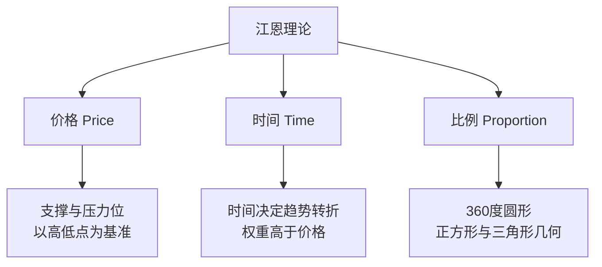

# 江恩理论

> [!note] 💡 概念解析
> 江恩理论由20世纪初交易大师威廉·江恩创立，结合价格、时间、几何比例三个维度分析市场，核心思想："当时间到达时，价格就会跟随。"

## 三大支柱

> [!important] 核心哲学
> 江恩认为市场具有"震动法则"（Law of Vibration），每种金融商品都有独特的震动频率。当时间与价格达成几何上的对称或比例时，就是趋势最易转折的时刻。

## 工具一：江恩角度线（Gann Fan）

### 1×1线——最重要的参考线

**1×1线** 代表"一个单位时间对应一个单位价格"的关系，是判断多空的分水岭：

- 价格在1×1线上方 → 多头力量强
- 有效跌破1×1线 → 趋势可能转弱

### 波动率设定

1×1线的倾斜度取决于**波动率**（Price/Time）设定。例如设定"1天=10点"，软件据此自动调整角度。

> [!tip] 新手建议
> 先用软件的"自动缩放比例"观察价格与1×1线的互动（支撑/压力），熟悉后再手动调整波动率。

## 工具二：江恩九方图（Square of 9）

将数字以螺旋方式排列在方格中，用来找出价格与时间的转折点。

**关键角度**（从起始价格出发）：

| 角度 | 含义 |
|------|------|
| 90° | 第一支撑/压力 |
| 180° | 主要转折位 |
| 270° | 强力支撑/压力 |
| 360° | 完整循环，最重要的转折 |

> [!note] 现代应用
> 现代交易软件（TradingView、MT4/MT5）已内建九方图功能，只需输入起始价格即可自动标示关键价位。

## 工具三：江恩周期理论

### 时间周期数字

| 周期类型 | 常用数字 | 应用 |
|---------|---------|------|
| 短期 | 7天、9天、13天 | 短线转折 |
| 中期 | 18天、27天、52天（约一季） | 波段操作 |
| 长期 | 1年、7年、10年 | 大循环 |

### 关键概念：时间对称

- **转折点周年庆**：历史上的重大起涨/起跌日，未来年份**同一天或相近日**容易出现类似反转
- **历史重演**：前一段上升波段运行了30天 → 下一次回档也接近30天时，就是高度警戒的"对称点"

> [!tip] 实战技巧
> 从7天、9天、18天和1年周期开始观察。当时间窗口到来时，若价格刚好触及江恩角度线的支撑或压力——**时空共振**的点位，胜率最高。

## 四大技术方法对比

| 方法 | 核心逻辑 | 主要侧重 | 最佳场景 |
|------|---------|---------|---------|
| 江恩理论 | 数学几何、时间平衡 | **时间**与价格的对称 | 预测转折时间点 |
| 波浪理论 | 市场心理 | 价格波动的**结构**型态 | 判断处于第几波 |
| 斐波那契 | 黄金分割 | 价格回档的**幅度** | 精确支撑压力位 |
| 传统指标 | 统计学与动能 | 超买**超卖**状态 | 短线进出场 |

## 优缺点

| 优点 | 限制 |
|------|------|
| 同时考虑时间与价格，视野独特 | 设定主观性高（角度线倾斜度因人而异） |
| 提供明确的支撑压力参考 | 学习曲线陡峭 |
| 适合波段和中长线 | 不适合短线当冲 |

> [!warning] 常见陷阱
> 新手最容易犯的错误：把江恩线当成"一定会发生"的铁律，忽略当下的量价确认。**江恩理论是辅助框架，不是预测神器。**

## 📚 相关概念

[[道氏理论]] [[艾略特波浪理论]] [[缠论]] [[趋势类指标（MA、EMA、MACD）]] [[指标组合使用方法论]]

## 课程化学习补充

> [!important] 学习定位
> 技术指标是价格与成交量的压缩表达，适合做信号过滤、风险控制和交易纪律，不适合孤立预测未来。本文仅用于学习、研究与复盘，不构成任何投资建议。

### 必须掌握的问题

- 指标参数是否符合交易周期
- 信号是否经过样本外验证
- 是否与趋势/量能/波动率共振
- 是否明确无效条件

### 实战应用流程

1. 先写清楚你的投资假设：为什么这个信号、资产或方法应该产生收益。
2. 明确数据口径：样本范围、更新时间、复权/分红/停牌处理和交易日历。
3. 做最小可行验证：先用简单规则验证方向，再逐步加入复杂模型。
4. 把成本和约束前置：手续费、滑点、冲击成本、保证金、流动性和容量都要进入测算。
5. 上线后持续复盘：记录信号、下单、成交、持仓、回撤和失效原因。

### 风险与失效条件

- 指标共线导致虚假确认
- 震荡市和趋势市参数错配
- 过度优化
- 忽略滑点和交易成本

### 复盘问题

- 这笔交易或这套模型赚的是什么钱：风险补偿、行为偏差、流动性溢价，还是偶然噪音？
- 如果市场环境反过来，最大亏损和最长恢复期会是多少？
- 当前结论是否依赖某个不可持续假设，例如低利率、低波动、充裕流动性或监管套利？
- 有没有一个更简单的基准策略能取得接近效果？

### 延伸学习

- [[技术分析完整指南]]
- [[量价关系与成交量指标]]
- [[假形态识别与应对]]
- [[风险度量指标]]

## 跨领域进阶扩展

> [!tip] 交易者视角
> 学到 `江恩理论` 时，不要只把它当成孤立知识点。把指标当成信号过滤器和纪律工具，不能替代交易系统。优秀投资交易者会把它放入“宏观背景 - 资产选择 - 估值/信号 - 组合风险 - 交易执行 - 复盘反馈”的闭环。

### 与其他知识的连接

- 趋势、动量、均值回归和波动率
- 成交量和资金流验证
- 多周期共振与冲突
- 成本、滑点和过度交易

### 进阶训练

1. 比较指标在趋势市和震荡市的表现
2. 给每个信号定义入场、退出、止损和暂停条件
3. 用样本外数据检查参数稳定性

### 能力验收

- 能否说清楚这个主题影响的是收益来源、风险来源、交易成本、流动性还是心理纪律？
- 能否指出它在什么市场环境、资产类别或交易周期中更有效？
- 能否把它写成一条可复盘的研究或交易规则？
- 能否说明如果判断错误，组合最大损失和退出机制是什么？

### 全局关联

- [[综合金融知识体系/金融投资全知识地图|金融投资全知识地图]]
- [[综合金融知识体系/优秀投资交易者能力地图|优秀投资交易者能力地图]]
- [[综合金融知识体系/一次性学习路线与复盘模板|一次性学习路线与复盘模板]]
