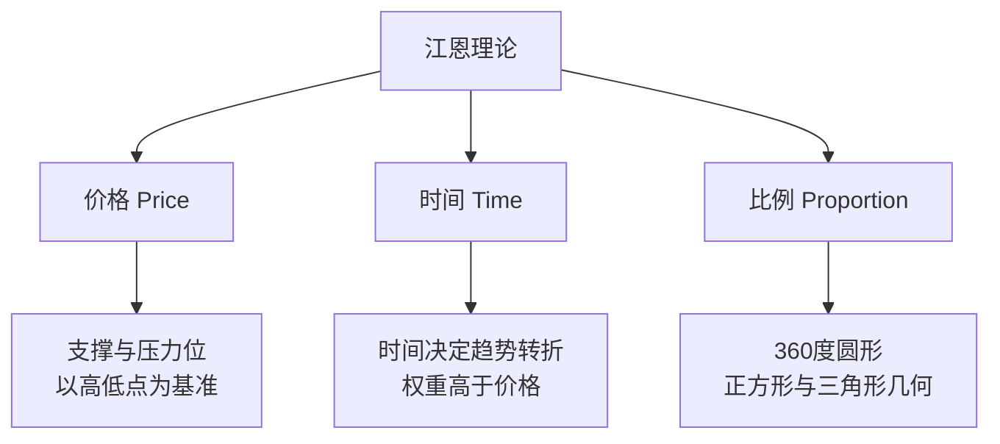

# 江恩理论

> [!note] 💡 概念解析
> 江恩理论由20世纪初交易大师威廉·江恩创立，结合价格、时间、几何比例三个维度分析市场，核心思想："当时间到达时，价格就会跟随。"

## 三大支柱

> [!important] 核心哲学
> 江恩认为市场具有"震动法则"（Law of Vibration），每种金融商品都有独特的震动频率。当时间与价格达成几何上的对称或比例时，就是趋势最易转折的时刻。

## 工具一：江恩角度线（Gann Fan）

### 1×1线——最重要的参考线

**1×1线** 代表"一个单位时间对应一个单位价格"的关系，是判断多空的分水岭：

- 价格在1×1线上方 → 多头力量强
- 有效跌破1×1线 → 趋势可能转弱

### 波动率设定

1×1线的倾斜度取决于**波动率**（Price/Time）设定。例如设定"1天=10点"，软件据此自动调整角度。

> [!tip] 新手建议
> 先用软件的"自动缩放比例"观察价格与1×1线的互动（支撑/压力），熟悉后再手动调整波动率。

## 工具二：江恩九方图（Square of 9）

将数字以螺旋方式排列在方格中，用来找出价格与时间的转折点。

**关键角度**（从起始价格出发）：

| 角度 | 含义 |
|------|------|
| 90° | 第一支撑/压力 |
| 180° | 主要转折位 |
| 270° | 强力支撑/压力 |
| 360° | 完整循环，最重要的转折 |

> [!note] 现代应用
> 现代交易软件（TradingView、MT4/MT5）已内建九方图功能，只需输入起始价格即可自动标示关键价位。

## 工具三：江恩周期理论

### 时间周期数字

| 周期类型 | 常用数字 | 应用 |
|---------|---------|------|
| 短期 | 7天、9天、13天 | 短线转折 |
| 中期 | 18天、27天、52天（约一季） | 波段操作 |
| 长期 | 1年、7年、10年 | 大循环 |

### 关键概念：时间对称

- **转折点周年庆**：历史上的重大起涨/起跌日，未来年份**同一天或相近日**容易出现类似反转
- **历史重演**：前一段上升波段运行了30天 → 下一次回档也接近30天时，就是高度警戒的"对称点"

> [!tip] 实战技巧
> 从7天、9天、18天和1年周期开始观察。当时间窗口到来时，若价格刚好触及江恩角度线的支撑或压力——**时空共振**的点位，胜率最高。

## 四大技术方法对比

| 方法 | 核心逻辑 | 主要侧重 | 最佳场景 |
|------|---------|---------|---------|
| 江恩理论 | 数学几何、时间平衡 | **时间**与价格的对称 | 预测转折时间点 |
| 波浪理论 | 市场心理 | 价格波动的**结构**型态 | 判断处于第几波 |
| 斐波那契 | 黄金分割 | 价格回档的**幅度** | 精确支撑压力位 |
| 传统指标 | 统计学与动能 | 超买**超卖**状态 | 短线进出场 |

## 优缺点

| 优点 | 限制 |
|------|------|
| 同时考虑时间与价格，视野独特 | 设定主观性高（角度线倾斜度因人而异） |
| 提供明确的支撑压力参考 | 学习曲线陡峭 |
| 适合波段和中长线 | 不适合短线当冲 |

> [!warning] 常见陷阱
> 新手最容易犯的错误：把江恩线当成"一定会发生"的铁律，忽略当下的量价确认。**江恩理论是辅助框架，不是预测神器。**

## 📚 相关概念

[[道氏理论]] [[艾略特波浪理论]] [[缠论]] [[趋势类指标（MA、EMA、MACD）]] [[指标组合使用方法论]]

## 实战掌握清单

> [!tip] 交易者视角
> 江恩理论 的学习重点不是记住术语，而是把它放进研究、组合、执行和复盘的闭环。技术指标是价格、成交量和波动率的二次加工，核心价值在于把主观观察变成稳定规则。

### 关键判断

- 先确认指标属于趋势、震荡、量能、波动率还是资金流。
- 判断当前市场是否适合该指标：趋势指标怕横盘，震荡指标怕单边。
- 把参数选择、信号延迟和交易频率写清楚。

### 落地动作

1. 用样本外数据检验信号，而不是只看历史图形好不好看。
2. 同时记录胜率、盈亏比、换手、滑点和回撤。
3. 把指标作为过滤器、触发器或退出规则，避免多个同源指标重复投票。

### 失效边界

- 参数过拟合。
- 忽略手续费和滑点。
- 在市场结构变化后继续迷信旧阈值。

### 复盘问题

- 这项知识改变了哪一个具体决策：标的、方向、仓位、退出、对冲还是不交易？
- 如果判断相反，最大亏损、最长恢复期和退出触发条件是什么？
- 有没有一个更简单的基准方法可以取得相近结果？
