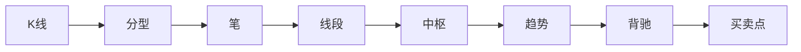

# 缠论

> [!note] 💡 概念解析
> 缠论（缠中说禅技术分析理论）是一种具有严密逻辑体系的技术分析方法，融合道氏理论、波浪理论、形态学，以"中枢"为核心概念定义趋势与买卖点。

## 结构层次（从小到大）



## 一、基础构建单位

### 1. 分型

| 类型 | 定义 |
|------|------|
| **顶分型** | 中间K线高点>两边，低点>两边 |
| **底分型** | 中间K线低点<两边，高点<两边 |

> [!important] 分型要求
> 必须由3根K线构成，不能有包含关系。分型是构成"笔"的基础。

### 2. 笔

由**一个顶分型 + 一个底分型**连接而成，中间不能有破坏笔的反向分型。至少需要5根K线。

### 3. 线段

至少由两"笔"组成，是比笔更高一级的走势结构，反映较为稳定的方向趋势。

## 二、核心结构：中枢

> [!important] 中枢是缠论最核心的概念
> **中枢** = 三个或以上"笔"的重叠价格区间
>
> 中枢区间：[最高的最低点，最低的最高点]

### 趋势判断依据

- **上涨趋势**：不断向上的中枢 + 离开中枢的上笔比前一个高
- **下跌趋势**：不断向下的中枢 + 离开中枢的下笔比前一个低
- **盘整**：只有一个中枢

## 三、背驰

### 定义

背驰 = 当前波段的能量不足以突破前一波段。

**判断方法**：比较两段同向走势的力度（可用MACD面积、柱子高度辅助判断），后一段力度小于前一段 → 背驰。

> [!tip] 背驰 = 趋势终结预警
> 一旦出现背驰，预示可能出现趋势反转或震荡。背驰是缠论中最重要的买卖时机信号。

## 四、三买三卖

### 三买（做多入场点）

| 买点 | 位置 | 风险 |
|------|------|------|
| **一买** | 离开中枢后第一笔回调不破中枢 | 高 |
| **二买** | 第一次回调形成新中枢后再次向上 | 中 |
| **三买** | 再次回抽确认中枢后继续向上 | **低** ⭐ |

### 三卖（做空入场点）

| 卖点 | 位置 | 风险 |
|------|------|------|
| **一卖** | 上涨后离开中枢的第一次回落 | 高 |
| **二卖** | 回落形成新中枢后继续下行 | 中 |
| **三卖** | 再次上拉不破中枢 | **低** ⭐ |

> [!tip] 实战要点
> 三买/三卖是缠论中风险最低的买卖点——趋势确认后回踩中枢不破，是最佳的进场时机。

## 五、级别

缠论强调**多级别联动**：

```
1分钟 → 5分钟 → 15分钟 → 30分钟 → 60分钟 → 日线 → 周线 → 月线
```

- 每个级别都有自己的"笔"、"中枢"和"走势类型"
- 高级别趋势具有更强的指导意义
- 小级别可以预测大级别的拐点

## 六、核心哲学

### 走势必完美

> 所有走势在缠论框架内都可以被解析，理论自洽，不依赖主观判断。

### 多空平衡

缠论不单纯看涨或看跌，而是分析多空力量的平衡与消长。

### 自相似结构

缠论强调"分形"理念——不同级别的走势结构具有相似性，大级别结构在小级别中重复出现。

## 缠论 vs 传统理论

| 特性 | 缠论 | 波浪理论 | 道氏理论 |
|------|------|---------|---------|
| 趋势定义 | 中枢位置关系 | 波浪计数 | 高低点比较 |
| 买卖点 | 明确的三买三卖 | 模糊 | 趋势反转 |
| 主观性 | 低（定义严格） | 高（数浪争议） | 中 |
| 学习难度 | 极高 | 高 | 中 |
| 体系完整度 | 完整闭环 | 开放体系 | 框架性 |

> [!warning] 缠论学习注意
> 缠论概念严格、体系庞大，初学者容易卡在"笔"和"中枢"的定义上。建议从日线级别开始练习，逐步下沉到小级别。

## 📚 相关概念

[[道氏理论]] [[艾略特波浪理论]] [[江恩理论]] [[趋势类指标（MA、EMA、MACD）]] [[指标组合使用方法论]]

## 实战掌握清单

> [!tip] 交易者视角
> 缠论 的学习重点不是记住术语，而是把它放进研究、组合、执行和复盘的闭环。技术指标是价格、成交量和波动率的二次加工，核心价值在于把主观观察变成稳定规则。

### 关键判断

- 先确认指标属于趋势、震荡、量能、波动率还是资金流。
- 判断当前市场是否适合该指标：趋势指标怕横盘，震荡指标怕单边。
- 把参数选择、信号延迟和交易频率写清楚。

### 落地动作

1. 用样本外数据检验信号，而不是只看历史图形好不好看。
2. 同时记录胜率、盈亏比、换手、滑点和回撤。
3. 把指标作为过滤器、触发器或退出规则，避免多个同源指标重复投票。

### 失效边界

- 参数过拟合。
- 忽略手续费和滑点。
- 在市场结构变化后继续迷信旧阈值。

### 复盘问题

- 这项知识改变了哪一个具体决策：标的、方向、仓位、退出、对冲还是不交易？
- 如果判断相反，最大亏损、最长恢复期和退出触发条件是什么？
- 有没有一个更简单的基准方法可以取得相近结果？
