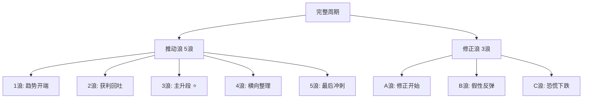

> [!note] 💡 概念解析
> 艾略特波浪理论由拉尔夫·艾略特在1930年代提出，认为市场走势遵循"5浪推动+3浪修正"的重复结构，背后驱动力是市场参与者的集体心理变化循环。

## 核心结构：5-3波浪模型

一个完整的市场周期由**8个浪**组成：

## 推动浪详解

| 浪 | 特征 | 市场心理 | 成交量 |
|----|------|---------|--------|
| **第1浪** | 趋势开端，涨势温和 | 少数敏感资金试探性买入 | 一般 |
| **第2浪** | 深幅回档，但不破1浪起点 | "熊市还没结束"悲观情绪 | 萎缩 |
| **第3浪** | 最长、最强、最具爆发力 | 确认新趋势，大量资金涌入 | 显著放大 |
| **第4浪** | 横向复杂整理，不破1浪高点 | 获利了结+蓄势待发 | 萎缩 |
| **第5浪** | 创新高但动能减弱 | 散户狂热追入 | 价量背离 |

> [!important] 第3浪是交易黄金窗口
> 第3浪通常是推动浪中最长、最强劲的一段，是**确定性最高的交易机会**。识别第3浪的关键：确认第2浪不破第1浪起点后，趋势确认成立。

## 修正浪详解

| 浪 | 特征 | 陷阱 |
|----|------|------|
| **A浪** | 修正开始，市场仍乐观 | 被误解为"买入良机" |
| **B浪** | 假性反弹（死猫跳） | 多头陷阱，成交量偏低 |
| **C浪** | 跌破A浪低点，恐慌抛售 | 常被误判为"最后一跌" |

## 三大铁律（绝对不可违反）

> [!important] 如果你的波浪划分违反以下任何一条，就需要重新数浪

### 铁律一：第2浪回档低点 > 第1浪起点

如果跌破第1浪起点，说明原先的上升趋势假设不成立。

### 铁律二：第3浪不能是最短的推动浪

第3浪可以是第二长或最长，但**绝不能是最短的**。如果划分中第3浪最短，必定错误。

### 铁律三：第4浪低点不与第1浪高点重叠

第4浪的价格范围不能进入第1浪的价格范围（楔形等特殊形态除外）。

## 碎形结构（Fractal Nature）

> [!note] 核心概念
> 每个波浪内部都包含更小级别的5-3结构，从数十年的"超级大循环浪"到几分钟的"微浪"都适用。

- 推动浪内部结构：**5-3-5-3-5**
- 修正浪内部结构：**5-3-5**（锯齿形）或 **3-3-5**（平台形）

**实战意义**：多时间框架分析——日线确定处于第3浪，切到小时图找第3浪内部更小的1-2浪，精确进场。

## 常见修正浪形态

| 形态 | 结构 | 特征 |
|------|------|------|
| 锯齿形（Zigzag） | 5-3-5 | 最剧烈，角度陡 |
| 平台形（Flat） | 3-3-5 | 横盘整理为主 |
| 三角形（Triangle） | 3-3-3-3-3 | 波动收窄，出现在4浪或B浪 |

## 与道氏理论的对比

| 特性 | 道氏理论 | 波浪理论 |
|------|---------|---------|
| 趋势定义 | 高低点比较 | 波浪计数 |
| 核心贡献 | 趋势概念+周期分类 | 波浪结构+斐波那契关系 |
| 预测能力 | 趋势跟踪为主 | 可预测目标位 |
| 主观性 | 低 | 中-高 |
| 学习难度 | 低 | 高 |

> [!warning] 波浪理论的局限
> 数浪主观性强——不同分析者对同一段走势可能数出不同结果。建议用于辅助判断大方向，不单独依赖。

## 📚 相关概念

[[道氏理论]] [[江恩理论]] [[缠论]] [[趋势类指标（MA、EMA、MACD）]] [[指标组合使用方法论]]
