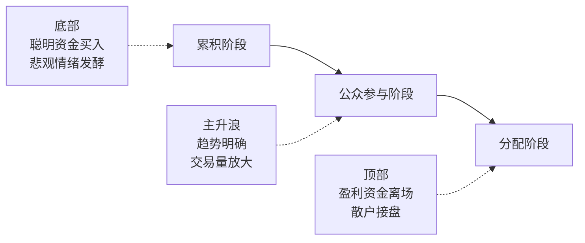

# 道氏理论

> [!note] 💡 概念解析
> 道氏理论是所有技术分析的鼻祖，由查尔斯·道创立。它定义了趋势的标准，明确了走势的周期性——几乎所有现代技术分析方法的内核都源自道氏理论。

## 起源

1896年，查尔斯·道（Charles Dow）创立道琼斯工业平均指数。他在《华尔街日报》的社论中逐步阐述了市场分析思想，去世后由继承者汉密尔顿整理为系统的道氏理论。

## 三大假设（核心基石）

### 假设一：市场价格反映一切信息

市场上的所有信息——经济、政治、心理因素——都会充分反映到价格中。**研究价格走势本身就是分析市场的关键**，不需要获取全部信息，只需跟随趋势。

### 假设二：市场价格呈趋势运行

价格不会随机波动，而是以某种趋势运行。人性中的规律性（贪婪、恐惧）导致市场波动有迹可循。**一旦趋势形成，通常会持续较长时间**，直到出现明确反转信号。

### 假设三：历史会重演

交易者心理类似——在类似市场条件下会做出类似决定，推动价格走势的重复。这就是为什么技术形态（头肩顶底、三角形等）会反复出现。

## 六个基本原则

### 原则一：趋势的定义

> [!important] 道氏趋势定义（最重要的内容）
> - **上涨趋势**：高点和低点不断上移——每个高点>前高，每个低点>前低
> - **下跌趋势**：低点和高点不断下移——每个低点<前低，每个高点<前高

### 原则二：市场有三种周期

| 趋势类型 | 持续时间 | 特征 |
|---------|---------|------|
| **主要趋势** | 一年以上 | 长期方向，如美股长期牛市 |
| **次要趋势** | 数周至数月 | 与主要趋势相反的调整 |
| **短期趋势** | 数天至数周 | 受突发事件影响大，波动快 |

### 原则三：市场的三个阶段

> [!tip] 实战指导
> 对大多数交易者而言，**能抓住第二阶段（公众参与阶段）就完全足够了**。不要试图抄底（第一阶段）或逃顶（第三阶段）。

### 原则四：指数互相确认

多个指数必须同时显现相同方向，才能确认趋势有效性。例如道琼斯工业指数和运输指数同时上涨，才确认牛市。

### 原则五：交易量确认

- 上涨趋势中，价格上涨应伴随交易量增加——强劲买盘支持
- 突破关键位时放量 → 真突破概率更高
- 大量交易堆积的价格区间 → 重要支撑/压力位

### 原则六：趋势持续直至出现反转信号

趋势在没有明确反转信号前会一直延续。**反转标准**：行情无法再创新高/新低，且反向突破前期低点/高点。

## 实战应用

### 策略一：趋势确认后回调进场

根据道氏理论，上涨趋势会经历回调再继续上涨。在趋势确认转多后，等待回调到支撑位再进场。

### 策略二：直接利用趋势反转信号进场

当走势走出符合道氏理论"趋势反转定义"的形态时（无法创新高且跌破前低），可直接进场。

> [!example] 反转案例
> 在连续上涨趋势中，行情受压力位压制无法继续创新高，回落过程中跌破前方低点 → 多头趋势结束，转向做空。

## 道氏理论与现代指标

道氏理论是所有技术指标的"祖先"：
- **均线系统** → 道氏趋势定义的量化表达
- **MACD** → 道氏趋势跟踪+背离预警
- **海龟交易法则** → 道氏"趋势持续直至反转"的直接应用
- **波浪理论** → 道氏周期分类的延伸

## 📚 相关概念

[[艾略特波浪理论]] [[江恩理论]] [[缠论]] [[趋势类指标（MA、EMA、MACD）]] [[指标组合使用方法论]]

## 课程化学习补充

> [!important] 学习定位
> 技术指标是价格与成交量的压缩表达，适合做信号过滤、风险控制和交易纪律，不适合孤立预测未来。本文仅用于学习、研究与复盘，不构成任何投资建议。

### 必须掌握的问题

- 指标参数是否符合交易周期
- 信号是否经过样本外验证
- 是否与趋势/量能/波动率共振
- 是否明确无效条件

### 实战应用流程

1. 先写清楚你的投资假设：为什么这个信号、资产或方法应该产生收益。
2. 明确数据口径：样本范围、更新时间、复权/分红/停牌处理和交易日历。
3. 做最小可行验证：先用简单规则验证方向，再逐步加入复杂模型。
4. 把成本和约束前置：手续费、滑点、冲击成本、保证金、流动性和容量都要进入测算。
5. 上线后持续复盘：记录信号、下单、成交、持仓、回撤和失效原因。

### 风险与失效条件

- 指标共线导致虚假确认
- 震荡市和趋势市参数错配
- 过度优化
- 忽略滑点和交易成本

### 复盘问题

- 这笔交易或这套模型赚的是什么钱：风险补偿、行为偏差、流动性溢价，还是偶然噪音？
- 如果市场环境反过来，最大亏损和最长恢复期会是多少？
- 当前结论是否依赖某个不可持续假设，例如低利率、低波动、充裕流动性或监管套利？
- 有没有一个更简单的基准策略能取得接近效果？

### 延伸学习

- [[技术分析完整指南]]
- [[量价关系与成交量指标]]
- [[假形态识别与应对]]
- [[风险度量指标]]
