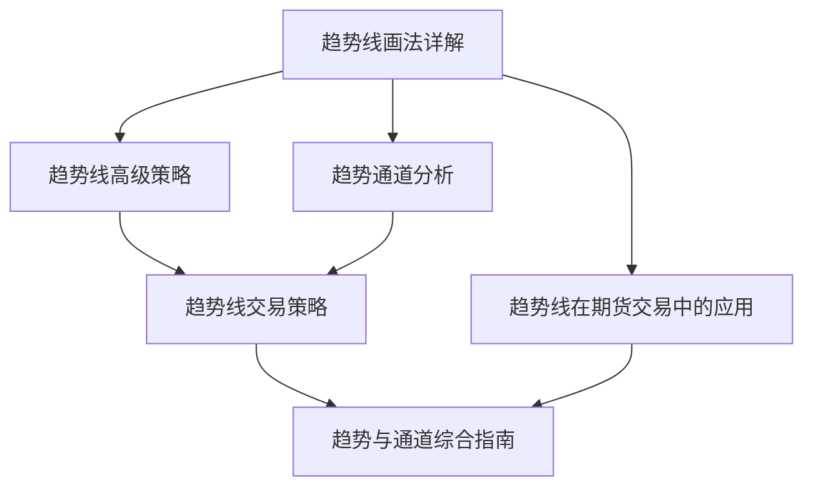

# 五、趋势线与通道

本章节详细介绍趋势线与趋势通道的画法、应用策略和实战技巧。

## 笔记列表

1. [[趋势线画法详解]] - 趋势线的基本定义、绘制规则和验证标准
2. [[趋势线高级策略]] - 突破回测、旗形形态、趋势线反弹三大策略
3. [[趋势线在期货交易中的应用]] - 趋势线在期货市场的特殊应用
4. [[趋势线交易策略]] - 围绕趋势线构建的系统化交易方法
5. [[趋势通道分析]] - 趋势通道的画法和交易策略
6. [[趋势与通道综合指南]] - 趋势线与趋势通道的完整知识框架

## 学习路径

## 核心要点

- 趋势线连接价格波动的高点或低点，判断趋势方向
- 趋势通道由两条平行线构成，提供支撑和阻力位
- 三大策略：突破回测、旗形形态、趋势线反弹
- 配合其他指标使用效果更佳
