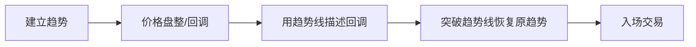

> [!note] 💡 概念解析
> 趋势线高级策略包括突破与回测、旗形形态、趋势线反弹三种核心交易方法，是将趋势线从分析工具转化为实战交易系统的进阶应用。

## 一、突破与回测策略

### 1.1 策略核心

价格突破确认有效的趋势线后，回到趋势线附近进行**回测**，此时是高概率的交易机会。

> [!tip] 关键要点
> 趋势线的**触点越多**，突破与回测策略的可靠性越高。至少需要3-4个有效触点。

### 1.2 入场时机

| 交易风格 | 入场方式 | 特点 |
|---------|---------|------|
| 激进型 | 价格刚触碰趋势线时入场 | 入场早，止损近，胜率较低 |
| 保守型 | 等待价格远离趋势线并出现明确动能后入场 | 入场晚，止损远，胜率较高 |

### 1.3 止损设置

止损通常设置在**趋势线的另一侧**，趋势线充当保护区域，将入场价与止损隔开。

## 二、旗形形态策略

### 2.1 策略逻辑

旗形形态属于**趋势跟随交易**：

### 2.2 趋势强度比较

> [!important] 核心判断方法
> 通过比较**主趋势强度**与**旗形形态强度**来判断突破方向：
> - 主趋势明显强于旗形 → 价格更可能延续原趋势
> - 旗形形态与主趋势强度接近 → 突破方向不确定

### 2.3 配合移动平均线

在旗形形态交易中添加**50日均线**有助于：
- 识别长期趋势方向
- 只关注符合趋势方向的旗形形态
- 避免逆势交易

## 三、趋势线反弹策略

### 3.1 策略要点

趋势线反弹是另一种趋势跟随方法，但趋势线在这里**不是用来确定入场时机**，而是用于识别**支撑或阻力情境**。

### 3.2 多时间框架分析

> [!example] 实战操作流程
> 1. 在**高时间框架**建立趋势线
> 2. 切换到**低时间框架**寻找入场时机
> 3. 利用其他技术概念（如头肩顶形态）确认入场点
> 4. 在高时间框架设置止损

### 3.3 入场确认

当价格从趋势线反弹时，寻找额外确认信号：
- 水平支撑/阻力位的突破
- K线反转形态（如吞没形态、锤子线）
- 其他技术指标的配合

## 四、其他趋势线策略

| 策略类型 | 描述 | 适用场景 |
|---------|------|---------|
| 趋势跟随 | 利用趋势线突破识别新趋势，跟踪利润 | 趋势明确的市场 |
| 价格通道 | 交易通道内的单个价格波动 | 震荡整理市场 |
| 趋势反转突破 | 通过主要趋势线突破判断反转 | 趋势末期 |

## 五、策略回测的局限性

> [!warning] 重要提醒
> 趋势线交易策略的最大缺点是**主观性强**，存在事后偏差。由于难以编写客观的回测规则，建议：
> 1. 不要轻易依赖未经验证的图表形态
> 2. 优先使用有明确规则、可回测的策略
> 3. 将趋势线作为辅助工具而非唯一依据

## 📚 相关概念

[[趋势线画法详解]] [[趋势通道分析]] [[趋势线交易策略]] [[旗形形态]] [[多时间框架分析]]
