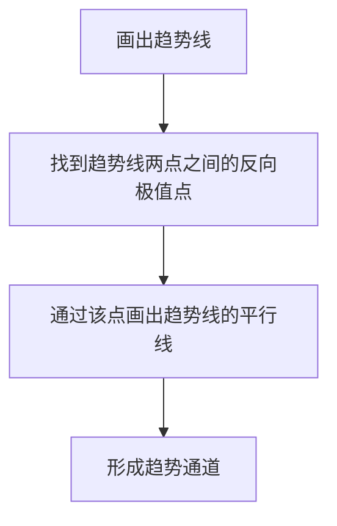

> [!note] 💡 概念解析
> 趋势通道是由两条平行的趋势线构成的价格运行区间，上轨为阻力线，下轨为支撑线，价格在通道内反复震荡运行。

## 一、趋势通道的定义

趋势通道是在趋势线的基础上，增加一条**平行线**形成的通道结构：

- **上升通道**：上升趋势线（下轨）+ 平行阻力线（上轨）
- **下降通道**：下降趋势线（上轨）+ 平行支撑线（下轨）

## 二、趋势通道的画法

### 2.1 绘制步骤

### 2.2 绘制要点

> [!important] 画线规则
> 1. 先画趋势线（连接低点或高点）
> 2. 找到连接趋势线的两个点之间的**反向极值点**
> 3. 通过该点画出趋势线的**平行线**
> 4. 若平行线被突破，重新找到离趋势线最近但不被K线突破的平行线

## 三、趋势通道的交易策略

### 3.1 通道内交易

| 通道类型 | 入场位置 | 出场位置 | 操作方向 |
|---------|---------|---------|---------|
| 上升通道 | 下轨附近 | 上轨附近 | 做多 |
| 下降通道 | 上轨附近 | 下轨附近 | 做空 |

### 3.2 通道突破交易

当价格突破通道时：
- **趋势加强**：重新画平行线，扩大通道
- **趋势反转**：运用123法则判断趋势变化

### 3.3 通道平移法

> [!tip] 目标位预测
> 无论平行线还是趋势线被突破，都可以**平移一次通道**来寻找短时的目标点位。这是一个非常实用的技巧。

## 四、趋势通道的优缺点

| 优点 | 缺点 |
|------|------|
| 直观清晰 | 通道被突破后短期失效 |
| 提供明确的支撑阻力位 | 需要重新画线 |
| 适用于任何周期 | 盘整行情中通道不稳定 |
| 不挑交易品种 | 存在假突破风险 |

## 五、趋势通道与123法则

当通道被突破时，配合123法则判断趋势变化：

1. **条件1**：通道线（或趋势线）被突破
2. **条件2**：价格未能创新高/新低
3. **条件3**：价格突破前一个回调低点/高点

三个条件同时满足，确认趋势反转。

## 📚 相关概念

[[趋势线画法详解]] [[趋势线高级策略]] [[趋势线交易策略]] [[123法则]] [[道氏理论]]
