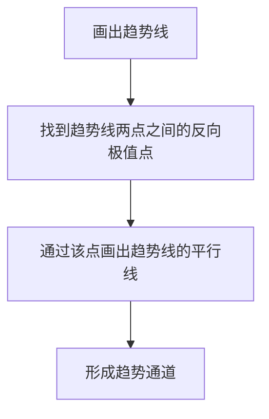

# 趋势通道分析

> [!note] 💡 概念解析
> 趋势通道是由两条平行的趋势线构成的价格运行区间，上轨为阻力线，下轨为支撑线，价格在通道内反复震荡运行。

## 一、趋势通道的定义

趋势通道是在趋势线的基础上，增加一条**平行线**形成的通道结构：

- **上升通道**：上升趋势线（下轨）+ 平行阻力线（上轨）
- **下降通道**：下降趋势线（上轨）+ 平行支撑线（下轨）

## 二、趋势通道的画法

### 2.1 绘制步骤

### 2.2 绘制要点

> [!important] 画线规则
> 1. 先画趋势线（连接低点或高点）
> 2. 找到连接趋势线的两个点之间的**反向极值点**
> 3. 通过该点画出趋势线的**平行线**
> 4. 若平行线被突破，重新找到离趋势线最近但不被K线突破的平行线

## 三、趋势通道的交易策略

### 3.1 通道内交易

| 通道类型 | 入场位置 | 出场位置 | 操作方向 |
|---------|---------|---------|---------|
| 上升通道 | 下轨附近 | 上轨附近 | 做多 |
| 下降通道 | 上轨附近 | 下轨附近 | 做空 |

### 3.2 通道突破交易

当价格突破通道时：
- **趋势加强**：重新画平行线，扩大通道
- **趋势反转**：运用123法则判断趋势变化

### 3.3 通道平移法

> [!tip] 目标位预测
> 无论平行线还是趋势线被突破，都可以**平移一次通道**来寻找短时的目标点位。这是一个非常实用的技巧。

## 四、趋势通道的优缺点

| 优点 | 缺点 |
|------|------|
| 直观清晰 | 通道被突破后短期失效 |
| 提供明确的支撑阻力位 | 需要重新画线 |
| 适用于任何周期 | 盘整行情中通道不稳定 |
| 不挑交易品种 | 存在假突破风险 |

## 五、趋势通道与123法则

当通道被突破时，配合123法则判断趋势变化：

1. **条件1**：通道线（或趋势线）被突破
2. **条件2**：价格未能创新高/新低
3. **条件3**：价格突破前一个回调低点/高点

三个条件同时满足，确认趋势反转。

## 📚 相关概念

[[趋势线画法详解]] [[趋势线高级策略]] [[趋势线交易策略]] [[123法则]] [[道氏理论]]

## 课程化学习补充

> [!important] 学习定位
> 技术指标是价格与成交量的压缩表达，适合做信号过滤、风险控制和交易纪律，不适合孤立预测未来。本文仅用于学习、研究与复盘，不构成任何投资建议。

### 必须掌握的问题

- 指标参数是否符合交易周期
- 信号是否经过样本外验证
- 是否与趋势/量能/波动率共振
- 是否明确无效条件

### 实战应用流程

1. 先写清楚你的投资假设：为什么这个信号、资产或方法应该产生收益。
2. 明确数据口径：样本范围、更新时间、复权/分红/停牌处理和交易日历。
3. 做最小可行验证：先用简单规则验证方向，再逐步加入复杂模型。
4. 把成本和约束前置：手续费、滑点、冲击成本、保证金、流动性和容量都要进入测算。
5. 上线后持续复盘：记录信号、下单、成交、持仓、回撤和失效原因。

### 风险与失效条件

- 指标共线导致虚假确认
- 震荡市和趋势市参数错配
- 过度优化
- 忽略滑点和交易成本

### 复盘问题

- 这笔交易或这套模型赚的是什么钱：风险补偿、行为偏差、流动性溢价，还是偶然噪音？
- 如果市场环境反过来，最大亏损和最长恢复期会是多少？
- 当前结论是否依赖某个不可持续假设，例如低利率、低波动、充裕流动性或监管套利？
- 有没有一个更简单的基准策略能取得接近效果？

### 延伸学习

- [[技术分析完整指南]]
- [[量价关系与成交量指标]]
- [[假形态识别与应对]]
- [[风险度量指标]]
