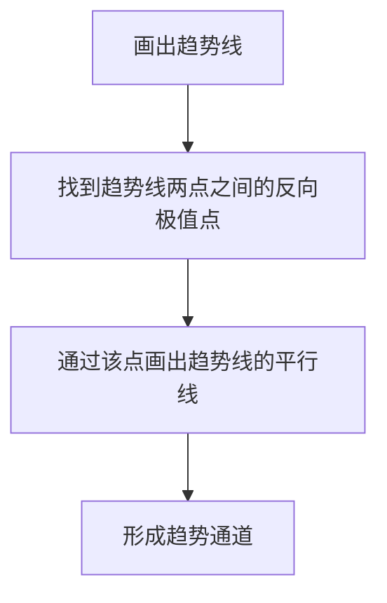

# 趋势通道分析

> [!note] 💡 概念解析
> 趋势通道是由两条平行的趋势线构成的价格运行区间，上轨为阻力线，下轨为支撑线，价格在通道内反复震荡运行。

## 一、趋势通道的定义

趋势通道是在趋势线的基础上，增加一条**平行线**形成的通道结构：

- **上升通道**：上升趋势线（下轨）+ 平行阻力线（上轨）
- **下降通道**：下降趋势线（上轨）+ 平行支撑线（下轨）

## 二、趋势通道的画法

### 2.1 绘制步骤

### 2.2 绘制要点

> [!important] 画线规则
> 1. 先画趋势线（连接低点或高点）
> 2. 找到连接趋势线的两个点之间的**反向极值点**
> 3. 通过该点画出趋势线的**平行线**
> 4. 若平行线被突破，重新找到离趋势线最近但不被K线突破的平行线

## 三、趋势通道的交易策略

### 3.1 通道内交易

| 通道类型 | 入场位置 | 出场位置 | 操作方向 |
|---------|---------|---------|---------|
| 上升通道 | 下轨附近 | 上轨附近 | 做多 |
| 下降通道 | 上轨附近 | 下轨附近 | 做空 |

### 3.2 通道突破交易

当价格突破通道时：
- **趋势加强**：重新画平行线，扩大通道
- **趋势反转**：运用123法则判断趋势变化

### 3.3 通道平移法

> [!tip] 目标位预测
> 无论平行线还是趋势线被突破，都可以**平移一次通道**来寻找短时的目标点位。这是一个非常实用的技巧。

## 四、趋势通道的优缺点

| 优点 | 缺点 |
|------|------|
| 直观清晰 | 通道被突破后短期失效 |
| 提供明确的支撑阻力位 | 需要重新画线 |
| 适用于任何周期 | 盘整行情中通道不稳定 |
| 不挑交易品种 | 存在假突破风险 |

## 五、趋势通道与123法则

当通道被突破时，配合123法则判断趋势变化：

1. **条件1**：通道线（或趋势线）被突破
2. **条件2**：价格未能创新高/新低
3. **条件3**：价格突破前一个回调低点/高点

三个条件同时满足，确认趋势反转。

## 📚 相关概念

[[趋势线画法详解]] [[趋势线高级策略]] [[趋势线交易策略]] [[123法则]] [[道氏理论]]

## 实战掌握清单

> [!tip] 交易者视角
> 趋势通道分析 的学习重点不是记住术语，而是把它放进研究、组合、执行和复盘的闭环。技术指标是价格、成交量和波动率的二次加工，核心价值在于把主观观察变成稳定规则。

### 关键判断

- 先确认指标属于趋势、震荡、量能、波动率还是资金流。
- 判断当前市场是否适合该指标：趋势指标怕横盘，震荡指标怕单边。
- 把参数选择、信号延迟和交易频率写清楚。

### 落地动作

1. 用样本外数据检验信号，而不是只看历史图形好不好看。
2. 同时记录胜率、盈亏比、换手、滑点和回撤。
3. 把指标作为过滤器、触发器或退出规则，避免多个同源指标重复投票。

### 失效边界

- 参数过拟合。
- 忽略手续费和滑点。
- 在市场结构变化后继续迷信旧阈值。

### 复盘问题

- 这项知识改变了哪一个具体决策：标的、方向、仓位、退出、对冲还是不交易？
- 如果判断相反，最大亏损、最长恢复期和退出触发条件是什么？
- 有没有一个更简单的基准方法可以取得相近结果？

## 深度案例与训练

### 指标实验

围绕 趋势通道分析 设计三组实验：趋势行情、震荡行情和急跌反弹。分别测试参数、信号延迟、胜率、盈亏比、换手率和最大回撤。

### 组合使用

- 不要堆叠多个同源指标，例如多个均线指标重复投票。
- 指标最好分工：趋势判断、入场触发、风险退出、仓位过滤。
- 对指标做样本外验证，避免只适合历史图形。

### 实盘要求

指标信号必须配合交易成本、流动性和止损纪律。

## 最小可执行项目

### 指标参数实验

围绕 趋势通道分析 做一个参数实验：默认参数、短周期参数和长周期参数分别在趋势、震荡和极端波动中表现如何。

| 输出 | 用途 |
|---|---|
| 胜率 | 判断信号命中 |
| 盈亏比 | 判断是否值得交易 |
| 换手 | 判断成本压力 |
| 回撤 | 设计仓位 |
| 参数稳定性 | 识别过拟合 |

### 验收标准

指标必须服务于明确分工：判断趋势、触发入场、过滤风险或辅助退出。

## 进一步实战化

### 指标验证练习

围绕 `趋势通道分析` 做一次小型验证：同一指标分别在趋势行情、震荡行情和急跌反弹中测试，记录胜率、盈亏比、换手、滑点和最大回撤。

| 维度 | 问题 |
|---|---|
| 参数 | 参数是否只在某段历史有效 |
| 成本 | 换手是否吃掉收益 |
| 环境 | 指标适合趋势还是震荡 |
| 退出 | 信号失效后如何离场 |

验收标准：指标必须有明确分工，不能既当趋势判断又当入场、止损和仓位规则。
