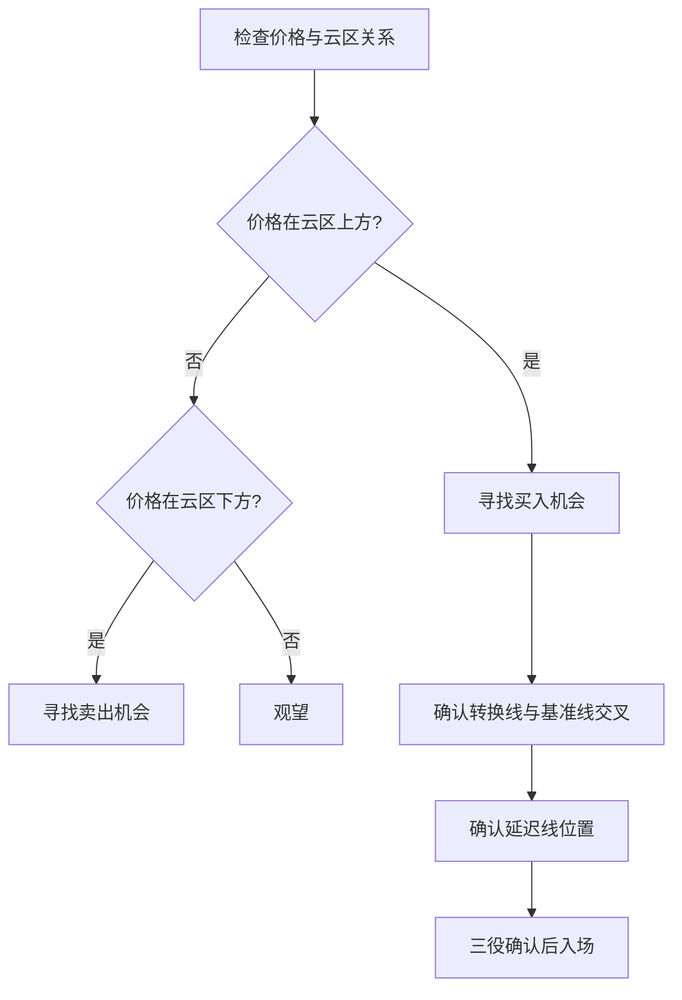

> [!note] 💡 概念解析
> Ichimoku云图是一套自成体系的技术分析系统，不仅能够判断市场趋势，还能提示支撑阻力的强弱，辅助投资者找到入场和离场机会。

## 一、云图的核心组成

### 1.1 五线系统

| 线条 | 周期 | 作用 |
|------|------|------|
| 转换线 | 9天 | 短期趋势 |
| 基准线 | 26天 | 中期趋势 |
| 先行带A | 转换线与基准线的平均 | 未来趋势预测 |
| 先行带B | 52天 | 未来趋势预测 |
| 延迟线 | 当前收盘价前移26天 | 趋势确认 |

### 1.2 云区的形成

云区（Kumo）由先行带A和先行带B之间的区域构成：
- **先行带A在上**：上升趋势云区（通常为绿色）
- **先行带B在上**：下降趋势云区（通常为红色）

## 二、云区的深度应用

### 2.1 云区厚度分析

> [!tip] 云区厚度的意义
> - **厚云区**：支撑/阻力强，趋势稳定
> - **薄云区**：支撑/阻力弱，容易被突破
> - **云区由薄变厚**：趋势可能反转

### 2.2 云区转折点

云区转折是重要的趋势变化信号：
- 先行带A从下向上穿越先行带B → 上升趋势确立
- 先行带A从上向下穿越先行带B → 下降趋势确立

### 2.3 价格与云区的关系

| 价格位置 | 市场状态 | 交易建议 |
|---------|---------|---------|
| 价格远离云区上方 | 强势上涨 | 持有多单 |
| 价格靠近云区上方 | 上涨趋势减弱 | 注意止盈 |
| 价格进入云区内部 | 趋势不明 | 观望 |
| 价格靠近云区下方 | 下跌趋势减弱 | 注意抄底 |
| 价格远离云区下方 | 强势下跌 | 持有空单 |

## 三、转换线与基准线的交叉

### 3.1 金叉（TK交叉）

转换线上穿基准线：
- 在云区上方金叉 → 强买入信号
- 在云区内部金叉 → 中性信号
- 在云区下方金叉 → 弱买入信号

### 3.2 死叉

转换线下穿基准线：
- 在云区下方死叉 → 强卖出信号
- 在云区内部死叉 → 中性信号
- 在云区上方死叉 → 弱卖出信号

## 四、延迟线的应用

延迟线是将当前收盘价向后移动26天，用于与历史价格比较：

> [!important] 延迟线判断方法
> - 延迟线在所有K线上方 → 上升趋势确认
> - 延迟线在所有K线下方 → 下跌趋势确认
> - 延迟线与K线交叉 → 趋势可能反转

## 五、云图的实战策略

### 5.1 完整的交易系统

### 5.2 止损止盈设置

- **止损**：设置在云区的另一侧
- **止盈**：利用水平论（N计算值、E计算值等）确定目标位

## 六、云图与其他指标的配合

| 配合指标 | 作用 |
|---------|------|
| MACD | 确认趋势动量 |
| RSI | 识别超买超卖 |
| 成交量 | 确认突破有效性 |
| 趋势线 | 提供额外支撑阻力 |

## 📚 相关概念

[[一目均衡表详解]] [[趋势类指标（MA、EMA、MACD）]] [[道氏理论]] [[趋势通道分析]] [[指标组合使用方法论]]
