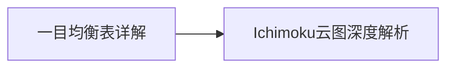

# 六、特殊指标

本章节介绍特殊的技术分析指标，包括一目均衡表（Ichimoku云图）等。

## 笔记列表

1. [[一目均衡表详解]] - 一目均衡表的起源、五条线构成、三大理论体系
2. [[Ichimoku云图深度解析]] - 云区的深度应用、实战策略和配合指标

## 学习路径

## 核心要点

- 一目均衡表由五条线和云区构成
- 三役好转是买入信号，三役逆转是卖出信号
- 云区是判断趋势方向的核心
- 三大理论：时间论、波动论、水平论
