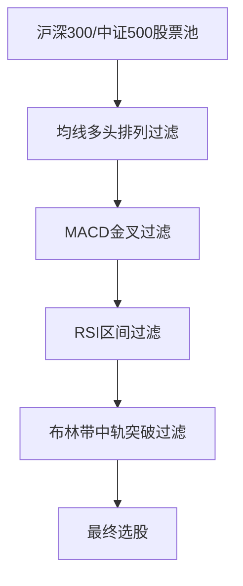

# 多因子趋势跟踪策略

> [!note] 💡 概念解析
> 多因子趋势跟踪策略是基于MA、EMA、MACD、RSI、KDJ及布林带六个核心技术指标的组合策略，通过多指标共振过滤单一指标在震荡市场中产生的假信号，提高趋势跟踪的可靠性。

## 一、策略概述

### 1.1 核心思想

趋势跟踪策略（Trend Following Strategy）的核心投资哲学在于**"顺势而为"**——相信已形成的趋势具有持续性，通过识别并跟随市场趋势获取收益。

> [!important] 与均值回归的区别
> - **趋势跟踪**：顺势交易，追涨杀跌
> - **均值回归**：逆势交易，高抛低吸

### 1.2 六大技术指标

| 指标 | 类型 | 核心功能 |
|------|------|---------|
| MA | 趋势 | 判断趋势方向 |
| EMA | 趋势 | 减少滞后性 |
| MACD | 趋势/动量 | 趋势强度与转折 |
| RSI | 动量 | 超买超卖 |
| KDJ | 动量 | 短期买卖 |
| BOLL | 波动性 | 波动范围 |

## 二、技术指标的数学原理

### 2.1 MA（简单移动平均线）

$$\text{MA}(N) = \frac{P_1 + P_2 + \cdots + P_N}{N}$$

**核心信号**：金叉买入，死叉卖出

### 2.2 EMA（指数移动平均线）

$$\text{EMA}_t = \alpha \times P_t + (1-\alpha) \times \text{EMA}_{t-1}$$

其中 $\alpha = \frac{2}{N+1}$

### 2.3 MACD

$$\text{DIF} = \text{EMA}(12) - \text{EMA}(26)$$
$$\text{DEA} = \text{EMA}(\text{DIF}, 9)$$
$$\text{MACD柱} = 2 \times (\text{DIF} - \text{DEA})$$

### 2.4 RSI

$$\text{RSI}(N) = 100 - \frac{100}{1 + \frac{\text{N日平均涨幅}}{\text{N日平均跌幅}}}$$

### 2.5 KDJ

$$\text{RSV} = \frac{C - L_9}{H_9 - L_9} \times 100$$
$$K = \frac{2}{3} K_{-1} + \frac{1}{3} \text{RSV}$$
$$D = \frac{2}{3} D_{-1} + \frac{1}{3} K$$
$$J = 3K - 2D$$

### 2.6 BOLL

$$\text{中轨} = \text{MA}(20)$$
$$\text{上轨} = \text{中轨} + 2\sigma$$
$$\text{下轨} = \text{中轨} - 2\sigma$$

## 三、多因子选股策略

### 3.1 选股条件

> [!tip] 四大选股条件
> 1. **均线多头排列**：MA5 > MA10 > MA20 > MA60
> 2. **MACD金叉**：DIF上穿DEA
> 3. **RSI区间过滤**：50 < RSI < 70
> 4. **布林带中轨突破**：价格突破布林带中轨

### 3.2 选股流程

## 四、风险控制机制

### 4.1 三重风控

| 风控机制 | 条件 | 操作 |
|---------|------|------|
| 止损 | 亏损达X% | 全部卖出 |
| 止盈 | 盈利达Y% | 部分卖出 |
| 最大持仓期限 | 持仓超过Z天 | 全部卖出 |

### 4.2 市场择时

> [!example] 市场择时策略
> 1. **大盘趋势判断**：沪深300的MA20 > MA60
> 2. **市场情绪判断**：RSI > 50
> 3. **波动性判断**：BOLL带宽适中
> 4. 三个条件同时满足才进行选股

## 五、策略回测表现

### 5.1 回测结果

| 指标 | 牛市 | 熊市 | 震荡市 |
|------|------|------|--------|
| 收益率 | 优秀 | 一般 | 较差 |
| 最大回撤 | 较小 | 较大 | 中等 |
| 胜率 | 高 | 低 | 中 |
| 盈亏比 | 高 | 低 | 中 |

### 5.2 策略特点

> [!warning] 策略局限
> 1. 在**牛市**环境中表现优异
> 2. 在**熊市**中仅能部分降低亏损
> 3. 整体策略具有显著的**动量特征**
> 4. 在**震荡市**中假信号较多

## 六、策略优化方向

### 6.1 参数优化

- 调整MA周期参数
- 优化RSI阈值
- 调整BOLL标准差倍数

### 6.2 因子增强

> [!tip] 增强方向
> 1. 增加**成交量因子**（OBV、VR）
> 2. 增加**波动性因子**（ATR）
> 3. 增加**基本面因子**（PE、PB）
> 4. 增加**情绪因子**（融资融券）

## 📚 相关概念

[[趋势类指标（MA、EMA、MACD）]] [[震荡类指标（KDJ、RSI、CCI）]] [[趋势强度指标（DMI、布林带）]] [[五大核心技术指标指南]] [[指标组合使用方法论]]

## 课程化学习补充

> [!important] 学习定位
> 技术指标是价格与成交量的压缩表达，适合做信号过滤、风险控制和交易纪律，不适合孤立预测未来。本文仅用于学习、研究与复盘，不构成任何投资建议。

### 必须掌握的问题

- 指标参数是否符合交易周期
- 信号是否经过样本外验证
- 是否与趋势/量能/波动率共振
- 是否明确无效条件

### 实战应用流程

1. 先写清楚你的投资假设：为什么这个信号、资产或方法应该产生收益。
2. 明确数据口径：样本范围、更新时间、复权/分红/停牌处理和交易日历。
3. 做最小可行验证：先用简单规则验证方向，再逐步加入复杂模型。
4. 把成本和约束前置：手续费、滑点、冲击成本、保证金、流动性和容量都要进入测算。
5. 上线后持续复盘：记录信号、下单、成交、持仓、回撤和失效原因。

### 风险与失效条件

- 指标共线导致虚假确认
- 震荡市和趋势市参数错配
- 过度优化
- 忽略滑点和交易成本

### 复盘问题

- 这笔交易或这套模型赚的是什么钱：风险补偿、行为偏差、流动性溢价，还是偶然噪音？
- 如果市场环境反过来，最大亏损和最长恢复期会是多少？
- 当前结论是否依赖某个不可持续假设，例如低利率、低波动、充裕流动性或监管套利？
- 有没有一个更简单的基准策略能取得接近效果？

### 延伸学习

- [[技术分析完整指南]]
- [[量价关系与成交量指标]]
- [[假形态识别与应对]]
- [[风险度量指标]]
