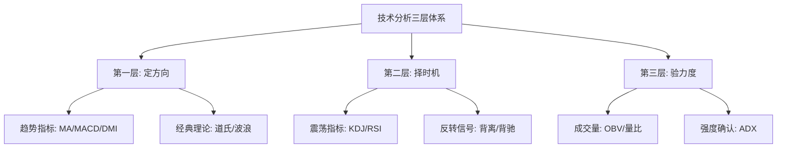

# 指标组合使用方法论

> [!note] 💡 概念解析
> 单独使用任何一个技术指标都是危险的。高手的玩法是**指标互补、相互验证**——用趋势指标定方向、震荡指标择时机、成交量指标验力度。

## 一、核心原则

### 1. 分层分工



### 2. 互补原则

每种指标有其最佳场景和弱点。组合的目的就是用A的长处弥补B的短处：

| 指标 | 最佳场景 | 致命弱点 | 互补搭档 |
|------|---------|---------|---------|
| KDJ | 震荡市超买超卖 | 趋势市失灵 | MA/MACD |
| MACD | 趋势跟踪+背离 | 震荡市假信号 | KDJ |
| DMI | 趋势强度判断 | 无买卖点 | MACD/KDJ |
| 布林带 | 波动率+突破 | 假突破多 | 成交量 |
| 成交量 | 资金验证 | 无法定向 | 所有方向指标 |

## 二、黄金组合一：趋势跟踪 + 震荡择时

### 配置：均线 + KDJ

**策略逻辑**：

1. **只在大趋势向上时做多**：股价站在60日均线之上 → 牛市环境
2. **在牛市中只做KDJ金叉**：KDJ在50附近形成金叉 → 绝佳加仓点
3. **忽略KDJ在超买区的死叉**：强势上涨中KDJ反复超买是正常的，以均线趋势为准

> [!example] 实战效果
> 完美解决KDJ在趋势行情中"失灵"的问题——既能抓住大趋势（均线），又能找到好的入场点（KDJ低吸）。

```
均线看方向（只做多）→ KDJ金叉入场 → KDJ死叉或均线破位出场
```

## 三、黄金组合二：多重确认，提高胜率

### 配置：MACD + DMI

**三重确认买入信号**：

1. **MACD在零轴上方金叉** → 趋势向好
2. **+DI上穿-DI** → 多方力量增强
3. **ADX拐头向上** → 趋势强度增加

> [!important] 三重共振 = 最高可靠性
> 当这三个信号同时出现时，买入信号的可靠性达到巅峰。极大过滤掉假信号，只在高确定性机会上下重注。

## 四、黄金组合三：波动区间交易

### 配置：布林带 + RSI + 成交量

| 信号 | 条件组合 | 操作 |
|------|---------|------|
| 买入 | 价格触及下轨 + RSI<30 + 缩量 | 超卖低吸 |
| 卖出 | 价格触及上轨 + RSI>70 + 放量 | 超买高抛 |
| 突破做多 | 价格突破上轨 + 放量>均量1.5倍 + RSI>50 | 强势突破跟进 |

## 五、黄金组合四：道氏理论 + MACD背离

### 配置：道氏趋势定义 + MACD背离

**大级别方向**用道氏理论（高低点比较）确定，**精确入场**用MACD背离捕捉。

> [!example] 实战案例
> 道氏理论确认上涨趋势（高低点不断上移）→ 等待MACD顶背离出现 → 趋势可能终结，减仓 → 道氏反转信号确认（跌破前低）→ 清仓做空。

## 六、完整的交易流程

```
┌──────────────────────────────────────┐
│  第1步：定大方向                      │
│  道氏理论 + MA多头/空头排列            │
│  → 确定当前是牛/熊/震荡               │
├──────────────────────────────────────┤
│  第2步：判断趋势强度                   │
│  DMI(ADX>25) + 成交量                  │
│  → 值得参与还是应该观望？              │
├──────────────────────────────────────┤
│  第3步：寻找入场时机                   │
│  牛市中KDJ金叉/回调到均线              │
│  熊市中MACD死叉/反弹到均线             │
│  → 精准择时                           │
├──────────────────────────────────────┤
│  第4步：多重确认                       │
│  至少2个指标同时发出信号               │
│  成交量验证方向                       │
│  → 过滤假信号                         │
├──────────────────────────────────────┤
│  第5步：设置出场条件                   │
│  止盈：目标位 + 背离信号               │
│  止损：趋势反转（道氏标准）            │
│  → 盈亏比 > 2:1                       │
└──────────────────────────────────────┘
```

## 七、指标选择的黄金法则

### 按市场环境选择

| 市场环境 | 首选指标组合 | 原因 |
|---------|------------|------|
| 强趋势市 | MA + MACD + DMI | 趋势跟踪最强 |
| 震荡市 | KDJ + 布林带 + RSI | 区间交易精准 |
| 趋势转折 | MACD背离 + 道氏反转 | 捕捉大拐点 |
| 突破交易 | 布林带 + 成交量 + DMI | 真假突破过滤 |

### 按交易风格选择

| 风格 | 指标配置 | 周期 |
|------|---------|------|
| 短线 | EMA5/EMA20 + KDJ + 量比 | 15分钟-1小时 |
| 波段 | MA20/MA60 + MACD + OBV | 日线 |
| 中长线 | 道氏理论 + MA60/MA120 + 周MACD | 周线-月线 |

## 八、常见错误与避免

> [!warning] 指标使用三大忌
> 1. **过度堆砌**：同时看5个以上指标 → 信号矛盾，决策瘫痪
> 2. **忽略时间框架**：用日线KDJ做周线趋势判断 → 周期错配
> 3. **无视市场环境**：震荡市用趋势指标，趋势市用震荡指标 → 反复被打脸

**黄金原则**：2-3个指标组合就足够，超过4个就是噪音。

## 📚 相关概念

[[趋势类指标（MA、EMA、MACD）]] [[震荡类指标（KDJ、RSI、CCI）]] [[趋势强度指标（DMI、布林带）]] [[道氏理论]] [[量价关系与成交量指标]] [[投资心理偏误]]

## 课程化学习补充

> [!important] 学习定位
> 技术指标是价格与成交量的压缩表达，适合做信号过滤、风险控制和交易纪律，不适合孤立预测未来。本文仅用于学习、研究与复盘，不构成任何投资建议。

### 必须掌握的问题

- 指标参数是否符合交易周期
- 信号是否经过样本外验证
- 是否与趋势/量能/波动率共振
- 是否明确无效条件

### 实战应用流程

1. 先写清楚你的投资假设：为什么这个信号、资产或方法应该产生收益。
2. 明确数据口径：样本范围、更新时间、复权/分红/停牌处理和交易日历。
3. 做最小可行验证：先用简单规则验证方向，再逐步加入复杂模型。
4. 把成本和约束前置：手续费、滑点、冲击成本、保证金、流动性和容量都要进入测算。
5. 上线后持续复盘：记录信号、下单、成交、持仓、回撤和失效原因。

### 风险与失效条件

- 指标共线导致虚假确认
- 震荡市和趋势市参数错配
- 过度优化
- 忽略滑点和交易成本

### 复盘问题

- 这笔交易或这套模型赚的是什么钱：风险补偿、行为偏差、流动性溢价，还是偶然噪音？
- 如果市场环境反过来，最大亏损和最长恢复期会是多少？
- 当前结论是否依赖某个不可持续假设，例如低利率、低波动、充裕流动性或监管套利？
- 有没有一个更简单的基准策略能取得接近效果？

### 延伸学习

- [[技术分析完整指南]]
- [[量价关系与成交量指标]]
- [[假形态识别与应对]]
- [[风险度量指标]]

## 跨领域进阶扩展

> [!tip] 交易者视角
> 学到 `指标组合使用方法论` 时，不要只把它当成孤立知识点。把指标当成信号过滤器和纪律工具，不能替代交易系统。优秀投资交易者会把它放入“宏观背景 - 资产选择 - 估值/信号 - 组合风险 - 交易执行 - 复盘反馈”的闭环。

### 与其他知识的连接

- 趋势、动量、均值回归和波动率
- 成交量和资金流验证
- 多周期共振与冲突
- 成本、滑点和过度交易

### 进阶训练

1. 比较指标在趋势市和震荡市的表现
2. 给每个信号定义入场、退出、止损和暂停条件
3. 用样本外数据检查参数稳定性

### 能力验收

- 能否说清楚这个主题影响的是收益来源、风险来源、交易成本、流动性还是心理纪律？
- 能否指出它在什么市场环境、资产类别或交易周期中更有效？
- 能否把它写成一条可复盘的研究或交易规则？
- 能否说明如果判断错误，组合最大损失和退出机制是什么？

### 全局关联

- [[综合金融知识体系/金融投资全知识地图|金融投资全知识地图]]
- [[综合金融知识体系/优秀投资交易者能力地图|优秀投资交易者能力地图]]
- [[综合金融知识体系/一次性学习路线与复盘模板|一次性学习路线与复盘模板]]
