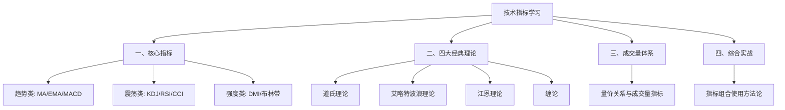

> [!note] 💡 概念解析
> 技术指标是基于价格、成交量等市场数据计算出的数学工具，用于识别趋势、判断买卖时机和衡量市场情绪。本专题从零开始系统学习技术指标。

## 学习路线

## 章节索引

### 一、核心指标
- [[趋势类指标（MA、EMA、MACD）]]
- [[震荡类指标（KDJ、RSI、CCI）]]
- [[趋势强度指标（DMI、布林带）]]

### 二、四大经典理论
- [[道氏理论]]
- [[艾略特波浪理论]]
- [[江恩理论]]
- [[缠论]]

### 三、成交量体系
- [[量价关系与成交量指标]]

### 四、综合实战
- [[指标组合使用方法论]]

## 为什么学这个？

技术指标是**市场语言的翻译器**：
- 趋势指标告诉你"方向在哪"
- 震荡指标告诉你"时机在哪"
- 成交量指标告诉你"力度如何"
- 经典理论告诉你"背后的规律"

本专题覆盖54篇原始资料精华，涵盖6大核心指标、4大经典理论，帮助你从零建立技术分析体系。

## 📚 相关概念

[[技术分析入门]] [[三张财务报表]] [[估值方法入门]] [[宏观经济基础]]
