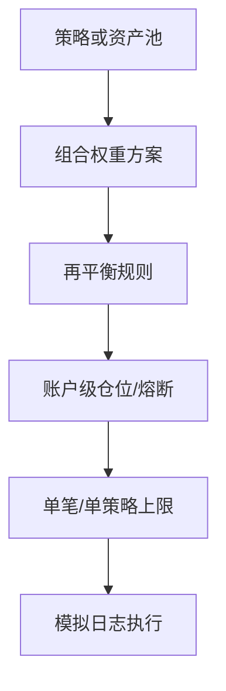

# 组合与仓位实操导航

> [!note] 核心问题
> 进阶里「组合管理」讲优化与再平衡，「凯利」讲下注比例；阶段零已有 **等权/逆波动脚本** 与 **风控卡**。本篇把两块合成一条 **2 周可执行路径**：先能定权重与再平衡，再谈仓位上限，最后才碰优化器与全凯利。

## 学习目标

1. 分清组合层（多资产权重）与仓位层（总风险/单笔大小）。  
2. 跑通或复核 quant-lab 等权/逆波动再平衡。  
3. 填完整张个人/策略风控卡中的仓位相关格。  
4. 理解「全凯利危险、分数凯利更常用」的实操含义。  
5. 完成「组合+仓位一页纸」，而不是只背模型名。  

## 两层问题

| 层 | 问题 | 典型工具 | 本库 |
|---|---|---|---|
| **组合权重** | 各资产/策略各占多少？ | 等权、风险平价、MV、BL | [[组合管理/目录]] · [[组合层实操]] |
| **仓位规模** | 总账户拿多少风险？单笔多大？ | 波动目标、回撤熔断、分数凯利 | [[凯利公式与仓位管理/目录]] · [[阶段四风控卡实操]] |



## 与阶段零脚本对照

| 脚本/文档 | 教什么 | 不教什么 |
|---|---|---|
| `run_equal_weight_rebalance.py` | 等权、再平衡频率、max_weight、换手成本 | 协方差优化、BL 观点 |
| `inv_vol` scheme | 「波动大少配」直觉 | 真正风险平价（需相关/RC） |
| [[阶段四风控卡实操]] | 回撤/单票/熔断文字规则 | 优化器求解 |
| [[资金管理与杠杆]]（课程） | 杠杆与破产直觉 | 完整 Kelly 推导 |

```powershell
cd ...\quant-lab
python scripts/pull_watchlist.py
python scripts/run_equal_weight_rebalance.py --scheme equal --rebalance ME --cost-bps 10
python scripts/run_equal_weight_rebalance.py --scheme inv_vol --max-weight 0.4
python scripts/summarize_report.py reports/port_equal_ME.json
```

详见 [[组合层实操]]。

## 推荐 2 周路径

| 天 | 读什么 | 做 |
|---:|---|---|
| 1 | [[组合构建方法]]（阶段四） | 用自己的话写「权重方法阶梯」 |
| 2 | [[组合层实操]] + 跑 equal / inv_vol | 两份 JSON + 换手对比 |
| 3 | [[再平衡策略总览]] | 日历 vs 阈值：选一种写进说明书 |
| 4 | [[风险度量指标]] 或课程 [[风险管理框架]] | 把 max_dd / 波动写进风控卡 |
| 5 | [[风险平价模型]]（概念） | 对比 inv_vol 教学简化 vs 真 RP |
| 6–7 | [[凯利公式概述]] + [[半凯利与分数凯利]] | 计算一个**假设**胜率赔率下的 f* 与 f*/2 |
| 8 | [[仓位管理概述]] 或 [[动态仓位管理]] | 连续亏损情景：仓位如何降 |
| 9 | [[阶段四风控卡实操]] | 卡 A/B 仓位格填满 |
| 10 | 一页纸（见下） | 交卷 |

优化器（均值方差、BL）放在**一页纸之后**再读 [[均值-方差模型]] / [[Black-Litterman模型]]，避免一上来调协方差。

## 凯利：实操纪律（先读再公式）

| 原则 | 含义 |
|---|---|
| 全凯利常过大 | 估计误差 + 路径依赖 → 回撤难忍 |
| 分数凯利 | 常用 1/2、1/4 等，换平滑 |
| 输入不可瞎编 | 胜率/赔率要用样本外或保守先验 |
| 多策略相关 | 不能每个策略各自全凯利再相加 |
| 流动性与制度 | A 股涨跌停/T+1 限制「理论最优仓」 |

公式直觉（下注比例与优势有关；细节见专题推导文）：

$$
f^* \approx \frac{bp - q}{b}
$$

（$b$ 净赔率，$p$ 胜率，$q=1-p$；**估计错则 f 错**。）

## 组合+仓位一页纸（作业）

| 字段 | 填写 |
|---|---|
| 账户目标与最大回撤 |  |
| 资产/策略池 |  |
| 权重方法 | 等权 / inv_vol / 其他 |
| 再平衡 | 频率或阈值 |
| 单票上限 |  |
| 策略资金占比上限 |  |
| 成本假设 |  |
| quant-lab 报告路径 |  |
| 是否使用凯利 | 否 / 分数凯利（比例） |
| 凯利输入来源 | 回测 / 假设 / 不用 |
| 熔断 | 日/总回撤动作 |
| 杠杆 | 默认否 |
| 模拟执行证据 | 日志路径或说明 |

## 专题内地图

### 组合管理（[[组合管理/目录]]）

| 区块 | 代表笔记 | 何时 |
|---|---|---|
| 优化 | [[现代投资组合理论]] [[均值-方差模型]] [[有效前沿与CAPM]] [[Black-Litterman模型]] | 一页纸后 |
| 风险 | [[风险度量指标]] [[风险平价模型]] [[量化风险管理体系]] [[黑天鹅风险管理]] | 与风控卡同步 |
| 再平衡 | [[再平衡策略总览]] [[动态再平衡分析]] [[回撤控制最优组合]] | 第 3 天 |

### 凯利与仓位（[[凯利公式与仓位管理/目录]]）

| 区块 | 代表笔记 | 何时 |
|---|---|---|
| 基础 | [[凯利公式概述]] [[凯利公式推导]] [[凯利公式变体]] | 第 6–7 天 |
| 仓位 | [[仓位管理概述]] [[半凯利与分数凯利]] [[动态仓位管理]] | 第 8 天 |
| 应用 | [[股票策略中的应用]] 等 | 有需要再读 |

## 与因子波次的衔接

| 上波 | 本波 |
|---|---|
| [[因子投资实操导航]] 得到分数/排序 | 本波解决「权重+规模」 |
| top_k 等权 | 可升级为风险预算，但仍先等权稳健 |

## 常见误区

| 误区 | 更好的理解 |
|---|---|
| 优化器一定优于等权 | 估计误差下等权常更稳 |
| inv_vol = 风险平价 | 教学近似，忽略相关结构 |
| 回测夏普高 → 全凯利 | 常通向不可执行回撤 |
| 仓位只看单笔盈亏比 | 要看账户路径与相关性 |
| 再平衡越勤越好 | 换手与税/费 |

## 练习（本波验收）

- [ ] equal 与 inv_vol 各一份结果或书面对比  
- [ ] 再平衡规则写进说明书  
- [ ] 风控卡仓位相关格无空  
- [ ] 分数凯利或明确「不用凯利」的理由  
- [ ] 一页纸完成  

## 相关概念

[[组合管理/目录]] [[凯利公式与仓位管理/目录]] [[组合层实操]] [[阶段四风控卡实操]] [[组合构建方法]] [[资金管理与杠杆]] [[因子投资实操导航]] [[全库百科化路线图]]
