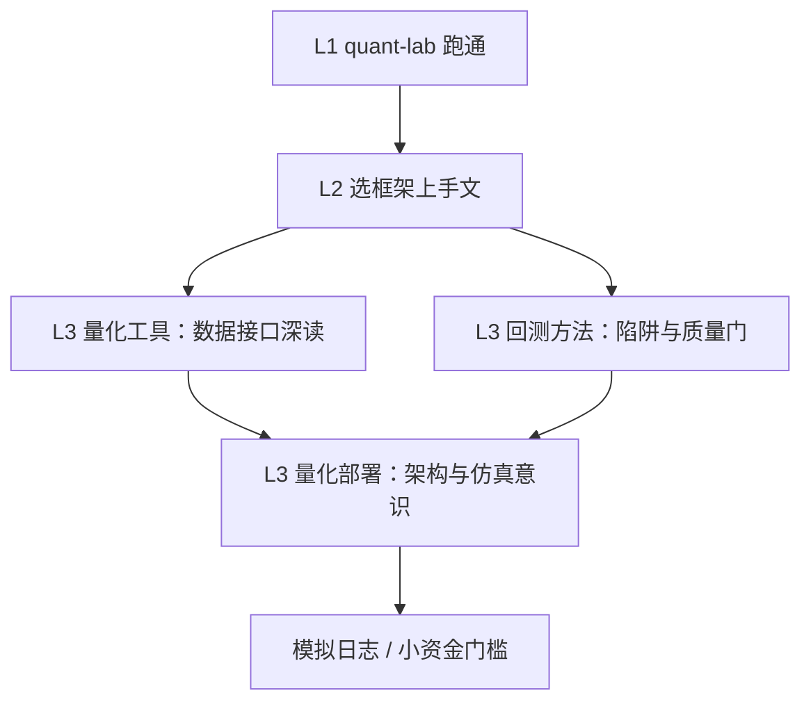

# 进阶工具部署与回测实操导航

> [!note] 核心问题
> 进阶专题里「量化工具 / 量化部署 / 回测方法」内容很多，但容易和阶段零、开源工具上手**重复迷路**。本篇是 **P3 第 1 波**导航：告诉你先读哪、深读哪、第一周交付什么，不重复发明第三套安装教程。

## 学习目标

1. 分清三层：课程闭环（阶段零）/ 框架上手（开源工具）/ 专题深读（进阶）。  
2. 按目标走「工具 → 回测质量 → 部署意识」顺序。  
3. 用检查清单完成一次「研究可复现 + 知道实盘还差什么」。  
4. 知道 AKShare 深文与 vn.py 部署文何时打开。  
5. 为 P3 后续波次（因子/组合）留好接口。  

## 三层分工（必读）

| 层级 | 位置 | 你在这里做什么 |
|---|---|---|
| L1 课程闭环 | [[实操百科总索引]] · quant-lab | 双均线/动量/作业证据 |
| L2 框架上手 | [[开源工具/目录]] · [[工具实操总导航]] | 选一条链 Hello World |
| L3 专题深读 | 本区三目录 | 数据接口细节、架构、回测陷阱全文 |



## 三条路径（只选一条主路径 1–2 周）

### 路径 1：A 股研究增强（默认）

```text
quant-lab 已跑通
  → [[量化工具/目录]]：AKShare 安装与股票数据篇
  → [[回测方法/目录]]：陷阱 + 质量门
  → [[回测与quant-lab对照清单]]
  → 可选：[[金融数据API全面汇总]]
```

### 路径 2：交易系统向

```text
[[vnpy上手实操]] 安装成功
  → [[VnPy框架详解]]（进阶）
  → [[量化部署/目录]]：四大支柱 / 从零搭建 / 事件驱动
  → [[从模拟到小资金实盘]]
  → 不要第一周接真钱网关
```

### 路径 3：AI 研究流

```text
[[Qlib上手实操]]
  → 进阶 [[机器学习交易/目录]]（抽样）
  → 回测陷阱全文（防泄露）
  → 与 [[因子打分实操]] 对照「教学 vs 研究流」
```

## 专题目录怎么读

### 量化工具（[[量化工具/目录]]）

| 优先 | 笔记倾向 |
|---|---|
| 先 | AKShare 概览 / 安装 / 股票数据 |
| 再 | efinance / xalpha（若做基金） |
| 后 | EasyQuant、工具合集 |
| 对照 | P1 [[数据源全景与选型]] · [[Tushare数据上手指南]] |

### 回测方法（[[回测方法/目录]]）

| 优先 | 笔记 |
|---|---|
| 1 | [[回测七大陷阱系统解析]] 或陷阱目录总览 |
| 2 | [[前视偏差与幸存者偏差]] |
| 3 | [[过拟合识别与防御]] |
| 4 | [[回测质量门清单]] |
| 5 | 框架：[[开源回测框架全景对比]] · [[Backtrader实战入门]] |
| 对照 | [[回测方法论]]（入门）· [[回测与quant-lab对照清单]] |

### 量化部署（[[量化部署/目录]]）

| 优先 | 笔记 |
|---|---|
| 1 | [[量化四大支柱]] |
| 2 | [[从零搭建量化交易系统]] |
| 3 | [[事件驱动架构详解]] |
| 4 | [[金融数据API全面汇总]] |
| 5 | 交易员工作流 / API 接入（有实盘意向再读） |
| 对照 | [[Python量化环境配置]] · [[vnpy上手实操]] |

## 一周交付物（验收）

| 交付 | 标准 |
|---|---|
| 主路径声明 | 路径 1/2/3 之一 |
| 深读笔记 ≥2 | 来自工具/回测/部署 |
| 对照清单 | 填完 [[回测与quant-lab对照清单]] 至少半表 |
| 缺口列表 | 「上仿真/实盘还缺什么」≥5 条 |
| 不做什么 | 明确本周不接的网关/实盘 |

## 与全库路线图

- 本波 = [[全库百科化路线图]] **P3 第 1 波**  
- 下一波建议：因子投资专题接线 [[因子打分实操]]  
- 开源列表检索仍用 [[quant_learn]]，不要当主教材  

## 常见误区

| 误区 | 更好的理解 |
|---|---|
| 进阶目录要按文件名全读 | 按路径抽样 |
| 部署文 = 立刻实盘 | 先架构与仿真 |
| 工具文与阶段零冲突 | 层级不同，阶段零优先闭环 |
| 只收藏 AKShare 接口 | 要有质量检查与 meta |

## 练习

写出你的主路径与本周两篇深读文件名；把「实盘缺口 5 条」贴进实验日志。

## 相关概念

[[量化工具/目录]] [[量化部署/目录]] [[回测方法/目录]] [[工具实操总导航]] [[全库百科化路线图]] [[实操百科总索引]]
