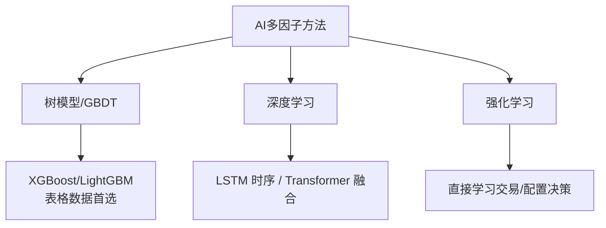
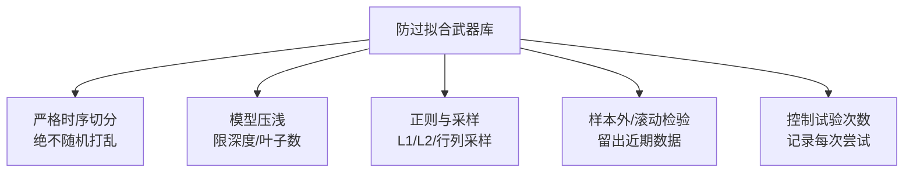

# AI多因子选股策略

> [!note] AI+多因子选股
> 人工智能和机器学习正在改变传统的多因子选股方法，能发现因子之间复杂的**非线性关系与交互效应**。但本篇要讲清的核心矛盾是：**机器学习相对线性合成，到底强在哪、又危险在哪**。AI不是更高级的"必胜键"，它是一把双刃剑——用对了提升上限，用错了过拟合得比线性模型还惨。线性合成的基础流程见 [[多因子Alpha挖掘实战]]。

## 一、为什么要请AI出场：线性模型的三道天花板

传统多因子（IC加权、等权合成）本质是**线性**的：综合分 = 各因子的加权和。这套方法稳健、可解释，但有三处天生的局限。

| 局限 | 含义 | AI能补的地方 |
|------|------|--------------|
| 线性假设 | 因子与收益被假定为直线关系 | 捕捉非线性（如估值过低反而是陷阱） |
| 交互盲区 | 各因子独立相加，忽略组合效应 | 自动发现"高ROE×低估值"的协同 |
| 静态权重 | 权重相对固定 | 随状态自适应调整 |

> [!example] 一个线性模型抓不到的关系（示例）
> 假设"低估值"在质量好的公司里是利好（便宜的好货），在质量差的公司里却是陷阱（便宜没好货）。线性模型只能学到"估值"一个统一系数，**抓不住这种依赖于另一因子的条件关系**；而树模型天然能在分裂时学到"先看质量、再看估值"的结构。

## 二、AI方法地图：选股该用哪一类



| 方法 | 特点 | 适用场景 | 选股实战地位 |
|------|------|----------|--------------|
| 随机森林 | 稳健、抗过拟合、可看重要性 | 因子筛选 | 常用基线 |
| **GBDT（XGBoost/LightGBM）** | 高效、准确、擅长表格数据 | **截面收益预测** | **当前主力** |
| LSTM | 时序建模 | 趋势/序列预测 | 数据要求高 |
| Transformer | 注意力机制 | 多因子融合、时序 | 前沿、易过拟合 |
| 强化学习 | 动态决策 | 组合优化 | 落地难、慎用 |

> [!tip] 选股为什么GBDT是主力
> A股因子数据是典型的**横截面表格数据**（每天几千只股票×几十个因子），样本量有限、信噪比低。GBDT 在这种场景下，往往比深度网络**更稳、更省、更不易过拟合**——不是因为它更先进，而是因为它更"克制"。深度学习的优势更多在高频、文本、图像等高维数据上。

## 三、GBDT做选股的完整骨架

把问题设成：用今天的因子，预测每只股票**未来一段时间的收益（或排序）**，再按预测值选股。

```python
import lightgbm as lgb
from sklearn.model_selection import TimeSeriesSplit

# X: 经过去极值/标准化/中性化的因子矩阵; y: 未来收益(或其排序)
# 关键：特征工程沿用线性流程那一套，AI不能省略数据清洗
model = lgb.LGBMRegressor(
    n_estimators=200, learning_rate=0.03,
    max_depth=4, num_leaves=15,          # 故意压浅，抑制过拟合
    subsample=0.8, colsample_bytree=0.8, # 行列采样，增加随机性
    reg_lambda=1.0                       # L2正则
)

# 必须按时间切分，绝不能随机打乱(否则前视泄漏)
tscv = TimeSeriesSplit(n_splits=5)
```

> [!important] AI不能跳过数据清洗
> 新手最大的误解是"上了机器学习，去极值中性化就不用做了"。恰恰相反——**脏数据喂给AI，它会更努力地把噪声当信号记住**。去极值、标准化、中性化这套预处理（见 [[多因子Alpha挖掘实战]]），在AI流程里一步都不能少。

## 四、特征重要性：AI给的"因子体检报告"

树模型能输出**特征重要性**，告诉你哪些因子对预测贡献最大。这是AI相对线性模型的一个实用红利。

```python
import pandas as pd
imp = pd.Series(model.feature_importances_, index=feature_names)
print(imp.sort_values(ascending=False).head(10))
```

> [!warning] 特征重要性 ≠ 真实有效性，别被它骗
> - **高重要性可能是过拟合**：模型可能重度依赖某个在历史上凑巧好用、实则无逻辑的因子。
> - **会被相关因子稀释**：两个高相关因子会"平分"重要性，看起来都不重要，其实合起来很关键。
> - **方向不明**：重要性只说"用得多"，不说"正向还是负向"，需配合 SHAP 等工具解读。
> 正确用法：把它当**线索**，回头用单因子IC和经济逻辑去验证，而不是直接信。

## 五、AI vs 线性合成：一张决策表

| 维度 | 线性合成（IC/等权） | AI（GBDT等） |
|------|---------------------|--------------|
| 非线性/交互 | 抓不到 | 能抓 |
| 可解释性 | 高，权重一目了然 | 较低，需SHAP辅助 |
| 过拟合风险 | 较低 | **高，需重度防护** |
| 数据量要求 | 低 | 较高 |
| 换手率 | 可控 | 易偏高（预测抖动） |
| 上线维护 | 简单 | 复杂，需持续监控 |
| 适合阶段 | 入门、基线 | 进阶、有足够样本和算力 |

> [!tip] 务实的路线
> **永远先用线性模型建一个基线**。只有当AI模型在**严格的样本外**测试中，稳定、显著地跑赢这个基线，AI的复杂度才值得。很多时候你会发现：精心做好的线性模型，已经吃掉了大部分收益。

## 六、过拟合：AI选股的头号杀手

> [!warning] 金融数据为何让过拟合格外致命
> 1. **信噪比极低**：股价里绝大部分是噪声，模型很容易把噪声背下来。
> 2. **样本不独立**：相邻日期高度相关，"看着很多"的数据，有效样本其实很少。
> 3. **非平稳**：市场规律本身在变，历史拟合得越完美，未来越可能失灵。
> 4. **可反复试**：换个参数就重测，几十次后总能"撞出"漂亮回测——这是自欺。

防过拟合的实战清单：



- **时序交叉验证**：用 `TimeSeriesSplit`，训练永远在预测之前的时间。
- **保留样本外窗口**：最近一段时间数据"封存"，最后只测一次，测完不许回去改。
- **限制复杂度**：浅树、少叶子、强正则，主动牺牲拟合度换泛化。
- **关注换手与成本**：AI预测每天抖动会推高换手，回测必须扣足成本。
- **诚实记录试验次数**：试得越多，"好结果"越可能是运气，要在心里给它打折。

## 七、常见误区与风险

> [!warning] AI选股最容易栽的坑
> 1. **唯模型论**：以为换个更新的网络就能赚钱，忽视数据质量和经济逻辑。
> 2. **跳过预处理**：把脏数据直接喂模型，放大噪声。
> 3. **随机划分数据**：导致前视泄漏，回测虚高，实盘崩盘。
> 4. **迷信特征重要性**：把它当结论而非线索。
> 5. **过度调参**：在同一份数据上反复优化，本质是把测试集也用进了训练。
> 6. **黑箱上线**：模型不可解释就实盘，出问题时完全不知道为什么。
> 7. **忽视容量与换手**：AI选出的小票、高换手组合，实盘成本可能吃掉全部超额。

> [!important] 衰减同样适用于AI因子
> AI挖出的关系也会拥挤、失效。模型上线后必须持续监控其样本外表现，机制见 [[Alpha衰减与因子生命周期]]。

> [!tip] 一句话总结
> AI是放大器：**放大好数据与好逻辑的价值，也放大坏数据与过拟合的危害。** 先把线性基线和数据功夫做扎实，AI才有意义。

## 相关链接

- [[多因子Alpha挖掘实战]]
- [[Alpha因子与量化交易入门]]
- [[目录|多因子策略]]
- [[LLM因子搜索]]
- [[因子检验与评价]]
- [[Alpha衰减与因子生命周期]]
- [[回测方法论]]
- [[风险管理框架]]

## 实战掌握清单

> [!tip] 交易者视角
> AI多因子选股策略 的学习重点不是记住术语，而是把它放进研究、组合、执行和复盘的闭环。量化策略必须从清晰假设出发，经过数据验证、成本测算、风险控制和实盘监控，才可能成为可持续系统。

### 关键判断

- 写清楚收益来自动量、反转、价值、套利、波动率、流动性还是行为偏差。
- 确认信号、过滤器、入场、退出、仓位和风控。
- 看收益是否集中在少数时期、少数品种或少数参数。

### 落地动作

1. 做样本外、滚动窗口和参数扰动测试。
2. 把手续费、滑点、冲击成本、容量和失败交易纳入报告。
3. 上线后监控成交质量、信号衰减、回撤和异常订单。

### 失效边界

- 过拟合。
- 策略容量不足。
- 市场结构变化后没有停止机制。

### 复盘问题

- 这项知识改变了哪一个具体决策：标的、方向、仓位、退出、对冲还是不交易？
- 如果判断相反，最大亏损、最长恢复期和退出触发条件是什么？
- 有没有一个更简单的基准方法可以取得相近结果？
