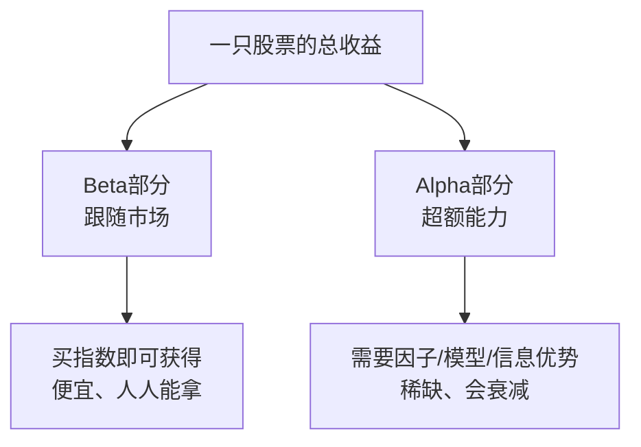

# Alpha因子与量化交易入门

> [!note] 核心概念
> Alpha因子是量化投资中最核心的概念，代表一个策略**战胜市场平均回报**的那部分能力，源于经典的资本资产定价模型（CAPM）。本篇是整个选股策略板块的**第一块基石**：把 Alpha 到底是什么、它和 Beta 怎么分、再从单个因子怎么一路走到一个投资组合，**一气讲通**。读完这篇，再去看 [[因子投资入门]]、[[因子分类体系]] 等专题会顺畅得多。

## 一、Alpha的由来：从CAPM到量化因子

要理解 Alpha，先看它诞生的公式——**资本资产定价模型（CAPM）**：

$$
E(R_i) = R_f + \beta_i \big(E(R_m) - R_f\big) + \alpha_i
$$

```
E(R_i) = R_f + β_i × (E(R_m) - R_f) + α_i
```

- `R_f`：无风险收益率（如国债）。
- `β_i`：资产对市场风险的敏感度。
- `R_m`：市场整体平均收益。
- `β_i × (E(R_m) - R_f)`：承担**市场风险**应得的补偿。
- `α_i`：**无法由市场波动解释的"额外回报"**——这就是Alpha。

> [!important] 一句话抓住本质
> 把一只股票的收益拆成两块：一块是"跟着大盘喝汤"（Beta部分），一块是"凭真本事多赚的"（Alpha部分）。**量化选股的全部努力，就是去稳定地获取后面那一块。**

## 二、Alpha vs Beta：入门最该分清的一对概念

| 维度 | Beta（市场收益） | Alpha（超额收益） |
|------|------------------|-------------------|
| 来源 | 跟随市场整体涨跌 | 选股/择时的真本事 |
| 获取方式 | 买指数基金即可 | 需要信息或模型优势 |
| 成本 | 极低 | 高（研究、数据、人力） |
| 可复制性 | 极高 | 低，且会衰减 |
| 稀缺性 | 不稀缺 | 稀缺，是零和博弈 |
| 典型代表 | 沪深300指数收益 | 跑赢指数的那部分 |



> [!warning] 新手最常犯的归因错误
> 牛市里随便买都赚钱，很多人误以为自己有"Alpha"。**其实那大概率只是Beta——大盘涨了你跟着涨而已。** 真正的Alpha，要看你**相对市场（或基准）多赚/少亏**了多少。分不清这两者，会把运气当成能力。

> [!note] Smart Beta：介于两者之间
> 还有一类"风格因子"收益（价值、规模、动量），公开、可复制、容量大，常被叫作 Smart Beta——它比纯Beta多一点、又不算真正稀缺的Alpha。这条光谱的完整讨论见 [[因子投资入门]]。

## 三、从"阿尔法"到"因子"：为什么说"找Alpha因子"

在量化里，我们说"找到 Alpha **因子**"而非笼统地"赚 Alpha"。**因子，就是能系统性解释资产收益差异的变量**——它是把"超额能力"落地成"可计算规则"的载体。

| 因子类型 | 示例 | 背后逻辑 |
|----------|------|----------|
| 估值类 | PE、PB | 买入便宜的股票 |
| 动量类 | 过去12个月收益率 | 趋势延续 |
| 成长类 | 营收增长率、利润增长率 | 投资高增长公司 |
| 质量类 | ROE、毛利率、负债率 | 买入好公司 |
| 情绪类 | 散户关注度、新闻情绪 | 捕捉市场情绪 |

> [!tip] 因子是Alpha的"工程化身"
> 抽象的"超额能力"摸不着，但"低PB的股票打高分"这样的**因子规则**看得见、算得出、可回测。把直觉翻译成因子，是量化区别于主观投资的分水岭。完整分类见 [[因子分类体系]]。

## 四、Alpha因子的构建流程（五步串讲）

从一个想法到一个能用的因子，五步走。这里是**入门级概览**，每一步的深入做法见 [[Alpha因子研究指南]] 与 [[多因子Alpha挖掘实战]]。


1. **定义假设** — 例如：低估值股票未来可能跑赢高估值股票。
2. **提取数据** — 从财报、行情、舆情中清洗数据（务必注意数据时点，避免用到未来信息）。
3. **构建指标** — 用数学方式量化，如 `PE = 股价 / 每股收益`，估值类常取倒数让"越便宜分越高"。
4. **测试有效性** — 在历史数据上检验因子的选股能力（看IC、分层）。
5. **组合与中性化** — 对行业、规模、市值做中性化，剥掉风格暴露，留下纯Alpha。

## 五、因子评估指标：怎么判断一个因子好不好

| 指标 | 含义 | 直觉 |
|------|------|------|
| IC（信息系数） | 因子值与未来收益的相关系数 | 衡量"预测准不准" |
| IR（信息比率） | IC均值 / IC标准差 | 衡量"准得稳不稳" |
| 分层收益 | 按因子值分组后的收益差 | 看"高分组是否真跑赢低分组" |
| 换手率 | 因子组合的交易频率 | 越高，被成本吃掉越多 |

完整定义与阈值见 [[因子检验与评价]]。这里只需记住一个直觉：

> [!important] 好因子 = 准（IC高）+ 稳（IR高）+ 能交易（换手可控、有容量）
> 三者缺一不可。只看IC高就上车，是新手最典型的翻车方式。

## 六、从因子到组合：最后一公里

单个因子选出的股票还不是组合。从因子到可持有的投资组合，要走完这条链：

```
单因子打分 → 多因子合成综合分 → 排序选头部 → 控制行业/个股权重 → 扣成本回测 → 建仓与定期再平衡
```

- **合成**：把多个低相关因子的得分加权合成（见 [[多因子模型详解]]）。
- **风控**：限制单一行业、单只个股的权重，控制整体风险暴露（见 [[风险管理框架]]）。
- **再平衡**：定期（月/季）重算、调仓，让组合始终持有当前最优的一篮子。

> [!example] 一个最小串讲案例（示例，非投资建议）
> 假设：你相信"便宜+优质"能跑赢市场（假设）→ 取 1/PB（价值）与 ROE（质量）两个因子 → 去极值标准化后做行业中性 → 回测显示综合分高的组合长期跑赢沪深300（示例）→ 等权合成后选头部30只、单行业不超过30%权重 → 每月再平衡。这就是一条从"Alpha想法"到"可执行组合"的完整最小路径。

## 七、常见误区与风险

> [!warning] 入门阶段最致命的几个误区
> 1. **把Beta当Alpha**：牛市赚的钱不等于你有超额能力，归因要诚实。
> 2. **只盯IC**：忽视稳定性（IR）、换手和容量，理论好看、实盘亏钱。
> 3. **忽视数据时点**：用了未来信息（前视偏差），回测漂亮、实盘归零。
> 4. **以为Alpha永恒**：Alpha会拥挤、会衰减，必须持续监控（见 [[Alpha衰减与因子生命周期]]）。
> 5. **跳过中性化**：以为选到了好因子，其实只是押注了某个行业或小盘股。
> 6. **单因子梭哈**：放弃多因子分散，把命运赌在一种风格上。

> [!tip] 一句话总结
> Alpha 是凭本事多赚的那部分，因子是把这份本事**工程化**的工具。**先把Alpha与Beta分清，再把因子做扎实，最后用组合把它落地**——这就是量化选股的入门主线。

## 相关链接

- [[因子分类体系]]
- [[多因子Alpha挖掘实战]]
- [[Alpha衰减与因子生命周期]]
- [[目录|量化策略总览]]
- [[因子投资入门]]
- [[什么是因子]]
- [[Alpha因子研究指南]]
- [[因子检验与评价]]
- [[多因子模型详解]]
- [[Fama-French三因子模型]]
- [[风险管理框架]]

## 实战掌握清单

> [!tip] 交易者视角
> Alpha因子与量化交易入门 的学习重点不是记住术语，而是把它放进研究、组合、执行和复盘的闭环。量化策略必须从清晰假设出发，经过数据验证、成本测算、风险控制和实盘监控，才可能成为可持续系统。

### 关键判断

- 写清楚收益来自动量、反转、价值、套利、波动率、流动性还是行为偏差。
- 确认信号、过滤器、入场、退出、仓位和风控。
- 看收益是否集中在少数时期、少数品种或少数参数。

### 落地动作

1. 做样本外、滚动窗口和参数扰动测试。
2. 把手续费、滑点、冲击成本、容量和失败交易纳入报告。
3. 上线后监控成交质量、信号衰减、回撤和异常订单。

### 失效边界

- 过拟合。
- 策略容量不足。
- 市场结构变化后没有停止机制。

### 复盘问题

- 这项知识改变了哪一个具体决策：标的、方向、仓位、退出、对冲还是不交易？
- 如果判断相反，最大亏损、最长恢复期和退出触发条件是什么？
- 有没有一个更简单的基准方法可以取得相近结果？
