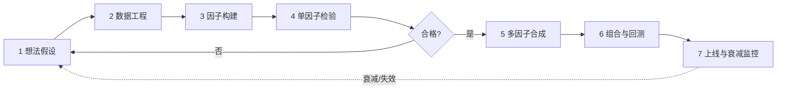
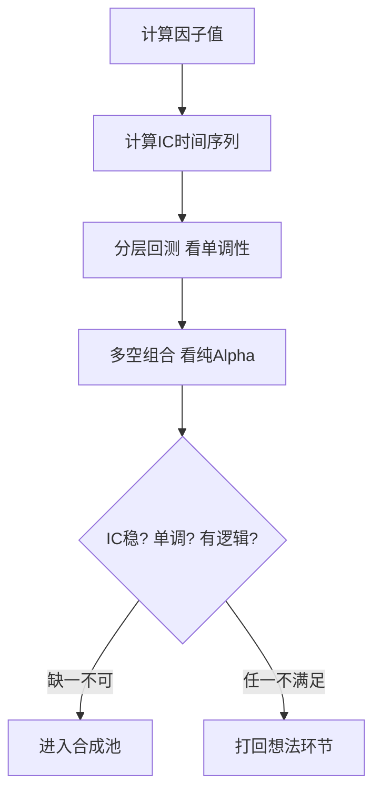

# Alpha因子研究指南

> [!note] Alpha因子研究
> 本指南整理自雪球平台的Alpha因子研究内容，聚焦一个核心问题：**一个因子从"脑子里的想法"到"账户里可交易的信号"，中间到底要走哪些路、踩哪些坑**。本篇按"想法 → 数据 → 构建 → 检验 → 组合 → 上线 → 监控衰减"的完整生命线串讲，是选股策略板块的**总流程图**。具体子环节（如构建细节、检验指标、衰减监控）由本篇延伸出去的专题各自展开。

## 一、研究全景：一条流水线，七个工位

很多新手把"做因子"理解成"找一个公式"。实际上，公式只是中间一小步。一个能稳定贡献收益的因子，更像一条**流水线产品**：每个工位都可能让它报废。



> [!important] 全流程第一性原则
> 越靠前的工位出错，后面做得再漂亮也是**精致的废品**。数据错了，再好的模型只是把错误放大；逻辑错了，再高的IC也只是过拟合的幻觉。所以这条流水线的纪律是：**前道不合格，绝不进入后道**。

下面逐个工位展开。

## 二、工位1：想法与假设——好因子先有"故事"

因子的起点不是数据，而是一句能讲清楚的话：**"为什么这类股票未来会跑赢/跑输？"** 这句话就是因子的经济假设。来源主要有三：

| 来源 | 说明 | 典型例子（示例） | 风险 |
|------|------|------------------|------|
| 学术文献 | Fama-French、Carhart 等经典框架 | 价值、规模、动量、质量 | 已被广泛使用，可能拥挤 |
| 实践直觉 | 市场观察、交易经验、行业常识 | "财报暴雷后还在跌" | 主观，易自我欺骗 |
| 数据挖掘 | 系统化批量搜索表达式 | 量价组合、另类数据 | 极易过拟合、需更严检验 |

> [!tip] 用"逻辑闸门"过滤想法
> 在写任何代码前，先问自己三句话：①**钱从哪来**？（风险补偿还是别人的行为偏差）②**谁在亏给我**？（散户追涨？被动盘？强制平仓？）③**为什么这个机会还没消失**？答不上来的因子，IC再高也要打个问号——它很可能只是历史的巧合。详见 [[什么是因子]]。

## 三、工位2：数据工程——决定上限的隐形工位

> [!warning] 80%的"神奇因子"死于数据
> 实盘最常见的失败，不是模型不够先进，而是**数据里藏着未来信息（前视偏差）**。因子研究里最贵的教训，几乎都和数据时点有关。

关键纪律有四条：

- **时点对齐（Point-in-Time）**：用某天的因子值时，只能用那一天**已经公开**的信息。财报最容易出错——3月底发布的年报，绝不能在1月1日就拿来选股。正确做法是用**财报公告日**而非报告期末来对齐。
- **复权处理**：计算历史收益必须用**后复权**价格，否则除权除息会被误当成暴跌。
- **survivorship（幸存者偏差）**：股票池要包含**当时存在、后来退市**的股票，否则你只在"活下来的赢家"里测试，结论天然偏乐观。
- **停牌与涨跌停**：涨跌停板上的股票"买不进/卖不出"，回测里若假装能成交，收益会被严重高估。

```python
# 示例：用财报"公告日"而非"报告期"对齐，避免前视偏差（伪代码）
# announce_date 为财报实际公开日期
factor = fundamentals.merge(announce_dates, on=["code", "report_period"])
factor = factor[factor["announce_date"] <= trade_date]   # 只用已公开的数据
factor = factor.sort_values("announce_date").groupby("code").last()  # 取最新已公开
```

## 四、工位3：因子构建——把"故事"翻译成"数字"

构建就是把假设量化成每只股票每天一个数值。这一步的标准化处理（去极值、标准化、中性化）是质量分水岭，本指南只点到为止，**完整可运行的处理流程见 [[多因子Alpha挖掘实战]] 与 [[因子构建方法]]**。

核心三步顺序不能乱：

$$
\text{原始因子} \xrightarrow{\text{去极值}} \text{抗噪} \xrightarrow{\text{标准化}} \text{同量纲} \xrightarrow{\text{中性化}} \text{纯Alpha}
$$

> [!note] 为什么必须中性化
> 如果不做行业/市值中性化，你以为发现了一个"好因子"，实际上可能只是**变相押注了某个行业或小盘股**。中性化的意义是剥掉这些已知的风格暴露，只留下因子"自己的"超额收益。

## 五、工位4：单因子检验——这是最关键的"质检"

检验回答一个问题：**这个因子真的能区分未来的好股票和坏股票吗？** 主要看三类证据，详细定义与阈值见 [[因子检验与评价]]。

| 检验维度 | 看什么 | 合格的直觉标准（示例） |
|----------|--------|------------------------|
| IC / RankIC | 因子值与未来收益的相关性 | 均值绝对值 > 0.03 且方向稳定 |
| ICIR | IC 的稳定程度（均值/标准差） | > 0.3~0.5，越高越稳 |
| 分层单调性 | 按因子分5~10组，收益是否阶梯排列 | 单调、多空差显著 |
| 多空组合 | 做多最高组、做空最低组的纯因子收益 | 净值平滑向上、回撤可控 |



> [!warning] IC高 ≠ 好因子
> 这是新手头号误区。一个因子可能 IC 漂亮，但：换手率极高（被交易成本吃光）、只在某段历史有效（不稳定）、或换手集中在难成交的小票（没容量）。**IC、稳定性、可交易性，三者缺一不可。**

## 六、工位5—6：多因子合成与组合回测

单因子合格后，要和其他因子合成。合成不是简单相加——高度相关的因子叠加只是重复下注。常见方式：

- **等权合成**：最简单稳健，适合因子数量少、相关性低时。
- **IC加权 / ICIR加权**：让历史更有效、更稳定的因子拿更高权重。
- **最优化合成**：在风险约束下最大化预期收益，但易过拟合，需谨慎。

合成出综合得分后，进入组合构建与回测，要叠加**交易成本、换手率约束、个股/行业权重上限**。回测方法论的完整规范见 [[回测方法论]]，组合层面的风险控制见 [[风险管理框架]]。

## 七、工位7：上线与衰减监控——因子会"老"

因子不是一次性产物。上线后必须持续盯三件事，**衰减机制与轮换策略的完整讨论见 [[Alpha衰减与因子生命周期]]**：

- **滚动IC**：用滚动窗口看IC是否系统性下滑。
- **拥挤度**：该因子是否被市场广泛使用、收益是否被压缩。
- **结构变化**：注册制、风格切换等是否改变了因子的底层逻辑。

> [!example] 一个完整的微型案例（示例数据，仅作演示）
> 假设你提出"高股息率股票更抗跌"的假设 → 用公告日对齐股息数据 → 去极值标准化后做行业中性 → 回测显示RankIC约0.04、分层单调、多空年化超额约5%（示例） → 与已有动量、质量因子相关性低，等权纳入组合 → 上线后每月跟踪滚动IC，发现连续3个月IC转负且利率环境逆转 → 降低权重并触发新因子研究。整条链路才算走完一圈。

## 八、因子研究的常见误区与风险

> [!warning] 七个反复夺命的坑
> 1. **只看IC不看经济逻辑**：把过拟合当成发现，是最隐蔽的失败。
> 2. **忽视因子的时变性**：用十年前的有效性，做今天的决策。
> 3. **前视偏差**：数据时点没对齐，回测漂亮、实盘归零。
> 4. **忽视交易成本与容量**：理论收益被手续费、冲击成本和成交上限吃光。
> 5. **数据窥探（p-hacking）**：在同一份数据上反复试，总能"试出"好结果。
> 6. **过度优化参数**：参数越多越灵活，越容易记住历史而非理解未来。
> 7. **因子拥挤无视**：好因子一旦众所周知，超额收益会被快速抹平。

> [!tip] 一句话总结
> 因子研究的功夫，七分在数据与逻辑，三分在模型。**把前道工位做扎实，比追求花哨算法重要得多。**

## 相关链接

- [[Alpha因子与量化交易入门]]
- [[多因子Alpha挖掘实战]]
- [[Alpha衰减与因子生命周期]]
- [[什么是因子]]
- [[因子构建方法]]
- [[因子检验与评价]]
- [[因子投资入门]]
- [[回测方法论]]
- [[风险管理框架]]

## 课程化学习补充

> [!important] 学习定位
> 量化策略是投资假设、数据工程、回测验证、风险预算和执行系统的组合，不是单一公式。本文仅用于学习、研究与复盘，不构成任何投资建议。

### 必须掌握的问题

- 假设是否可证伪
- 数据是否 point-in-time
- 绩效是否扣除真实成本
- 上线后是否监控衰减

### 实战应用流程

1. 先写清楚你的投资假设：为什么这个信号、资产或方法应该产生收益。
2. 明确数据口径：样本范围、更新时间、复权/分红/停牌处理和交易日历。
3. 做最小可行验证：先用简单规则验证方向，再逐步加入复杂模型。
4. 把成本和约束前置：手续费、滑点、冲击成本、保证金、流动性和容量都要进入测算。
5. 上线后持续复盘：记录信号、下单、成交、持仓、回撤和失效原因。

### 风险与失效条件

- 数据挖掘偏差
- 因子拥挤
- 换手过高
- 实盘偏离回测

### 复盘问题

- 这笔交易或这套模型赚的是什么钱：风险补偿、行为偏差、流动性溢价，还是偶然噪音？
- 如果市场环境反过来，最大亏损和最长恢复期会是多少？
- 当前结论是否依赖某个不可持续假设，例如低利率、低波动、充裕流动性或监管套利？
- 有没有一个更简单的基准策略能取得接近效果？

### 延伸学习

- [[量化投资完全指南]]
- [[回测质量门清单]]
- [[市场微观结构与交易执行]]
- [[量化风险管理体系]]
