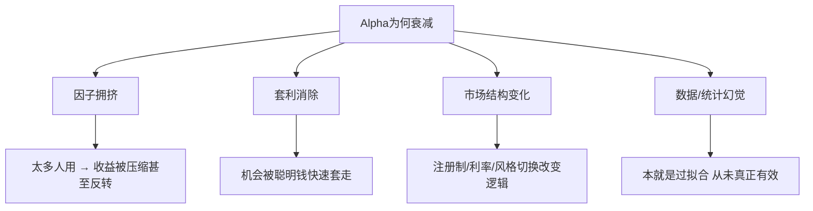
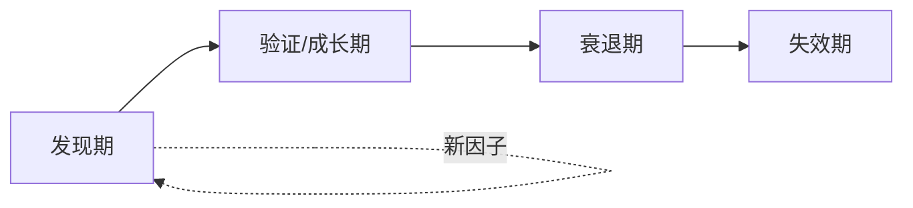
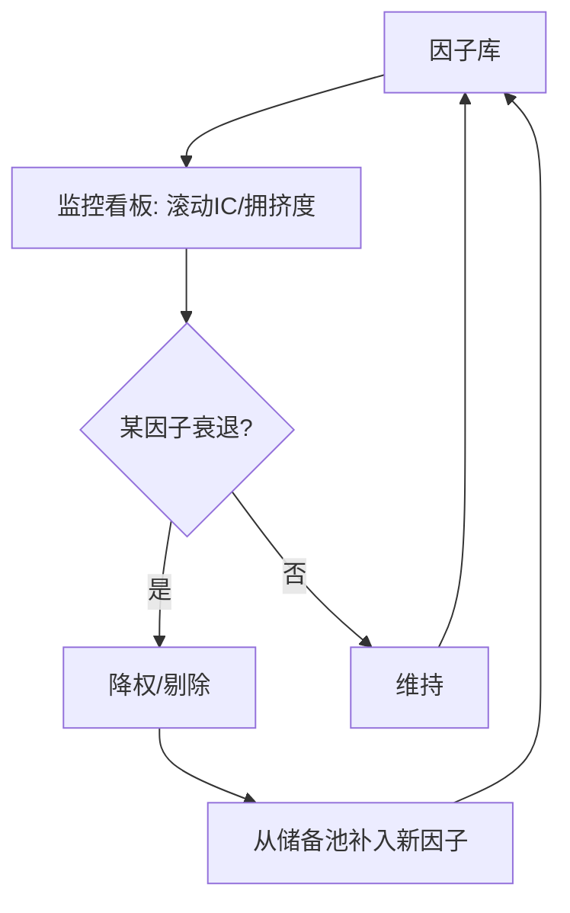

# Alpha衰减与因子生命周期

> [!note] 因子衰减
> Alpha因子并非永恒有效，它们会随时间推移而衰减甚至失效。本篇聚焦因子研究最容易被新手忽略、却决定长期生死的环节：**因子为什么会老、怎么判断它老了、以及如何监控与轮换**。如果说 [[Alpha因子研究指南]] 教你"怎么造一个因子"，本篇就是教你"怎么给因子养老送终、新陈代谢"。

## 一、一个反直觉的事实：好因子会"自我毁灭"

> [!important] Alpha的内在矛盾
> 因子的超额收益，往往来自别人的错误或不愿承担的风险。**一旦这个错误被广泛认知、这个机会被大量资金涌入，它就会被抹平——好因子越成功，越多人复制，就越快失效。** 这是Alpha与生俱来的自我毁灭倾向，也是为什么"持续找新因子"是量化的永恒任务。

这与 [[因子投资入门]] 里讲的两类来源直接相关：

- **行为偏差类**因子（如动量、情绪）衰减更快——认知普及后，错误就少了。
- **风险补偿类**因子（如价值、规模）更顽固，但也会因风险定价变化而波动。

## 二、Alpha衰减的四大原因



### 1. 因子拥挤（Crowding）

越来越多投资者使用同一因子 → 大家在同一批股票上同向交易 → 因子收益被竞争压缩。极端情况下，当拥挤资金被迫同时平仓（如去杠杆），因子会**剧烈反转**——这就是著名的"动量崩溃""拥挤踩踏"。

> [!warning] 拥挤的隐蔽危险
> 拥挤不只是"收益变少"，更是"尾部风险变大"。一个看似平静的拥挤因子，可能在某次流动性冲击中一天回吐数年收益。

### 2. 套利消除（Arbitrage）

学术论文一旦发表、商业因子一旦公开，聪明的资金会迅速涌入套利，把定价偏差填平。**"因子被发现"本身，往往就是衰减的开始。**

### 3. 市场结构变化

经济周期转换、政策与制度变迁（如注册制、交易规则改变）、利率环境逆转、投资者结构变化（散户→机构），都会**改变因子赖以生效的底层逻辑**。这类衰减是"逻辑失效"，比拥挤更彻底。

### 4. 数据质量与统计幻觉

有些"衰减"其实是因为这个因子**从一开始就没真有效**——它只是历史数据上的过拟合产物（数据修订、幸存者偏差、数据窥探）。"上线即失效"的因子，多半属于此类。

| 衰减原因 | 信号特征 | 是否可逆 |
|----------|----------|----------|
| 拥挤 | 收益下降+波动放大+与同类高相关 | 部分可逆（拥挤退潮后） |
| 套利消除 | 公开后IC持续下台阶 | 通常不可逆 |
| 结构变化 | 逻辑前提消失、IC方向改变 | 不可逆 |
| 统计幻觉 | 样本外从未兑现 | 本就无效 |

## 三、因子生命周期：四个阶段



$$
\text{发现期} \rightarrow \text{成长期} \rightarrow \text{衰退期} \rightarrow \text{失效期}
$$

| 阶段 | 特征 | IC表现（示例） | 容量 | 拥挤度 | 策略动作 |
|------|------|----------------|------|--------|----------|
| 发现期 | 新、少人知 | 高 | 小 | 低 | 小仓积极使用，吃早期红利 |
| 成长/验证期 | 逐步被验证 | 稳定 | 增长 | 上升 | 提为标准配置 |
| 衰退期 | 拥挤加剧 | 下降、波动增大 | 见顶 | 高 | 降权重、警惕反转 |
| 失效期 | 逻辑或统计失效 | 趋近0或转负 | — | — | 剔除，转向新因子 |

> [!note] 容量与收益的此消彼长
> 因子早期"容量小但收益高"，正因为没人知道；随着资金涌入，容量被填满、收益被稀释。**任何因子都逃不开这条"收益—容量"的反向曲线。** 这也是大资金天然偏好低拥挤、有逻辑因子的原因。

## 四、如何监控衰减：把"老化"量化

判断因子是不是在衰减，不能靠感觉，要靠几个可量化的监控指标。

### 1. 滚动IC与衰减斜率

用滚动窗口算IC，观察其趋势。IC 时间序列系统性下台阶，是衰减最直接的证据。

```python
# 示例：滚动窗口IC + 线性趋势，监控衰减（伪代码）
roll_ic = ic_series.rolling(window=126).mean()   # 约半年滚动IC
slope = linregress(range(len(roll_ic.dropna())), roll_ic.dropna()).slope
# slope 显著为负 → 因子可能进入衰退期
```

### 2. 拥挤度指标

- **因子相关性上升**：你的因子与公开风格因子越来越像。
- **多空两端的换手与持仓重合度**：和市场主流持仓高度重合，说明拥挤。
- **估值价差收敛**：如价值因子，多空组合的估值差被压窄，溢价空间所剩无几。

### 3. 逻辑前提复核

定期回头问：**这个因子当初赖以生效的逻辑，现在还成立吗？** 利率变了？制度变了？参与者变了？逻辑没了，IC再好也要警惕。

| 监控维度 | 看什么 | 预警信号 |
|----------|--------|----------|
| 滚动IC | 趋势与斜率 | 持续下行/转负 |
| 拥挤度 | 相关性、持仓重合 | 持续上升 |
| 多空价差 | 收益空间 | 快速收敛 |
| 逻辑前提 | 制度/利率/结构 | 前提消失 |

## 五、应对策略：监控 + 轮换 + 新陈代谢

> [!tip] 核心心法：不押"永恒因子"，而养"因子生态"
> 与其执着于找一个永远有效的因子（不存在），不如经营一个**不断有新因子补充、老因子退场的动态因子库**。组合的稳健，来自因子的新陈代谢，而非单一因子的长寿。

具体动作：

- **持续监控**：把上面的滚动IC、拥挤度做成定期看板，定期复核。
- **动态调权**：按生命周期阶段调权重——成长期加、衰退期减、失效期剔。
- **因子轮换 / 储备**：始终保有一批"发现期"的候选新因子（可借助 [[LLM因子搜索]]、[[AI多因子选股策略]] 扩充储备），随时替换退场因子。
- **多因子分散**：靠多因子组合分散单因子衰减风险（见 [[多因子模型详解]]、[[因子投资体系]]），避免单点失效拖垮整体。



## 六、常见误区与风险

> [!warning] 因子衰减环节最常踩的坑
> 1. **把过去的有效当成未来的承诺**：因子的历史回测，不保证它还在生命周期的"上半场"。
> 2. **死守一个明星因子**：越成功、越拥挤、越危险，舍不得放手是大忌。
> 3. **混淆"短期跑输"与"真衰减"**：风险补偿类因子本就有难熬期，别把正常回撤当失效而割肉。这正是为什么要看**逻辑+滚动IC**而非单看近期收益。
> 4. **没有储备就被动**：等老因子失效才临时找新的，永远慢半拍。
> 5. **忽视拥挤的尾部风险**：只看平均收益、不看拥挤踩踏的极端回撤。
> 6. **不复核逻辑前提**：只盯统计指标，忽略制度与利率等"地基"的变化。

> [!important] 衰减与"短期跑输"的区分（最关键的判断）
> | | 正常回撤 | 真实衰减 |
> |---|----------|----------|
> | 逻辑前提 | 仍成立 | 已改变/消失 |
> | 滚动IC | 短期波动、未系统下行 | 系统性下台阶 |
> | 拥挤度 | 未明显上升 | 显著上升 |
> | 该做的事 | 坚持/逢低 | 减仓/剔除 |
> 分清这两者，是因子管理里最值钱、也最难的功夫。

> [!tip] 一句话总结
> 因子会老，这是规律不是意外。**赢家不是找到了不老的因子，而是建立了能不断造新、淘旧的因子新陈代谢机制。**

## 相关链接

- [[Alpha因子与量化交易入门]]
- [[多因子Alpha挖掘实战]]
- [[因子分类体系]]
- [[Alpha因子研究指南]]
- [[因子检验与评价]]
- [[因子投资入门]]
- [[多因子模型详解]]
- [[因子投资体系]]
- [[LLM因子搜索]]
- [[AI多因子选股策略]]

## 课程化学习补充

> [!important] 学习定位
> 量化策略是投资假设、数据工程、回测验证、风险预算和执行系统的组合，不是单一公式。本文仅用于学习、研究与复盘，不构成任何投资建议。

### 必须掌握的问题

- 假设是否可证伪
- 数据是否 point-in-time
- 绩效是否扣除真实成本
- 上线后是否监控衰减

### 实战应用流程

1. 先写清楚你的投资假设：为什么这个信号、资产或方法应该产生收益。
2. 明确数据口径：样本范围、更新时间、复权/分红/停牌处理和交易日历。
3. 做最小可行验证：先用简单规则验证方向，再逐步加入复杂模型。
4. 把成本和约束前置：手续费、滑点、冲击成本、保证金、流动性和容量都要进入测算。
5. 上线后持续复盘：记录信号、下单、成交、持仓、回撤和失效原因。

### 风险与失效条件

- 数据挖掘偏差
- 因子拥挤
- 换手过高
- 实盘偏离回测

### 复盘问题

- 这笔交易或这套模型赚的是什么钱：风险补偿、行为偏差、流动性溢价，还是偶然噪音？
- 如果市场环境反过来，最大亏损和最长恢复期会是多少？
- 当前结论是否依赖某个不可持续假设，例如低利率、低波动、充裕流动性或监管套利？
- 有没有一个更简单的基准策略能取得接近效果？

### 延伸学习

- [[量化投资完全指南]]
- [[回测质量门清单]]
- [[市场微观结构与交易执行]]
- [[量化风险管理体系]]
