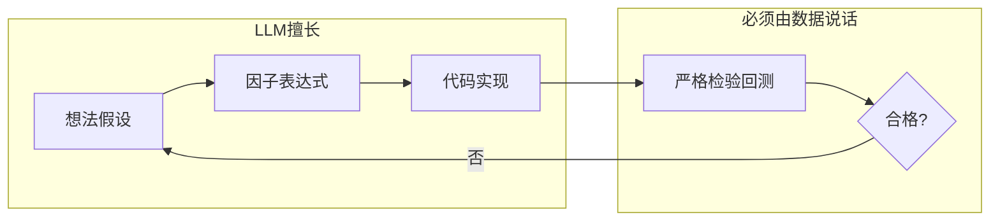
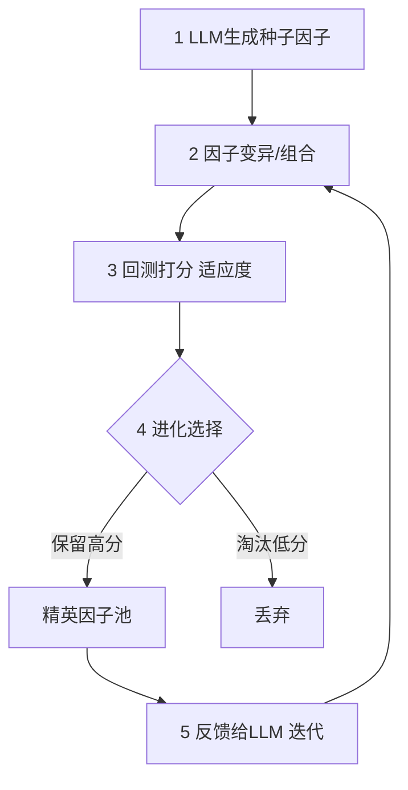

# LLM因子搜索

> [!note] LLM在因子搜索中的应用
> 大语言模型（LLM）正被用于Alpha因子的自动搜索与生成。本篇聚焦一个独特角度：**LLM不是用来"预测涨跌"的（那是 [[AI多因子选股策略]] 里GBDT的活），而是用来"生成因子想法和表达式"的**——它扮演的是一个不知疲倦、读过海量文献的"研究助理"。关键问题是：怎么让它高效产出、又不被它的幻觉和过拟合坑了。

## 一、LLM做的是哪一步：定位很重要

回顾因子研究流水线（见 [[Alpha因子研究指南]]），LLM 主要切入**最前端的"想法与构建"环节**，而不是替代检验和回测。

> [!important] LLM负责"提出"，数据负责"裁决"
> LLM 能批量提出假设、写出表达式、生成代码，但它**说一个因子"应该有效"毫无证据力**。能不能用，永远由严格的样本外检验决定（见 [[因子检验与评价]]）。把这条边界守住，是安全使用LLM的前提。

## 二、传统因子搜索的瓶颈，与LLM的补位

| 传统因子搜索的局限 | LLM如何补位 |
|--------------------|-------------|
| 依赖个人经验与领域知识 | 整合金融、统计、编程多领域知识 |
| 想法产出慢、覆盖窄 | 一次生成几十上百个候选假设 |
| 难表达复杂组合 | 直接写出复杂因子表达式 |
| 想法常缺逻辑说明 | 同时给出经济逻辑解释 |

LLM 的四个具体优势：

- **知识整合**：把分散在论文、研报、教科书里的逻辑串起来。
- **创意生成**：组合出人类不常想到的因子结构。
- **代码生成**：直接产出可计算的因子代码（仍需人工审）。
- **解释能力**：为每个因子配一段经济逻辑，方便人工初筛。

## 三、EFS因子搜索框架：LLM × 进化算法

> [!note] 核心思路
> 单靠LLM一次生成，质量参差。**EFS（Evolutionary Factor Search，进化式因子搜索）** 把 LLM 当"变异与生成引擎"，把回测当"自然选择"，让因子一代代进化——好的留下，差的淘汰。

五步循环：

1. **种子因子生成**：LLM 根据提示生成一批初始因子假设与表达式。
2. **因子变异**：对现有因子做变换（换窗口、换算子、与其他因子组合）。
3. **适应度评估**：用回测指标（IC、ICIR、扣成本后收益）给每个因子打分。
4. **进化选择**：保留高分因子，淘汰低分。
5. **迭代优化**：把表现好的因子和"为什么好"反馈给 LLM，引导下一轮生成。

| EFS要素 | 对应进化论 | 实现 |
|---------|------------|------|
| 种子因子 | 初始种群 | LLM生成 |
| 变异/组合 | 基因变异/重组 | LLM或算子库 |
| 适应度 | 环境选择压力 | 回测得分 |
| 精英保留 | 适者生存 | 取TopN |

## 四、关键风险：LLM自带的三个"原罪"

这是本篇最该重视的部分。LLM 在因子搜索里有三类**特有且危险**的风险，传统方法里不存在或不严重。

### 风险一：幻觉（Hallucination）

> [!warning] LLM会"一本正经地编造"
> LLM 可能生成**根本不存在的财务字段、错误的计算公式，或引用并不存在的论文**来"论证"因子有效。它的目标是生成看起来合理的文本，**不是说真话**。
> - 编造字段：用了数据源里没有的指标。
> - 错误公式：财务比率算法张冠李戴。
> - 伪造引用：编出"某经典论文证明"——这类引用一律不可信。
> **应对**：所有字段、公式必须人工对照数据字典核验；任何"研究证明"都当作未经证实。

### 风险二：过拟合（被放大的老问题）

> [!warning] LLM让过拟合变得"自动化、规模化"
> LLM 能一晚上生成上万个因子。在同一份历史数据上筛上万个因子，**纯靠运气也能筛出一批漂亮回测**——这就是大规模的数据窥探（p-hacking）。试得越多，"幸存者"越可能是噪声。
> **应对**：① 用**严格的样本外/滚动窗口**做最终裁决；② 对多重检验做惩罚（试 N 个因子，显著性标准要相应提高）；③ 优先保留**有清晰经济逻辑**的因子，逻辑是抗过拟合的最好护栏。

### 风险三：前视偏差（Look-ahead）

> [!warning] LLM不懂"数据时点"
> LLM 写因子代码时，**完全没有"哪天能拿到哪条数据"的概念**。它很容易写出用了未来信息的代码：比如直接用报告期末日期对齐财报（而非公告日）、或用到了当日收盘后才知道的量。
> **应对**：人工逐行审查时点对齐（Point-in-Time），尤其是财报公告日、停牌、复权处理。这一关 LLM 帮不上忙，只能靠人。

| 风险 | 本质 | 谁能解决 |
|------|------|----------|
| 幻觉 | 编造字段/公式/引用 | 人工核验数据字典 |
| 过拟合 | 大规模数据窥探 | 样本外检验+多重检验惩罚+逻辑筛 |
| 前视偏差 | 不懂数据时点 | 人工审查时点对齐 |

## 五、应用前景与务实定位

- 自动化、规模化的因子发现，扩充因子库储备。
- 降低初筛阶段的人力成本，让研究员专注于验证和组合。
- 发现人类思维定式之外的因子结构。

> [!tip] 把LLM当"高产但不可靠的实习生"
> 它能极快地交出一大堆草稿，但**每一份都要导师（你 + 严格回测）签字才能用**。它的价值在于扩大搜索的"广度"，而把关质量的"深度"，仍牢牢握在人和数据手里。

## 六、常见误区与风险总结

> [!warning] LLM因子搜索最危险的几个误区
> 1. **直接采信LLM说的"有效"**：它没有证据，只有话术。
> 2. **不核验字段与公式**：幻觉会悄悄混进生产代码。
> 3. **生成越多越好**：海量生成 = 海量过拟合机会，必须配套更严的检验。
> 4. **省略时点审查**：LLM代码的前视偏差是隐形地雷。
> 5. **轻信编造的论文引用**：把伪引用当成逻辑支撑，是自我欺骗。
> 6. **把LLM当终点而非起点**：它是想法发动机，不是收益保证。

> [!example] 一个安全的使用闭环（示例）
> 让 LLM 生成 100 个带逻辑说明的量价因子 → 人工剔除编造字段/可疑公式的约 30 个 → 逐行审查时点对齐 → 在训练集做初筛留下约 20 个 → **封存的样本外窗口只测一次**，结合多重检验惩罚，最终留下 3~5 个逻辑与统计双过关的因子。整个过程，LLM 只参与了第一步。

> [!tip] 一句话总结
> LLM 把因子搜索的"产能"放大了百倍，但**它同时把幻觉、过拟合、前视这三类风险也放大了百倍**。用它的广度，守你的纪律。

## 相关链接

- [[Alpha因子与量化交易入门]]
- [[多因子Alpha挖掘实战]]
- [[AI多因子选股策略]]
- [[Alpha因子研究指南]]
- [[因子检验与评价]]
- [[因子构建方法]]
- [[Alpha衰减与因子生命周期]]

## 实战掌握清单

> [!tip] 交易者视角
> LLM因子搜索 的学习重点不是记住术语，而是把它放进研究、组合、执行和复盘的闭环。量化策略必须从清晰假设出发，经过数据验证、成本测算、风险控制和实盘监控，才可能成为可持续系统。

### 关键判断

- 写清楚收益来自动量、反转、价值、套利、波动率、流动性还是行为偏差。
- 确认信号、过滤器、入场、退出、仓位和风控。
- 看收益是否集中在少数时期、少数品种或少数参数。

### 落地动作

1. 做样本外、滚动窗口和参数扰动测试。
2. 把手续费、滑点、冲击成本、容量和失败交易纳入报告。
3. 上线后监控成交质量、信号衰减、回撤和异常订单。

### 失效边界

- 过拟合。
- 策略容量不足。
- 市场结构变化后没有停止机制。

### 复盘问题

- 这项知识改变了哪一个具体决策：标的、方向、仓位、退出、对冲还是不交易？
- 如果判断相反，最大亏损、最长恢复期和退出触发条件是什么？
- 有没有一个更简单的基准方法可以取得相近结果？
