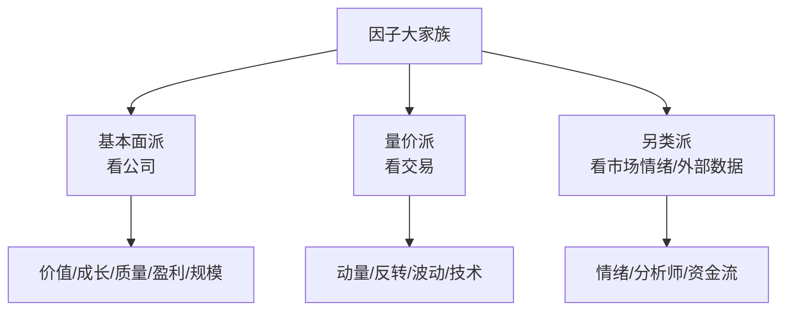

# 因子分类体系

> [!note] 因子分类
> 量化投资中的因子，可以按经济含义和数据来源系统分类。理解分类不是为了背名词，而是为了**搭出一个互补、不重复的因子库**——知道每个因子在押什么逻辑、和谁高度相关、覆盖了哪些"赚钱的角度"。本篇是选股策略板块的**分类字典与对照大表**，配合 [[因子投资入门]]（讲为何有效）和 [[多因子Alpha挖掘实战]]（讲怎么做）一起看。

## 一、为什么要给因子分类

> [!important] 分类的真正目的：避免"伪分散"
> 你以为持有了10个因子很分散，但如果其中8个都是价值类，它们会**同涨同跌**——本质上还是单押价值。分类的意义，是让你**按"逻辑维度"组队**：从价值、动量、质量、波动等彼此独立的角度各取一两个，才是真正的分散。分类思维直接决定多因子组合的稳健性。



## 二、十大因子类别全表

下面是核心对照大表，**这是本篇的主干**，按"逻辑—代表指标—方向直觉—主要风险"四栏排布。表中数字与方向均为常见经验直觉（示例），实盘需自行检验。

| 类别 | 经济逻辑（为何有效） | 代表指标 | 方向直觉（示例） | 主要风险/弱点 |
|------|----------------------|----------|------------------|----------------|
| 价值 Value | 便宜的资产长期均值回归 | PE、PB、PS、EV/EBITDA、股息率 | 越便宜越好（值越低分越高） | 价值陷阱、长期跑输成长 |
| 成长 Growth | 高增长公司未来盈利更高 | 营收增速、净利增速、EPS增速、预期上修 | 增速越高越好 | 高估值、增速不可持续 |
| 质量 Quality | 优质资产抗风险、长期占优 | ROE、毛利率、资产负债率、现金流质量、盈利稳定性 | 盈利能力强、负债低更好 | 拥挤、贵 |
| 盈利 Profitability | 高盈利能力即"好生意" | ROA、ROIC、毛利率、营业利润率 | 越高越好 | 与质量高度重叠 |
| 动量 Momentum | 趋势延续、反应不足 | 过去3~12月收益率、截面动量 | 近期强者恒强 | 急跌反转（动量崩溃） |
| 反转 Reversal | 短期过度反应后回摆 | 过去1月/1周收益率 | 短期超跌者反弹 | 与动量方向相反，周期短、噪声大 |
| 规模 Size | 小盘长期溢价（流动性/风险补偿） | 总市值、流通市值、SMB | 市值越小溢价越高 | 波动大、流动性差、易受风格切换冲击 |
| 低波动 Low Volatility | 低波动异象，风险调整后更优 | 历史波动率、特质波动率、Beta | 波动越低越好 | 利率敏感、可能拥挤 |
| 情绪 Sentiment | 捕捉市场系统性犯错 | 分析师预期变化、新闻情绪、散户关注度、融资融券 | 因子而异 | 噪声大、数据质量参差 |
| 技术/量价 Technical | 量价中蕴含资金行为信息 | 换手率、量价相关、技术指标信号 | 因子而异 | 易过拟合、换手高 |

> [!tip] 怎么用这张表组队
> 实战里常见的"四梁八柱"配法（示例）：价值×1（PB）+ 质量×1（ROE）+ 动量×1（12月收益）+ 低波×1（特质波动率）。四个因子分属四个独立逻辑，相关性低，组合天然更稳。具体合成方法见 [[多因子Alpha挖掘实战]]。

## 三、风格因子 vs Alpha因子：一个关键区分

> [!warning] 别把"风格暴露"当成"超额能力"
> 价值、规模、动量这类被学术界确认、容量巨大、人人皆知的因子，常被称为**风格因子（Beta类）**——它们更像市场的"系统性维度"，超额收益有限且会拥挤。而你自己挖掘、相对小众、能提供独立增量的，才是狭义的 **Alpha因子**。

| 维度 | 风格因子（如价值/规模） | Alpha因子（自挖小众因子） |
|------|--------------------------|----------------------------|
| 知名度 | 极高，写进教科书 | 低，私有 |
| 容量 | 大 | 通常较小 |
| 拥挤风险 | 高 | 视情况 |
| 主要作用 | 解释收益、做风险中性化的"基准" | 提供独立超额收益 |

这个区分的实战含义是：做单因子检验时，你常要**先把风格因子中性化掉**，看剩下的是不是真有独立的Alpha。Alpha 与 Beta 的概念见 [[Alpha因子与量化交易入门]]，经典风格模型见 [[Fama-French三因子模型]]。

## 四、因子有效性评估：分类之后必做的质检

把因子归好类，只是搭好了候选池。每个候选还要过一道有效性检验，常用指标如下（完整定义见 [[因子检验与评价]]）：

| 指标 | 说明 | 经验标准（示例） |
|------|------|------------------|
| IC | 信息系数，因子与未来收益相关性 | >0.03 |
| IR | 信息比率 | >0.5 |
| ICIR | IC的稳定性（IC均值/标准差） | >0.3~0.5 |
| 分层收益 | 多空收益差 | 显著为正 |
| 单调性 | 分层收益是否阶梯排列 | 越单调越好 |

IC 的核心定义可用秩相关近似表达：

$$
\text{RankIC}_t = \text{corr}\big(\text{rank}(f_t),\ \text{rank}(r_{t+1})\big)
$$

其中 $f_t$ 是当期因子值，$r_{t+1}$ 是下一期收益。RankIC 比普通 IC 更抗极端值，是分类因子时的常用第一道筛。

## 五、相关性矩阵：分类落地的最后一步

> [!important] 同类因子要"防重复"
> 分类只是粗筛，最终要算**因子间相关性矩阵**。同一类里（如PE与PB、ROE与ROA）往往高度相关，留一个代表即可；跨类之间若也意外高相关，说明它们偷偷押了同一逻辑，需剔除。**目标是：库里每个因子都贡献独立信息。**

```python
# 示例：用相关性矩阵给因子去重（伪代码）
corr = factor_df.corr(method="spearman")    # 各因子RankIC序列或暴露的相关性
# 对相关性>0.7的因子对，保留IC更高/更稳的那个
keep = greedy_drop_high_correlation(corr, threshold=0.7)
```

## 六、常见误区与风险

> [!warning] 分类环节最常踩的坑
> 1. **为分类而分类**：纠结某因子归"质量"还是"盈利"，却忘了真正该算的是相关性。
> 2. **伪分散**：库里十个因子八个同类，看似分散，实则单押一种风格。
> 3. **忽视方向漂移**：有些因子（如规模、低波）方向会随市场环境、利率周期改变，不是一成不变。
> 4. **把风格因子当独家Alpha**：用众所周知的价值因子，却期待独门超额，注定失望。
> 5. **只按名字归类、不按数据验证**：一个因子到底属于哪类、是否有效，最终由数据说了算，不由名字说了算。

> [!tip] 一句话总结
> 分类的终点不是一张漂亮的目录，而是**一个彼此独立、各有逻辑、经过检验的因子库**。

## 相关链接

- [[Alpha因子与量化交易入门]]
- [[多因子Alpha挖掘实战]]
- [[../目录|量化策略总览]]
- [[什么是因子]]
- [[因子投资入门]]
- [[因子检验与评价]]
- [[Fama-French三因子模型]]
- [[多因子模型详解]]
