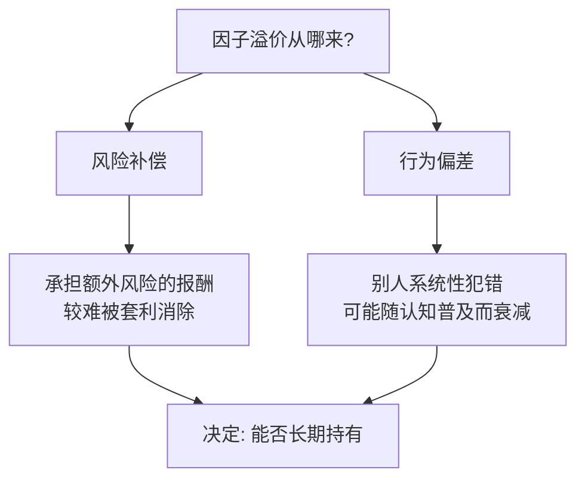

# 因子投资入门

> [!note] 因子投资
> 因子投资是通过系统地投资于具有特定"优秀特征"的股票，来获取超越市场回报的策略。它更像是一种**被纪律化、规则化的价值投资**。本篇是新手地图，回答三个根本问题：因子投资**是什么**、**为什么能赚钱**、它和**指数基金/主动选股**到底是什么关系。技术细节交给其他专题，本篇只负责把全局讲清楚。

## 一、什么是因子投资：给"好股票"下一个可计算的定义

每个投资者心里都有一套"什么是好股票"。因子投资做的事，是把这些模糊的直觉，**翻译成一条可计算、可重复执行的规则**，然后让计算机对全市场几千只股票一视同仁地打分、排序、选股。

**它像什么？** 就像选秀节目：评委（策略）按唱功、舞蹈、颜值（一个个因子）多维度打分，最后选综合分最高的选手。区别在于，因子投资的"评委"不会因为心情、面子或小道消息而改变标准——它**对每只股票用同一把尺子**。

> [!tip] 因子投资 = 规则化 + 分散化
> 它的两大底色：**规则化**（消除拍脑袋和情绪）与**分散化**（不押单只股票，押的是一类特征）。这两点正是它区别于传统"挑个股"的关键。因子的严格定义见 [[什么是因子]]。

## 二、为什么因子能赚钱：两种来源，一张表说清

这是入门最该想透的问题。因子的超额收益（溢价）主要来自两类完全不同的解释，理解它决定了你**敢不敢长期持有**。

| 解释流派 | 核心逻辑 | 钱从哪来 | 会不会消失 | 代表因子 |
|----------|----------|----------|------------|----------|
| 风险补偿（理性派） | 这类股票承担了某种"额外风险"，溢价是承担风险应得的报酬 | 你替别人扛了不想扛的风险 | 不易消失，但会有难熬的回撤期 | 价值、规模 |
| 行为偏差（行为派） | 投资者的系统性犯错（追涨、过度反应、锚定）造成定价偏离 | 别人的认知错误亏给你 | 一旦被广泛认知，可能被套利抹平 | 动量、部分情绪因子 |



> [!important] 这张表为什么重要
> 如果一个因子的收益来自**风险补偿**，那么在它表现差的年份，你要敢于坚持——因为那正是"风险兑现"的时刻，扛过去才有溢价。如果来自**行为偏差**，你要警惕它**被太多人发现后失效**（即拥挤，见 [[Alpha衰减与因子生命周期]]）。**不知道钱从哪来，就不知道该在什么时候坚持、什么时候撤退。**

## 三、常见的"优秀基因"（因子速览）

新手先认识这几类最经典的因子即可，完整的十大类对照大表见 [[因子分类体系]]：

- **价值因子**：买"便宜"的股票，如低市盈率（P/E）、低市净率（P/B）。逻辑：均值回归。
- **动量因子**：买近期表现好的股票。逻辑：趋势延续与反应不足。
- **质量因子**：买"好公司"，如高净资产收益率（ROE）、低负债率。逻辑：优质资产长期占优。
- **低波动因子**：买波动小的股票，长期风险调整后收益反而更好（"低波动异象"）。
- **规模因子**：买市值小的公司，历史上长期回报更高（但波动也更大）。

> [!warning] 没有"永远最好"的因子
> 因子会**轮动**：某一年价值大胜，另一年动量称王。单押一个因子，等于把命运压在一种市场风格上。这正是要做**多因子组合**的根本原因，详见 [[因子投资体系]] 与 [[多因子模型详解]]。

## 四、因子投资在投资光谱里的位置

新手最容易混淆的，是因子投资和指数基金、主动选股的关系。用一条光谱看最清楚：

| 维度 | 被动指数（Beta） | 因子投资（Smart Beta） | 主动选股（Alpha） |
|------|------------------|------------------------|-------------------|
| 收益来源 | 市场整体上涨 | 系统性的因子溢价 | 基金经理个人判断 |
| 决策方式 | 完全按指数 | 规则化、透明 | 主观、依赖人 |
| 费率 | 最低 | 中等 | 较高 |
| 可复制性 | 极高 | 高 | 低（靠人） |
| 透明度 | 高 | 高 | 通常较低 |

> [!note] 因子投资是"第三条路"
> 它站在被动与主动之间：**像被动一样规则化、低成本、可复制；又像主动一样追求超越市场。** 业界常称之为 Smart Beta（聪明的贝塔）。本质上，它把过去"明星基金经理脑子里的选股逻辑"，变成了**写在纸面上、谁都能执行的规则**。Alpha 与 Beta 的概念区分见 [[Alpha因子与量化交易入门]]。

## 五、实现方法：一句话的操作闭环

每月或每季度，对全市场股票在各因子上打分，选综合排名最高的几十只构建组合，定期再平衡：

```
全市场打分 → 综合排序 → 选头部N只等权/优化建仓 → 定期(月/季)再平衡 → 控制换手与成本
```

> [!example] 一个最小可行的因子组合（示例，非投资建议）
> 假设规则：每月底，在沪深300成分股里，对"低P/B（价值）"和"高ROE（质量）"两个因子各自打分、等权相加，选综合分最高的30只等权持有，下月底重做一次。这就是一个完整、透明、可复现的因子策略雏形——虽简单，但已具备规则化与分散化两大内核。

## 六、新手常见误区与风险

> [!warning] 入门阶段最常踩的五个坑
> 1. **把因子当"稳赚不赔"**：因子是长期统计优势，**短期跑输市场是常态**，熬不住就拿不到溢价。
> 2. **追逐刚刚大涨的因子**：因子有轮动和均值回归，过去三年最猛的因子，未来可能正要回吐。
> 3. **单因子梭哈**：放弃分散化，等于放弃因子投资最大的护城河。
> 4. **忽视成本**：换手太勤，超额收益被手续费和冲击成本吃光。
> 5. **混淆Smart Beta与真Alpha**：因子溢价是公开、可复制的，别误以为自己拥有独家秘籍。

> [!tip] 一句话总结
> 量化选股，优中选优，赚取因子溢价——**用规则代替情绪，用分散代替豪赌，用耐心代替择时。**

## 相关链接

- [[Alpha因子与量化交易入门]]
- [[因子分类体系]]
- [[目录|多因子策略]]
- [[什么是因子]]
- [[因子投资体系]]
- [[多因子模型详解]]
- [[Fama-French三因子模型]]
- [[Alpha衰减与因子生命周期]]

## 实战掌握清单

> [!tip] 交易者视角
> 因子投资入门 的学习重点不是记住术语，而是把它放进研究、组合、执行和复盘的闭环。量化策略必须从清晰假设出发，经过数据验证、成本测算、风险控制和实盘监控，才可能成为可持续系统。

### 关键判断

- 写清楚收益来自动量、反转、价值、套利、波动率、流动性还是行为偏差。
- 确认信号、过滤器、入场、退出、仓位和风控。
- 看收益是否集中在少数时期、少数品种或少数参数。

### 落地动作

1. 做样本外、滚动窗口和参数扰动测试。
2. 把手续费、滑点、冲击成本、容量和失败交易纳入报告。
3. 上线后监控成交质量、信号衰减、回撤和异常订单。

### 失效边界

- 过拟合。
- 策略容量不足。
- 市场结构变化后没有停止机制。

### 复盘问题

- 这项知识改变了哪一个具体决策：标的、方向、仓位、退出、对冲还是不交易？
- 如果判断相反，最大亏损、最长恢复期和退出触发条件是什么？
- 有没有一个更简单的基准方法可以取得相近结果？
