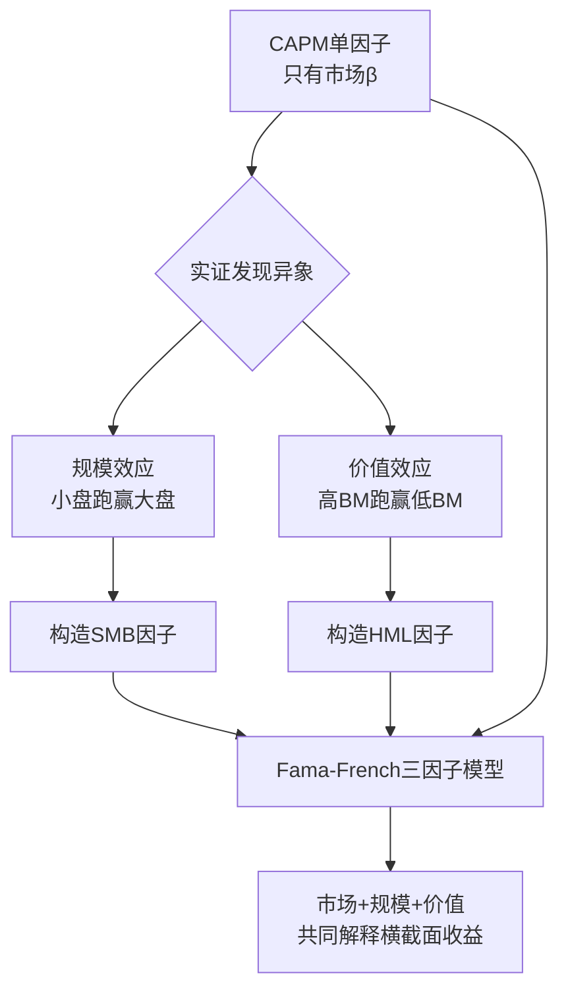
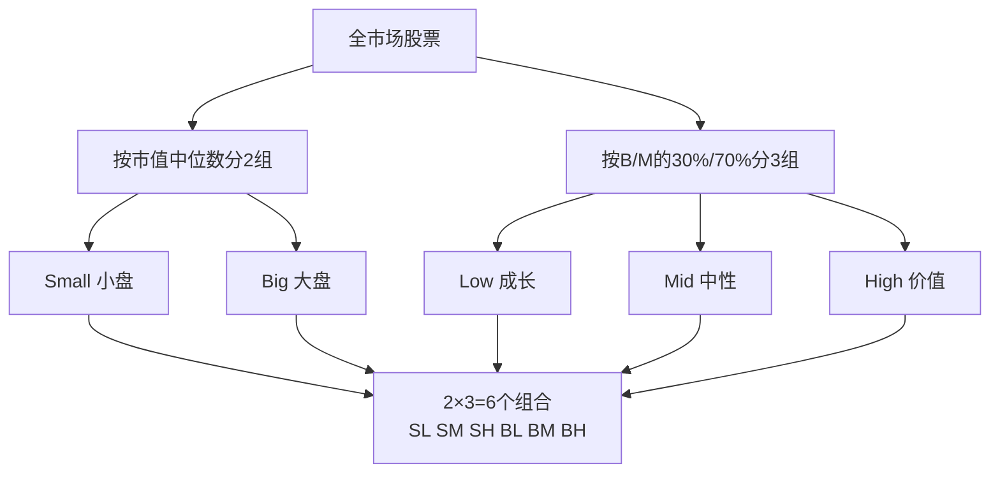
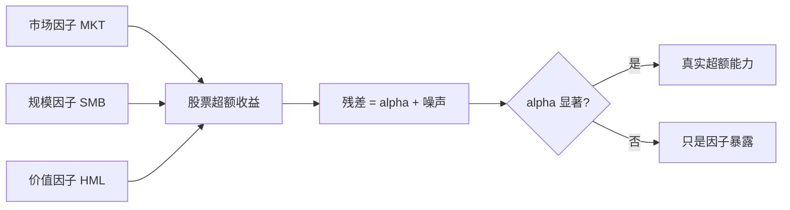

# Fama-French三因子模型

> [!note] Fama-French三因子模型
> Fama-French三因子模型是现代资产定价理论的基石，由Eugene Fama和Kenneth French于1993年提出。它在CAPM的单一市场因子之外，再加入**规模（SMB）**与**价值（HML）**两个因子，用三个共同因子来解释股票收益的横截面差异。一句话：CAPM说"风险只有一种"，三因子说"风险至少有三种"。

## 一、从CAPM说起：为什么需要三因子

### 1. CAPM的承诺与裂缝

资本资产定价模型（CAPM）认为，一只股票的预期超额收益只由它对市场组合的暴露（β）决定：

$$
E[R_i] - R_f = \beta_i \times \big(E[R_m] - R_f\big)
$$

理论很优雅：唯一被定价的风险是**系统性市场风险**，公司特有风险可以通过分散投资消除。然而从1970年代起，实证研究陆续发现一批 CAPM "解释不了"的规律（统称**异象 / anomalies**）：

| 异象 | 现象描述 | CAPM能否解释 |
|------|---------|------------|
| 规模效应 | 小市值股票长期收益高于大市值股票 | 否 |
| 价值效应 | 高账面市值比（B/M）股票收益高于低B/M | 否 |
| β异常 | 高β股票的实际超额收益不如理论那么高 | 否 |

> [!important] 核心问题
> 如果两只股票的市场β相同，CAPM预测它们应有相同的预期收益。但现实里，一只小盘价值股的长期回报常常显著高于一只大盘成长股——这部分"多出来的收益"，CAPM无法解释。Fama-French的贡献，就是把这部分系统性地"模型化"。

### 2. 三因子的诞生逻辑



Fama 与 French 的关键洞见：规模和价值不是"白捡的午餐"，而是一种**系统性风险溢价**——小公司、价值股在经济下行时更脆弱，投资者要求更高回报作为补偿。这把"异象"重新解释成了"风险因子"，纳入资产定价框架。

## 二、模型公式与逐项解读

三因子模型的回归方程（时间序列形式）：

$$
R_{i,t} - R_{f,t} = \alpha_i + \beta_i^{MKT}\,(R_{m,t} - R_{f,t}) + \beta_i^{SMB}\,SMB_t + \beta_i^{HML}\,HML_t + \varepsilon_{i,t}
$$

> [!note] 符号速查
> - $R_{i,t}-R_{f,t}$：资产 $i$ 在 $t$ 期的**超额收益**（被解释变量）
> - $\alpha_i$：截距项，模型解释不了的部分（业绩归因里的"真 alpha"）
> - $\beta^{MKT},\beta^{SMB},\beta^{HML}$：对三个因子的**暴露/敏感度**（载荷）
> - $\varepsilon_{i,t}$：残差，特异性风险

每一项的经济解读：

| 项 | 名称 | 衡量什么 | 解读 |
|----|------|---------|------|
| $\alpha_i$ | 阿尔法 | 超额收益中无法被三因子解释的部分 | >0 且显著=真本事；接近0=收益全靠因子暴露 |
| $\beta^{MKT}$ | 市场暴露 | 随大盘起伏的程度 | ≈1 与大盘同步；>1 进攻；<1 防守 |
| $\beta^{SMB}$ | 规模暴露 | 偏小盘还是大盘 | >0 偏小盘风格；<0 偏大盘风格 |
| $\beta^{HML}$ | 价值暴露 | 偏价值还是成长 | >0 偏价值风格；<0 偏成长风格 |

> [!tip] 关键理解
> 三因子模型最大的用途之一是**风格识别**：把一只基金的收益拿来回归，看 $\beta^{SMB}$、$\beta^{HML}$ 的正负大小，就能客观判断它到底是"小盘价值"还是"大盘成长"风格——而不必听基金经理自己怎么说。

## 三、三个因子详解

### 1. 市场因子（MKT，Market Excess Return）

- **定义**：市场组合收益率减去无风险利率，$MKT = R_m - R_f$
- **经济含义**：承担系统性市场风险的补偿，与 CAPM 中的因子一脉相承
- **来源**：继承自 CAPM，是三因子里唯一的"老面孔"
- **直觉**：任何股票都逃不开大盘的涨跌，这是最基础的系统性风险

### 2. 规模因子（SMB，Small Minus Big）

- **定义**：小市值组合收益 **减去** 大市值组合收益
- **经济含义**：持有小盘股相对大盘股获得的超额收益（小盘溢价）
- **历史表现**：长期看小盘股倾向于跑赢大盘股，但**周期性极强**，可能多年失效
- **风险解释**：小公司融资难、抗风险能力弱、信息不透明，衰退中更易出事，故需溢价补偿

### 3. 价值因子（HML，High Minus Low）

- **定义**：高账面市值比（B/M）组合收益 **减去** 低 B/M 组合收益
- **经济含义**：价值股相对成长股的超额收益（价值溢价）
- **历史表现**：长期价值股跑赢成长股，但2010年代价值因子在美股长期低迷，引发争议
- **风险解释**：高 B/M 公司常是经营困难、被市场"嫌弃"的企业，承担了更高的财务/经营风险

> [!example] B/M 是什么（示例，假设数字）
> 账面市值比 = 账面价值 / 市值。假设某公司净资产（账面）100亿，市值50亿，则 B/M = 2.0，属于典型"高 B/M"价值股；另一家净资产50亿、市值500亿的公司，B/M = 0.1，属于"低 B/M"成长股。注意 B/M 是 PB 的倒数。

## 四、因子如何构建（2×3 分组直觉）

Fama-French 用一套巧妙的"分组做多空"方法剥离出纯净的因子收益，避免规模与价值互相污染。



得到 6 个市值加权组合后，因子收益按下式计算：

$$
SMB = \tfrac{1}{3}(SL + SM + SH) - \tfrac{1}{3}(BL + BM + BH)
$$

$$
HML = \tfrac{1}{2}(SH + BH) - \tfrac{1}{2}(SL + BL)
$$

> [!note] 为什么要 2×3 双重分组
> SMB 在"低、中、高 B/M"三档里都各取小减大的差，相当于**控制住价值的影响后**只看规模；HML 在"小、大"两档里各取高减低，相当于**控制住规模后**只看价值。这种交叉控制让两个因子尽量"正交"、互不串味。详细数据流程见 [[Fama-French数据处理]]。

## 五、如何解读回归结果

拿到 OLS 回归结果后，重点看四样东西：

| 看什么 | 关注指标 | 判断标准（经验，非定论） |
|--------|---------|------------------------|
| 模型拟合度 | $R^2$ | 单只基金常达 0.8~0.95，越高说明收益越能被因子解释 |
| 有无真 alpha | 截距 $\alpha$ 及其 t值 | t 值绝对值 > 2 且 $\alpha>0$ → 存在显著正 alpha |
| 风格画像 | $\beta^{SMB},\beta^{HML}$ 符号 | 据正负判断小/大盘、价值/成长 |
| 系数可信度 | 各 β 的 t值 | t 值大才说明该暴露真实存在 |

```python
import statsmodels.api as sm

# df 含列: excess_ret(组合超额收益), MKT, SMB, HML
X = sm.add_constant(df`"MKT", "SMB", "HML"`)
y = df["excess_ret"]
model = sm.OLS(y, X).fit()
print(model.params)     # alpha 与三个 beta
print(model.tvalues)    # 对应 t 值
print(model.rsquared)   # 拟合优度
```

> [!tip] 一句话归因
> 把基金收益丢进三因子回归后：如果 $R^2$ 很高、$\alpha$ 不显著，说明"超额收益其实只是踩对了风格（因子暴露）"；如果 $\alpha$ 显著为正，才说明经理有真正的选股或择时能力。完整归因方法见 [[Fama-French实战指南]] 与 [[业绩评估与归因]]。

## 六、三因子对 CAPM 的改进

| 维度 | CAPM | Fama-French三因子 |
|------|------|------------------|
| 因子数 | 1（市场） | 3（市场+规模+价值） |
| 能否解释规模效应 | 否 | 是 |
| 能否解释价值效应 | 否 | 是 |
| 横截面解释力 $R^2$ | 较低 | 显著提升 |
| 风格识别能力 | 弱 | 强 |
| 理论简洁性 | 最简洁 | 略复杂但更贴近现实 |

> [!important] 改进的本质
> 三因子并没有"推翻"CAPM，而是**扩展**了它：把原来被当成"异象"或"运气"的规模、价值收益，重新解释为可定价的系统性风险。它由此成为后续所有多因子研究的范式起点（详见 [[多因子模型详解]]、[[资产定价研究方法论]]）。

## 七、常见误区与风险

> [!warning] 五个常见误区
> 1. **把 α 当成"水平证明"**：单期 α 受噪声影响大，必须看 t 值和足够长的样本，单月 α 高没意义。
> 2. **以为因子永远有效**：SMB、HML 都有长达数年的失效期，2010年代价值因子在美股大幅跑输即是教训。
> 3. **混淆"暴露"与"alpha"**：靠重仓小盘价值股赚的钱是 β（因子暴露），不是 α（超额能力），别张冠李戴。
> 4. **直接套用美国因子数据**：A股的规模/价值效应强度、方向与美股不同，应使用本地构建的因子，见 [[Fama-French数据处理]]。
> 5. **B/M 与 PB 搞反**：B/M 高 = PB 低 = 价值股；不少人方向记反导致结论颠倒。

> [!warning] 主要风险
> - **因子拥挤**：当大量资金涌入同一因子，溢价可能被抹平甚至反转。
> - **数据偏差**：幸存者偏差、前视偏差会系统性高估因子收益（详见 [[回测方法论]]）。
> - **模型设定误差**：三因子仍解释不了动量等异象，不能当"万能公式"。

## 八、一图总结



> [!tip] 学习路径
> 理解三因子后，可继续学习 [[Fama-French五因子模型]]（加入盈利与投资因子）、动手做 [[Fama-French数据处理]]，再用 [[Fama-French实战指南]] 完成回归归因，最后用 [[资产定价研究方法论]] 系统化你的实证检验。

## 相关链接

- [[Fama-French五因子模型]]
- [[Fama-French实战指南]]
- [[Fama-French数据处理]]
- [[资产定价研究方法论]]
- [[多因子模型详解]]
- [[什么是因子]]
- [[目录|量化策略总览]]

## 实战掌握清单

> [!tip] 交易者视角
> Fama-French三因子模型 的学习重点不是记住术语，而是把它放进研究、组合、执行和复盘的闭环。量化策略必须从清晰假设出发，经过数据验证、成本测算、风险控制和实盘监控，才可能成为可持续系统。

### 关键判断

- 写清楚收益来自动量、反转、价值、套利、波动率、流动性还是行为偏差。
- 确认信号、过滤器、入场、退出、仓位和风控。
- 看收益是否集中在少数时期、少数品种或少数参数。

### 落地动作

1. 做样本外、滚动窗口和参数扰动测试。
2. 把手续费、滑点、冲击成本、容量和失败交易纳入报告。
3. 上线后监控成交质量、信号衰减、回撤和异常订单。

### 失效边界

- 过拟合。
- 策略容量不足。
- 市场结构变化后没有停止机制。

### 复盘问题

- 这项知识改变了哪一个具体决策：标的、方向、仓位、退出、对冲还是不交易？
- 如果判断相反，最大亏损、最长恢复期和退出触发条件是什么？
- 有没有一个更简单的基准方法可以取得相近结果？
