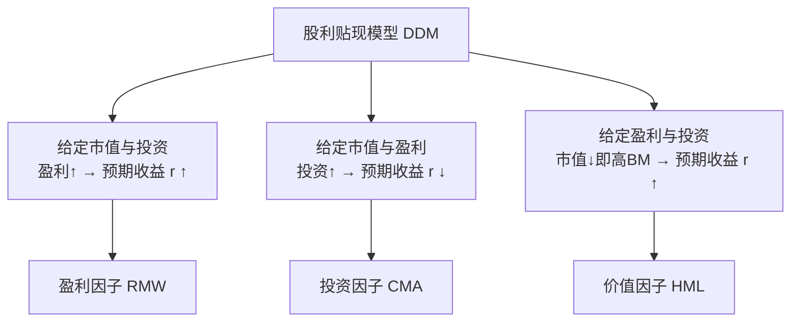
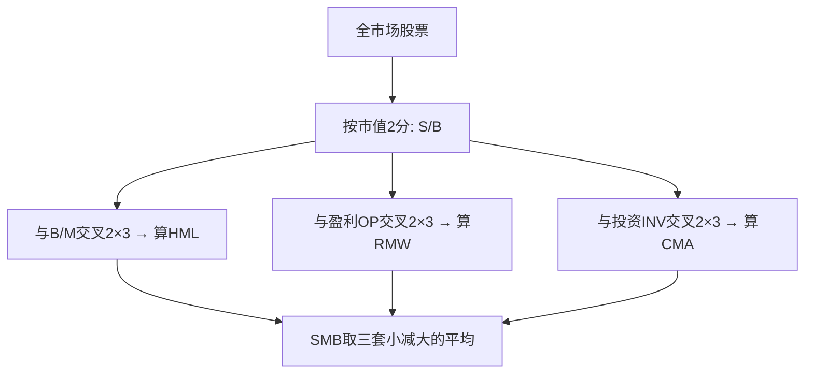

# Fama-French五因子模型

> [!note] 五因子模型
> Fama-French五因子模型于2015年提出，在三因子（市场、规模、价值）基础上再加入**盈利因子（RMW）**和**投资因子（CMA）**。两个新因子的灵感来自股利贴现模型——盈利越强、投资越克制的公司，理论上能给股东更高回报。它是目前学术界和业界最广泛使用的资产定价模型之一，但也伴随着不小的争议（动量缺失、HML 冗余）。

## 一、为什么从三因子升级到五因子

### 1. 三因子的"未解之谜"

三因子模型问世后，研究者又发现它解释不了的新规律：

| 异象 | 现象 | 三因子能否解释 |
|------|------|--------------|
| 盈利效应 | 高盈利能力公司收益更高 | 否 |
| 投资效应 | 投资激进（扩张快）的公司收益更低 | 否 |

### 2. 理论靠山：股利贴现模型（DDM）

五因子并非凭空加因子，而是有清晰的估值逻辑。从股利贴现模型出发，公司市值等于未来盈利折现：

$$
M_t = \sum_{\tau=1}^{\infty} \frac{E[Y_{t+\tau} - dB_{t+\tau}]}{(1+r)^{\tau}}
$$

其中 $Y$ 是盈利、$dB$ 是账面权益增量（约等于投资）、$r$ 是内部收益率（即预期收益）。对该式做代数变形可推出三条直觉：



> [!important] 核心洞见
> 同样的估值恒等式，既"推出"了价值因子，也"推出"了盈利和投资因子。这给五因子提供了统一的经济学根基，也埋下了"HML 可能冗余"的伏笔——既然 HML、RMW、CMA 同源，它们之间难免高度相关。

## 二、模型公式

$$
R_{i,t} - R_{f,t} = \alpha_i + \beta_1 MKT_t + \beta_2 SMB_t + \beta_3 HML_t + \beta_4 RMW_t + \beta_5 CMA_t + \varepsilon_{i,t}
$$

## 三、五个因子详解

| 因子 | 全称 | 含义 | 构建指标 |
|-----|------|------|---------|
| MKT | Market | 市场超额收益 | 市场组合收益 − 无风险利率 |
| SMB | Small Minus Big | 小盘溢价 | 小市值组合 − 大市值组合 |
| HML | High Minus Low | 价值溢价 | 高 B/M 组合 − 低 B/M 组合 |
| RMW | Robust Minus Weak | 盈利溢价 | 高盈利组合 − 低盈利组合 |
| CMA | Conservative Minus Aggressive | 投资溢价 | 保守投资组合 − 激进投资组合 |

### 盈利因子（RMW，Robust Minus Weak）

- **定义**：高营业利润率（Robust）公司收益 减去 低营业利润率（Weak）公司收益
- **经济逻辑**：盈利能力强、稳定的"现金奶牛"长期表现更优；这与质量投资（Quality）理念相通
- **衡量指标**：营业利润率 = (营收 − 营业成本 − 利息 − 销管费用) / 账面权益
- **直觉**：能持续赚钱的公司，理应给股东更高回报

### 投资因子（CMA，Conservative Minus Aggressive）

- **定义**：保守投资（Conservative，扩张慢）公司收益 减去 激进投资（Aggressive，扩张快）公司收益
- **经济逻辑**：过度投资、资产疯狂扩张的公司往往回报较低（"投资黑洞"），克制的公司反而回报更好
- **衡量指标**：总资产增长率 = (本期总资产 − 上期总资产) / 上期总资产
- **直觉**：盲目扩张常常烧钱、摊薄股东价值；自律的资本开支更利于回报

> [!example] RMW 与 CMA 的方向（示例，假设）
> 假设 A 公司营业利润率 30%、年资产增速 5%，B 公司营业利润率 5%、年资产增速 60%。五因子框架下，A 是"高盈利 + 保守投资"型，预期收益更高；B 是"低盈利 + 激进投资"型，预期收益更低。RMW 和 CMA 正是把这种差异系统化。

## 四、因子构建：从 2×3 到 2×2×2×2

三因子只需按"规模×价值"做 2×3 分组；五因子要同时控制规模、价值、盈利、投资四个维度，构建更复杂。



> [!note] 构建要点
> - **HML / RMW / CMA**：分别在"规模×该指标"的 2×3 分组中，用高组减低组（市值加权）。
> - **SMB**：在三套独立 2×3 分组里都算一次"小减大"，再取平均，使规模因子不被单一指标污染。
> - 数据处理细节（清洗、缩尾、月度再平衡）见 [[Fama-French数据处理]] 与 [[因子构建方法]]。

```python
# 概念示意：盈利因子的高低组（非完整可运行代码）
# op = 营业利润率, 已按 2×3(规模×盈利) 分好组
robust = df[df["op_group"] == "R"]["vw_ret"].mean()   # 高盈利组（市值加权收益）
weak   = df[df["op_group"] == "W"]["vw_ret"].mean()   # 低盈利组
RMW = robust - weak
```

## 五、五因子 vs 三因子

| 方面 | 三因子模型 | 五因子模型 |
|-----|----------|----------|
| 因子数 | 3 | 5 |
| 横截面解释力 | 较强 | 更强（多解释盈利、投资效应） |
| 价值因子 HML | 显著 | 常被 RMW/CMA 部分替代，甚至变得冗余 |
| 提出时间 | 1993 | 2015 |
| 理论根基 | 风险补偿直觉 | 股利贴现模型推导 |
| 是否含动量 | 否 | 否（仍缺失） |

## 六、争议与批评

五因子虽强，但学术界争议从未停止，主要集中在三点：

### 1. HML 变得"冗余"

> [!warning] HML 的尴尬
> Fama-French 自己的研究发现：**一旦控制了 RMW 和 CMA，HML 在解释横截面收益上几乎不再提供额外信息**。原因正是前述 DDM 同源性——价值、盈利、投资本就高度相关。于是出现一个悖论：五因子里那个开创性的价值因子，反而可能是可有可无的。不过出于历史与实务惯例，HML 通常仍被保留。

### 2. 动量因子缺失

> [!warning] 最受诟病的"缺口"
> 动量效应（过去赢家继续赢）是最稳健、最广泛验证的异象之一，但五因子**刻意不包含动量**。Fama 对动量一直持保留态度（认为缺乏清晰的风险解释）。实务中，很多人会自行加上动量因子 UMD，构成"六因子"使用。详见 [[多因子策略核心原理]]。

### 3. 因子定价 vs 行为解释之争

| 阵营 | 观点 | 对溢价的解释 |
|------|------|------------|
| 风险派（Fama-French） | 因子=系统性风险 | 高收益是承担风险的补偿 |
| 行为派 | 因子=定价错误 | 溢价源于投资者认知偏差，可能被套利消除 |

> [!note] 没有定论
> 因子溢价到底是"风险补偿"还是"市场犯错"，至今没有公认答案。这场争论直接关系到因子未来是否会持续有效——若是风险补偿则长期稳定，若是定价错误则可能随套利而消失。判断逻辑见 [[资产定价研究方法论]] 与 [[因子检验与评价]]。

## 七、实务中如何选择

| 场景 | 推荐模型 | 理由 |
|------|---------|------|
| 业绩归因 / 风格识别 | 五因子（或加动量的六因子） | 暴露刻画更全面 |
| 教学 / 快速直觉 | 三因子 | 简洁、易解释 |
| 中国 A 股 | 本地化因子（含规模、价值，验证盈利/投资） | 美股因子不可照搬 |
| 追求最高解释力 | 五/六因子 + 稳健性检验 | 但谨防过拟合 |

> [!tip] 实务建议
> 不要迷信"因子越多越好"。加因子能提升样本内 $R^2$，却可能损害样本外稳健性，还会引入多重共线性（如 HML 与 CMA 高度相关）。务实做法：先用三/五因子归因，再视需要谨慎扩展，并始终做样本外与 [[回测方法论]] 检验。

## 八、常见误区与风险

> [!warning] 常见误区
> 1. **以为五因子一定优于三因子**：若 HML 冗余，多加因子只是徒增复杂度和共线性。
> 2. **忽视动量**：用纯五因子做归因，会把动量收益错误地塞进 α，高估"超额能力"。
> 3. **盈利/投资指标口径混乱**：RMW 用营业利润率、CMA 用总资产增长率，换口径会显著改变结果。
> 4. **直接搬运因子值**：A 股盈利、投资因子的有效性需独立验证，不能照抄美国数据。
> 5. **把因子当稳赚**：任何单一因子都会有长期失效期，组合与风控不可少。

> [!important] 风险提示
> 五因子是**统计模型**而非"市场真理"。它在样本内拟合好，不代表未来仍然有效；因子拥挤、结构性市场变化（如成长股长牛）都可能让某些因子长期跑输。模型用于理解与归因，而非保证收益。

## 相关链接

- [[Fama-French三因子模型]]
- [[Fama-French实战指南]]
- [[Fama-French数据处理]]
- [[资产定价研究方法论]]
- [[多因子策略核心原理]]
- [[因子分类体系]]
- [[目录|量化策略总览]]

## 实战掌握清单

> [!tip] 交易者视角
> Fama-French五因子模型 的学习重点不是记住术语，而是把它放进研究、组合、执行和复盘的闭环。量化策略必须从清晰假设出发，经过数据验证、成本测算、风险控制和实盘监控，才可能成为可持续系统。

### 关键判断

- 写清楚收益来自动量、反转、价值、套利、波动率、流动性还是行为偏差。
- 确认信号、过滤器、入场、退出、仓位和风控。
- 看收益是否集中在少数时期、少数品种或少数参数。

### 落地动作

1. 做样本外、滚动窗口和参数扰动测试。
2. 把手续费、滑点、冲击成本、容量和失败交易纳入报告。
3. 上线后监控成交质量、信号衰减、回撤和异常订单。

### 失效边界

- 过拟合。
- 策略容量不足。
- 市场结构变化后没有停止机制。

### 复盘问题

- 这项知识改变了哪一个具体决策：标的、方向、仓位、退出、对冲还是不交易？
- 如果判断相反，最大亏损、最长恢复期和退出触发条件是什么？
- 有没有一个更简单的基准方法可以取得相近结果？
