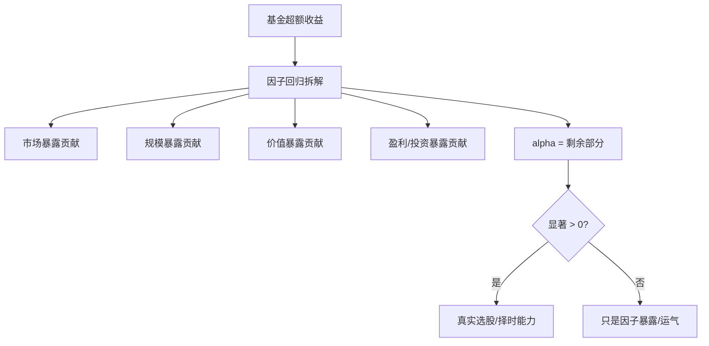

# Fama-French实战指南

> [!note] 实战应用
> 本文聚焦 Fama-French 因子最核心的实战用途——**回归归因**：用一只股票/基金/策略的收益对 FF 因子做回归，求出 alpha 与各 beta，进而回答那个关键问题——"这份超额收益，到底是经理的真本事（alpha），还是只是踩对了风格（因子暴露）？"全程给出 statsmodels 示例。

## 一、为什么要做因子回归

> [!important] 一个灵魂拷问
> 某基金过去三年年化跑赢沪深300十个点。它厉害吗？——不一定。如果它只是重仓了小盘价值股，而同期小盘价值风格本就大涨，那这十个点是 **β（因子暴露）** 带来的，换谁拿着这种风格都能赚。只有扣掉所有因子暴露后**仍然为正且显著**的部分，才是真正的 **α（超额能力）**。



## 二、回归模型

时间序列回归方程（以五因子为例）：

$$
R_{p,t} - R_{f,t} = \alpha_p + \beta_1 MKT_t + \beta_2 SMB_t + \beta_3 HML_t + \beta_4 RMW_t + \beta_5 CMA_t + \varepsilon_{p,t}
$$

- 被解释变量 $y$：组合**超额收益** $R_p - R_f$
- 解释变量 $X$：因子序列（自带常数项即 $\alpha$）
- 估计方法：普通最小二乘 OLS（建议配 HAC/Newey-West 稳健标准误）

## 三、完整 Python 流程

### 1. 数据获取与对齐

```python
import pandas as pd
import numpy as np
import statsmodels.api as sm

# fund: 含 date, ret（组合月度收益）
# factors: 含 date, MKT, SMB, HML, RMW, CMA, RF（无风险利率）
df = pd.merge(fund, factors, on="date").sort_values("date")

# 关键：被解释变量必须是“超额收益”
df["excess_ret"] = df["ret"] - df["RF"]
```

> [!warning] 最常见的低级错误
> 忘记减无风险利率，直接拿原始收益做回归。这会把无风险利率的水平错误地塞进 $\alpha$，导致 alpha 系统性偏高。**被解释变量永远是超额收益 $R_p-R_f$。**

### 2. 跑回归（三因子 / 五因子）

```python
factor_cols = ["MKT", "SMB", "HML", "RMW", "CMA"]   # 三因子则只取前三
X = sm.add_constant(df[factor_cols])                 # const 即 alpha
y = df["excess_ret"]

# 用 Newey-West 稳健标准误，处理自相关与异方差
model = sm.OLS(y, X).fit(cov_type="HAC", cov_kwds={"maxlags": 6})
print(model.summary())
```

### 3. 提取关键结果

```python
alpha = model.params["const"]            # 月度 alpha
alpha_t = model.tvalues["const"]         # alpha 的 t 值
betas = model.params.drop("const")       # 各因子暴露
r2 = model.rsquared                      # 拟合优度

ann_alpha = (1 + alpha) ** 12 - 1        # 年化 alpha（近似）
print(f"年化alpha≈{ann_alpha:.2%}, alpha t值={alpha_t:.2f}, R²={r2:.3f}")
```

## 四、如何解读结果：alpha 还是 beta？

### 1. 看 alpha 判断"真本事"

| alpha 情况 | t 值 | 结论 |
|-----------|------|------|
| α > 0 | \|t\| > 2 | **显著正 alpha**：存在真实超额能力 |
| α > 0 | \|t\| < 2 | 数字为正但**不显著**，可能只是运气 |
| α ≈ 0 | — | 收益**几乎全靠因子暴露**解释 |
| α < 0 | \|t\| > 2 | 显著为负：扣除风格后其实跑输 |

> [!tip] t 值的直觉
> t 值衡量"这个估计离 0 有多远、有多可信"。经验上 |t| > 2 对应约 5% 显著性水平。**单看 alpha 的数值大小没意义，必须结合 t 值和样本长度。**

### 2. 看 beta 判断"风格画像"

| 系数 | 符号 | 含义 |
|------|------|------|
| $\beta_{MKT}$ | ≈1 / >1 / <1 | 与大盘同步 / 进攻 / 防守 |
| $\beta_{SMB}$ | >0 | 偏小盘风格 |
| $\beta_{SMB}$ | <0 | 偏大盘风格 |
| $\beta_{HML}$ | >0 | 偏价值风格 |
| $\beta_{HML}$ | <0 | 偏成长风格 |
| $\beta_{RMW}$ | >0 | 偏高盈利（质量）股 |
| $\beta_{CMA}$ | >0 | 偏保守投资（低扩张）股 |

> [!example] 一次完整解读（示例，假设数字）
> 某基金五因子回归结果：$\alpha$ 月度 0.1%（t=0.8）、$\beta_{MKT}=0.95$、$\beta_{SMB}=0.6$、$\beta_{HML}=0.5$、$R^2=0.92$。
> 解读：$R^2$ 高达 0.92，说明收益几乎都能被因子解释；$\beta_{SMB}>0$、$\beta_{HML}>0$ 表明是**小盘价值**风格；$\alpha$ 虽为正但 t=0.8 不显著。**结论：这只基金的超额收益主要来自小盘价值暴露，看不出显著的选股 alpha。**

## 五、收益归因：把超额收益拆开

除了判断 alpha，还能定量算出"每个因子贡献了多少收益"：

$$
\underbrace{\bar{R}_p - R_f}_{\text{平均超额}} \;=\; \alpha \;+\; \sum_k \beta_k \cdot \bar{F}_k
$$

```python
# 各因子的平均收益
factor_mean = df[factor_cols].mean()
# 各因子贡献 = beta × 因子平均收益
contribution = betas * factor_mean
contribution["alpha"] = alpha
print((contribution / df["excess_ret"].mean()).sort_values())  # 各部分占比
```

> [!note] 归因的价值
> 这张"贡献分解表"能直观告诉投资者：组合收益里多少来自市场、多少来自小盘、多少来自价值、多少是真 alpha。这正是机构做 [[业绩评估与归因]] 的标准动作。

## 六、滚动回归：暴露会漂移

单次全样本回归假设风格不变，现实中基金风格会"漂移"。用滚动窗口观察 beta 随时间的变化：

```python
window = 36   # 36个月滚动窗口
roll_betas = []
for i in range(window, len(df) + 1):
    sub = df.iloc[i - window:i]
    m = sm.OLS(sub["excess_ret"], sm.add_constant(sub[factor_cols])).fit()
    roll_betas.append(m.params)
roll_betas = pd.DataFrame(roll_betas, index=df["date"].iloc[window - 1:])
# roll_betas.plot()  # 观察 SMB/HML 暴露是否漂移
```

> [!tip] 风格漂移的信号
> 如果 $\beta_{SMB}$、$\beta_{HML}$ 在不同时期大幅摆动，说明基金在**择时切换风格**——这本身可能是一种能力，也可能是追涨杀跌的风险来源，值得深究。

## 七、模型诊断（别跳过）

> [!warning] 回归结果可信的前提
> - **多重共线性**：五因子中 HML 与 CMA 常高度相关，会让单个 beta 不稳定。检查方差膨胀因子（VIF），或对照三因子结果。
> - **自相关 / 异方差**：月度收益常有自相关，务必用 Newey-West（HAC）稳健标准误，否则 t 值虚高。
> - **样本长度**：样本太短（如不足 36 个月）时 alpha 的 t 值几乎不可信。
> - **结构突变**：跨越牛熊或制度变化的长样本，单一回归可能掩盖结构变化，配合滚动回归看。

## 八、常见误区与风险

> [!warning] 实战六大误区
> 1. **忘减无风险利率** → alpha 虚高（见上文）。
> 2. **只看 alpha 数值不看 t 值** → 把噪声当能力。
> 3. **漏掉动量因子** → 动量收益被错塞进 alpha，高估超额能力（建议加 UMD 做六因子，见 [[Fama-French五因子模型]]）。
> 4. **用错因子数据** → 拿美股因子回归 A 股标的，结论失真（本地因子构建见 [[Fama-French数据处理]]）。
> 5. **样本内过拟合** → 不断加因子让 $R^2$ 变高，但样本外失效。
> 6. **忽略交易成本与流动性** → 回归出的 alpha 是"纸上"收益，实盘要扣成本（见 [[回测方法论]]）。

> [!important] 终极提醒
> 因子回归是**诊断工具**，不是**收益保证**。它能帮你看清收益来源、识别风格、揭穿"伪 alpha"，但 alpha 的持续性需要长期样本和样本外检验来确认。统计显著 ≠ 未来必然延续。系统化的检验框架见 [[资产定价研究方法论]]。

## 相关链接

- [[Fama-French三因子模型]]
- [[Fama-French五因子模型]]
- [[Fama-French数据处理]]
- [[资产定价研究方法论]]
- [[业绩评估与归因]]
- [[目录|量化策略总览]]

## 课程化学习补充

> [!important] 学习定位
> 量化策略是投资假设、数据工程、回测验证、风险预算和执行系统的组合，不是单一公式。本文仅用于学习、研究与复盘，不构成任何投资建议。

### 必须掌握的问题

- 假设是否可证伪
- 数据是否 point-in-time
- 绩效是否扣除真实成本
- 上线后是否监控衰减

### 实战应用流程

1. 先写清楚你的投资假设：为什么这个信号、资产或方法应该产生收益。
2. 明确数据口径：样本范围、更新时间、复权/分红/停牌处理和交易日历。
3. 做最小可行验证：先用简单规则验证方向，再逐步加入复杂模型。
4. 把成本和约束前置：手续费、滑点、冲击成本、保证金、流动性和容量都要进入测算。
5. 上线后持续复盘：记录信号、下单、成交、持仓、回撤和失效原因。

### 风险与失效条件

- 数据挖掘偏差
- 因子拥挤
- 换手过高
- 实盘偏离回测

### 复盘问题

- 这笔交易或这套模型赚的是什么钱：风险补偿、行为偏差、流动性溢价，还是偶然噪音？
- 如果市场环境反过来，最大亏损和最长恢复期会是多少？
- 当前结论是否依赖某个不可持续假设，例如低利率、低波动、充裕流动性或监管套利？
- 有没有一个更简单的基准策略能取得接近效果？

### 延伸学习

- [[量化投资完全指南]]
- [[回测质量门清单]]
- [[市场微观结构与交易执行]]
- [[量化风险管理体系]]
