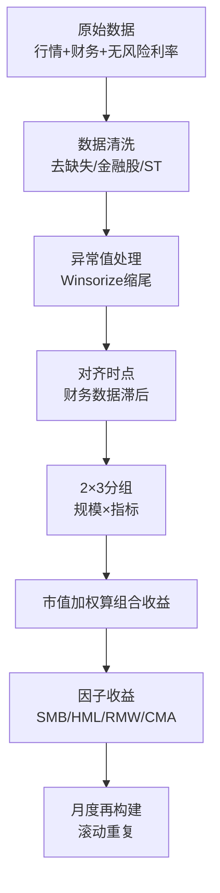
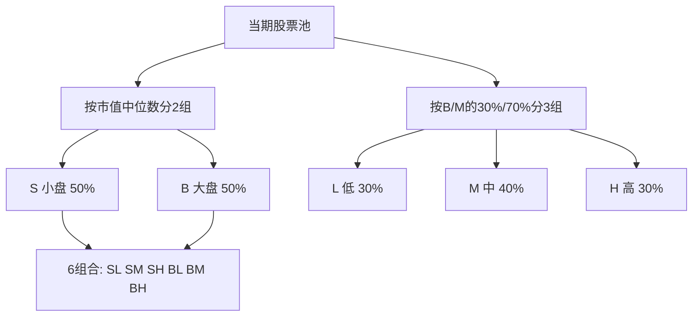

# Fama-French数据处理

> [!note] 数据处理
> Fama-French因子能不能用、可不可信，**七成功夫在数据处理**。本文聚焦如何从原始行情与财务数据，一步步构建出 SMB、HML 等因子组合：2×3 分组、市值加权、月度再构建，并给出完整的 Python 数据处理流程与避坑指南。

## 一、整体流程鸟瞰



> [!important] 一句话原则
> 因子构建的灵魂是"**用尽可能干净、可交易、无前视的数据，复刻 Fama-French 的分组多空逻辑**"。任何一步偷工减料，都会让后续回归 [[Fama-French实战指南]] 得出误导性的 alpha/beta。

## 二、数据准备

### 1. 所需数据

| 数据类别 | 具体字段 | 用途 |
|---------|---------|------|
| 股票收益率 | 月度收益率（含分红，复权） | 计算组合收益 |
| 市值数据 | 总市值或流通市值 | 规模分组 + 加权 |
| 财务数据 | 账面价值、营业利润、总资产 | 构建 B/M、OP、INV |
| 无风险利率 | 国债 / 央票收益率（月化） | 计算超额收益 |

### 2. 数据来源

- **国内**：Wind、Choice 等数据终端；CSMAR、RESSET 等学术数据库
- **国际**：Yahoo Finance、Alpha Vantage、CRSP/Compustat
- **现成因子**：Kenneth French 数据库提供美股现成因子序列（适合做对照基准，不适合直接当 A 股因子用）

> [!tip] 选市值口径
> A 股因 IPO 制度、限售股等原因，**流通市值**往往比总市值更贴近可交易现实。构建本土因子时优先考虑流通市值，并与总市值口径做稳健性对比。

## 三、数据清洗

```python
# 1) 删除关键字段缺失
data = data.dropna(subset=["ret", "market_cap", "book_value"])

# 2) 排除金融股（财务杠杆结构特殊，B/M 含义不同）
data = data[~data["industry"].isin(["银行", "保险", "证券", "多元金融"])]

# 3) 排除 ST / *ST（基本面异常、易退市）
data = data[~data["name"].str.contains("ST", na=False)]

# 4) 剔除上市不足一定时间的新股（次新股波动异常）
data = data[data["list_days"] >= 180]

# 5) 剔除账面价值为负的公司（B/M 失去意义）
data = data[data["book_value"] > 0]
```

> [!note] 为什么排除金融股
> 银行、保险等金融企业普遍高杠杆，其账面价值、B/M 的经济含义与一般工商企业差异巨大，会扭曲价值因子。这是 Fama-French 原始论文就采用的标准做法。

## 四、异常值处理（Winsorize 缩尾）

极端值会严重影响分组分位数和加权收益，需做缩尾：

```python
from scipy.stats.mstats import winsorize

# 对收益率与因子指标各做 1% 双侧缩尾
for col in ["ret", "BM", "op", "inv"]:
    data[col] = winsorize(data[col], limits=[0.01, 0.01])
```

> [!tip] 缩尾 vs 截断
> - **Winsorize（缩尾）**：把超出分位的极端值"压"到分位数边界，保留样本量。
> - **Truncate（截断）**：直接删除极端样本，会损失数据。
> 因子研究中更常用缩尾，避免样本流失。缩尾比例（1%、2.5%）应作为稳健性检验的一项。

## 五、关键中的关键：时点对齐（防前视偏差）

> [!warning] 最容易致命的错误
> 财务数据（如年报账面价值）在**报告期结束后数月才公布**。若在分组时直接用"当期"财报，等于用了未来才知道的信息——**前视偏差（look-ahead bias）**，会凭空制造虚高的因子收益。

Fama-French 的经典处理：

- 用 $t-1$ 年 12 月底的**市值**做规模分组；
- 用 $t-1$ 财年的**账面价值**计算 B/M；
- 在 $t$ 年 **6 月底**重新构建组合，确保财报早已公开。

```python
# 财务数据统一滞后，确保"可获得"才使用（示意）
fin["avail_date"] = fin["report_period"] + pd.DateOffset(months=4)  # 假设滞后4个月可得
merged = pd.merge_asof(
    price.sort_values("date"),
    fin.sort_values("avail_date"),
    left_on="date", right_on="avail_date",
    by="stock_id", direction="backward",
)
```

## 六、2×3 分组与市值加权

### 1. 分组规则



> [!note] 分位数细节
> - 规模：用**中位数**一分为二（50/50）。
> - 价值/盈利/投资：用 **30% 与 70% 分位数**切三段（30/40/30）。
> - Fama-French 经典做法常以 **NYSE（大盘股）** 计算分位断点再套用全样本，避免大量微型股扭曲断点；A 股可类比用主板股票定断点。

### 2. 组合收益必须"市值加权"

> [!important] 为什么是市值加权而非等权
> 等权会让大量小微股主导组合，夸大规模效应、降低可投资性。Fama-French 用**市值加权（value-weighted）**计算每个组合的收益，更贴近真实可交易组合。

```python
def vw_return(group):
    # group 含 ret 与 weight(=上期市值)
    w = group["weight"]
    return (group["ret"] * w).sum() / w.sum()

port_ret = (
    data.groupby(["date", "size_grp", "bm_grp"])
        .apply(vw_return)
        .reset_index(name="vw_ret")
)
```

## 七、因子收益计算

得到 6 个市值加权组合后：

$$
SMB = \tfrac{1}{3}(SL + SM + SH) - \tfrac{1}{3}(BL + BM + BH)
$$

$$
HML = \tfrac{1}{2}(SH + BH) - \tfrac{1}{2}(SL + BL)
$$

$$
MKT = R_m - R_f
$$

```python
p = port_ret.pivot(index="date", columns=["size_grp", "bm_grp"], values="vw_ret")

SMB = (p["S"].mean(axis=1)) - (p["B"].mean(axis=1))           # 小三组均值 - 大三组均值
HML = (p[("S","H")] + p[("B","H")]) / 2 \
    - (p[("S","L")] + p[("B","L")]) / 2                       # 高 - 低
factors = pd.DataFrame({"MKT": mkt, "SMB": SMB, "HML": HML})
```

> [!tip] 五因子的扩展
> 构建 RMW、CMA 时，把上面的"B/M"分别换成营业利润率（OP）、总资产增长率（INV），各做一套独立 2×3 分组即可；SMB 则取三套分组"小减大"的平均。原理见 [[Fama-French五因子模型]] 与 [[因子构建方法]]。

## 八、月度再构建（再平衡）

> [!note] 滚动逻辑
> 因子组合并非一次成型。经典做法是**每年 6 月按最新分位重排成分股**，期间每月按市值加权计算组合收益；下一年 6 月再重排。这样既反映成分变化，又避免过度频繁换手。

```python
factor_series = []
for ym in month_range:                 # 遍历每个月
    pool = build_pool(ym)              # 取当月可交易股票池
    pool = assign_groups(pool, ym)     # 按最近一次重排的断点分组
    f = compute_factors(pool, ym)      # 市值加权 → 算 SMB/HML/...
    factor_series.append(f)
factors = pd.concat(factor_series)
```

| 频率选择 | 优点 | 缺点 |
|---------|------|------|
| 年度重排（经典） | 换手低、贴近论文 | 反映信息偏慢 |
| 月度重排 | 信息更新快 | 换手高、噪声大、交易成本上升 |

## 九、常见问题与误区

> [!warning] 数据处理六大坑
> 1. **前视偏差**：分组时用了尚未公布的财报——最隐蔽也最致命，务必做时点滞后。
> 2. **幸存者偏差**：股票池只含"现在还活着"的公司，剔除了退市股，系统性高估收益。应使用含退市样本的数据库。
> 3. **数据频率不匹配**：日度行情与季度财务混用而不对齐，导致错配。
> 4. **等权代替市值加权**：夸大小盘效应、降低可投资性。
> 5. **忘记复权 / 漏算分红**：收益率失真，价值股（高分红）尤其受影响。
> 6. **断点用全样本而非大盘股**：微型股扭曲分位断点。

> [!important] 验证习惯
> 构建完因子后，务必把自制 SMB/HML 与权威来源（如对应市场的公开因子序列）做相关性对照；相关性过低往往意味着某个环节（时点、加权、清洗）出了问题。下游回归与归因见 [[Fama-French实战指南]]，检验方法见 [[资产定价研究方法论]]。

## 相关链接

- [[Fama-French三因子模型]]
- [[Fama-French五因子模型]]
- [[Fama-French实战指南]]
- [[资产定价研究方法论]]
- [[因子构建方法]]
- [[回测方法论]]

## 课程化学习补充

> [!important] 学习定位
> 量化策略是投资假设、数据工程、回测验证、风险预算和执行系统的组合，不是单一公式。本文仅用于学习、研究与复盘，不构成任何投资建议。

### 必须掌握的问题

- 假设是否可证伪
- 数据是否 point-in-time
- 绩效是否扣除真实成本
- 上线后是否监控衰减

### 实战应用流程

1. 先写清楚你的投资假设：为什么这个信号、资产或方法应该产生收益。
2. 明确数据口径：样本范围、更新时间、复权/分红/停牌处理和交易日历。
3. 做最小可行验证：先用简单规则验证方向，再逐步加入复杂模型。
4. 把成本和约束前置：手续费、滑点、冲击成本、保证金、流动性和容量都要进入测算。
5. 上线后持续复盘：记录信号、下单、成交、持仓、回撤和失效原因。

### 风险与失效条件

- 数据挖掘偏差
- 因子拥挤
- 换手过高
- 实盘偏离回测

### 复盘问题

- 这笔交易或这套模型赚的是什么钱：风险补偿、行为偏差、流动性溢价，还是偶然噪音？
- 如果市场环境反过来，最大亏损和最长恢复期会是多少？
- 当前结论是否依赖某个不可持续假设，例如低利率、低波动、充裕流动性或监管套利？
- 有没有一个更简单的基准策略能取得接近效果？

### 延伸学习

- [[量化投资完全指南]]
- [[回测质量门清单]]
- [[市场微观结构与交易执行]]
- [[量化风险管理体系]]
