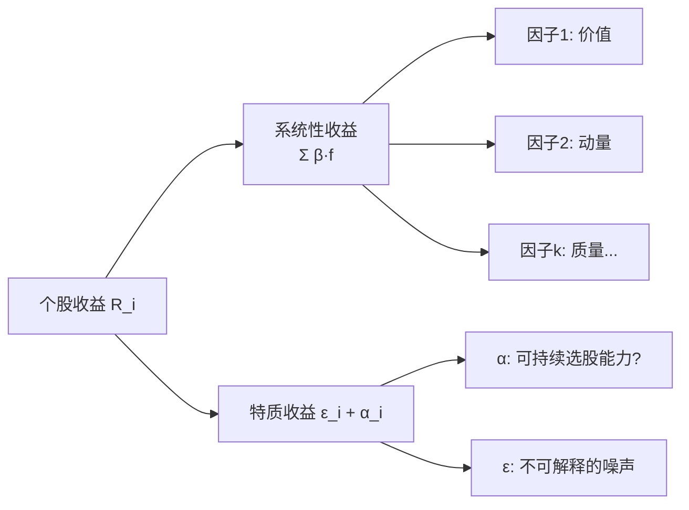
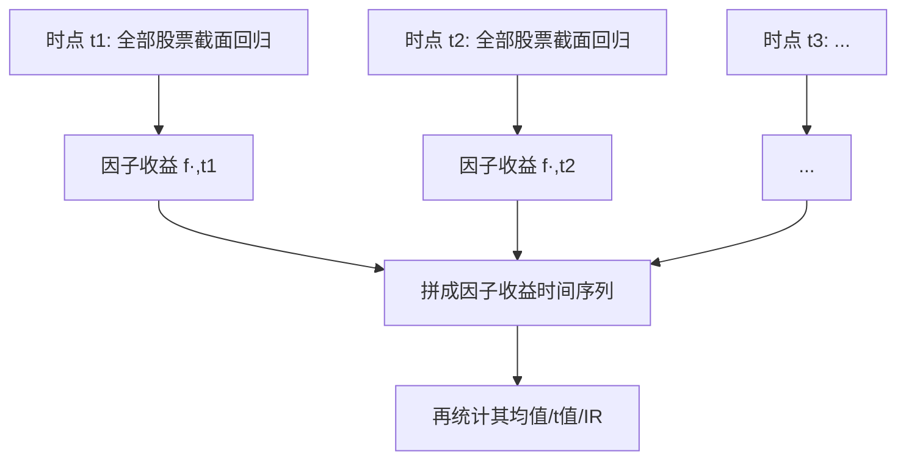

# 多因子模型详解

> [!note] 多因子模型
> 多因子模型是现代投资组合理论的核心，它把一只股票的收益拆成两块：**能被共同因子解释的部分**（系统性收益）和**剩下解释不了的部分**（特质收益）。这篇笔记聚焦"数学形式"——把收益方程写清楚，并讲透两条估计路线：**截面回归**与**时序回归**。

## 一、一句话抓住模型的数学骨架

多因子模型的核心方程只有一行：

$$
R_i = \alpha_i + \sum_{k=1}^{K} \beta_{i,k} \, f_k + \varepsilon_i
$$

把它翻译成大白话：

> **某只股票的收益 = 它在各个因子上的暴露 × 对应因子的收益 + 自己的特质收益。**

| 符号 | 名称 | 含义 | 谁是已知、谁要估计 |
|------|------|------|------|
| $R_i$ | 个股收益 | 股票 $i$ 在某期的（超额）收益 | 已知（观测值） |
| $\alpha_i$ | 截距/选股能力 | 不被因子解释的常数部分 | 待估计 |
| $\beta_{i,k}$ | 因子暴露（factor loading） | 股票 $i$ 对因子 $k$ 的敏感度 | 视路线而定 |
| $f_k$ | 因子收益（factor return） | 因子 $k$ 这一期赚了多少 | 视路线而定 |
| $\varepsilon_i$ | 特质/残差收益 | 个股独有、与因子无关的部分 | 误差项 |

> [!important] 整篇笔记的题眼
> 方程里 **$\beta$（暴露）和 $f$（因子收益）一个是"已知"、另一个是"待求"**。先固定哪个、再回归求哪个——这正是"截面回归"与"时序回归"两条路线分道扬镳的地方。

## 二、把"收益分解"看成一张图

- **系统性部分**：所有股票"共享"的风险来源，靠分散投资无法消除，因此理论上要给溢价。
- **特质部分**：单只股票自己的故事（突发利好、管理层变动……），可以通过持有足够多的股票被分散掉。

> [!tip] 为什么要做这个分解？
> 1. **风险归因**：组合的波动到底来自"押注了价值因子"还是"压错了某只票"？分解后一目了然。
> 2. **Alpha 提纯**：把已知因子的影响剥离后，剩下的 $\alpha$ 才是真正值钱的、别人没发现的超额收益。

## 三、两条估计路线总览

同一个方程，估计方法却有两套完全不同的思路。先用一张表建立全局印象，后面两节再各自展开。

| 维度 | 时序回归（Time-Series） | 截面回归（Cross-Sectional） |
|------|------|------|
| 回归的"样本" | 同一只股票的**多期**收益 | 同一时点的**多只**股票 |
| 自变量 $X$ | 因子收益序列 $f_k$（已知） | 因子暴露 $\beta_{i,k}$（已知/事先算好） |
| 待求 $\beta$/$f$ | 求**因子暴露** $\beta_{i,k}$ | 求**因子收益** $f_k$ |
| 代表 | CAPM、Fama-French 时序检验 | Barra 模型、Fama-MacBeth |
| 因子如何获得 | 因子收益是**事先构造的组合**（如 SMB、HML） | 因子暴露是**事先算好的特征**（如 PB、市值） |
| 典型用途 | 资产定价检验、求 $\beta$ 做风险对冲 | 多因子选股、纯因子收益估计 |
| 数据形态 | 时间维度长 | 横截面维度宽 |

> [!note] 一个好记的口诀
> **时序回归"竖着切"**（沿时间，一只股票一根回归）；**截面回归"横着切"**（沿股票，一个时点一根回归）。

## 四、时序回归：固定因子收益，求暴露 β

### 4.1 思路

时序回归假设因子收益 $f_k$ 是**可观测、可交易的组合收益**。最经典的例子就是 Fama-French：

- 市场因子 $f_{MKT}$ = 市场组合超额收益
- 规模因子 $f_{SMB}$ = "小盘 − 大盘"组合收益
- 价值因子 $f_{HML}$ = "高账面市值比 − 低账面市值比"组合收益

这些因子收益每天/每月都能算出来，是**已知的**。于是对**单只股票 $i$**，用它的历史收益序列对这些因子序列做一次时间序列回归：

$$
R_{i,t} = \alpha_i + \beta_{i,MKT} f_{MKT,t} + \beta_{i,SMB} f_{SMB,t} + \beta_{i,HML} f_{HML,t} + \varepsilon_{i,t}
$$

回归跑完，得到这只股票的三个 $\beta$（暴露）和一个 $\alpha$。

### 4.2 结果怎么读

| 估计量 | 解读 |
|------|------|
| $\beta_{i,k}$ | 这只票对因子 $k$ 的敏感度，可用于风险对冲、组合暴露控制 |
| $\alpha_i$ 显著为正 | 扣掉因子后仍有超额收益——可能是真本事，也可能是漏掉了某个因子 |
| $R^2$ | 因子整体能解释这只票多少波动 |

> [!example] 示例（数字为假设）
> 对某只票做月度时序回归，得 $\beta_{MKT}=1.1$、$\beta_{SMB}=0.6$、$\beta_{HML}=-0.3$，$\alpha=0.2\%/\text{月}$ 且 t 值=1.1（不显著）。
> 解读：这是只**偏小盘、偏成长**的高 Beta 股；$\alpha$ 在统计上约等于 0，说明它的收益基本被三因子解释完了，**没有额外的"免费午餐"**。

> [!warning] 时序回归的隐含前提
> 它要求**因子收益本身是可观测的组合收益**。如果你想用的"因子"是 PB、市值这类**个股特征**（不是组合收益），时序回归就用不上——这时要走截面回归。

## 五、截面回归：固定暴露，求因子收益 f

### 5.1 思路

截面回归反过来：**因子暴露 $\beta_{i,k}$ 是事先算好的个股特征**（比如把每只票的 PB、市值、动量做标准化），是**已知的**；要估计的反而是**这一期每个因子赚了多少**，即因子收益 $f_k$。

在**某一个时点 $t$**，用当期所有股票的收益对它们的暴露做一次横截面回归：

$$
R_{i,t} = \sum_{k=1}^{K} \beta_{i,k} \, f_{k,t} + u_{i,t}, \qquad i = 1,2,\dots,N
$$

跑完这一根回归，得到当期的因子收益向量 $(f_{1,t}, f_{2,t}, \dots, f_{K,t})$。**每一期跑一根**，就得到一条因子收益的时间序列。

### 5.2 Fama-MacBeth 两步法

截面回归最经典的统计框架是 **Fama-MacBeth 两步法**：

1. **第一步（截面）**：逐期做横截面回归，得到每期的因子收益 $\hat f_{k,t}$。
2. **第二步（时序汇总）**：把每期估计出的 $\hat f_{k,t}$ 当成一个序列，求其时间序列均值与 t 统计量：

$$
\bar f_k = \frac{1}{T}\sum_{t=1}^{T}\hat f_{k,t}, \qquad
t(\bar f_k) = \frac{\bar f_k}{\,\hat\sigma(\hat f_k)/\sqrt{T}\,}
$$

如果 $\bar f_k$ 显著为正，就说明该因子在样本期内**确实赚到了风险溢价**。

> [!tip] 为什么量化选股偏爱截面回归
> 因为我们关心的常是"**哪些股票特征能预测下期收益**"。截面回归直接以个股特征（PB、动量……）为自变量，天然契合选股；而且能顺手算出**纯因子收益**——剥离其他因子影响后，单个因子的净贡献。

### 5.3 IC 与截面回归的关系

实务里常用的 **IC（信息系数）** 其实就是截面回归的"简化版"：

$$
IC_t = \text{corr}\big(\,\beta_{i,k}^{(t)},\; R_{i,t+1}\,\big)
$$

即"本期因子值"与"下期收益"的**横截面相关系数**。单因子、单变量回归的斜率方向与 IC 同号——**IC 可以看作只放一个因子时截面回归斜率的标准化度量**。IC 越高越稳定，因子越值钱。（IC 的系统用法见 [[因子检验与评价]]。）

## 六、两条路线的统一视角

| 你拥有的"已知量" | 你想求的 | 该走的路线 |
|------|------|------|
| 因子是**可交易组合收益**（SMB/HML…） | 个股暴露 $\beta$、检验 $\alpha$ | 时序回归 |
| 因子是**个股特征**（PB、市值、动量…） | 因子收益 $f$、纯因子溢价 | 截面回归 |
| 既想要暴露又想要纯因子收益 | 二者都要 | 先截面定暴露口径，再 Fama-MacBeth |

> [!note] 一句话收尾
> **方程不变，谁已知谁就当自变量。** 把"暴露"当已知就求"因子收益"（截面）；把"因子收益"当已知就求"暴露"（时序）。理解了这一点，多因子模型的数学形式就再也不会绕晕你了。

## 七、因子模型的演进

随着研究推进，模型在"用几个因子"上不断加码，本质都是在上面那行方程里增加求和项 $K$：

| 模型 | 因子 | 解释力 |
|-----|------|--------|
| CAPM | 市场 | 基础 |
| Fama-French三因子 | 市场+规模+价值 | 更强 |
| Carhart四因子 | 三因子+动量 | 进一步 |
| Fama-French五因子 | 三因子+盈利+投资 | 最强 |

> [!warning] 因子不是越多越好
> 加因子能提高样本内 $R^2$，但每多一个因子就多一份**过拟合**与**多重共线性**风险。学界已统计出数百个"因子"，其中大量在样本外失效（即所谓"因子动物园"问题）。**先问经济逻辑，再看统计显著性**，最后还要扛得住样本外检验。

## 八、常见误区与风险

> [!warning] 用模型时最容易踩的坑
> 1. **把暴露和因子收益搞反**：截面回归里 $\beta$ 是自变量、$f$ 是要估的；时序回归恰好相反。混淆会导致整套估计逻辑错位。
> 2. **$\alpha$ 显著就当成本事**：$\alpha$ 显著也可能只是**漏掉了某个真实因子**。加入更多因子后 $\alpha$ 常常被"吃掉"。
> 3. **忽视暴露随时间漂移**：$\beta$ 并非恒定，行业切换、风格轮动都会让暴露变化，需滚动估计。
> 4. **共线性导致系数乱跳**：价值、规模等因子间相关时，单个 $\beta$ 估计不稳，应先做正交化/中性化（见 [[多因子策略核心原理]]）。
> 5. **前视偏差**：截面回归里"本期因子值"必须用**当期收盘前可得**的数据预测"下期"收益，绝不能用未来财报。
> 6. **以为 $R^2$ 高就好**：定价检验里恰恰希望 $\alpha$ 不显著、因子能解释收益；而选股里又希望抓到 $\alpha$。**目标不同，对 $R^2$/$\alpha$ 的期望相反**，别一概而论。

> [!tip] 实践小结
> - 做**风险管理 / 对冲**：走时序回归，拿到稳定的 $\beta$。
> - 做**选股 / 找 Alpha**：走截面回归，关注 IC、纯因子收益。
> - 调仓节奏：月度/季度为主，配合多因子综合评分、风险预算控制与交易成本管理。

## 相关链接

- [[Fama-French三因子模型]]
- [[Fama-French五因子模型]]
- [[多因子策略核心原理]]
- [[多因子策略深度解析]]
- [[资产定价研究方法论]]
- [[因子检验与评价]]
- [[目录|量化策略总览]]

## 课程化学习补充

> [!important] 学习定位
> 量化策略是投资假设、数据工程、回测验证、风险预算和执行系统的组合，不是单一公式。本文仅用于学习、研究与复盘，不构成任何投资建议。

### 必须掌握的问题

- 假设是否可证伪
- 数据是否 point-in-time
- 绩效是否扣除真实成本
- 上线后是否监控衰减

### 实战应用流程

1. 先写清楚你的投资假设：为什么这个信号、资产或方法应该产生收益。
2. 明确数据口径：样本范围、更新时间、复权/分红/停牌处理和交易日历。
3. 做最小可行验证：先用简单规则验证方向，再逐步加入复杂模型。
4. 把成本和约束前置：手续费、滑点、冲击成本、保证金、流动性和容量都要进入测算。
5. 上线后持续复盘：记录信号、下单、成交、持仓、回撤和失效原因。

### 风险与失效条件

- 数据挖掘偏差
- 因子拥挤
- 换手过高
- 实盘偏离回测

### 复盘问题

- 这笔交易或这套模型赚的是什么钱：风险补偿、行为偏差、流动性溢价，还是偶然噪音？
- 如果市场环境反过来，最大亏损和最长恢复期会是多少？
- 当前结论是否依赖某个不可持续假设，例如低利率、低波动、充裕流动性或监管套利？
- 有没有一个更简单的基准策略能取得接近效果？

### 延伸学习

- [[量化投资完全指南]]
- [[回测质量门清单]]
- [[市场微观结构与交易执行]]
- [[量化风险管理体系]]
