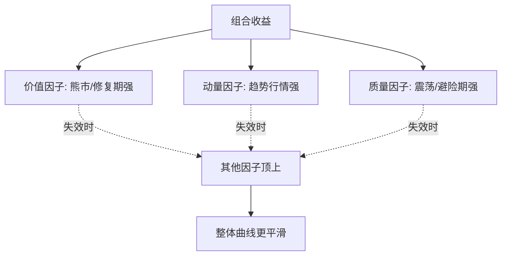
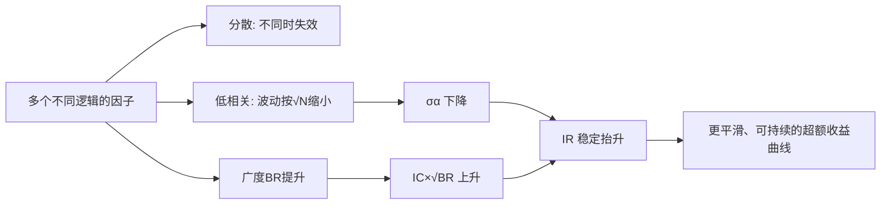

# 多因子策略核心原理

> [!note] 核心原理
> 多因子模型是量化投资的核心工具。这篇笔记不堆公式细节，而是回答一个最根本的问题：**为什么要用"多个"因子，而不是把一个最强的因子用到极致？** 答案藏在三个词里——**分散、低相关、稳定的 IR**，以及一个关键技术——**因子正交化**。

## 一、先从"单因子的天花板"说起

任何单一因子，无论历史回测多漂亮，都有三个躲不掉的问题：

| 单因子的硬伤 | 具体表现 |
|------|------|
| **会失效的窗口** | 价值因子可以连续数年跑输（如成长股牛市），动量在转折点被反复打脸 |
| **拥挤与衰减** | 一个因子被越多人用，超额收益越被抹平（因子拥挤） |
| **风格集中** | 单押一个因子＝单押一种风格，组合波动完全暴露在该风格的轮动上 |

> [!tip] 一句话点破
> **单因子是在赌"某一种逻辑长期有效且不被市场识破"——这是一种没有分散的押注。** 多因子的全部价值，就是把这种押注分散开。

## 二、模型骨架：收益分解

承接 [[多因子模型详解]]，股票收益被分解为：

$$
R_i = \alpha_i + \sum_{j=1}^{K} \beta_{i,j}\, F_j + \varepsilon_i
$$

- $\alpha_i$：股票 $i$ 的超额收益（Alpha）
- $\beta_{i,j}$：股票 $i$ 对因子 $j$ 的暴露
- $F_j$：因子 $j$ 的收益
- $\varepsilon_i$：残差项

多因子策略要做的，就是**同时下注多个 $F_j$**，并把它们的力量科学地合成起来。

## 三、为什么多因子优于单因子（核心三论）

### 3.1 分散：把"会失效"的风险摊薄

不同因子背后是**不同的盈利逻辑**：价值赚的是"低估修复"，动量赚的是"趋势延续"，质量赚的是"好公司溢价"。它们不会在同一时间同时失效。

> [!note] 类比
> 单因子像一支只会一种打法的球队，遇到克制就输；多因子像攻防兼备的球队，这套不灵换那套——**赢面不靠某一招无敌，而靠总有一招能用**。

### 3.2 低相关：组合波动按"平方根"缩小

这是多因子最硬核的数学理由。若把每个因子看成一个收益序列，组合的波动取决于**因子之间的相关性**。两个因子组合的方差为：

$$
\sigma_p^2 = w_1^2\sigma_1^2 + w_2^2\sigma_2^2 + 2w_1 w_2 \rho_{12}\sigma_1\sigma_2
$$

关键在 $\rho_{12}$（相关系数）：

| 相关性 $\rho$ | 组合效果 |
|------|------|
| $\rho = 1$（完全相关） | 等于没分散，波动不降 |
| $\rho = 0$（不相关） | 波动按 $\sqrt{N}$ 规律下降，分散效果好 |
| $\rho < 0$（负相关） | 此消彼长，波动进一步压缩 |

> [!example] 等权 N 个等效不相关因子（示例/假设）
> 假设有 $N$ 个波动相同、两两不相关的因子，等权组合后波动约为单因子的 $1/\sqrt{N}$：
> - $N=1$：波动 100%
> - $N=4$：波动约 50%
> - $N=9$：波动约 33%
> **收益若能保持，波动却下降——这正是"信息比率提升"的来源。**

### 3.3 稳定的 IR：多因子真正追求的目标

量化看的不是单纯收益，而是**信息比率（IR）**——单位主动风险换来的超额收益：

$$
IR = \frac{\text{超额收益均值}}{\text{超额收益波动}} = \frac{\alpha}{\sigma_\alpha}
$$

经典的 **基本法则（Fundamental Law of Active Management）** 把 IR 拆为：

$$
IR \approx IC \times \sqrt{BR}
$$

- $IC$：单次预测的准确度（信息系数）
- $BR$：**独立下注的次数（广度）**

> [!important] 这条公式就是"多因子优于单因子"的最强论据
> 单因子 $IC$ 再高，**广度 $BR$ 也有限**。引入多个**相互独立**的因子，等于成倍提高 $BR$——即使每个因子的 $IC$ 不算高，靠"独立下注次数"的平方根放大，**整体 IR 依然能稳步抬升**。
> 注意：公式里的广度要求"**独立**"。这就引出了下一节的正交化——只有把因子里重复的部分剔掉，$BR$ 才是真广度。

### 3.4 三论关系图

## 四、因子正交化：让"多"真正变成"多"

### 4.1 问题：因子之间常常重叠

很多因子表面不同，骨子里高度相关。例如：

| 看似不同的因子 | 隐藏的重叠 |
|------|------|
| 小市值 vs 低价 | 小盘股往往也是低价股 |
| 价值（低 PB） vs 高股息 | 低估值公司常伴随高分红 |
| 动量 vs 换手率 | 强势股常伴随放量高换手 |

若直接把这些"伪独立"因子加总，相当于在同一个方向上**重复下注**——广度 $BR$ 是虚的，分散是假的，风险还偷偷集中。

### 4.2 正交化的核心思想

**正交化 = 用回归把因子 B 里"能被因子 A 解释的部分"剥掉，只留下 B 独有的残差。**

对因子 B 关于因子 A 做横截面回归：

$$
\text{Factor}_B = a + b\cdot \text{Factor}_A + \boldsymbol{r}
$$

回归残差 $\boldsymbol{r}$ 就是**正交化后的纯净 B 因子**——它与 A 不相关，承载的是 B 独有的信息。

> [!tip] 直觉
> 正交化就像"**先把账面市值比里属于'小盘'的味道去掉，剩下的才是纯粹的'便宜'**"。这样价值与规模才真正各管一摊，互不抢功。

### 4.3 常用的正交化/去重手段

| 方法 | 做法 | 适用场景 |
|------|------|------|
| **行业/市值中性化** | 把因子对行业哑变量、市值回归，取残差 | 几乎所有选股因子的标配预处理 |
| **施密特正交化** | 按指定顺序逐个剔除前序因子成分 | 因子有明确主次时 |
| **对称正交化** | 同时正交、不偏袒任何因子 | 因子地位平等、想最大限度保留信息 |
| **主成分分析（PCA）** | 提取互不相关的主成分作为新因子 | 因子高度冗余、想降维 |

> [!warning] 正交化的副作用
> 正交化会**改变因子的经济含义**：残差因子不再是"原始的价值"，而是"剔除规模后的价值"。过度正交化还可能把有用信号也削掉。**先想清楚要保留什么逻辑，再决定正交的顺序与强度。**

## 五、因子模型的两大应用

理解了"为什么多因子"，再看它落地的两个方向：

### 5.1 风险模型（Risk Model）
- 分解投资组合的风险来源
- 控制特定风险因子的暴露
- 代表：Barra 风险模型

### 5.2 Alpha 模型（Alpha Model）
- 预测资产的超额收益
- 构建最优投资组合
- 代表：多因子选股模型

> [!note] 两者关系
> **Alpha 模型负责"想赚什么"，风险模型负责"别在不想赚的地方暴露太多"。** 一个进攻、一个防守，配合使用才是成熟的多因子体系。

## 六、因子构建与组合方法

### 6.1 因子构建的两条路

**截面因子**
- 在每个时间截面上对股票排序
- 计算因子值与未来收益的关系
- 适用于选股策略

**时序因子**
- 分析单个资产的时间序列特征
- 预测资产收益的时间序列变化
- 适用于择时策略

### 6.2 因子组合方法概览

| 方法 | 优点 | 缺点 |
|-----|------|------|
| 等权法 | 简单、稳健 | 忽视因子差异 |
| IC加权 | 考虑因子有效性 | IC不稳定 |
| 最优化 | 理论最优 | 过拟合风险 |
| 机器学习 | 捕捉非线性 | 黑箱、难解释 |

> [!tip] 衔接
> 这里只是列出框架。各种合成权重的**具体公式与取舍**，在 [[多因子策略深度解析]] 里有逐一推导。

## 七、常见误区与风险

> [!warning] 关于"多因子"最常见的误解
> 1. **以为因子越多越好**：加入与已有因子高度相关的"伪新因子"，只增加换手与拥挤，不增加真实广度 $BR$。
> 2. **不做正交化就直接相加**：等于在同方向重复押注，风险偷偷集中，分散是假象。
> 3. **盯收益不盯 IR**：多因子的目标是**稳定的风险调整收益**，不是把短期收益冲到最高。
> 4. **把相关性当常数**：因子相关性随市场状态变化（危机中常一起上升），平时的分散在极端行情可能瞬间失效。
> 5. **忽视基本法则的前提**：$IR\approx IC\sqrt{BR}$ 要求下注"独立"且"可执行"，受交易成本、容量约束时广度会打折。
> 6. **忽略经济逻辑**：纯靠数据挖出的因子即便正交、低相关，缺乏逻辑支撑也极易在样本外失效。

> [!important] 一句话总纲
> 多因子的本质不是"凑很多因子"，而是 **"用相互独立、各有逻辑的多重押注，把不可分散的单一风格风险，转化为可分散的组合风险，从而换取更稳定的 IR"**。正交化，是让这句话成立的技术前提。

## 相关链接

- [[Fama-French三因子模型]]
- [[多因子模型详解]]
- [[多因子策略深度解析]]
- [[多因子策略实战]]
- [[什么是因子]]
- [[因子检验与评价]]
- [[目录|量化策略总览]]

## 实战掌握清单

> [!tip] 交易者视角
> 多因子策略核心原理 的学习重点不是记住术语，而是把它放进研究、组合、执行和复盘的闭环。量化策略必须从清晰假设出发，经过数据验证、成本测算、风险控制和实盘监控，才可能成为可持续系统。

### 关键判断

- 写清楚收益来自动量、反转、价值、套利、波动率、流动性还是行为偏差。
- 确认信号、过滤器、入场、退出、仓位和风控。
- 看收益是否集中在少数时期、少数品种或少数参数。

### 落地动作

1. 做样本外、滚动窗口和参数扰动测试。
2. 把手续费、滑点、冲击成本、容量和失败交易纳入报告。
3. 上线后监控成交质量、信号衰减、回撤和异常订单。

### 失效边界

- 过拟合。
- 策略容量不足。
- 市场结构变化后没有停止机制。

### 复盘问题

- 这项知识改变了哪一个具体决策：标的、方向、仓位、退出、对冲还是不交易？
- 如果判断相反，最大亏损、最长恢复期和退出触发条件是什么？
- 有没有一个更简单的基准方法可以取得相近结果？
