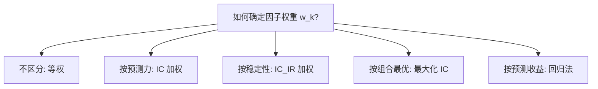
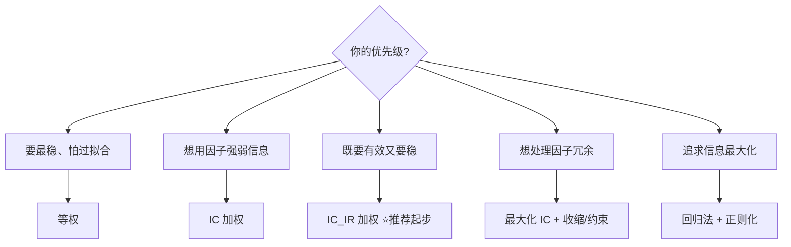

# 多因子策略深度解析

> [!note] 深度解析
> 这篇笔记聚焦多因子里最容易"拍脑袋"的一环——**因子合成（权重怎么定）**。当你手里有 5 个、10 个有效因子，到底该等权相加，还是按有效性加权？这里把五种主流方法的**思想、权重公式、适用场景和坑**逐一摊开对比。

## 一、问题的本质：从"多个分"到"一个分"

承接 [[多因子策略核心原理]]，每只股票在每个因子上都有一个标准分 $\tilde z_{i,k}$，合成的目标是得到综合得分：

$$
\text{Score}_i = \sum_{k=1}^{K} w_k \, \tilde z_{i,k}
$$

**全部争论都集中在 $w_k$ 怎么定。** 五种主流方法，本质是对"如何衡量一个因子值不值得多给权重"给出不同答案。

先上总览表，再逐个展开：

| 方法 | 权重依据 | 是否考虑因子相关性 | 优点 | 主要风险 |
|------|------|:---:|------|------|
| 等权 | 不区分 | 否 | 极稳健、零估计误差 | 浪费了因子强弱信息 |
| IC 加权 | 因子预测力 | 否 | 强因子多给权重 | IC 不稳，权重抖动 |
| IC_IR 加权 | 预测力 / 波动 | 否 | 兼顾有效性与稳定性 | 仍忽略因子间冗余 |
| 最大化 IC | 组合整体 IC 最优 | **是** | 理论最优、考虑协方差 | 对协方差估计极敏感 |
| 回归法 | 直接预测收益 | 是（隐含） | 信息利用最充分 | 最易过拟合 |

> [!tip] 先有个直觉
> 从上到下，**理论上更"聪明"，实战中更"危险"**。越往下越依赖对 IC 协方差、收益的估计，估计一旦不准，聪明反被聪明误。

## 二、方法一：等权法（Equal Weight）

### 思想
所有因子一视同仁，权重相等。

### 权重公式

$$
w_k = \frac{1}{K}
$$

### 评价
- **优点**：没有任何需要估计的参数 → **零估计误差**、不会过拟合、换手低。
- **缺点**：把弱因子和强因子摆在同等地位，浪费了"哪个因子更好"的信息。

> [!note] 别小看等权
> 大量实证显示，等权常常是**极难打败的基准**。原因正是它"什么都不估计"——而其他方法多出来的收益，常被估计误差吃掉。**做合成实验，永远拿等权当对照组。**

## 三、方法二：IC 加权（IC Weighting）

### 思想
因子的预测力用 **IC（信息系数）** 衡量，IC 高的因子多给权重。通常用历史一段窗口的平均 IC。

### 权重公式

$$
w_k = \frac{\overline{IC}_k}{\sum_{j=1}^{K} \big|\overline{IC}_j\big|}
$$

其中 $\overline{IC}_k$ 是因子 $k$ 在回看窗口内的 IC 均值。（IC 为负的因子说明方向反了，应先把因子方向调正。）

### 评价
- **优点**：直接奖励"更能预测收益"的因子，符合直觉。
- **缺点**：**IC 本身波动很大**。某因子这段时间 IC 高、下段时间 IC 低，权重会跟着大幅抖动，导致换手上升。

> [!warning] IC 加权的陷阱
> IC 加权只看"预测力高不高"，**不看"稳不稳"**。一个偶尔 IC 很高、但极不稳定的因子，可能拿到过高权重。这正是下一个方法要修正的地方。

## 四、方法三：IC_IR 加权（信息比率加权）

### 思想
不光看 IC 高，还要看 IC **稳**。用 IC 的"信息比率" $ICIR$——IC 均值除以 IC 的波动——来定权重：

$$
ICIR_k = \frac{\overline{IC}_k}{\sigma(IC_k)}
$$

### 权重公式

$$
w_k = \frac{ICIR_k}{\sum_{j=1}^{K} \big|ICIR_j\big|}
$$

### 评价
- **优点**：**同时奖励"有效"和"稳定"**。一个 IC 不算最高、但常年稳定的因子，会比"忽高忽低"的因子拿到更高权重。
- **缺点**：依然把每个因子**当作独立的**来加权，没有考虑因子之间的相关/冗余（两个高度相关的因子可能都拿高权重，等于重复下注）。

> [!tip] 实战里 IC_IR 加权是"性价比之王"
> 它比等权多用了信息、又比"最大化 IC / 回归法"稳健得多，估计的东西只是 IC 的均值和方差，相对可靠。**很多成熟产品的默认合成方式就是它。**

## 五、方法四：最大化 IC（Maximize Composite IC）

### 思想
前三种方法都是"逐因子"定权重。这种方法换个目标：**直接让"合成后的综合因子"整体 IC 最大**，并且**考虑因子之间的协方差**（冗余的因子会被自动压低权重）。

### 权重公式
设 $\boldsymbol{IC}$ 为各因子 IC 的均值向量，$\Sigma_{IC}$ 为因子 IC 的协方差矩阵，则使合成因子 IC 最大化的最优权重（形式上类似均值-方差最优解）为：

$$
\mathbf{w}^{\*} \propto \Sigma_{IC}^{-1}\, \boldsymbol{IC}
$$

直觉：$\boldsymbol{IC}$ 在分子→预测力越强权重越大；$\Sigma_{IC}^{-1}$ 在作用→**与别人重复（相关性高）的因子被惩罚、权重被压低**。

### 评价
- **优点**：**第一次把"因子间相关性"纳入权重**，理论上是 IC 意义下的最优组合，能自动给冗余因子降权。
- **缺点**：需要估计 IC 协方差矩阵 $\Sigma_{IC}$ 并求逆，**对估计误差极其敏感**。矩阵接近奇异时，权重会剧烈放大、走向极端。

> [!warning] 求逆 = 放大噪声
> $\Sigma_{IC}^{-1}$ 这一步是双刃剑：它能识别冗余，也会把协方差里的**估计噪声成倍放大**，导致权重在样本外飘忽不定。实战需配合**收缩估计（shrinkage）**或对权重加约束（如非负、上限），否则极易过拟合。

## 六、方法五：回归法（Regression / 预测收益）

### 思想
不再绕道 IC，**直接用因子值回归预测下期收益**，把回归预测值当作综合得分（等价于用回归系数作为隐含权重）。承接 [[多因子模型详解]] 的截面回归思路：

$$
R_{i,t+1} = \sum_{k=1}^{K} w_k\, \tilde z_{i,k}^{(t)} + u_i
$$

回归解出的系数 $\hat w_k$ 就是因子权重，预测值 $\widehat{R}_{i,t+1}=\sum_k \hat w_k \tilde z_{i,k}$ 直接拿来排序选股。

### 评价
- **优点**：**信息利用最充分**，直接对准"预测收益"这个终极目标，且隐含考虑了因子相关性（回归本身会处理共线性的"共同部分"）。
- **缺点**：**最容易过拟合**。回归对异常值、共线性敏感，样本内拟合越好，样本外越可能崩。常需用**正则化回归（Ridge/Lasso）**约束系数。

> [!note] 回归法 vs 最大化 IC
> 两者都"聪明"且都"危险"。区别：最大化 IC 的目标函数是**合成因子的 IC**，回归法的目标函数是**预测收益的误差**。实务中回归法更直接，但也更需要正则化和滚动验证来防过拟合。

## 七、五法横向决策图

> [!important] 选择心法
> - **起步/求稳**：等权 或 IC_IR 加权。
> - **因子高度冗余**：最大化 IC（务必加收缩与约束）。
> - **追求极致且有能力防过拟合**：回归法 + 正则化 + 严格样本外验证。
> 越"聪明"的方法越要配**更强的纪律**（收缩、约束、滚动验证），否则不如老实用等权。

## 八、合成之外：别忘了流程前提

合成只是一环。承接 [[多因子量化指南]]，无论用哪种权重，前置的**去极值、标准化、行业/市值中性化**都必须做到位——否则权重再精巧，喂进去的也是脏数据。

## 九、常见误区与风险

> [!warning] 因子合成里最容易犯的错
> 1. **不调方向就加权**：把"越小越好"的因子（如 PE）当"越大越好"加权，等于反向下注。**合成前先把所有因子方向调正。**
> 2. **盲目追求"最优"方法**：最大化 IC / 回归法理论最优，但估计噪声大，**样本外常输给等权**。
> 3. **忽略因子相关性**：用等权 / IC / IC_IR 时，两个高度相关因子＝重复押注，需先正交化去重。
> 4. **权重不加约束**：最优化方法解出的权重可能极端（某因子权重畸高甚至为负），应加非负/上限约束。
> 5. **回看窗口选取随意**：IC、ICIR 都依赖回看窗口长度；窗口太短噪声大、太长反应慢，需稳健性测试。
> 6. **样本内调出"完美权重"**：在历史上反复试出最优权重＝过拟合。**权重必须用滚动/样本外验证**，且越简单越好。
> 7. **把合成当成全部**：合成方法的收益差异，常小于"是否扣交易成本、是否有未来函数"带来的差异。**先保证流程干净，再纠结权重。**

> [!important] 一句话收尾
> 因子合成没有"标准答案"——**复杂方法的理论优势，常被估计误差抵消**。务实的路线是：**以等权/IC_IR 为基准，把更复杂的方法当作"在严格约束和样本外验证下的增量尝试"**，而不是默认更复杂就更好。

## 相关链接

- [[多因子策略核心原理]]
- [[多因子Alpha挖掘实战]]
- [[多因子策略实战]]
- [[多因子模型详解]]
- [[多因子量化指南]]
- [[因子检验与评价]]
- [[组合构建方法]]
- [[目录|量化策略总览]]

## 实战掌握清单

> [!tip] 交易者视角
> 多因子策略深度解析 的学习重点不是记住术语，而是把它放进研究、组合、执行和复盘的闭环。量化策略必须从清晰假设出发，经过数据验证、成本测算、风险控制和实盘监控，才可能成为可持续系统。

### 关键判断

- 写清楚收益来自动量、反转、价值、套利、波动率、流动性还是行为偏差。
- 确认信号、过滤器、入场、退出、仓位和风控。
- 看收益是否集中在少数时期、少数品种或少数参数。

### 落地动作

1. 做样本外、滚动窗口和参数扰动测试。
2. 把手续费、滑点、冲击成本、容量和失败交易纳入报告。
3. 上线后监控成交质量、信号衰减、回撤和异常订单。

### 失效边界

- 过拟合。
- 策略容量不足。
- 市场结构变化后没有停止机制。

### 复盘问题

- 这项知识改变了哪一个具体决策：标的、方向、仓位、退出、对冲还是不交易？
- 如果判断相反，最大亏损、最长恢复期和退出触发条件是什么？
- 有没有一个更简单的基准方法可以取得相近结果？
