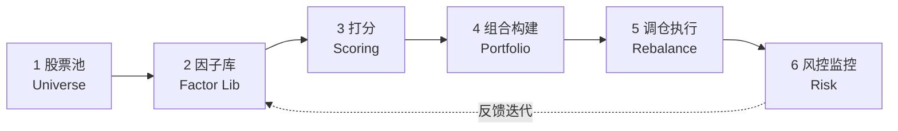
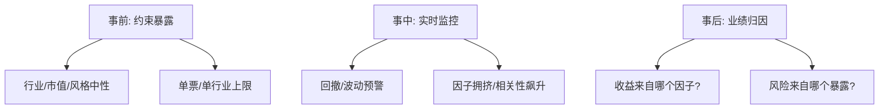

# 多因子量化指南

> [!note] 完整指南
> 这篇是**端到端施工图**：从一张空白的策略画布出发，一步步搭出一套能跑的多因子选股系统。链路是固定的——**股票池 → 因子库 → 打分 → 组合 → 调仓 → 风控**。每一步都给出"要做什么、怎么做、容易错在哪"。

## 一、全流程鸟瞰



> [!tip] 先记住这条链
> 后面每一节就是把这张图的一个方块拆开讲。任何一个环节偷工减料，下游都会被放大——**垃圾进，垃圾出**。

把六步浓缩成一张速查表：

| 步骤 | 核心产出 | 一句话目标 | 高频坑 |
|------|------|------|------|
| 1 股票池 | 可投资股票集合 | 干净、可交易、无未来信息 | 用了已退市/已知成分的偏差 |
| 2 因子库 | 标准化后的因子矩阵 | 有逻辑、经过清洗的因子 | 极值/缺失/未中性化 |
| 3 打分 | 每只票的综合得分 | 把多因子合成一个分 | 权重拍脑袋、方向搞反 |
| 4 组合构建 | 目标持仓权重 | 收益与风险的最优平衡 | 过度优化、约束缺失 |
| 5 调仓执行 | 交易指令 | 低成本落地目标组合 | 换手过高、滑点失控 |
| 6 风控监控 | 风险暴露与预警 | 守住回撤、控制暴露 | 只在事后看，不做事前约束 |

## 二、第 1 步：股票池（Universe）

### 要做什么
确定"在哪些股票里选"。这是地基，决定了策略的容量与风格基调。

### 怎么做
- **基础范围**：如沪深 300 / 中证 500 / 中证 800 / 全 A 等。
- **可交易性过滤**：剔除停牌、一字涨跌停（当日无法成交）、上市未满 N 个交易日的次新股。
- **风险剔除**：ST/\*ST、被立案调查、流动性极差（日均成交额过低）的标的。

> [!warning] 股票池里的两大偏差
> - **生存偏差**：只用"现在还活着"的股票回测，会高估收益。**回测要用历史时点真实存在的成分股（point-in-time）**。
> - **前视偏差**：用了"事后才知道"的指数成分调整。调入/调出要按当时的真实生效日。

## 三、第 2 步：因子库（Factor Library）

### 要做什么
准备一批有经济逻辑、清洗干净、可比较的因子。

### 因子大类（示例）

| 大类 | 代表因子 | 直觉 |
|------|------|------|
| 价值 | PE、PB、PS、股息率 | 买得便宜 |
| 成长 | 营收/净利增速、ROE 趋势 | 公司在变好 |
| 质量 | ROE、毛利率、负债率 | 是不是好公司 |
| 动量/反转 | 过去 N 月收益、短期反转 | 趋势 or 超跌 |
| 波动/风险 | 波动率、Beta | 低波异象 |
| 流动性 | 换手率、AmihL 非流动性 | 流动性溢价 |

### 因子预处理流水线（关键）


预处理三件套：

1. **去极值**：用 MAD 或分位数法把异常值拉回边界，防止个别极端值绑架整列。
2. **标准化**：转成均值 0、标准差 1 的 Z-Score，让不同量纲的因子可加总。
3. **中性化**：对行业哑变量与市值回归取残差，剥离行业/规模的干扰（呼应 [[多因子策略核心原理]] 的正交化思想）。

> [!note] 缺失值怎么办
> 行业中位数填充是常见做法；缺失过多的因子或股票当期剔除。**切忌用全样本均值填充**——那会引入跨期的未来信息。

## 四、第 3 步：打分（Scoring）

### 要做什么
把多个因子合成**一个**可排序的综合得分。

### 两种主流打分方式

| 方式 | 做法 | 特点 |
|------|------|------|
| **打分法（排序）** | 每个因子按分位打分，再加权求和 | 稳健、抗异常值，最常用 |
| **回归法（预测）** | 用因子值回归预测下期收益，取预测值排序 | 信息利用充分，但易过拟合 |

综合得分的一般形式：

$$
\text{Score}_i = \sum_{k=1}^{K} w_k \cdot \tilde z_{i,k}
$$

其中 $\tilde z_{i,k}$ 是股票 $i$ 在因子 $k$ 上预处理后的标准分，$w_k$ 是因子权重。

> [!tip] 方向一定要统一
> 合成前务必把所有因子调成"**越大越好**"。比如 PE 是"越小越好"，要先取倒数或乘 $-1$，否则等于把好因子反着用。
> 权重 $w_k$ 怎么定（等权 / IC 加权 / IC_IR 加权 / 最大化 IC / 回归法）是另一个大话题，详见 [[多因子策略深度解析]]。

## 五、第 4 步：组合构建（Portfolio Construction）

### 要做什么
把"得分高的股票"变成"实际的持仓权重"。从一列分数到一张持仓表，中间隔着**风险与约束**。

### 三种思路

| 方法 | 做法 | 适用 |
|------|------|------|
| **分层/Top-N 等权** | 取得分前 N 名等权或市值加权 | 简单透明，适合起步 |
| **分层 + 行业配平** | 各行业内选 Top，保持行业中性 | 控制行业偏离 |
| **优化器（MVO 等）** | 最大化得分、约束风险与暴露 | 精细但需防过拟合 |

带约束的组合优化通用形式：

$$
\max_{\mathbf{w}} \;\; \mathbf{w}^\top \boldsymbol{\alpha} \;-\; \lambda\, \mathbf{w}^\top \Sigma\, \mathbf{w}
$$

$$
\text{s.t.}\quad \sum_i w_i = 1,\;\; 0 \le w_i \le w_{\max},\;\; |\,\mathbf{w}-\mathbf{w}_{bench}\,|_{\text{行业}} \le \delta
$$

- 第一项是预期收益（得分），第二项是风险惩罚，$\lambda$ 是风险厌恶系数。
- 常见约束：单票上限、行业偏离上限、换手率上限、风格暴露上限。

> [!warning] 优化器是把双刃剑
> 协方差矩阵 $\Sigma$ 估计噪声大时，优化器会把权重押到"看起来风险最低"的角落，结果**对估计误差极度敏感**。起步阶段，**分层等权往往比花哨的优化更稳**。

## 六、第 5 步：调仓执行（Rebalance）

### 要做什么
按既定节奏，把当前持仓调整到目标组合，并尽量压低交易成本。

| 决策项 | 常见选择 | 权衡 |
|------|------|------|
| 调仓频率 | 月度 / 双周 / 季度 | 频率高→信号新鲜但成本高 |
| 换手控制 | 设单期换手上限、缓冲带 | 减少无谓交易 |
| 成本建模 | 佣金+印花税+滑点 | 回测必须扣，否则虚高 |
| 执行方式 | 开盘/收盘/VWAP 分批 | 降低冲击成本 |

> [!important] A 股的硬约束
> **T+1**（当天买入次日才能卖）、**涨跌停**（停板时无法成交）、**印花税**（卖出单边收取）都会实打实吃掉收益。回测里若不扣这些，**纸面收益会被严重高估**。

> [!tip] 缓冲带降换手
> 不要每期把组合推倒重来。设"缓冲带"：得分掉出 Top-N 但仍在 Top-1.5N 内的持仓暂不卖出。**能显著降低换手与成本，且对收益影响很小**。

## 七、第 6 步：风控与监控（Risk）

### 要做什么
事前约束暴露、事中监控、事后归因，三层闭环。



### 因子评估体系（贯穿始终）

无论上线前还是上线后，都用同一套指标体检因子：

| 维度 | 指标 | 标准（经验值，示例） |
|-----|------|------|
| 预测力 | IC | >0.03 |
| 稳定性 | IC标准差 / ICIR | ICIR 越大越好 |
| 收益性 | 分层收益 | 显著且单调 |
| 容量性 | 换手率 | 适中 |
| 鲁棒性 | 参数敏感性 | 低敏感 |

> [!note] 风控不是上线后才做的事
> 最好的风控发生在**组合构建阶段**（第 4 步的约束）。等回撤发生了再砍仓，往往已是被动止损。**事前中性化 + 事中监控 + 事后归因**，缺一不可。

## 八、把六步串成一段伪代码

```python
# 端到端多因子选股骨架（示意，非完整可运行）
def run_multi_factor(date):
    # 1. 股票池：point-in-time，剔除停牌/ST/次新
    universe = get_universe(date)

    # 2. 因子库：取原始值 -> 去极值 -> 标准化 -> 中性化
    factors = load_factors(universe, date)
    factors = winsorize(factors)
    factors = zscore(factors)
    factors = neutralize(factors, by=["industry", "market_cap"])

    # 3. 打分：方向对齐后加权合成
    factors = align_direction(factors)          # 统一“越大越好”
    score = (factors * factor_weights).sum(axis=1)

    # 4. 组合构建：Top-N + 行业配平（起步用等权）
    target_w = build_portfolio(score, top_n=50, industry_neutral=True)

    # 5. 调仓：对比现有持仓，加缓冲带降换手，扣成本
    orders = rebalance(current_holdings(date), target_w, buffer=0.5)

    # 6. 风控：检查暴露/换手是否越界，记录用于事后归因
    risk_check(target_w, limits=RISK_LIMITS)
    return orders
```

> [!tip] 落地顺序建议
> **先把最简版本跑通**（固定股票池 + 3~5 个因子等权 + Top-N 等权 + 月度调仓 + 扣成本），确认链路无误、无未来函数，**再**逐步加因子、加权重优化、加约束。先求"对"，再求"优"。

## 九、常见误区与风险

> [!warning] 搭系统时最常见的翻车点
> 1. **跳过预处理直接打分**：不去极值/不中性化，得分被极端值和行业偏离主导。
> 2. **股票池含未来信息**：用当前成分股回测历史，生存偏差让曲线虚高。
> 3. **回测不扣成本与冲击**：忽略佣金、印花税、滑点、T+1，实盘立刻打回原形。
> 4. **一上来就上优化器**：协方差估计不稳，优化结果对噪声极敏感，不如先分层等权。
> 5. **换手失控**：每期推倒重来，收益全被交易成本吃掉——加缓冲带。
> 6. **只做事后风控**：风险应在组合构建时约束，而非回撤后被动止损。
> 7. **过度拟合权重**：在历史上调出"完美权重"，样本外即失效——权重要稳健、可解释。

> [!important] 一句话收尾
> 多因子系统的竞争力，**七分在工程纪律（无未来函数、扣成本、控换手），三分在因子本身**。把这条六步链路每一环都做扎实，比挖出一个"神因子"更可靠。

## 相关链接

- [[多因子策略核心原理]]
- [[多因子策略实战]]
- [[多因子策略深度解析]]
- [[多因子模型详解]]
- [[Fama-French实战指南]]
- [[因子构建方法]]
- [[因子检验与评价]]
- [[组合构建方法]]
- [[风险管理框架]]
- [[目录|量化策略总览]]

## 实战掌握清单

> [!tip] 交易者视角
> 多因子量化指南 的学习重点不是记住术语，而是把它放进研究、组合、执行和复盘的闭环。量化策略必须从清晰假设出发，经过数据验证、成本测算、风险控制和实盘监控，才可能成为可持续系统。

### 关键判断

- 写清楚收益来自动量、反转、价值、套利、波动率、流动性还是行为偏差。
- 确认信号、过滤器、入场、退出、仓位和风控。
- 看收益是否集中在少数时期、少数品种或少数参数。

### 落地动作

1. 做样本外、滚动窗口和参数扰动测试。
2. 把手续费、滑点、冲击成本、容量和失败交易纳入报告。
3. 上线后监控成交质量、信号衰减、回撤和异常订单。

### 失效边界

- 过拟合。
- 策略容量不足。
- 市场结构变化后没有停止机制。

### 复盘问题

- 这项知识改变了哪一个具体决策：标的、方向、仓位、退出、对冲还是不交易？
- 如果判断相反，最大亏损、最长恢复期和退出触发条件是什么？
- 有没有一个更简单的基准方法可以取得相近结果？
