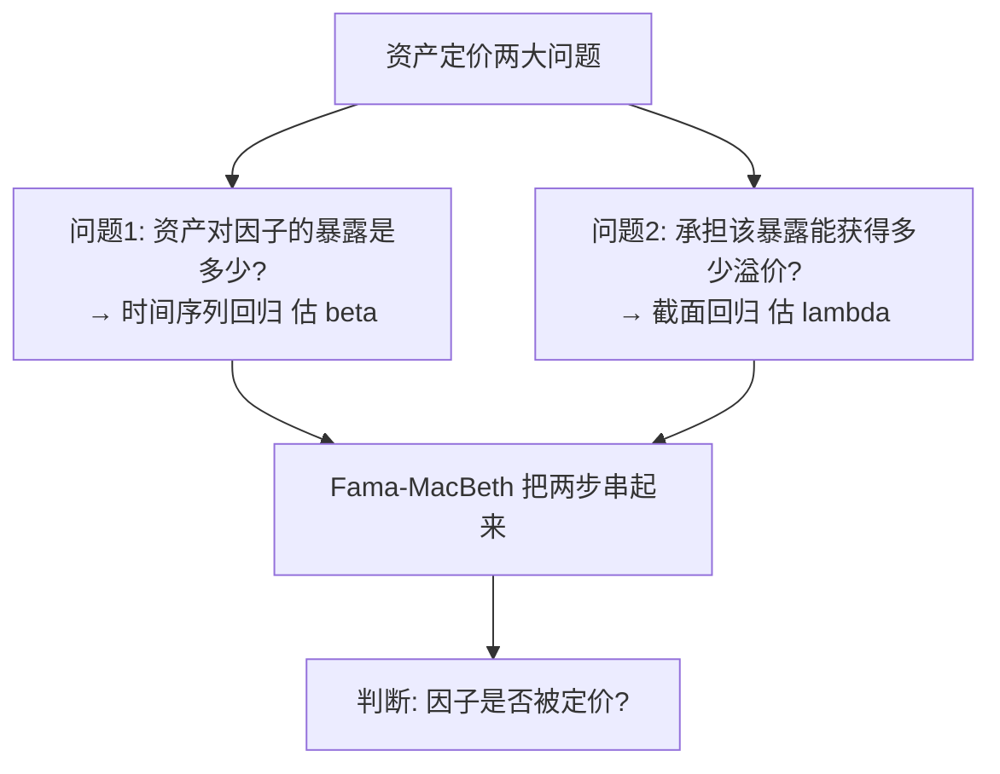
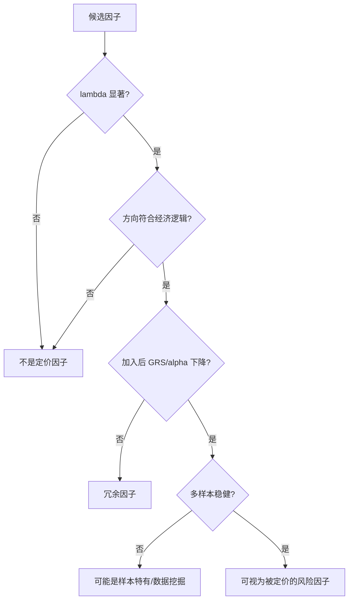

# 资产定价研究方法论

> [!note] 研究方法论
> 资产定价是金融学的核心：研究"承担什么风险、应获得多少回报"。本文系统梳理实证资产定价的三大主力方法——**时间序列回归、Fama-MacBeth 截面回归、GRS 联合检验**，并讲清那个终极判断逻辑：**一个因子到底有没有被市场"定价"？**

## 一、两个根本问题，两类回归

实证资产定价绕不开两个问题，它们分别对应两类回归：



| 回归类型 | 回归对象 | 估计什么 | 回答的问题 |
|---------|---------|---------|-----------|
| 时间序列回归 | 每个资产的收益对因子序列 | 因子载荷 $\beta$ 与截距 $\alpha$ | 暴露多少？有无定价误差？ |
| 截面回归 | 某时点各资产收益对其 $\beta$ | 因子风险溢价 $\lambda$ | 多承担一单位暴露能多赚多少？ |

> [!important] 核心区分
> **β（载荷）和 λ（溢价）是两回事**。β 是"这只股票随因子波动多少"（敏感度）；λ 是"市场愿意为承担一单位该因子风险支付多少回报"（价格）。一个因子被"定价"，要求它的 **λ 显著不为零**。

## 二、方法一：时间序列回归

对每个资产（或组合）跑：

$$
R_{i,t} - R_{f,t} = \alpha_i + \sum_k \beta_{i,k} F_{k,t} + \varepsilon_{i,t}
$$

### 用途与判读

- 估出各资产的因子载荷 $\beta_{i,k}$；
- 截距 $\alpha_i$ 是**定价误差**：若模型完整，所有 $\alpha_i$ 应联合等于 0；
- 单个资产 $\alpha$ 显著 ≠ 0，说明该模型没能完全解释它的收益（业绩归因里这就是"真 alpha"，见 [[Fama-French实战指南]]）。

> [!tip] 关键直觉
> 时间序列回归的截距 $\alpha$ 就是"模型解释不了的超额收益"。检验一个因子模型好不好，核心就是看它能否把一批测试资产的 $\alpha$ 全部压到统计上为零——这正是 GRS 检验要做的事。

## 三、方法二：Fama-MacBeth 截面回归

Fama-MacBeth（1973）是检验"因子是否被定价"的经典两步法。


### 三步详解

**第一步**：时序回归估每个资产的 $\hat\beta_i$（同方法一）。

**第二步**：在**每一个时点 $t$**，用当期横截面收益对上一步的 $\hat\beta_i$ 回归：

$$
R_{i,t} = \gamma_{0,t} + \lambda_t\,\hat\beta_i + \eta_{i,t}
$$

每期得到一个溢价估计 $\lambda_t$。

**第三步**：对时间序列 $\{\lambda_t\}$ 求均值与标准误，做 t 检验：

$$
\hat\lambda = \frac{1}{T}\sum_{t=1}^{T}\lambda_t,\qquad t(\hat\lambda) = \frac{\hat\lambda}{\,\mathrm{std}(\lambda_t)/\sqrt{T}\,}
$$

> [!note] Fama-MacBeth 的精妙之处
> 它把"逐期截面溢价"当成一个时间序列样本，用其波动直接算标准误——**天然处理了截面相关性**。这是它流行半个世纪的原因。注意第一步估计的 β 有误差，会传导到第二步（**误差累积问题 / EIV**），实务中常用组合（而非个股）做测试资产来缓解。

```python
import statsmodels.api as sm
import pandas as pd

# 假设已完成第一步，betas: index=资产, columns=各因子beta
lambdas = []
for t, cross in returns.groupby("date"):          # 逐期截面
    merged = cross.merge(betas, on="asset")
    X = sm.add_constant(merged[factor_betas])      # 用 beta 作自变量
    res = sm.OLS(merged["ret"], X).fit()
    lambdas.append(res.params)                     # 当期 gamma0 与各 lambda
lam = pd.DataFrame(lambdas)
# 第三步：均值 / (std/sqrt(T)) 得 t 值
t_stats = lam.mean() / (lam.std() / len(lam) ** 0.5)
print(t_stats)
```

## 四、方法三：GRS 联合检验

GRS（Gibbons-Ross-Shanken，1989）检验一个因子模型的**整体定价能力**：所有测试资产的时序回归截距 $\alpha_i$ 是否**联合**为零。

$$
H_0:\ \alpha_1 = \alpha_2 = \cdots = \alpha_N = 0
$$

GRS 统计量（服从 F 分布）直观形式：

$$
GRS = \frac{T-N-K}{N}\cdot\frac{\hat\alpha'\,\hat\Sigma^{-1}\,\hat\alpha}{1 + \bar{f}'\,\hat\Omega^{-1}\,\bar{f}} \sim F(N,\,T-N-K)
$$

其中 $N$ 为测试资产数、$K$ 为因子数、$T$ 为期数、$\hat\alpha$ 为截距向量。

| GRS 结果 | 含义 |
|---------|------|
| 不显著（不能拒绝 $H_0$） | 截距整体为零，**模型定价较成功** |
| 显著（拒绝 $H_0$） | 存在未被解释的定价误差，**模型不完整** |

> [!important] GRS 的判读反直觉
> 和一般检验不同，做因子模型时我们**希望 GRS 不显著**（拒绝不了"截距全为零"），因为那意味着模型把测试资产的超额收益都解释干净了。比较两个模型时，GRS 统计量更小、$\bar{|\alpha|}$ 更低的那个更优。

> [!tip] 三方法如何配合
> 典型实证套路：先用**时序回归**估 β 并看个体 α；再用 **GRS** 看模型整体能否压平所有 α；最后用 **Fama-MacBeth** 检验各因子溢价 λ 是否显著为正。三者从不同角度回答"模型好不好、因子是否被定价"。

## 五、组合排序法（构造测试资产）

回归需要"测试资产"，最常用的是按特征排序构造的组合。

| 排序方式 | 做法 | 用途 |
|---------|------|------|
| 单变量排序 | 按一个特征（如 B/M）分 5/10 组 | 看该特征的单调收益模式 |
| 双变量独立排序 | 两特征各自分组再交叉 | 控制一个看另一个（如 5×5=25 组合） |
| 双变量条件排序 | 先按 A 分组、组内再按 B 分组 | 强控制 A 的影响 |

> [!example] 经典测试资产（示例）
> Fama-French 常用 **25 个 Size×B/M 组合** 作为测试资产：5 档市值 × 5 档 B/M。若一个因子模型号称完整，就应该能把这 25 个组合的 α 全部解释为零——GRS 检验的就是这件事。

## 六、终极判断逻辑：一个因子"被定价"了吗？

> [!important] 判定清单
> 一个因子要被认定为"被市场定价的风险因子"，通常需要同时满足：
> 1. **溢价显著**：Fama-MacBeth 的 $\lambda$ 显著不为零（t 值够大）。
> 2. **方向合理**：溢价符号与经济逻辑一致（如承担风险者获正回报）。
> 3. **提升定价**：加入该因子后，测试资产的 GRS / 平均 |α| 明显下降。
> 4. **稳健**：在不同样本期、不同测试资产、不同地区都成立。
> 5. **有经济解释**：能讲清它代表何种系统性风险，而非纯数据挖掘。



## 七、标准研究流程

1. **文献回顾**：了解已有因子与异象，避免重复造轮子。
2. **数据准备**：清洗、对齐、防前视/幸存者偏差（见 [[Fama-French数据处理]]）。
3. **因子构建**：分组、市值加权计算因子序列（见 [[因子构建方法]]）。
4. **实证检验**：时序回归 + 截面回归 + GRS。
5. **稳健性检验**：换样本期、换测试资产、换标准误（Newey-West）、控制已知因子。
6. **经济解释**：给出风险或行为层面的解释（见 [[因子检验与评价]]）。

## 八、常用工具

| 语言 | 常用库 | 适用 |
|------|-------|------|
| Python | statsmodels、pandas、linearmodels | 时序/截面回归、Fama-MacBeth |
| R | plm、sandwich、lmtest | 面板与稳健标准误 |
| Stata | reg、xtreg、asreg | 经典学术工作流 |

> [!tip] 实用提醒
> Python 的 `linearmodels.FamaMacBeth` 可一行完成 Fama-MacBeth；`statsmodels` 配 `cov_type="HAC"` 做 Newey-West 稳健标准误。但工具只是手段，**正确的检验逻辑和干净的数据**才是结论可信的根本。

## 九、常见误区与风险

> [!warning] 方法论六大坑
> 1. **数据挖掘 / p-hacking**：试足够多因子总能找到"显著"的，必须用样本外与多重检验校正。
> 2. **EIV 误差累积**：第一步 β 估计误差传到第二步，用组合做测试资产、用足够长样本缓解。
> 3. **忽略稳健标准误**：不做 Newey-West/Shanken 校正会让 t 值虚高、结论过度自信。
> 4. **GRS 判读反了**：误以为"显著=好"，实际做模型时希望它不显著。
> 5. **混淆 β 与 λ**：把"暴露大"当成"溢价高"，二者无必然关系。
> 6. **只看样本内**：样本内显著的因子可能样本外完全失效，务必跨期/跨市场验证。

> [!important] 终极风险提示
> 统计显著 ≠ 经济上真实存在。一个因子在历史数据里"被定价"，不保证未来依旧；因子拥挤、结构变化、制度差异都会改变结论。资产定价研究的价值在于**逼近真相的严谨过程**，而非给出永恒的"赚钱公式"。

## 相关链接

- [[Fama-French三因子模型]]
- [[Fama-French五因子模型]]
- [[Fama-French数据处理]]
- [[Fama-French实战指南]]
- [[因子检验与评价]]
- [[../目录|量化策略总览]]
