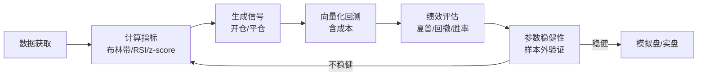
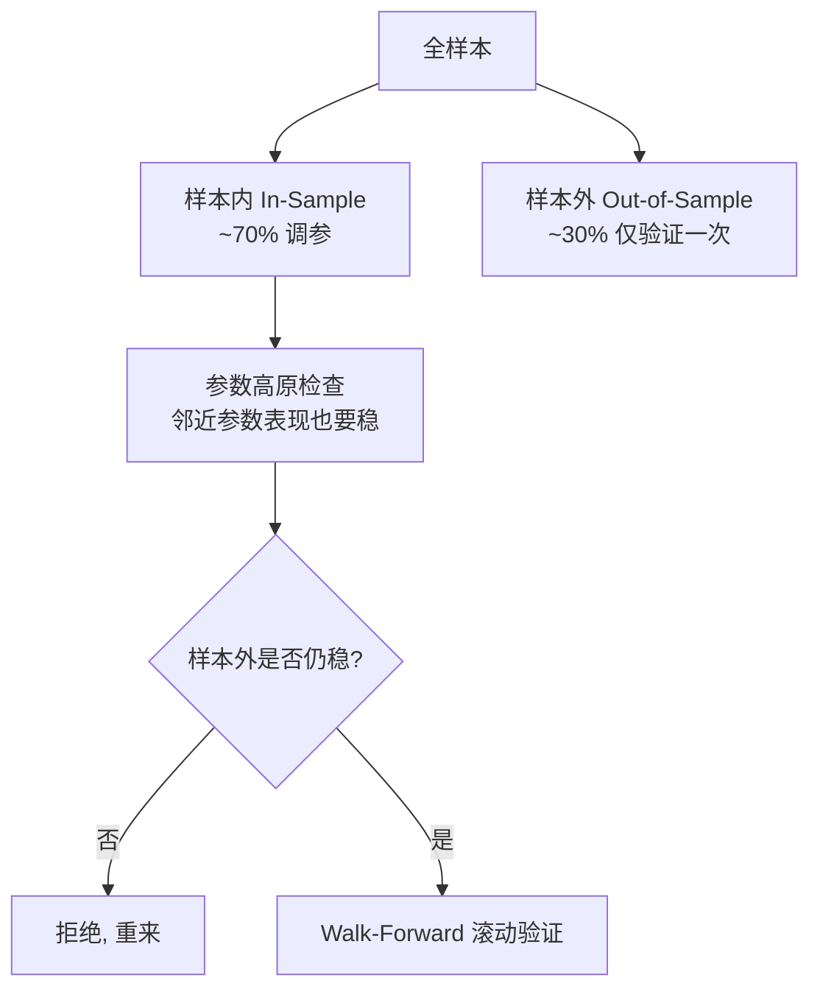

# 均值回归Python实战

> [!note] Python实现
> 本文给出**单资产**均值回归策略的端到端 Python 实战：从数据获取、信号生成（布林带 / RSI / z-score）、向量化回测，到参数选择与过拟合防范。代码以"可运行骨架"为目标，便于直接改造。理论根基见 [[均值回归策略基础]]，多资产对冲版见 [[均值回归配对交易]]。

## 一、整体流程



> [!important] 三条铁律
> 1. 信号用 `shift(1)` 延后一根再参与收益，**杜绝未来函数**。
> 2. 一切绩效**必须扣除手续费与滑点**，否则高频小利是幻觉。
> 3. 参数必须在**样本外**还能用，样本内最优毫无意义。

## 二、数据获取

```python
import yfinance as yf
import numpy as np
import pandas as pd

# 获取股票数据（示例标的，可替换为 A 股/ETF 数据源）
data = yf.download('AAPL', start='2018-01-01', end='2025-01-01', auto_adjust=True)
px = data['Close'].dropna()          # 使用后复权收盘价，避免分红/拆股造成假跳空
ret = px.pct_change()                # 日收益，后续回测复用
```

> [!warning] 数据三大坑
> - **未复权价格**：分红除权会造成"假跳空"，污染均线与价差，务必用后复权。
> - **幸存者偏差**：只回测当前还活着的股票，会高估收益（退市的最惨案例被剔除了）。
> - **停牌/缺失**：直接 `dropna` 可能错位，必要时按交易日历对齐。

## 三、计算技术指标

```python
def add_indicators(df, win=20, k=2.0, rsi_win=14):
    out = df.to_frame('Close').copy()
    # --- 布林带 ---
    out['SMA']   = out['Close'].rolling(win).mean()
    out['Std']   = out['Close'].rolling(win).std()
    out['Upper'] = out['SMA'] + k * out['Std']
    out['Lower'] = out['SMA'] - k * out['Std']
    # --- z-score（与布林带同源：z 即"偏离几个标准差"）---
    out['Z'] = (out['Close'] - out['SMA']) / out['Std']
    # --- RSI（Wilder 平滑）---
    delta = out['Close'].diff()
    gain = delta.clip(lower=0).ewm(alpha=1/rsi_win, adjust=False).mean()
    loss = (-delta.clip(upper=0)).ewm(alpha=1/rsi_win, adjust=False).mean()
    rs = gain / loss
    out['RSI'] = 100 - 100 / (1 + rs)
    return out

ind = add_indicators(px)
```

布林带与 z-score 本质同源——布林带的"上/下轨"就是 $z=\pm k$ 的等价表达：

$$
\text{Upper/Lower} = \mu_t \pm k\,\sigma_t \quad\Longleftrightarrow\quad z_t=\frac{P_t-\mu_t}{\sigma_t}=\pm k
$$

| 指标 | 偏离度量 | 优点 | 缺点 |
|------|---------|------|------|
| 布林带 | 距中轨标准差倍数 | 自适应波动率 | 趋势市频繁假突破 |
| z-score | 同上（连续值） | 阈值可跨品种复用 | 同布林带，依赖窗口 |
| RSI | 涨跌动能比 | 不依赖价格量纲 | 强趋势中钝化（长期超买/超卖） |

## 四、生成交易信号

三种信号可单用，也可"与"在一起做多重确认（提高质量、降低频率）。

```python
def gen_signal(df, z_entry=2.0, z_exit=0.5, rsi_low=30, rsi_high=70, mode='z'):
    """返回目标仓位 position ∈ {+1, 0, -1}，并做持仓状态机处理"""
    pos = pd.Series(0, index=df.index, dtype=float)

    if mode == 'z':                       # z-score / 布林带回归
        long_in  = df['Z'] <= -z_entry
        short_in = df['Z'] >=  z_entry
        flat     = df['Z'].abs() <= z_exit
    elif mode == 'rsi':                   # RSI 超买超卖
        long_in  = df['RSI'] < rsi_low
        short_in = df['RSI'] > rsi_high
        flat     = (df['RSI'] > 45) & (df['RSI'] < 55)
    elif mode == 'combo':                 # 多重确认：z 与 RSI 同时极端
        long_in  = (df['Z'] <= -z_entry) & (df['RSI'] < rsi_low)
        short_in = (df['Z'] >=  z_entry) & (df['RSI'] > rsi_high)
        flat     = df['Z'].abs() <= z_exit

    # 状态机：触发开仓后持有，直到触发平仓；避免逐根反复抖动
    state = 0
    out = []
    for i in range(len(df)):
        if state == 0:
            if long_in.iloc[i]:  state = 1
            elif short_in.iloc[i]: state = -1
        else:
            if flat.iloc[i]: state = 0
        out.append(state)
    pos[:] = out
    return pos

position = gen_signal(ind, mode='z')
```

> [!tip] 平仓阈值 ≠ 开仓阈值
> 用"开仓 ±2、平仓 ±0.5"的**滞回（hysteresis）**设计，而不是同一根线既开又平。否则价格在阈值附近抖动会触发大量无意义的反复交易，成本爆炸。`z_exit` 也可设为 0（回到中枢才平），需用回测取舍。

## 五、向量化回测（含成本）

```python
def backtest(price, position, fee=0.0005, slip=0.0005):
    """
    price: 收盘价 Series; position: 目标仓位(+1/0/-1)
    fee, slip: 单边手续费、滑点（示例：各 5bp）
    """
    ret = price.pct_change().fillna(0)
    pos = position.shift(1).fillna(0)            # 关键：信号延后一根，杜绝未来函数
    turnover = pos.diff().abs().fillna(0)        # 仓位变动 = 换手
    cost = turnover * (fee + slip)               # 每次调仓的成本
    strat_ret = pos * ret - cost                 # 扣成本后的策略日收益
    equity = (1 + strat_ret).cumprod()
    return pd.DataFrame({'ret': strat_ret, 'equity': equity,
                         'pos': pos, 'bench': (1 + ret).cumprod()})

bt = backtest(ind['Close'], position)
```

## 六、绩效评估

```python
def performance(strat_ret, freq=252):
    r = strat_ret.dropna()
    cum = (1 + r).prod() - 1
    ann = (1 + r).prod() ** (freq / len(r)) - 1
    vol = r.std() * np.sqrt(freq)
    sharpe = ann / vol if vol > 0 else np.nan
    eq = (1 + r).cumprod()
    mdd = (eq / eq.cummax() - 1).min()
    win = (r[r != 0] > 0).mean()
    return pd.Series({'累计收益': cum, '年化': ann, '年化波动': vol,
                      '夏普': sharpe, '最大回撤': mdd, '胜率': win})

print(performance(bt['ret']))
```

| 指标 | 含义 | 经验参考（示例/假设） |
|------|------|----------------------|
| 年化收益 | 复利年化 | 视市场而定，别只看这个 |
| 夏普比率 | 单位风险收益 | 扣成本后 > 1 已不易 |
| 最大回撤 | 峰值到谷值最大跌幅 | 能否承受决定能否坚持 |
| 胜率 | 盈利交易占比 | 回归策略常高胜率、低赔率 |
| 换手率 | 调仓频繁度 | 越高越受成本拖累 |

> [!note] 高胜率 ≠ 高收益
> 均值回归典型是"高胜率、低赔率"：经常赚小钱，偶尔（趋势失控时）亏大钱。务必同时看**最大回撤**和**盈亏比**，否则会被漂亮的胜率欺骗。

## 七、参数选择与过拟合防范

核心参数与影响：

| 参数 | 说明 | 典型值（示例） | 调大的影响 |
|------|------|---------------|-----------|
| 回望窗口 `win` | 均值/标准差周期 | 20 日 | 信号更平滑、更滞后 |
| 标准差倍数 `k` | 布林带/z 阈值 | 2 | 信号更少、更极端 |
| RSI 阈值 | 超买超卖线 | 30 / 70 | 收窄则信号更少 |
| 止损/止盈 | 硬风控线 | -5% / z≥3.5 离场 | 影响尾部风险 |
| 半衰期 | 决定窗口与持仓时长 | 由数据估计 | 见 [[均值回归策略基础]] |

> [!warning] 过拟合：回测最危险的幻觉
> 在历史上不断调参，直到资金曲线"完美"，是自欺欺人。表现完美的参数往往是**拟合了噪声**，样本外立刻失效。

防范手段：



- **样本内/外切分**：仅在样本内调参，样本外只验证一次，提前看就等于偷看答案。
- **参数高原 > 参数尖峰**：选"周围一片参数都不错"的稳健区，而非孤立的最优点。
- **Walk-Forward**：滚动地"训练—验证"，更贴近真实滚动交易。
- **现实约束**：永远扣成本、考虑容量与流动性，警惕幸存者偏差。

```python
def split_oos(df, ratio=0.7):
    n = int(len(df) * ratio)
    return df.iloc[:n], df.iloc[n:]   # 仅在前段调参, 后段一次性验证
```

> [!example] 稳健性自查清单
> 1. 换个标的/时间段，逻辑是否仍成立？
> 2. 窗口 ±5、阈值 ±0.5，夏普是否平滑而非雪崩？
> 3. 成本翻倍，策略是否还活着？
> 4. 去掉表现最好的一年，结论是否反转？
> 若任一条让策略崩溃，多半是过拟合。系统化方法见 [[回测方法论]] 与 [[风险管理框架]]。

## 八、常见误区与风险

> [!warning] 实战五大坑
> 1. **未来函数**：用当根收盘价信号交易当根收盘价收益 → 回测虚高，实盘崩。务必 `shift(1)`。
> 2. **不计成本**：高频反向交易的手续费/滑点会吞掉微利，"纸面稳赚"上盘即亏。
> 3. **趋势市硬抄底**：单边行情里 z 一直为负，越买越亏（"接飞刀"）。需用 ADX 等做状态过滤。
> 4. **静态均值**：全样本固定均值忽视漂移，应滚动估计。
> 5. **过拟合参数**：样本内完美、样本外失效，必须 OOS 验证。

## 相关链接

- [[均值回归策略基础]]
- [[均值回归配对交易]]
- [[目录|量化策略总览]]
- [[布林带]]
- [[RSI]]
- [[回测方法论]]
- [[风险管理框架]]

## 课程化学习补充

> [!important] 学习定位
> 量化策略是投资假设、数据工程、回测验证、风险预算和执行系统的组合，不是单一公式。本文仅用于学习、研究与复盘，不构成任何投资建议。

### 必须掌握的问题

- 假设是否可证伪
- 数据是否 point-in-time
- 绩效是否扣除真实成本
- 上线后是否监控衰减

### 实战应用流程

1. 先写清楚你的投资假设：为什么这个信号、资产或方法应该产生收益。
2. 明确数据口径：样本范围、更新时间、复权/分红/停牌处理和交易日历。
3. 做最小可行验证：先用简单规则验证方向，再逐步加入复杂模型。
4. 把成本和约束前置：手续费、滑点、冲击成本、保证金、流动性和容量都要进入测算。
5. 上线后持续复盘：记录信号、下单、成交、持仓、回撤和失效原因。

### 风险与失效条件

- 数据挖掘偏差
- 因子拥挤
- 换手过高
- 实盘偏离回测

### 复盘问题

- 这笔交易或这套模型赚的是什么钱：风险补偿、行为偏差、流动性溢价，还是偶然噪音？
- 如果市场环境反过来，最大亏损和最长恢复期会是多少？
- 当前结论是否依赖某个不可持续假设，例如低利率、低波动、充裕流动性或监管套利？
- 有没有一个更简单的基准策略能取得接近效果？

### 延伸学习

- [[量化投资完全指南]]
- [[回测质量门清单]]
- [[市场微观结构与交易执行]]
- [[量化风险管理体系]]
