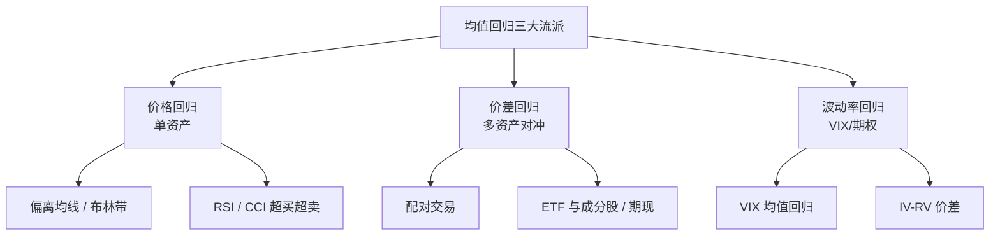
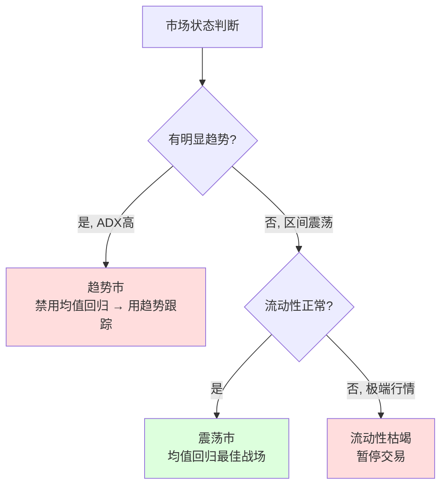

# 均值回归策略基础

> [!note] 均值回归
> 均值回归（Mean Reversion）策略假设资产价格围绕其某个"中枢"波动，当价格显著偏离中枢时，倾向于回归。它与趋势跟踪是量化择时的两大对立流派：趋势跟踪赌"偏离会延续"，均值回归赌"偏离会修复"。本文聚焦**理论根基**，把"为什么会回归、回归有多快、什么时候别信回归"讲透。

## 一、核心直觉：橡皮筋与小狗

把价格想象成被橡皮筋拴在木桩上的小狗。小狗（价格）可以乱跑（受情绪、消息驱动），但橡皮筋（基本面/统计中枢）会把它拉回木桩附近。

- **拉得越远，回拉的力越大** → 偏离越极端，反转概率与幅度越高。
- **木桩本身会移动** → 中枢（均值）不是常数，会随基本面漂移，这是策略最大的暗礁。
- **橡皮筋可能断** → 一旦基本面真正改变（关系破裂），价格不再回归，而是奔向新中枢。

> [!tip] 一句话总结
> 均值回归赚的是"情绪过度反应被修正"的钱，而不是"价值长期增长"的钱。它本质上是在**做空波动、做多收敛**。

## 二、理论根基

### 1. 过度反应假说（Overreaction）

行为金融学（De Bondt & Thaler 等的"赢家—输家"研究方向）指出：投资者面对新信息时常常**反应过度**，把短期冲击外推成长期趋势，导致价格短暂超调（overshoot），随后被理性资金纠正。均值回归正是捕捉这段"超调 → 纠正"的过程。


### 2. 短期噪声 vs 长期价值

价格可分解为"价值成分 + 噪声成分"：

$$
P_t = V_t + \varepsilon_t
$$

其中 $V_t$ 是缓慢变化的价值（趋势/中枢），$\varepsilon_t$ 是均值为零、会被修复的噪声。均值回归策略本质上是在**估计并交易 $\varepsilon_t$**，赌它回到 0。难点在于：噪声和价值的真实变化在事前难以区分。

### 3. 行为驱动力

| 行为偏误 | 如何制造偏离 | 为何会回归 |
|---------|-------------|-----------|
| 羊群效应 | 跟风买卖放大短期波动 | 跟风资金耗尽后反转 |
| 锚定效应 | 过度参照近期价格 | 锚点被基本面纠正 |
| 处置效应 | 急于止盈、死扛亏损 | 抛压/承接错配后修复 |
| 流动性冲击 | 大单冲击瞬时打偏价格 | 做市/套利者填平价差 |

### 4. Ornstein–Uhlenbeck 过程（数学骨架）

均值回归在连续时间下的标准刻画是 **O-U 过程**，它是一个"带回拉力的随机游走"：

$$
dX_t = \theta\,(\mu - X_t)\,dt + \sigma\,dW_t
$$

- $\mu$：长期均值（中枢，小狗的木桩）。
- $\theta>0$：**回归速度**，越大代表橡皮筋越紧，拉回越快。
- $\sigma$：波动强度。
- $W_t$：标准布朗运动（随机扰动）。

关键性质：漂移项 $\theta(\mu - X_t)$ 永远指向 $\mu$。当 $X_t>\mu$ 时为负（向下拉），当 $X_t<\mu$ 时为正（向上拉）。这就是"回归"的数学来源。与之对比，纯随机游走（趋势漂移恒定）没有这个回拉项，价格不会被拉回任何中枢。

> [!important] 趋势 vs 回归的分水岭
> 同一段时间序列，趋势跟踪假设它像**随机游走/带漂移**（无回拉），均值回归假设它像 **O-U 过程**（有回拉）。先用统计检验判断序列属于哪一类，再决定用哪种策略——这是不亏钱的第一步。

### 5. 半衰期（Half-life）：回归有多快

由 O-U 过程可推出价格修复一半偏离所需的时间——**半衰期**：

$$
t_{1/2} = \frac{\ln 2}{\theta}
$$

实务中 $\theta$ 通常用一阶自回归（AR(1)）估计。把离散化的 O-U 写成回归形式：

$$
\Delta X_t = \alpha + \beta\, X_{t-1} + \epsilon_t, \qquad \theta \approx -\beta
$$

于是半衰期 $t_{1/2} = -\dfrac{\ln 2}{\beta}$。

```python
import numpy as np
import statsmodels.api as sm

def half_life(series):
    """用 AR(1) 估计均值回归半衰期（单位：与数据频率一致，如'日'）"""
    s = series.dropna()
    lag = s.shift(1)
    delta = s - lag
    df = sm.add_constant(lag.dropna())
    beta = sm.OLS(delta.dropna(), df.loc[delta.dropna().index]).fit().params.iloc[1]
    return -np.log(2) / beta if beta < 0 else np.inf   # beta>=0 视为不回归

# 示例（假设数据）：half_life(spread) -> 约 12（日），说明约两周修复一半偏离
```

> [!tip] 半衰期是"持仓周期"的标尺
> 半衰期 ~5 日 → 适合日内/超短；~20 日 → 适合波段；若算出 $\theta\le 0$ 或半衰期长达数百日，说明序列**根本不回归**，应放弃该标的。半衰期还能用来设"止损时间"——超过 2~3 倍半衰期仍不回归，多半是关系出了问题。

## 三、三大策略类型



### 1. 价格均值回归（单资产）

最直接：赌单一标的价格回到自身均线。常用工具：

| 工具 | 偏离度量 | 入场逻辑 |
|------|---------|---------|
| 均线偏离 | $(P-MA)/MA$ | 乖离率过大反向 |
| 布林带 | 距中轨的标准差倍数 | 触下轨买、上轨卖 |
| RSI | 相对涨跌动能 | <30 超卖买、>70 超卖卖 |
| CCI | 价格相对统计区间 | ±100/±200 反向 |

> [!warning] 单资产回归的最大风险
> 单资产没有对冲，**承担全部方向性风险**。一旦标的进入真正的单边趋势（如基本面反转、退市风险），"低吸"会变成"接飞刀"。这也是为什么机构更偏好价差回归（见下）。

### 2. 价差均值回归（统计套利的内核）

不赌单一价格，而是构造一个**对冲后的价差**（如 A − β·B），让方向性风险大部分相互抵消，只保留"相对错价"这一更稳定的回归对象。配对交易、ETF 与成分股套利、期现套利都属此类。它对"市场整体涨跌"中性，是机构均值回归的主力形态。详见 [[均值回归配对交易]] 与 [[统计套利深度解析]]。

### 3. 波动率均值回归

波动率（尤其 VIX、隐含波动率 IV）比价格更具回归性：恐慌会飙升但难以长期维持，平静也终将被打破。常见做法是交易 IV 与已实现波动率 RV 的价差（波动率风险溢价），或在 VIX 极端高位做空波动率。**注意**：波动率回归"赚小钱、亏大钱"，尾部风险极端，需严格风控。

## 四、信号的统一语言：z-score

无论价格还是价差，都可用 **z-score** 把"偏离"标准化为"偏离了几个标准差"，这是均值回归最通用的信号：

$$
z_t = \frac{x_t - \mu_t}{\sigma_t}
$$

其中 $\mu_t$、$\sigma_t$ 一般取滚动窗口（如 20 日）均值与标准差。交易规则（示例阈值）：

| z-score 区间 | 含义 | 操作（做多偏离修复方向） |
|--------------|------|--------------------------|
| $z \le -2$ | 显著低于中枢 | 开多 |
| $z \ge +2$ | 显著高于中枢 | 开空 |
| $\lvert z\rvert \le 0.5$ | 已回到中枢附近 | 平仓 |
| $\lvert z\rvert \ge 3.5$ | 极端偏离 | 警惕关系破裂，触发止损而非加仓 |

```python
def zscore_signal(x, window=20, entry=2.0, exit=0.5):
    """滚动 z-score 均值回归信号：+1 做多, -1 做空, 0 平仓"""
    mu = x.rolling(window).mean()
    sd = x.rolling(window).std()
    z = (x - mu) / sd
    sig = (z <= -entry).astype(int) - (z >= entry).astype(int)
    sig = sig.where(z.abs() >= exit, 0)   # 回到中枢附近清零
    return z, sig
```

> [!note] 为什么用 z-score 而非绝对价差
> 绝对价差随标的价格水平、波动率变化而漂移，阈值难以固定。z-score 把不同标的、不同时期统一到"标准差"尺度上，阈值（如 ±2）可跨品种复用，也便于组合多个回归信号。完整的滚动回测与参数选择见 [[均值回归Python实战]]。

## 五、什么市场状态适合均值回归

均值回归是**有条件的策略**，绝非任何时候都能用。



| 市场状态 | 是否适用 | 说明 |
|---------|---------|------|
| 区间震荡市 | ✅ 最佳 | 价格反复回中枢，胜率高 |
| 强单边趋势市 | ❌ 危险 | 反复止损，被趋势碾压 |
| 高波动恐慌 | ⚠️ 谨慎 | 价差可能进一步极端化 |
| 流动性枯竭 | ❌ 暂停 | 平不掉仓，滑点吞噬利润 |

> [!important] 先做"状态识别"，再谈"信号"
> 实务中常用 ADX、赫斯特指数（Hurst < 0.5 偏回归、> 0.5 偏趋势）、方差比率检验来判断当前是"趋势态"还是"回归态"，只在回归态启用本策略。把均值回归无差别地全天候运行，是新手最常见的爆亏方式。

## 六、实战要点

1. **识别真正的偏离** — 用统计检验（ADF、半衰期）区分"会回归的噪声"与"不会回归的趋势"。
2. **确定回归周期** — 用半衰期匹配持仓时长与窗口参数，别拿短周期信号扛长周期波动。
3. **控制仓位与止损** — 设硬止损（如 z 触及 3.5 或基本面消息），防止"无限加仓摊平"。
4. **警惕均值漂移** — 中枢会随基本面移动，用滚动窗口而非全样本固定均值。
5. **考虑交易成本** — 高频反向交易的手续费与滑点会显著侵蚀微薄的回归利润。

## 七、常见误区与风险

> [!warning] 五大致命误区
> 1. **趋势市里硬抄底**：把单边下跌当"偏离"，越跌越加，结果"接飞刀"。均值回归的头号杀手。
> 2. **无止损的网格式加仓**：靠"摊低成本"对抗趋势，赌单次回归，一次黑天鹅清零账户。
> 3. **静态均值**：用全历史固定均值，忽视基本面漂移，价格在新中枢附近被你反复做反。
> 4. **过拟合参数**：在历史上反复调窗口、阈值直到曲线漂亮，样本外失效。务必区分样本内/外。
> 5. **忽视成本与容量**：回测不计手续费/滑点，看似稳赚；上实盘后高频小利被成本吃光。

| 风险类型 | 触发场景 | 缓释手段 |
|---------|---------|---------|
| 趋势延续 | 单边行情中反复回归失败 | 状态过滤 + 硬止损 + 时间止损 |
| 基本面突变 | 公司暴雷、行业政策反转 | 关注事件，破裂即离场 |
| 均值漂移 | 中枢被新基本面重置 | 滚动窗口、定期再估计 |
| 流动性枯竭 | 极端行情无法平仓 | 限定标的流动性、降杠杆 |
| 参数过拟合 | 历史最优参数失效 | 样本外验证、参数稳健性测试 |
| 成本侵蚀 | 高频小利交易 | 计入真实成本、控制换手 |

> [!example] 一句话风控
> 均值回归活下来的关键，是承认"这次可能不回归"，并为此预先准备好止损与离场——而不是用更多仓位去赌它一定回归。

## 相关链接

- [[均值回归Python实战]]
- [[均值回归配对交易]]
- [[配对交易策略|配对交易策略]]
- [[目录|量化策略总览]]
- [[统计套利深度解析]]
- [[风险管理框架]]

## 课程化学习补充

> [!important] 学习定位
> 量化策略是投资假设、数据工程、回测验证、风险预算和执行系统的组合，不是单一公式。本文仅用于学习、研究与复盘，不构成任何投资建议。

### 必须掌握的问题

- 假设是否可证伪
- 数据是否 point-in-time
- 绩效是否扣除真实成本
- 上线后是否监控衰减

### 实战应用流程

1. 先写清楚你的投资假设：为什么这个信号、资产或方法应该产生收益。
2. 明确数据口径：样本范围、更新时间、复权/分红/停牌处理和交易日历。
3. 做最小可行验证：先用简单规则验证方向，再逐步加入复杂模型。
4. 把成本和约束前置：手续费、滑点、冲击成本、保证金、流动性和容量都要进入测算。
5. 上线后持续复盘：记录信号、下单、成交、持仓、回撤和失效原因。

### 风险与失效条件

- 数据挖掘偏差
- 因子拥挤
- 换手过高
- 实盘偏离回测

### 复盘问题

- 这笔交易或这套模型赚的是什么钱：风险补偿、行为偏差、流动性溢价，还是偶然噪音？
- 如果市场环境反过来，最大亏损和最长恢复期会是多少？
- 当前结论是否依赖某个不可持续假设，例如低利率、低波动、充裕流动性或监管套利？
- 有没有一个更简单的基准策略能取得接近效果？

### 延伸学习

- [[量化投资完全指南]]
- [[回测质量门清单]]
- [[市场微观结构与交易执行]]
- [[量化风险管理体系]]

## 跨领域进阶扩展

> [!tip] 交易者视角
> 学到 `均值回归策略基础` 时，不要只把它当成孤立知识点。把策略视为假设、数据、验证、组合和执行的整体工程。优秀投资交易者会把它放入“宏观背景 - 资产选择 - 估值/信号 - 组合风险 - 交易执行 - 复盘反馈”的闭环。

### 与其他知识的连接

- 收益来源和经济解释
- 数据清洗和偏差控制
- 回测、组合和风控
- 实盘衰减与策略迭代

### 进阶训练

1. 把策略假设写成可证伪命题
2. 建立基准策略比较
3. 把换手、容量和成本纳入绩效评价

### 能力验收

- 能否说清楚这个主题影响的是收益来源、风险来源、交易成本、流动性还是心理纪律？
- 能否指出它在什么市场环境、资产类别或交易周期中更有效？
- 能否把它写成一条可复盘的研究或交易规则？
- 能否说明如果判断错误，组合最大损失和退出机制是什么？

### 全局关联

- [[综合金融知识体系/金融投资全知识地图|金融投资全知识地图]]
- [[综合金融知识体系/优秀投资交易者能力地图|优秀投资交易者能力地图]]
- [[综合金融知识体系/一次性学习路线与复盘模板|一次性学习路线与复盘模板]]
