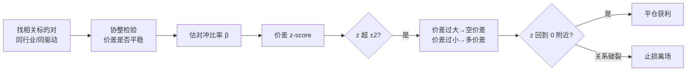
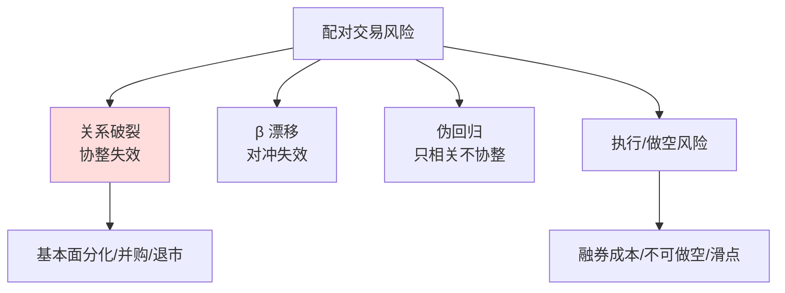

# 均值回归配对交易

> [!note] 配对交易
> 配对交易（Pairs Trading）是均值回归在**多资产**上的经典应用：不赌单只股票的方向，而是构造两只相关标的的**价差**，赌这个价差回归其历史中枢。它对市场整体涨跌近似中性，是统计套利最朴素也最重要的形态。本文从"价差即均值回归对象"的角度，讲清选对、协整、对冲比率、z-score 开平仓与关系破裂风险。理论根基见 [[均值回归策略基础]]，更深的协整与回测细节见 [[配对交易协整理论]] 与 [[配对交易Python回测]]。

## 一、核心思想：把"价差"当成会回归的资产

单资产均值回归赌的是价格回到自身均线，问题是它**承担全部方向性风险**（趋势一来就被碾压）。配对交易换了个对象：

$$
\text{Spread}_t = A_t - \beta\, B_t
$$

构造一个对冲组合（多 A、空 β 份 B），让"市场整体涨跌"在 A 与 B 上**相互抵消**，只留下"A 相对 B 的错价"。这个价差比单一价格更平稳、更具回归性，于是均值回归的逻辑用在它身上更可靠。



> [!tip] 一句话
> 配对交易 = 做空"价差波动"、做多"价差收敛"，赚的是相对错价被修复的钱，而非赌大盘方向。

## 二、第一步：选对（Pair Selection）

好的配对需要"基本面同源 + 统计上协整"。只看相关系数远远不够。

| 维度 | 要求 | 说明 |
|------|------|------|
| 经济同源 | 同行业/同驱动因子 | 有共同基本面，价差才有回归的"理由" |
| 高相关 | 价格/收益相关系数高（如 >0.8） | 必要不充分条件 |
| 协整关系 | 价差平稳（见下） | **决定性条件**，比相关更本质 |
| 流动性 | 两腿都能低成本做空 | 否则无法对冲、无法执行 |

> [!warning] 相关 ≠ 协整
> 两条同时上涨的随机游走（如同处牛市的两只无关股票）相关系数也很高，但价差会越走越远、**不回归**——这是"伪回归"。配对交易要的是**协整**：价格各自非平稳，但某个线性组合（价差）平稳。务必以协整检验为准，相关系数只用来初筛。

> [!example] 经典配对来源（示例）
> 同业龙头（如两大白酒）、同标的双重上市/ADR、ETF 与其成分股、商品期货跨期/跨品种。共同点：存在把它们"拴在一起"的经济纽带。

## 三、第二步：协整与对冲比率

### 1. 协整的直觉

价格 $A_t$、$B_t$ 各自是非平稳的随机游走（一阶单整），但若存在 β 使得 $A_t-\beta B_t$ 平稳（均值回归），则称二者**协整**。平稳的价差正是我们要交易的回归对象。

### 2. Engle–Granger 两步法

```python
import numpy as np
import pandas as pd
import statsmodels.api as sm
from statsmodels.tsa.stattools import coint, adfuller

# 第一步：协整检验（直接给出协整 p 值）
score, pvalue, _ = coint(stock_a, stock_b)
print(f'协整检验 p 值: {pvalue:.4f}')   # < 0.05 视为存在协整关系

# 第二步：OLS 估计对冲比率 β（价差 = A - β·B）
model = sm.OLS(stock_a, sm.add_constant(stock_b)).fit()
hedge_ratio = model.params.iloc[1]
spread = stock_a - hedge_ratio * stock_b

# 对价差本身做 ADF 平稳性检验，二次确认
adf_p = adfuller(spread.dropna())[1]
print(f'对冲比率 β = {hedge_ratio:.3f}, 价差 ADF p 值 = {adf_p:.4f}')
```

> [!important] 对冲比率不是"1:1"
> 直接做"1 股 A 对 1 股 B"通常错误。β 决定每做多 1 单位 A 应做空多少 B，才能让价差对市场中性。β 还会随时间漂移，应**滚动重估**（如滚动 OLS 或卡尔曼滤波），否则对冲会逐渐失效。

### 3. 半衰期：价差回归多快

价差是 O-U 过程，用 AR(1) 估计回归速度并换算半衰期（推导见 [[均值回归策略基础]]）：

$$
\Delta s_t = \alpha + \beta_{ar}\, s_{t-1} + \epsilon_t,\qquad t_{1/2} = -\frac{\ln 2}{\beta_{ar}}
$$

```python
def half_life(spread):
    s = spread.dropna(); lag = s.shift(1); d = (s - lag).dropna()
    b = sm.OLS(d, sm.add_constant(lag.loc[d.index])).fit().params.iloc[1]
    return -np.log(2) / b if b < 0 else np.inf

# 半衰期决定持仓周期与窗口；过长(如>百日)说明价差几乎不回归 → 弃用该对
```

## 四、第三步：z-score 开平仓

把价差标准化为 z-score，用统一阈值开平仓（与单资产同语言）：

$$
z_t=\frac{\text{Spread}_t-\mu_t}{\sigma_t}
$$

```python
window = 30
mu  = spread.rolling(window).mean()
sd  = spread.rolling(window).std()
zscore = (spread - mu) / sd

# 交易信号（示例阈值）
longs   = zscore < -2     # 价差过小 → 做多价差：买 A、卖 β 份 B
shorts  = zscore >  2     # 价差过大 → 做空价差：卖 A、买 β 份 B
exits   = zscore.abs() < 0.5   # 价差回到中枢附近 → 平仓
stop    = zscore.abs() > 3.5   # 极端偏离 → 视为关系异常，止损而非加仓
```

| z-score | 价差状态 | 操作 | 持仓方向 |
|---------|---------|------|---------|
| $\le -2$ | A 相对偏低 | 做多价差 | 多 A、空 β·B |
| $\ge +2$ | A 相对偏高 | 做空价差 | 空 A、多 β·B |
| $\lvert z\rvert \le 0.5$ | 回到中枢 | 平仓 | 空仓 |
| $\lvert z\rvert \ge 3.5$ | 极端 | 止损离场 | 空仓 |

> [!tip] 开平阈值要分离 + 设硬止损
> 用"±2 开、±0.5 平"的滞回设计避免抖动；同时必须有"z 极端化（如 ≥3.5）或基本面事件"触发的**硬止损**。配对交易最大的亏损不是来自波动，而是来自"价差不再回归"时仍死扛、甚至加仓摊平。

## 五、关键指标速查

| 指标 | 说明 | 标准（示例） |
|-----|------|-------------|
| 相关系数 | 价格相关性（初筛） | > 0.8 |
| 协整 p 值 | 协整关系显著性 | < 0.05 |
| 价差 ADF p 值 | 价差平稳性 | < 0.05 |
| 半衰期 | 价差回归速度 | 越短越好（匹配持仓周期） |
| 对冲比率 β | 两腿配比 | 由 OLS/滚动估计 |

## 六、常见误区与风险

配对交易看似"市场中性、稳赚价差"，但它的风险恰恰藏在"中性"的假设里。



> [!warning] 头号风险：关系破裂（Cointegration Breakdown）
> 配对交易最致命的不是价差变大，而是**协整关系彻底失效**——本应回归的价差一去不返。诱因：一方基本面突变（暴雷、业绩反转）、行业格局改变、并购/重组、退市。此时"价差越大越加仓"等于在错误方向上不断放大头寸，可造成巨额亏损（历史上多个统计套利团队栽在这里）。

> [!warning] 其他常见误区
> 1. **只看相关、不验协整**：陷入伪回归，价差永不回头。
> 2. **β 当常数**：对冲比率会漂移，静态 β 让组合逐渐变成单边裸头寸。
> 3. **忽视做空成本/限制**：融券费率、无法做空、停牌会让"理论价差"无法落地。
> 4. **过拟合配对**：从上千组合里挑历史最优的一对，多半是数据窥探，样本外失效。
> 5. **无止损死扛**：把"均值回归"当信仰，关系破裂时仍加仓摊平 → 单次黑天鹅清零。

| 风险 | 触发场景 | 缓释手段 |
|------|---------|---------|
| 关系破裂 | 基本面分化/并购/退市 | 硬止损、时间止损、跟踪事件、组合分散到多对 |
| β 漂移 | 长期结构变化 | 滚动/卡尔曼估计 β，定期再检验协整 |
| 伪回归 | 仅相关不协整 | 以协整+ADF 为准，相关仅初筛 |
| 执行风险 | 融券难/成本高/滑点 | 选高流动性可做空标的、计入真实成本 |
| 过拟合 | 海选配对、调参 | 样本外验证、限制搜索、要求经济逻辑 |

> [!example] 实战风控要点
> 1. **分散**：同时持有多组弱相关的配对，单对破裂不致命。
> 2. **时间止损**：超过 2~3 倍半衰期仍不回归，按"关系可疑"离场。
> 3. **事件优先**：出现并购/退市/暴雷等结构性消息，立即离场而非等 z 回归。
> 4. **持续再检验**：定期重跑协整与 β，关系失效即剔除该对。

## 相关链接

- [[均值回归策略基础]]
- [[配对交易协整理论|配对交易协整理论]]
- [[配对交易策略|配对交易策略]]
- [[均值回归Python实战]]
- [[统计套利深度解析]]
- [[风险管理框架]]

## 课程化学习补充

> [!important] 学习定位
> 量化策略是投资假设、数据工程、回测验证、风险预算和执行系统的组合，不是单一公式。本文仅用于学习、研究与复盘，不构成任何投资建议。

### 必须掌握的问题

- 假设是否可证伪
- 数据是否 point-in-time
- 绩效是否扣除真实成本
- 上线后是否监控衰减

### 实战应用流程

1. 先写清楚你的投资假设：为什么这个信号、资产或方法应该产生收益。
2. 明确数据口径：样本范围、更新时间、复权/分红/停牌处理和交易日历。
3. 做最小可行验证：先用简单规则验证方向，再逐步加入复杂模型。
4. 把成本和约束前置：手续费、滑点、冲击成本、保证金、流动性和容量都要进入测算。
5. 上线后持续复盘：记录信号、下单、成交、持仓、回撤和失效原因。

### 风险与失效条件

- 数据挖掘偏差
- 因子拥挤
- 换手过高
- 实盘偏离回测

### 复盘问题

- 这笔交易或这套模型赚的是什么钱：风险补偿、行为偏差、流动性溢价，还是偶然噪音？
- 如果市场环境反过来，最大亏损和最长恢复期会是多少？
- 当前结论是否依赖某个不可持续假设，例如低利率、低波动、充裕流动性或监管套利？
- 有没有一个更简单的基准策略能取得接近效果？

### 延伸学习

- [[量化投资完全指南]]
- [[回测质量门清单]]
- [[市场微观结构与交易执行]]
- [[量化风险管理体系]]

## 跨领域进阶扩展

> [!tip] 交易者视角
> 学到 `均值回归配对交易` 时，不要只把它当成孤立知识点。把策略视为假设、数据、验证、组合和执行的整体工程。优秀投资交易者会把它放入“宏观背景 - 资产选择 - 估值/信号 - 组合风险 - 交易执行 - 复盘反馈”的闭环。

### 与其他知识的连接

- 收益来源和经济解释
- 数据清洗和偏差控制
- 回测、组合和风控
- 实盘衰减与策略迭代

### 进阶训练

1. 把策略假设写成可证伪命题
2. 建立基准策略比较
3. 把换手、容量和成本纳入绩效评价

### 能力验收

- 能否说清楚这个主题影响的是收益来源、风险来源、交易成本、流动性还是心理纪律？
- 能否指出它在什么市场环境、资产类别或交易周期中更有效？
- 能否把它写成一条可复盘的研究或交易规则？
- 能否说明如果判断错误，组合最大损失和退出机制是什么？

### 全局关联

- [[综合金融知识体系/金融投资全知识地图|金融投资全知识地图]]
- [[综合金融知识体系/优秀投资交易者能力地图|优秀投资交易者能力地图]]
- [[综合金融知识体系/一次性学习路线与复盘模板|一次性学习路线与复盘模板]]
