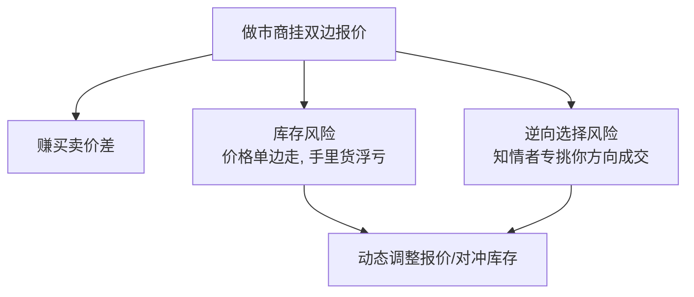

# AI高频交易

> [!note] AI+高频交易
> 高频交易（HFT）是在极短时间尺度（微秒到秒级）上、靠速度与微观结构优势获利的交易方式。AI/机器学习在其中扮演"信号大脑"的角色，但 HFT 的胜负更多取决于**延迟、基础设施和制度准入**。本文给出务实概览，并坦白说明：**这是机构的赛道，个人门槛极高。**

## 一、先厘清：HFT 不只是"交易很快"

| 时间尺度 | 类别 | 主要矛盾 |
|---------|------|---------|
| 微秒~毫秒 | 纯高频 / 做市 / 延迟套利 | 速度、机房、硬件 |
| 秒~分钟 | 中高频 / 微观结构 alpha | 信号质量 + 执行 |
| 分钟~日 | 日内统计套利 | 模型 + 容量 |

> [!important] HFT 的本质是"基础设施竞赛"
> 在最快的那一层，谁先看到、先报到、先成交，谁就赢。再聪明的 AI 模型，如果延迟比对手慢几微秒，信号一文不值。**这也是个人几乎无法参与纯 HFT 的根本原因。**

## 二、信号来源：HFT 赚的是什么

| 信号类型 | 直觉 | 典型时间尺度 |
|---------|------|-------------|
| 订单簿失衡（OBI） | 买卖挂单量悬殊预示短期方向 | 毫秒~秒 |
| 订单流（Order Flow） | 主动成交方向的持续性 | 毫秒~秒 |
| 微价格（Micro-price） | 用挂单量加权的"更真实中间价" | 瞬时 |
| 延迟套利 | 不同场所同标的的价格短暂错位 | 微秒 |
| 做市价差 | 持续提供流动性赚买卖价差 | 持续 |

### 订单簿失衡（示意）

$$ \text{OBI} = \frac{V_{bid} - V_{ask}}{V_{bid} + V_{ask}} $$

$V_{bid}$、$V_{ask}$ 为买一/卖一（或前若干档）挂单量。OBI 偏正常预示短期上行压力——这是最基础的微观结构特征之一。微观结构背景见 [[市场微观结构与交易执行]]。

## 三、做市与逆向选择：HFT 的核心张力

做市商持续挂双边买卖单，靠**买卖价差**赚钱，但要承担两类风险：

> [!important] 逆向选择（Adverse Selection）
> 做市商最怕和"信息更灵的人"成交：当有人因利好猛买你的卖单，往往意味着价格马上要涨——你刚卖出的货立刻浮亏。做市的全部艺术，就是**用价差收入覆盖逆向选择 + 库存损失**。AI 在这里的价值是更快识别"这笔成交是不是被套了"，并即时调整报价宽度与库存。

| 做市要素 | 目标 |
|---------|------|
| 报价宽度 | 价差越窄成交越多，但抗逆向选择越弱 |
| 库存管理 | 偏离目标库存时倾斜报价，引导回中性 |
| 撤改速度 | 行情一变立刻撤旧报价，避免被"打"陈旧单 |

> [!example] 库存倾斜报价（直觉/示例）
> 假设做市商目标库存为 0，但当前手里多了一批多头。为了把库存推回中性，它会**主动把卖价报得更有吸引力、把买价报得更保守**——更想卖、更不想买。AI/RL 的作用就是根据库存、波动率、订单流，实时算出"此刻报价该往哪边偏、偏多少"，在"多成交"与"控风险"之间动态权衡。

## 四、AI 在 HFT 中的角色与局限

### 1. 典型应用

| 技术 | 应用 | 优势 | 局限 |
|------|------|------|------|
| LSTM / 时序模型 | 短期价格/订单流预测 | 捕捉时序依赖 | 推理延迟、易过拟合微观噪音 |
| Transformer | 订单簿序列建模 | 注意力捕捉结构 | 计算重、延迟敏感场景慎用 |
| 强化学习（RL） | 做市报价 / 最优执行 | 序贯决策、自适应库存 | 训练不稳、样本效率低、难上线 |
| CNN | 订单簿"快照"模式识别 | 提取局部形态 | 可解释性差 |
| GBDT / 线性模型 | 高频特征打分 | **快、稳、可解释** | 表达力有限 |

> [!tip] 越快的层，模型越"简单"
> 反直觉但重要：在延迟最敏感的环节，从业者往往偏好**线性模型或浅层树模型**，因为深度网络的推理延迟可能直接抹掉信号优势。复杂 AI 更多用在**稍慢的中高频 alpha**与**离线特征/策略生成**上，而非微秒级热路径。

### 2. AI 的真实局限

> [!warning] AI 不是 HFT 的银弹
> - **延迟 > 智能**：纯高频层，速度决定一切，模型再准也救不了慢。
> - **信噪比极低**：高频数据噪音巨大，模型极易把噪音学成"规律"（过拟合）。
> - **非平稳**：微观结构随制度、参与者变化漂移，模型要高频重训。
> - **冲击反身性**：你的下单本身改变订单簿，历史样本里没有"你自己"。
> - **可解释与风控**：黑箱模型在毫秒级失控时，人来不及干预，必须有硬性熔断。

## 五、主流 HFT 策略家族

不同 HFT 策略对"速度"与"模型"的依赖度差别很大：

| 策略家族 | 赚什么 | 速度依赖 | 模型依赖 |
|---------|--------|---------|---------|
| 做市（Market Making） | 买卖价差 + 返佣 | 极高 | 中（库存/报价） |
| 延迟套利（Latency Arb） | 跨场所价格错位 | 极致 | 低 |
| 统计/微观结构 alpha | 短期价格可预测性 | 高 | 高 |
| 事件驱动（行情/新闻） | 信息扩散的时间差 | 高 | 中高 |
| 流动性侦测 | 识别大单并抢跑/规避 | 高 | 中 |

> [!note] 速度与模型的取舍
> 越靠"延迟套利"一端，几乎不需要模型，纯拼基础设施；越靠"统计 alpha"一端，速度仍重要但**信号质量开始起决定作用**——这也是 AI 唯一能真正发力、且个人有一线可参与空间的区域（在更慢的频率上）。

## 六、延迟预算：信号必须比延迟"跑得快"

HFT 的盈利窗口极短，一笔交易的端到端延迟必须**远小于**信号的有效寿命：

$$ T_{\text{行情到达}} + T_{\text{计算决策}} + T_{\text{下单到达}} \;\ll\; T_{\text{信号有效期}} $$

> [!warning] AI 模型的"延迟税"
> 假设某微观信号有效期只有几百微秒（示例），而一次深度网络推理就要消耗其中相当一部分，留给网络往返和撮合的时间所剩无几——信号还没用上就失效了。这就是为什么**热路径偏爱极简模型**，复杂 AI 退到离线或更慢的频率。这里不给精确数字，重在理解"延迟预算"这个约束。

## 七、低延迟基础设施（个人无法逾越的墙）

| 层面 | 机构做法 | 个人现实 |
|------|---------|---------|
| 物理位置 | 交易所机房**主机托管（colocation）** | 几乎不可得 |
| 网络 | 专线、微波、内核旁路（kernel bypass） | 普通宽带，延迟高几个数量级 |
| 硬件 | FPGA/ASIC 处理行情与下单 | 通用 CPU |
| 行情 | 直连交易所 Level-3 逐笔 | 受限、延迟、分钟/快照级 |
| 制度 | 席位、做市资格、报撤单额度 | 普通账户、受撤单/异常交易监管约束 |

> [!important] 个人能不能做"高频"
> 纯微秒级 HFT 对个人**基本关闭**——拼不过托管+FPGA+直连。个人现实可行的天花板是**中低频日内 / 微观结构特征辅助的择时与执行优化**：不和机构拼速度，而是用更好的信号、更克制的频率，把可得的小优势做扎实。盲目模仿"AI 高频"多半交学费。

## 八、HFT 与统计套利的关系

HFT 与统计套利有重叠（如高频统计套利、延迟套利），但侧重不同：

| 维度 | 高频交易 | 统计套利（中低频） |
|------|---------|-------------------|
| 胜负手 | 速度、基础设施 | 模型、信号、容量 |
| 时间尺度 | 微秒~秒 | 小时~周 |
| 个人可行性 | 极低 | 相对可行（如配对） |

想从"可落地"的方向入门，建议先走统计套利路线：[[统计套利深度解析]]、[[配对交易策略]]。

## 九、常见误区与风险

> [!warning] AI 高频五大误区
> 1. **以为"AI 够强就能高频"**：延迟和制度门槛才是主矛盾。
> 2. **用深模型上微秒热路径**：推理延迟吃掉全部优势。
> 3. **把高频噪音当 alpha**：信噪比极低，过拟合家常便饭。
> 4. **回测忽略自身冲击与延迟**：实盘下单改变盘口，历史样本无法复现。
> 5. **个人盲目对标机构 HFT**：基础设施差几个数量级，注定亏钱。

**核心风险**：极端延迟竞争、模型非平稳失效、闪崩/流动性骤断、监管对异常交易与撤单的限制、技术故障（一个 bug 在毫秒级可造成巨亏）。风控见 [[风险管理框架]]。

> [!important] 给个人投资者的诚实建议
> 如果你是个人投资者，**不要把精力投到纯高频**。把"AI + 交易"的热情，用在能验证、有容量、不拼延迟的地方——多因子、统计套利、配对交易、执行优化。先用 [[配对交易Python回测]] 与 [[回测方法论]] 把一套低频策略做扎实，再谈更快的频率。**承认门槛，是省钱的第一步。**

## 相关链接

- [[市场微观结构与交易执行]]
- [[统计套利深度解析]]
- [[配对交易策略]]
- [[配对交易协整理论]]
- [[CTA策略Python实战]]
- [[回测方法论]]
- [[风险管理框架]]
- [[../目录|量化策略总览]]
