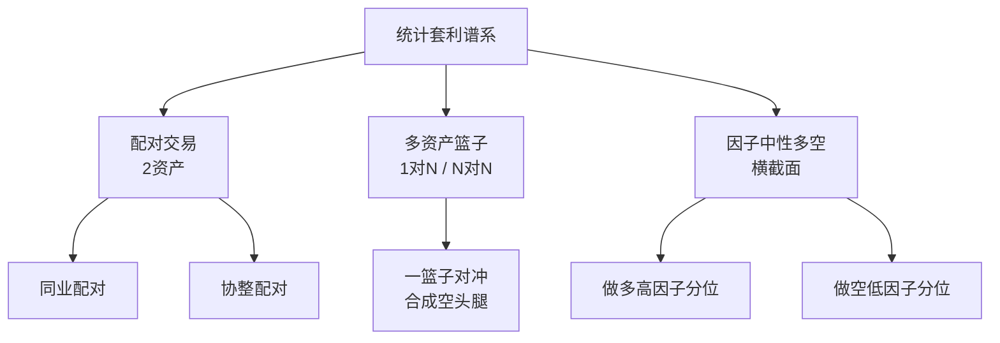
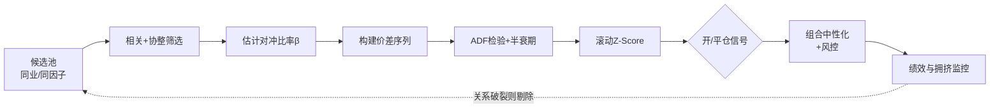
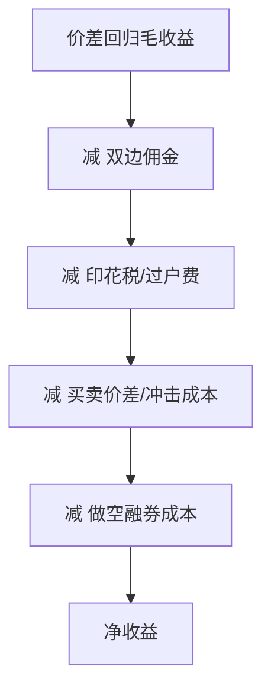

# 统计套利深度解析

> [!note] 统计套利
> 统计套利（Statistical Arbitrage，简称 StatArb）是一种量化投资策略族，核心是"利用价格对历史统计关系的短期偏离，在预期回归时获利"。它不是无风险套利（arbitrage），而是**概率意义上的套利**——靠大数定律把单笔不确定的小优势，累积成组合层面的稳定收益。

## 一、统计套利到底"套"的是什么

很多人把统计套利和无风险套利混为一谈，这是最根本的误解。

| 维度 | 无风险套利 | 统计套利 |
|------|-----------|---------|
| 收益确定性 | 锁定、无风险 | 概率性、可能亏损 |
| 依据 | 同一资产两处定价不同 | 历史统计规律 |
| 持仓时间 | 极短（毫秒到日内） | 数小时到数周 |
| 失效方式 | 几乎不会 | 关系破裂、范式切换 |
| 典型例子 | ETF 申赎、跨市场同股 | 配对交易、多空因子组合 |

> [!important] 一句话本质
> 统计套利赌的是"**关系**"而非"**方向**"。它对市场整体涨跌（β）保持中性，只想赚取价格相对错位收敛（α）的钱。



## 二、从配对到多资产：策略的三个层次

### 1. 配对交易（Pairs Trading）

最基础的形态：两只强相关资产 A、B，价差偏离则反向下注，回归则平仓。详见 [[配对交易策略]]。这是理解一切统计套利的起点。

### 2. 一对多 / 多对多篮子

单只股票的价差噪音太大、容量太小。进阶做法是用**一篮子资产合成"虚拟对手腿"**：

$$ \text{Spread}_t = P_{i,t} - \sum_{j \neq i} w_j \, P_{j,t} $$

其中权重 $w_j$ 由回归或协整（Johansen）估计。例如用同行业 5~10 只票合成一个"行业镜像"，再对单只个股做偏离交易，比一对一更稳健。

### 3. 因子中性多空（Factor-Neutral Long/Short）

这是机构 StatArb 的主流形态。不再盯单个配对，而是在**整个股票横截面**上排序：

| 步骤 | 操作 |
|------|------|
| 打分 | 用多因子模型给每只股票算综合得分 |
| 排序 | 按得分分成 10 个分位（decile） |
| 建仓 | 做多最高分位，做空最低分位 |
| 中性化 | 让组合对市值、行业、β 等暴露≈0 |
| 再平衡 | 定期（如每日/每周）刷新得分换仓 |

> [!tip] 关键直觉
> 因子中性多空本质是"把成百上千个微弱的配对叠加在一起"。单只票预测准确率可能只有 51%，但分散到上千只、上百个交易日后，组合夏普可以做得很高。这正是统计套利"以量取胜"的体现，与 [[相关性与协方差估计]] 紧密相关。

## 三、均值回归的统计基础

统计套利能成立，前提是价差序列具备**均值回归（mean reversion）**性质，而不是随机游走。

### 1. 平稳性是命门

- **随机游走**：$S_t = S_{t-1} + \varepsilon_t$，方差随时间发散，永不回归——不能交易。
- **平稳序列 I(0)**：均值、方差不随时间漂移，偏离后倾向回拉——可交易。

判断工具是 **ADF 单位根检验**（见 [[配对交易协整理论]]）。价差必须通过 ADF 检验（p 值足够小），才说明它"有回头的力量"。

### 2. OU 过程：给回归速度建模

价差常用 Ornstein-Uhlenbeck（OU）过程刻画：

$$ dS_t = \kappa(\mu - S_t)\,dt + \sigma\, dW_t $$

| 参数 | 含义 | 交易意义 |
|------|------|---------|
| $\kappa$ | 回归速度 | 越大回归越快，机会周转越高 |
| $\mu$ | 长期均值 | 价差的"锚" |
| $\sigma$ | 瞬时波动率 | 决定开仓阈值的宽窄 |

最实用的衍生量是**半衰期**（价差回到一半偏离所需时间）：

$$ t_{1/2} = \frac{\ln 2}{\kappa} $$

> [!example] 半衰期怎么用（示例）
> 假设估计出某配对半衰期约 5 个交易日。那么：持仓周期大致设在 1~2 倍半衰期（5~10 天）较合理；若半衰期长达 60 天，回归太慢、占用资金久、漂移风险高，多半不值得做。

如何从数据估半衰期？常用做法是对价差做一阶自回归，用回归系数反推 $\kappa$：

```python
import numpy as np, statsmodels.api as sm

s = spread.dropna()
s_lag = s.shift(1).dropna()
delta = (s - s_lag).dropna()
s_lag = s_lag.loc[delta.index]

beta = sm.OLS(delta, sm.add_constant(s_lag)).fit().params.iloc[1]
half_life = -np.log(2) / beta   # beta<0 时半衰期为正
print(f"半衰期 ≈ {half_life:.1f} 个交易日")
```

> [!tip] 半衰期是"体检指标"
> 半衰期不仅决定持仓周期，还能用来筛选配对：太长（回归慢）一票否决，太短（噪音主导、被成本吃掉）也要警惕。它和协整、ADF 一起构成选对的核心体检项（见 [[配对交易协整理论]]）。

### 3. Z-Score：把偏离标准化

$$ Z_t = \frac{S_t - \mu}{\sigma} $$

Z 把价差换算成"偏离了几个标准差"，便于统一设阈值（如 $|Z|>2$ 开仓、$|Z|<0.5$ 平仓）。

> [!warning] 移动窗口 vs 全样本
> 用**全样本**均值方差算 Z 会引入未来信息（look-ahead bias），回测虚高、实盘打脸。实战务必用**滚动窗口**（如过去 60 日）动态估计 $\mu$、$\sigma$。这是新手最常见的致命错误之一，详见 [[回测方法论]]。

## 四、完整流程：一张图看懂



## 五、成本与净收益：理论 alpha 的"漏斗"

统计套利的毛收益往往不大，**成本是决定生死的变量**。一笔配对从毛收益到落袋，要穿过层层漏斗：



| 成本项 | 说明 | 对统计套利的影响 |
|--------|------|-----------------|
| 佣金 | 双腿、双向，开+平共 4 次 | 换手越高侵蚀越重 |
| 印花税 | A 股卖出单边征收 | 直接压低净收益 |
| 冲击成本 | 大单推动价格不利于己 | 限制容量与单笔规模 |
| 融券成本 | 做空腿借券利息 | 可能吞掉大半价差 |

> [!important] 频率与成本是一对死敌
> 提高交易频率能抓更多回归机会，但每多一次换手就多一层成本。统计套利的"甜点区"是：**信号足够强、足以覆盖成本，又不至于因频率过高被成本反噬**。半衰期太短的配对常常死在这里——看着回归很快，净收益却为负。

## 六、容量与拥挤：被忽视的生死线

统计套利最反直觉的一点：**它的收益会随资金规模和参与者增多而衰减**。

### 1. 容量（Capacity）

单个配对的价差盘口很浅，下大单会自己把价差打没。容量上限大致受限于：

$$ \text{容量} \propto \frac{\text{日均成交额} \times \text{可承受冲击}}{\text{换手频率}} $$

频率越高、标的越小，容量越低。这也是为什么个人做窄配对反而有空间，而百亿资金必须铺到上千标的。

### 2. 拥挤（Crowding）

当大量量化机构用相似因子、相似信号时：

| 拥挤的后果 | 机制 |
|-----------|------|
| 收益衰减 | 价差还没张开就被抢平 |
| 相关性飙升 | 平时不相关的策略同涨同跌 |
| 踩踏风险 | 去杠杆时集体平仓，价差反向爆走 |

> [!warning] 2007 量化地震的教训
> 2007 年 8 月，多家知名量化基金在数日内同时巨亏又快速反弹。普遍解读是：拥挤的多空因子组合在某机构被迫去杠杆时引发连锁平仓，原本"安全"的中性组合瞬间高度相关。**中性 ≠ 安全，拥挤会让分散化在最需要时失效。** 这里不引用精确数字，重点是理解机制。

### 3. 如何监控拥挤（务实做法）

- 跟踪自己策略与"标准因子"（动量、价值等）的相关性，骤升要警惕；
- 关注价差**回归速度变慢**或**信号衰减**，可能是同质对手变多；
- 保留多元化的信号来源，不把全部仓位押在一类逻辑上。

## 七、常见误区与风险

> [!warning] 五大常见误区
> 1. **把统计套利当无风险套利**：它会亏，且可能连续亏；关系破裂时损失可以很大。
> 2. **用全样本统计量**：引入未来信息，回测漂亮、实盘崩盘。
> 3. **只看相关不看协整**：相关高但不协整的价差会持续发散（见 [[配对交易协整理论]]）。
> 4. **忽视成本**：双边交易、做空成本、冲击成本能吃掉大部分理论收益。
> 5. **过度优化阈值**：在历史上调出完美的开平仓线，本质是过拟合。

**核心风险清单**：协整关系破裂、范式切换（基本面突变）、拥挤踩踏、流动性枯竭、做空受限（涨停/融券不可得）、模型半衰期失效。风控配置参考 [[风险管理框架]]。

> [!important] 给个人投资者的现实建议
> 统计套利对个人最友好的形态是**低频、宽半衰期的配对/小篮子**——容量需求低、不拼延迟、逻辑透明。不要一上来就追求高频或上千标的的因子组合，那是机构的赛道。先用 [[配对交易Python回测]] 把一个配对吃透，远胜过盲目铺摊子。

## 相关链接

- [[配对交易协整理论]]
- [[配对交易策略]]
- [[配对交易Python回测]]
- [[均值回归策略基础]]
- [[相关性与协方差估计]]
- [[风险管理框架]]
- [[回测方法论]]
- [[目录|量化策略总览]]

## 课程化学习补充

> [!important] 学习定位
> 量化策略是投资假设、数据工程、回测验证、风险预算和执行系统的组合，不是单一公式。本文仅用于学习、研究与复盘，不构成任何投资建议。

### 必须掌握的问题

- 假设是否可证伪
- 数据是否 point-in-time
- 绩效是否扣除真实成本
- 上线后是否监控衰减

### 实战应用流程

1. 先写清楚你的投资假设：为什么这个信号、资产或方法应该产生收益。
2. 明确数据口径：样本范围、更新时间、复权/分红/停牌处理和交易日历。
3. 做最小可行验证：先用简单规则验证方向，再逐步加入复杂模型。
4. 把成本和约束前置：手续费、滑点、冲击成本、保证金、流动性和容量都要进入测算。
5. 上线后持续复盘：记录信号、下单、成交、持仓、回撤和失效原因。

### 风险与失效条件

- 数据挖掘偏差
- 因子拥挤
- 换手过高
- 实盘偏离回测

### 复盘问题

- 这笔交易或这套模型赚的是什么钱：风险补偿、行为偏差、流动性溢价，还是偶然噪音？
- 如果市场环境反过来，最大亏损和最长恢复期会是多少？
- 当前结论是否依赖某个不可持续假设，例如低利率、低波动、充裕流动性或监管套利？
- 有没有一个更简单的基准策略能取得接近效果？

### 延伸学习

- [[量化投资完全指南]]
- [[回测质量门清单]]
- [[市场微观结构与交易执行]]
- [[量化风险管理体系]]
