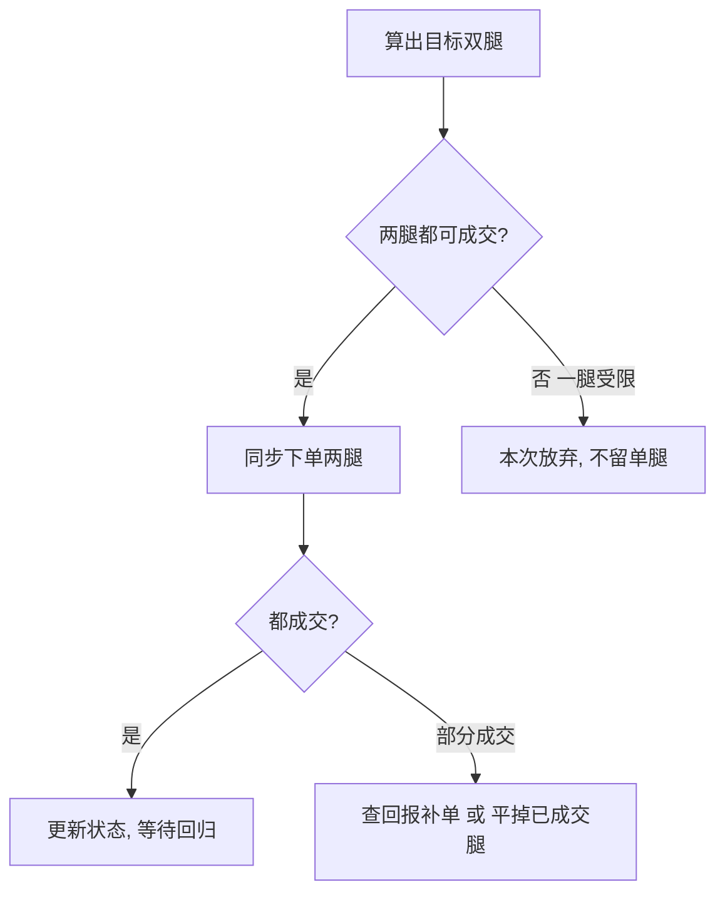

# 配对交易QMT实战

> [!note] QMT实战
> 本文讲的是把配对交易从"回测能跑"落到"实盘能用"的**工程要点**：数据、信号、下单、风控、撮合细节。以 QMT / miniQMT（迅投）为载体，但思路对多数实盘平台通用。**重点在工程概念，代码为示意，接口以你所用版本文档为准。**

## 一、回测 ≠ 实盘：思维切换

| 维度 | 回测 | 实盘 |
|------|------|------|
| 数据 | 一次性历史、干净 | 逐 bar 推送、有延迟/缺失 |
| 成交 | 假设按收盘价成交 | 受盘口、涨跌停、流动性制约 |
| 持仓 | 变量里的数字 | 券商真实仓位，需对账 |
| 时间 | 瞬间跑完 | 实时、不可回退 |
| 失败成本 | 改代码重跑 | 真金白银 |

> [!important] 实盘第一原则：以"真实持仓"为准
> 回测里 `position` 是个变量；实盘里你的持仓是券商系统的真实状态。**永远先查实际持仓，再决定下单量**，不要假设上一笔单全部按预期成交。这是配对交易实盘最容易翻车的地方——两腿成交不一致会破坏中性。

## 二、QMT 平台简介

QMT 是迅投科技的量化交易终端，常见两种用法：

- **QMT（图形终端 + 内置 Python）**：`init` / `handlebar` 事件驱动框架。
- **miniQMT（xtquant 库）**：在外部 Python 进程里调用，便于工程化、接自有代码。

能力涵盖：实时行情订阅、历史数据获取、委托/撤单、持仓与资金查询、回测与模拟盘。

## 三、策略框架骨架

```python
def init(ContextInfo):
    ContextInfo.stock_a = '600519.SH'      # 示例：A 腿
    ContextInfo.stock_b = '000858.SZ'      # 示例：B 腿
    ContextInfo.hedge_ratio = 0.8          # 对冲比率（示例，应来自协整）
    ContextInfo.window = 60                # 滚动窗口
    ContextInfo.entry, ContextInfo.exit_z = 2.0, 0.5
    ContextInfo.target_notional = 100000   # 单腿目标名义金额（示例）

def handlebar(ContextInfo):
    # 每个 bar 触发：取数 → 算 Z → 对照实际持仓 → 下单
    z = calc_zscore(ContextInfo)
    rebalance(ContextInfo, z)
```

> [!tip] 只在"最新且已收的 bar"上决策
> `handlebar` 会在历史回放阶段逐根触发。实盘要确保只对**最新一根已完成的 bar**下单，避免用未走完的 bar 触发信号（变相未来函数）。

## 四、数据：实盘的第一道坎

```python
def calc_zscore(ContextInfo):
    n = ContextInfo.window + 5
    a = ContextInfo.get_market_data(['close'], stock_code=ContextInfo.stock_a,
                                    count=n, dividend_type='front')  # 前复权
    b = ContextInfo.get_market_data(['close'], stock_code=ContextInfo.stock_b,
                                    count=n, dividend_type='front')
    spread = a['close'] - ContextInfo.hedge_ratio * b['close']
    mu, sd = spread.rolling(ContextInfo.window).mean(), spread.rolling(ContextInfo.window).std()
    return float(((spread - mu) / sd).iloc[-1])
```

> [!warning] 实盘取数四个雷区
> 1. **复权类型**：必须前复权且与回测一致，否则价差跳变。
> 2. **停牌**：某腿停牌时数据缺失/陈旧，应暂停该配对而非照算。
> 3. **时间对齐**：两腿 bar 必须同一时刻，跨市场（沪/深）注意撮合时点差异。
> 4. **窗口数据不足**：刚开盘/新订阅时历史不够，`rolling` 出 `NaN`，要判空跳过。

## 五、下单：把"目标持仓"翻译成委托

```python
def rebalance(ContextInfo, z):
    acct = ContextInfo.accountid
    pos_a = get_position(ContextInfo, ContextInfo.stock_a)  # 查真实持仓
    pos_b = get_position(ContextInfo, ContextInfo.stock_b)

    # 目标方向：-1 空价差 / +1 多价差 / 0 平
    if z >  ContextInfo.entry:   tgt_a, tgt_b = -1, +1
    elif z < -ContextInfo.entry: tgt_a, tgt_b = +1, -1
    elif abs(z) < ContextInfo.exit_z: tgt_a, tgt_b = 0, 0
    else: return  # 持仓不变

    # 折算成股数（按 100 股取整），再下差额单
    place_leg(ContextInfo, ContextInfo.stock_a, tgt_a, pos_a)
    place_leg(ContextInfo, ContextInfo.stock_b, tgt_b, pos_b)
```

> [!important] 用"目标仓位 - 当前仓位"下差额单
> 不要每次都全量下单，而要计算 `目标 - 当前` 的**差额**再委托，避免重复开仓、仓位翻倍。`order_target_percent` 这类"目标百分比"接口本质就是替你算差额——但实盘要警惕它对资金/可用余额的处理。

## 六、撮合与成交细节（实盘真正难的地方）

| 细节 | 问题 | 应对 |
|------|------|------|
| 涨跌停 | 想卖的腿封涨停卖不出 | 跳过该次再平衡，监控解封 |
| 一字板/停牌 | 单腿无法成交 | 整对暂停，不留单腿敞口 |
| 滑点与冲击 | 市价单吃穿盘口 | 限价单 + 分批，控制单笔占比 |
| 部分成交 | 只成交一部分 | 查成交回报，按未成交量补单 |
| T+1 | A 股当日买入不可卖 | 平多腿受限，需提前规划 |
| 融券可得性 | 空头腿无券可融 | 事前确认券源，否则策略不可行 |

> [!warning] 单腿风险：配对交易的头号实盘杀手
> 配对的"中性"建立在**两腿同时成交**。若 A 成交、B 因涨跌停/无券没成交，你就持有了裸露的方向性头寸，风险敞口完全失控。务必：要么两腿都成交、要么都不动；一腿失败要立即考虑撤销/对冲另一腿。



## 七、实盘风控清单

> [!example] 上线前必须就位的风控
> - **资金/仓位上限**：单配对、总账户的最大占用，硬编码上限。
> - **单腿超时保护**：下单后 N 秒未完全成交则撤单并处置另一腿。
> - **价差止损**：$\lvert Z \rvert$ 突破极端阈值强制平仓。
> - **时间止损**：超过 2~3 倍半衰期未回归则离场。
> - **断线/异常处理**：行情断、报单失败要有重连与告警，宁可不交易也别乱交易。
> - **对账**：定时核对策略记账与券商真实持仓/资金，偏差即停。
> - **盘前自检**：检查券源、可用资金、订阅是否正常。

风控理念详见 [[风险管理框架]]；微观撮合背景见 [[市场微观结构与交易执行]]。

## 八、从回测到实盘的迁移checklist

| 环节 | 回测做法 | 实盘必须补的 |
|------|---------|-------------|
| 数据 | 离线 CSV | 实时订阅 + 复权一致 + 判空 |
| 信号 | 全序列向量化 | 仅最新已收 bar，防未来函数 |
| 持仓 | 变量 | 查真实持仓下差额单 |
| 成交 | 假设全成 | 处理涨跌停/部分成交/T+1 |
| 风控 | 事后看 | 实时上限 + 告警 + 对账 |

## 九、常见误区与风险

> [!warning] QMT 实盘六大误区
> 1. **照搬回测假设按收盘价成交**：实盘有滑点、涨跌停、流动性。
> 2. **不查真实持仓就下单**：重复开仓、仓位失控。
> 3. **忽视单腿失败**：留下裸方向敞口，中性化形同虚设。
> 4. **复权/对齐与回测不一致**：价差跳变，信号全错。
> 5. **无异常与断线处理**：行情中断仍盲目报单。
> 6. **不做对账**：策略以为的仓位 ≠ 实际仓位，越错越远。

> [!important] 给个人投资者的现实提醒
> A 股环境下，配对交易实盘的最大约束往往不是策略本身，而是**做空可得性（融券券源）+ T+1 + 涨跌停**。在投入实盘前，请先用**模拟盘**长期验证撮合表现，并确认空头腿能稳定融到券。很多在回测里赚钱的配对，因无法做空那一腿而**根本无法落地**。先小资金、低频、单配对跑顺，再谈扩展。

## 相关链接

- [[配对交易协整理论]]
- [[配对交易Python回测]]
- [[配对交易策略]]
- [[统计套利深度解析]]
- [[市场微观结构与交易执行]]
- [[风险管理框架]]
- [[目录|量化策略总览]]

## 实战掌握清单

> [!tip] 交易者视角
> 配对交易QMT实战 的学习重点不是记住术语，而是把它放进研究、组合、执行和复盘的闭环。量化策略必须从清晰假设出发，经过数据验证、成本测算、风险控制和实盘监控，才可能成为可持续系统。

### 关键判断

- 写清楚收益来自动量、反转、价值、套利、波动率、流动性还是行为偏差。
- 确认信号、过滤器、入场、退出、仓位和风控。
- 看收益是否集中在少数时期、少数品种或少数参数。

### 落地动作

1. 做样本外、滚动窗口和参数扰动测试。
2. 把手续费、滑点、冲击成本、容量和失败交易纳入报告。
3. 上线后监控成交质量、信号衰减、回撤和异常订单。

### 失效边界

- 过拟合。
- 策略容量不足。
- 市场结构变化后没有停止机制。

### 复盘问题

- 这项知识改变了哪一个具体决策：标的、方向、仓位、退出、对冲还是不交易？
- 如果判断相反，最大亏损、最长恢复期和退出触发条件是什么？
- 有没有一个更简单的基准方法可以取得相近结果？
