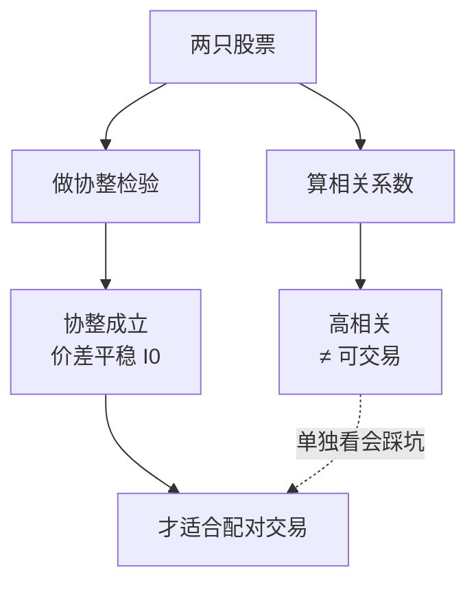

# 配对交易协整理论

> [!note] 协整理论
> 协整（Cointegration）是配对交易的数学基础。它回答一个关键问题：两个各自"乱走"（非平稳）的价格序列，能否被一个固定的线性组合"拴"成一个会回归的稳定价差？能，就值得做配对；不能，价差只会越偏越远。

## 一、为什么需要协整：相关性不够用

很多人凭"相关系数高"就去做配对，这是危险的。

### 相关 vs 协整

| 维度 | 相关性（Correlation） | 协整（Cointegration） |
|------|----------------------|----------------------|
| 衡量对象 | 收益率的**同步波动** | 价格的**长期均衡** |
| 时间视角 | 短期、瞬时 | 长期、结构性 |
| 是否保证回归 | 否 | 是（价差平稳） |
| 典型反例 | 同涨同跌但渐行渐远 | — |

> [!warning] 经典反例：两个同向漂移的随机游走
> 两条都向上漂移的随机游走，收益率可以高度相关，但它们的差额可以无限扩大——相关高，却不协整。**做配对要的是"价差回归"，这只有协整能保证，相关性不能。**



## 二、平稳与单整：基础概念

### 1. 平稳序列（Stationary）

均值、方差、自协方差都不随时间变化。直觉上：围绕一条水平线上下波动，偏离后倾向回拉。

### 2. 单整阶数 I(d)

| 记号 | 含义 | 例子 |
|------|------|------|
| I(0) | 本身平稳 | 平稳的价差、白噪音 |
| I(1) | 一阶差分后平稳 | 多数股票价格（差分=收益率近似平稳） |
| I(2) | 二阶差分后平稳 | 较少见 |

绝大多数股价是 **I(1)**：价格本身像随机游走（非平稳），但日度变化（差分）大致平稳。

### 3. 协整的定义

$$ \text{若 } X_t \sim I(1),\; Y_t \sim I(1),\;\text{且存在 } \beta \text{ 使 } Z_t = Y_t - \beta X_t \sim I(0),\;\text{则 } X_t, Y_t \text{ 协整} $$

> [!important] 直觉：醉汉与狗
> 经典比喻：一个醉汉（X）和他牵着的狗（Y）各自走得毫无规律（都是 I(1)），但牵狗绳让两者之间的距离始终在一个范围内波动（$Z_t$ 平稳）。这根"绳"就是协整关系，$\beta$ 是绳子的"换算系数"——对冲比率。

## 三、Engle-Granger 两步法

最常用、最直观的协整检验，专为两变量设计。

### 第一步：OLS 回归估计长期关系

$$ Y_t = \alpha + \beta X_t + \varepsilon_t $$

用普通最小二乘拟合，得到截距 $\alpha$ 与斜率 $\beta$（即对冲比率）。残差序列：

$$ \hat{\varepsilon}_t = Y_t - \hat{\alpha} - \hat{\beta} X_t $$

### 第二步：对残差做 ADF 单位根检验

若残差 $\hat{\varepsilon}_t$ 平稳（I(0)），则 $X$、$Y$ 协整。`statsmodels` 的 `coint` 已把两步打包：

```python
from statsmodels.tsa.stattools import coint
import statsmodels.api as sm

# 一行版：直接给协整检验 p 值
score, pvalue, _ = coint(Y, X)
print(f"协整检验 p 值: {pvalue:.4f}")  # < 0.05 视为协整

# 拆开版：显式拿到对冲比率 β
X_ = sm.add_constant(X)
ols = sm.OLS(Y, X_).fit()
alpha, beta = ols.params
resid = Y - alpha - beta * X
```

> [!warning] 回归方向不可随意
> $Y$ 对 $X$ 回归与 $X$ 对 $Y$ 回归得到的 $\beta$ 不互为倒数，协整 p 值也可能不同。实务上要么固定一个经济上合理的方向，要么两个方向都测、取更稳的一组。Engle-Granger 的这一"方向敏感性"正是它的主要局限。

## 四、ADF 检验：判断平稳性

ADF（Augmented Dickey-Fuller）检验"序列是否含单位根（即是否非平稳）"。

$$ \Delta y_t = \gamma\, y_{t-1} + \sum_{i=1}^{p} \delta_i \Delta y_{t-i} + \varepsilon_t $$

| 假设 | 含义 |
|------|------|
| 原假设 $H_0$ | $\gamma = 0$：存在单位根，**非平稳** |
| 备择 $H_1$ | $\gamma < 0$：无单位根，**平稳** |

判读：**p 值 < 0.05** → 拒绝原假设 → 序列平稳 → 价差可交易。

```python
from statsmodels.tsa.stattools import adfuller

adf_stat, pvalue, *_ = adfuller(resid)
print(f"ADF p 值: {pvalue:.4f}")  # < 0.05 → 残差平稳 → 协整成立
```

> [!note] ADF 不平稳怎么办
> 若残差未通过 ADF，说明这对不协整，**直接放弃**，不要硬调参数把它"做平稳"。换对、或回到基本面重新选候选，才是正路（见 [[配对交易策略]]）。

## 五、Johansen 检验：多变量协整

Engle-Granger 只处理两个变量，且方向敏感。三个及以上资产（如一篮子对冲）要用 **Johansen 检验**，它基于向量误差修正模型（VECM），能一次检验多个协整关系，并给出协整向量。

```python
from statsmodels.tsa.vector_ar.vecm import coint_johansen

# data: 列为多只资产价格的 DataFrame
result = coint_johansen(data, det_order=0, k_ar_diff=1)
# result.lr1 (迹统计量) 与 result.cvt (临界值) 比较，判断协整秩
```

| 检验 | 变量数 | 协整关系数 | 方向敏感 |
|------|--------|-----------|---------|
| Engle-Granger | 仅 2 | 至多 1 | 是 |
| Johansen | ≥ 2 | 可多个 | 否 |

## 六、对冲比率估计：方法与直觉

对冲比率 $\beta$ 决定"两腿配多少"。常见估计方式：

| 方法 | 思路 | 特点 |
|------|------|------|
| OLS 静态 | 全样本回归取 $\beta$ | 简单，但假设 $\beta$ 恒定 |
| 滚动 OLS | 滚动窗口动态估 $\beta$ | 适应关系缓慢漂移 |
| TLS / 正交回归 | 同时考虑两边误差 | 缓解 OLS 方向偏差 |
| 卡尔曼滤波 | 状态空间动态更新 $\beta$ | 平滑追踪时变关系 |

> [!tip] 静态还是动态
> 关系稳定、半衰期短的配对，静态 OLS 足够且更稳健；关系随基本面缓慢变化的，用滚动 OLS 或卡尔曼滤波更合适。但动态估计参数更多、更易过拟合，**能简则简**。

### 误差修正：协整的动态含义

协整序列服从误差修正模型（ECM），价差偏离会被"拉回"：

$$ \Delta Y_t = \phi\,(Y_{t-1} - \beta X_{t-1}) + \dots + u_t,\quad \phi < 0 $$

$\phi$ 越负，回归越快。这与 OU 过程的 $\kappa$、半衰期 $t_{1/2}=\ln 2/\kappa$ 在直觉上一致：都在描述"价差被拉回均值的速度"。

## 七、协整与配对交易：落地标准

> [!example] 选对四道关卡（建议顺序）
> 1. **经济逻辑**：同业/产业链/同标的，先有"该一起动"的理由。
> 2. **协整检验**：Engle-Granger（或 Johansen）p 值 < 0.05。
> 3. **残差平稳**：ADF 对价差 p 值 < 0.05。
> 4. **半衰期适中**：太长（回归慢、占资金、易漂移）一票否决。

## 八、常见误区与风险

> [!warning] 协整应用四大误区
> 1. **用相关代替协整**：高相关却不协整 → 价差持续发散。
> 2. **全样本回归算 β 与 μ/σ**：偷看未来，实盘失效（用滚动/样本外）。
> 3. **无脑信赖历史协整**：协整是统计结论，会因并购、政策、行业分化**永久破裂**。
> 4. **多变量误用 EG**：三只以上还用两步法，方向与遗漏问题放大，应改 Johansen。

> [!important] 协整是"曾经成立"，不是"永远成立"
> 协整检验只告诉你历史上存在均衡关系。一旦基本面结构变化（重组、政策、需求迁移），这根"橡皮筋"会断。务必**定期重检协整**，并设置时间/价差止损，把破裂的代价控制住。风险框架见 [[风险管理框架]]。

## 相关链接

- [[配对交易Python回测]]
- [[配对交易QMT实战]]
- [[配对交易策略]]
- [[统计套利深度解析]]
- [[相关性与协方差估计]]
- [[均值回归配对交易]]
- [[目录|量化策略总览]]

## 课程化学习补充

> [!important] 学习定位
> 量化策略是投资假设、数据工程、回测验证、风险预算和执行系统的组合，不是单一公式。本文仅用于学习、研究与复盘，不构成任何投资建议。

### 必须掌握的问题

- 假设是否可证伪
- 数据是否 point-in-time
- 绩效是否扣除真实成本
- 上线后是否监控衰减

### 实战应用流程

1. 先写清楚你的投资假设：为什么这个信号、资产或方法应该产生收益。
2. 明确数据口径：样本范围、更新时间、复权/分红/停牌处理和交易日历。
3. 做最小可行验证：先用简单规则验证方向，再逐步加入复杂模型。
4. 把成本和约束前置：手续费、滑点、冲击成本、保证金、流动性和容量都要进入测算。
5. 上线后持续复盘：记录信号、下单、成交、持仓、回撤和失效原因。

### 风险与失效条件

- 数据挖掘偏差
- 因子拥挤
- 换手过高
- 实盘偏离回测

### 复盘问题

- 这笔交易或这套模型赚的是什么钱：风险补偿、行为偏差、流动性溢价，还是偶然噪音？
- 如果市场环境反过来，最大亏损和最长恢复期会是多少？
- 当前结论是否依赖某个不可持续假设，例如低利率、低波动、充裕流动性或监管套利？
- 有没有一个更简单的基准策略能取得接近效果？

### 延伸学习

- [[量化投资完全指南]]
- [[回测质量门清单]]
- [[市场微观结构与交易执行]]
- [[量化风险管理体系]]

## 跨领域进阶扩展

> [!tip] 交易者视角
> 学到 `配对交易协整理论` 时，不要只把它当成孤立知识点。把策略视为假设、数据、验证、组合和执行的整体工程。优秀投资交易者会把它放入“宏观背景 - 资产选择 - 估值/信号 - 组合风险 - 交易执行 - 复盘反馈”的闭环。

### 与其他知识的连接

- 收益来源和经济解释
- 数据清洗和偏差控制
- 回测、组合和风控
- 实盘衰减与策略迭代

### 进阶训练

1. 把策略假设写成可证伪命题
2. 建立基准策略比较
3. 把换手、容量和成本纳入绩效评价

### 能力验收

- 能否说清楚这个主题影响的是收益来源、风险来源、交易成本、流动性还是心理纪律？
- 能否指出它在什么市场环境、资产类别或交易周期中更有效？
- 能否把它写成一条可复盘的研究或交易规则？
- 能否说明如果判断错误，组合最大损失和退出机制是什么？

### 全局关联

- [[综合金融知识体系/金融投资全知识地图|金融投资全知识地图]]
- [[综合金融知识体系/优秀投资交易者能力地图|优秀投资交易者能力地图]]
- [[综合金融知识体系/一次性学习路线与复盘模板|一次性学习路线与复盘模板]]
