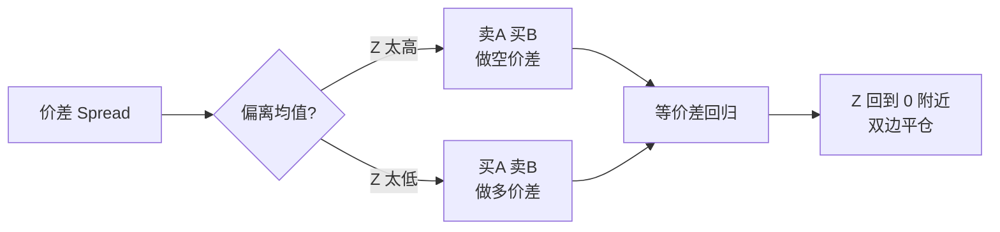
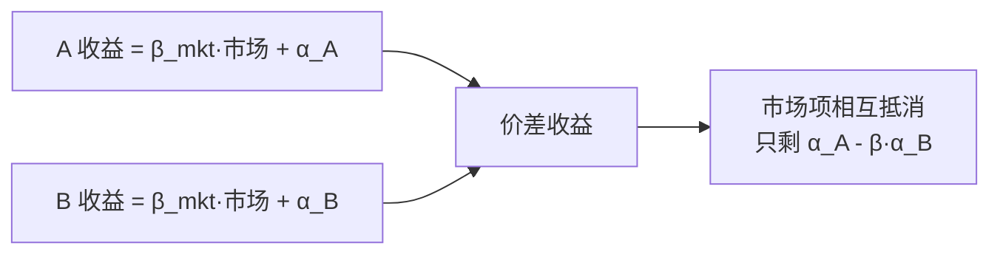
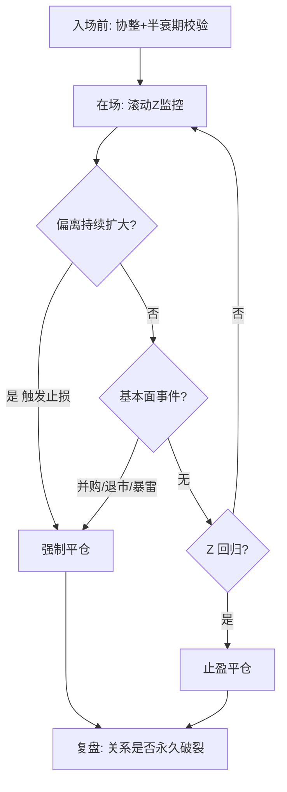

# 配对交易策略

> [!note] 配对交易
> 配对交易（Pairs Trading）是统计套利最经典的形态：找到两只长期"绑在一起"的资产，做多被低估的一腿、做空被高估的一腿，赌它们的价差回归历史均值。它**对市场方向中性**——大盘涨跌不重要，重要的是两腿的相对关系。

## 一、基本原理：一句话与一张图

价差偏离 → 反向建仓 → 价差回归 → 平仓获利。

> [!tip] 盈利来源
> 配对交易赚的是"**两腿之差**回归"的钱。即使 A、B 同时大跌，只要 A 跌得比 B 少（相对强），价差仍可能给你带来正收益。这就是它在熊市里仍能运作的原因。

## 二、选对方法（三大流派对比）

选对（pair selection）是配对交易成败的 80%。三种主流方法各有侧重：

| 方法 | 核心思想 | 优点 | 缺点 | 适用 |
|------|---------|------|------|------|
| 同业基本面法 | 选业务高度同质的竞品 | 逻辑硬、关系稳 | 候选少、主观 | 个人首选 |
| 距离法（Distance） | 归一化价格欧氏距离最小 | 简单、无模型假设 | 不保证均值回归 | 海量初筛 |
| 协整法（Cointegration） | 统计上存在长期均衡 | 理论严谨、回归性强 | 易过拟合、需检验 | 进阶核心 |

### 1. 同业基本面法

从经济逻辑出发：同行业竞争对手、同一产业链上下游、A/H 同股、同主题 ETF。例如（示例）白酒龙头之间、两大快递、同业银行。

> [!tip] 为什么个人优先用基本面法
> 协整可能"碰巧"在历史数据上成立，但缺乏经济逻辑支撑的协整最容易在未来破裂。先用基本面圈出"本就该一起动"的候选，再用统计检验确认，远比纯数据挖掘稳健。

### 2. 距离法

把两只股票价格各自归一化（如除以首日价或标准化），计算累计价差平方和，挑距离最小的若干对。它不假设任何模型，胜在简单、可大规模筛选，但**距离近不代表会回归**——常作粗筛第一步。

### 3. 协整法

用 Engle-Granger 或 Johansen 检验确认两序列存在协整关系，并估计对冲比率 $\beta$。这是配对交易的统计核心，数学细节见 [[配对交易协整理论]]。

> [!warning] 相关 ≠ 协整
> 高相关只说明"短期同步波动"，不保证价差平稳；协整才说明"长期被同一根橡皮筋拴住"。**只看相关系数选对，是最常见的坑。**

## 三、构建价差与信号

### 1. 价差定义

$$ \text{Spread}_t = P_{A,t} - (\alpha + \beta \cdot P_{B,t}) $$

$\beta$ 为对冲比率（每 1 股 A 用多少股 B 对冲），由 OLS 回归得到。

### 2. Z-Score 标准化

$$ Z_t = \frac{\text{Spread}_t - \mu}{\sigma} $$

> [!important] 用滚动窗口，别用全样本
> $\mu$、$\sigma$ 必须用**滚动窗口**（如过去 60 日）估计，否则会偷看未来、回测虚高。这是配对交易回测的第一红线，详见 [[配对交易Python回测]]。

### 3. 信号规则（示例参数）

| 信号 | 条件 | 动作 |
|------|------|------|
| 开仓做空价差 | $Z > +2$ | 卖 A、买 B |
| 开仓做多价差 | $Z < -2$ | 买 A、卖 B |
| 止盈平仓 | $\lvert Z \rvert < 0.5$ | 双边平仓 |
| 止损 | $\lvert Z \rvert > 3.5$ | 强制平仓 |

> [!note] 阈值不是越极端越好
> 阈值越高，单笔胜率越高但机会越少；阈值越低，交易越频繁但易被噪音和成本侵蚀。$+2 / 0.5$ 是常见起点，需用样本外数据验证，切勿在历史上反复调参（过拟合）。

## 四、仓位与资金管理

### 1. 美元中性（Dollar-Neutral）

两腿市值大致相等，使组合净敞口≈0：

$$ \text{名义多头金额} \approx \text{名义空头金额} $$

### 2. β / 波动率加权

更进一步可做**贝塔中性**或**波动率平价**，让两腿对市场和波动的暴露相互抵消，而非简单等额。

### 3. 多配对组合

实战很少只做一对。把 N 个低相关的配对并行，单对失效不致命：

> [!tip] 分散是配对交易的免费午餐
> 单个配对随时可能因并购、政策、财务暴雷而永久破裂。同时运行 10~20 个逻辑独立的配对，能把"个别破裂"摊薄成可承受的成本。

## 五、一个完整交易的全流程（示例）

下面用一组**假设数字**串起从开仓到平仓的全过程，帮助建立直觉（非真实行情）。

> [!example] 从信号到平仓（示例/假设）
> 设某配对对冲比率 $\beta=0.8$，滚动 60 日价差均值 $\mu$、标准差 $\sigma$ 已估出，当前 $Z=+2.3$。
> 1. **开仓**：$Z>+2$，做空价差——卖 A 约 10 万元、买 B 约 10 万元（美元中性，B 腿用 $\beta$ 调整后等额）。
> 2. **持有**：每日重算滚动 Z，监控基本面事件与持仓天数。
> 3. **回归**：数日后 $Z$ 回落到 $+0.4$，触发 $\lvert Z\rvert<0.5$ 平仓，双腿同时了结。
> 4. **盈亏来源**：A 相对 B 走弱了一截——无论大盘当期涨跌，赚的都是这段"相对收敛"。
> 5. **若不回归**：$Z$ 反而升到 $+3.5$ 触发止损，或超过 2~3 倍半衰期仍不回归触发时间止损，认亏离场。

> [!note] 单笔盈亏的近似拆解
> 价差组合的瞬时收益可近似写成
> $$ r_{pair} \approx r_A - \beta\, r_B $$
> 做空价差时取其相反数。可见组合收益只跟"两腿相对表现"有关，与共同的市场因子大体对冲掉——这正是"市场中性"的数学含义。

## 六、为什么说它"市场中性"

| 行情情景（示例） | 单边做多 A | 配对做空价差(空A多B) |
|------------------|-----------|----------------------|
| 大盘普涨，A 弱于 B | 赚（被动） | 赚（相对收敛） |
| 大盘普跌，A 弱于 B | 亏 | 仍赚（相对收敛） |
| A、B 同步同幅 | 看大盘 | 约等于 0（中性） |

> [!important] 中性不等于稳赚
> 市场中性只是"剥离了大盘方向"，赚的是相对价值收敛。一旦两腿的**关系本身**变了（协整破裂），中性反而成了"双倍受伤"——做多腿继续跌、做空腿继续涨。中性≠低风险，关系破裂才是真风险。

## 七、风控全流程

| 风控维度 | 具体手段 |
|---------|---------|
| 时间止损 | 超过 2~3 倍半衰期仍不回归，强制离场 |
| 价差止损 | $\lvert Z \rvert$ 突破极端阈值（如 3.5）止损 |
| 事件风控 | 监控并购、停牌、ST、重大公告，命中即退出 |
| 协整复检 | 定期重做协整检验，失效则剔除该配对 |
| 容量约束 | 单腿下单量不超过盘口可承受冲击 |

## 八、扩展策略

- **多股票统计套利**：一对多/多对多，用一篮子合成对手腿（见 [[统计套利深度解析]]）。
- **跨市场配对**：A/H、ETF 与成分股、境内外同标的。
- **ETF 配对 / 行业轮动对冲**：相关行业 ETF 之间做相对价值。
- **期货跨品种套利**：如相关商品、跨期价差。

## 九、常见误区与风险

> [!warning] 配对交易五大误区
> 1. **只看相关、不看协整**：价差不平稳，越偏越远直到爆仓。
> 2. **全样本算 Z**：未来信息泄漏，回测漂亮实盘亏。
> 3. **忽略做空成本与限制**：A 股融券难、券源贵、可能无券可融。
> 4. **不设时间止损**："等回归"等成永久套牢，资金占用且漂移。
> 5. **过度优化阈值/窗口**：把噪音拟合成规律，样本外立刻失效。

**核心风险**：协整破裂（并购、政策、行业分化）、做空受限、流动性不足、交易成本、模型半衰期失效。完整框架见 [[风险管理框架]]。

> [!important] 给个人投资者的现实提醒
> 配对交易听上去"中性、稳健"，但 A 股的**融券约束**会大幅削弱可执行性——做空那一腿常常缺券、成本高，甚至遇涨停无法卖出。务必先确认两腿都能稳定做空（或用可对冲的衍生品/ETF 替代），再谈策略，否则纸面收益无法落地。

## 相关链接

- [[配对交易协整理论]]
- [[配对交易Python回测]]
- [[配对交易QMT实战]]
- [[统计套利深度解析]]
- [[均值回归配对交易]]
- [[风险管理框架]]
- [[../目录|量化策略总览]]
