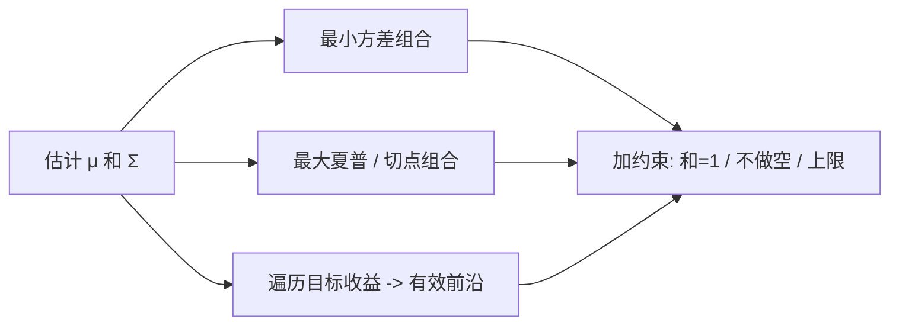

# NVIDIA量化组合优化

> [!note] 本篇定位：组合优化实战
> 本篇用 **numpy + scipy** 做均值-方差优化：求**最小方差组合**、**最大夏普组合**，并描出**有效前沿**。理论渊源见 [[马科维茨理论]]，权重落地见 [[组合构建方法]]。
> 协方差矩阵与二次型 wᵀΣw 的向量化基础见 [[NumPy与Pandas量化指南]]，收益/风险度量见 [[Python金融分析指南]]。GPU 加速本篇只作概念性提及，不编造任何基准数字。

## 一、问题设定：收益、风险、目标

给定 N 个资产的预期收益向量 μ 与协方差矩阵 Σ，权重 w（和为 1）：

$$r_p = w^{\top}\mu,\qquad \sigma_p^2 = w^{\top}\Sigma w$$

均值-方差优化就是在"给定风险求最大收益 / 给定收益求最小风险"之间取舍。

```python
import numpy as np
from scipy.optimize import minimize

np.random.seed(42)
N = 4                                         # 示例：4 只资产
mu = np.array([0.08, 0.12, 0.10, 0.07])       # 年化预期收益（示例）

# 构造一个正定的年化协方差矩阵（示例）
A = np.random.randn(N, N)
Sigma = A @ A.T / 50 + np.eye(N) * 0.02       # A@Aᵀ 保证半正定，加对角更稳

def port_return(w):  return w @ mu                       # 组合预期收益
def port_vol(w):     return np.sqrt(w @ Sigma @ w)       # 组合波动 = sqrt(wᵀΣw)
```

## 二、最小方差组合（解析解 + 数值解）

无约束（允许做空）下，全局最小方差组合有**解析解**：$w_{gmv}=\dfrac{\Sigma^{-1}\mathbf{1}}{\mathbf{1}^{\top}\Sigma^{-1}\mathbf{1}}$。

```python
ones = np.ones(N)
inv_Sigma = np.linalg.inv(Sigma)
w_gmv = inv_Sigma @ ones / (ones @ inv_Sigma @ ones)     # 解析最小方差（可做空）
print('解析最小方差权重（示例）:', w_gmv.round(3))
```

加上"不许做空"约束时无解析解，改用数值优化：

```python
bounds = tuple((0.0, 1.0) for _ in range(N))             # 0<=w<=1，禁止做空
cons_sum = ({'type': 'eq', 'fun': lambda w: w.sum() - 1},)   # 权重和为 1
w0 = np.repeat(1 / N, N)                                  # 等权初值

res_mv = minimize(port_vol, w0, method='SLSQP',
                  bounds=bounds, constraints=cons_sum)
w_minvar = res_mv.x
print('数值最小方差权重（示例）:', w_minvar.round(3))
```

## 三、最大夏普组合

最大化夏普等价于最小化"负夏普"。`scipy.optimize.minimize` 不直接做最大化，取负号即可。

```python
def neg_sharpe(w, rf=0.0):
    return -(port_return(w) - rf) / port_vol(w)           # 负夏普，便于最小化

res_ms = minimize(neg_sharpe, w0, args=(0.0,), method='SLSQP',
                  bounds=bounds, constraints=cons_sum)
w_maxsharpe = res_ms.x

print('最大夏普权重（示例）:', w_maxsharpe.round(3))
print('对应年化收益/波动（示例）:',
      round(port_return(w_maxsharpe), 4), round(port_vol(w_maxsharpe), 4))
```

> [!important] 切点组合
> 最大夏普组合就是从无风险利率引出、与有效前沿相切的"切点组合"。它是 [[组合构建方法]] 里风险资产的核心配置，再按风险偏好与无风险资产混合。

## 四、有效前沿

对一系列目标收益，分别求"达到该收益的最小波动组合"，连起来就是有效前沿。

```python
def min_vol_for_target(target):
    cons = (
        {'type': 'eq', 'fun': lambda w: w.sum() - 1},        # 权重和为 1
        {'type': 'eq', 'fun': lambda w: w @ mu - target},    # 达到目标收益
    )
    r = minimize(port_vol, w0, method='SLSQP', bounds=bounds, constraints=cons)
    return r.fun if r.success else np.nan

targets = np.linspace(mu.min(), mu.max(), 25)            # 不许做空时收益范围在此区间
frontier = np.array([min_vol_for_target(t) for t in targets])

# 简要绘制（中文字体设置见 Python金融分析课程）
import matplotlib.pyplot as plt
plt.rcParams['axes.unicode_minus'] = False
fig, ax = plt.subplots(figsize=(7, 4))
ax.plot(frontier, targets, '-', color='navy', label='有效前沿')
ax.scatter(port_vol(w_maxsharpe), port_return(w_maxsharpe),
           c='red', s=60, zorder=5, label='最大夏普')
ax.scatter(port_vol(w_minvar), port_return(w_minvar),
           c='green', s=60, zorder=5, label='最小方差')
ax.set_xlabel('年化波动'); ax.set_ylabel('年化收益')
ax.set_title('有效前沿（示例）'); ax.legend(); ax.grid(alpha=0.3)
plt.tight_layout()
```



## 五、GPU 加速：什么时候才值得（概念性）

当资产数 N 上千、需要**百万级随机权重采样**或大规模情景模拟时，重复的 Σ 运算会成为瓶颈。`cupy` 提供与 NumPy 几乎同名的 GPU 数组 API，可把矩阵运算与批量计算搬到 GPU 并行。

```python
# 概念示意：把"大批随机权重的组合风险"搬到 GPU 批量计算
# import cupy as cp
# W = cp.random.dirichlet(cp.ones(N), size=1_000_000)      # 百万组随机权重
# Sigma_gpu = cp.asarray(Sigma)
# vols = cp.sqrt(cp.einsum('ij,jk,ik->i', W, Sigma_gpu, W))  # 批量 wᵀΣw
# 是否更快取决于 N、批量大小与具体硬件 —— 此处不给任何加速倍数
```

> [!warning] 别为小问题上 GPU
> 几十到几百只资产、单次优化，数据在 CPU↔GPU 间搬运的开销往往超过计算本身，GPU 反而更慢。GPU 的价值在**超大规模 + 高并行**（海量情景、超大股票池），具体收益需实测，不可臆造数字。

## 六、常见误区 / 踩坑

| 误区 | 后果 | 正确做法 |
|------|------|----------|
| 直接用样本协方差 | 估计误差被当信号，权重极端 | Ledoit-Wolf 收缩 / 对角正则 |
| 预期收益 μ 当成已知 | μ 极难估，微小变化致权重剧变 | 降低对 μ 依赖，或用反向优化/BL |
| 出现角点解（单资产 100%） | 集中度风险、不稳定 | 加单资产上限、最小持仓约束 |
| 求逆 `inv(Σ)` 数值不稳 | 病态矩阵下结果失真 | 用 `solve` / 伪逆 / 加对角项 |
| μ 与 Σ 年化口径不一致 | 收益/风险错配，前沿错位 | 同频率、同年化口径 |
| 样本内优化报漂亮前沿 | 样本外失效（过拟合历史） | 样本外检验，参见 [[回测方法论]] |
| 不设 `bounds` 却假设不做空 | 解里出现负权重 | 显式 `bounds=(0,1)` |
| 小问题盲目上 GPU | 搬运开销大于收益 | 先测瓶颈，大规模才上 |

> [!tip] 均值-方差最脆弱的一环是 μ
> 协方差相对可估，预期收益 μ 误差最大，且优化器对 μ 高度敏感（"误差最大化器"）。实务中常退而求其次：用最小方差 / 风险平价等**不依赖 μ** 的方案，或引入先验（Black-Litterman）。理论脉络见 [[马科维茨理论]]。

## 相关链接

- [[量化投资完全指南]]
- [[量化策略案例分析]]
- [[Python量化进阶]]
- [[目录|量化策略总览]]
- [[马科维茨理论]]
- [[组合构建方法]]
- [[NumPy与Pandas量化指南]]

## 实战掌握清单

> [!tip] 交易者视角
> NVIDIA量化组合优化 的学习重点不是记住术语，而是把它放进研究、组合、执行和复盘的闭环。量化策略必须从清晰假设出发，经过数据验证、成本测算、风险控制和实盘监控，才可能成为可持续系统。

### 关键判断

- 写清楚收益来自动量、反转、价值、套利、波动率、流动性还是行为偏差。
- 确认信号、过滤器、入场、退出、仓位和风控。
- 看收益是否集中在少数时期、少数品种或少数参数。

### 落地动作

1. 做样本外、滚动窗口和参数扰动测试。
2. 把手续费、滑点、冲击成本、容量和失败交易纳入报告。
3. 上线后监控成交质量、信号衰减、回撤和异常订单。

### 失效边界

- 过拟合。
- 策略容量不足。
- 市场结构变化后没有停止机制。

### 复盘问题

- 这项知识改变了哪一个具体决策：标的、方向、仓位、退出、对冲还是不交易？
- 如果判断相反，最大亏损、最长恢复期和退出触发条件是什么？
- 有没有一个更简单的基准方法可以取得相近结果？
